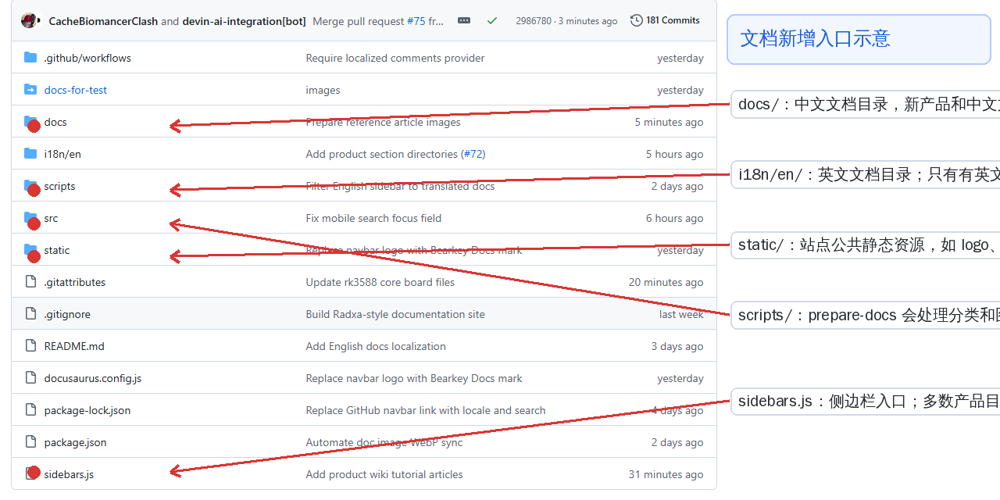

# document-web-design 文档新增教程

这篇文档说明如何在 `document-web-design` 仓库里新增分类、产品目录、文章和图片资源。

## 1. 先看仓库目录



常用目录：

| 路径 | 用途 |
| --- | --- |
| `docs/` | 中文文档根目录，中文页面都放这里。 |
| `i18n/en/docusaurus-plugin-content-docs/current/` | 英文文档根目录，只有有英文内容时才同步创建。 |
| `static/` | 全站公共静态资源，比如 logo、全站共用图片。普通文章图片不建议放这里。 |
| `scripts/` | 文档准备脚本，`prepare-docs` 会自动补 `_category_.json`、转换图片。 |
| `sidebars.js` | 侧边栏入口配置，大部分产品目录会按文件夹自动生成。 |

## 2. 当前文档层级

站点主要按这个结构组织：

```text
docs/
├── core-board/                 # 核心板
│   └── rk3588-core-board/      # 某个产品
│       ├── _category_.json     # 产品在侧边栏里的名称/顺序
│       ├── product-specification.md
│       ├── wiki-tutorial.md
│       └── wiki-tutorial-assets/
├── main-board/                 # 主板
├── terminal/                   # 终端
├── reference/                  # 其他
├── aiot-solutions/             # AIOT 解决方案
├── openharmony/                # OpenHarmony
└── mineharmony/                # MineHarmony
```

英文目录路径要和中文目录保持一致：

```text
中文：docs/core-board/rk3588-core-board/product-specification.md
英文：i18n/en/docusaurus-plugin-content-docs/current/core-board/rk3588-core-board/product-specification.md
```

如果文章只有中文，不要在英文目录创建同名文件。

## 3. 在已有分类下新增一个产品

例如要在“核心板”下面新增一个产品 `RK3576 核心板`。

### 第一步：创建产品目录

目录名建议用英文小写短横线：

```text
docs/core-board/rk3576-core-board/
```

### 第二步：新增 `_category_.json`

`_category_.json` 控制产品在侧边栏中的显示名称和排序。

```json
{
  "label": "RK3576 核心板",
  "position": 5
}
```

说明：

- `label`：侧边栏显示的产品名称。
- `position`：排序数字，越小越靠前。

### 第三步：新增产品文章

常见产品文章文件：

```text
docs/core-board/rk3576-core-board/product-specification.md
docs/core-board/rk3576-core-board/wiki-tutorial.md
```

`product-specification.md` 示例：

```md
---
sidebar_position: 1
sidebar_label: 产品规格书
title: RK3576 核心板产品规格书
---

# RK3576 核心板产品规格书


```

`wiki-tutorial.md` 示例：

```md
---
sidebar_position: 2
sidebar_label: Wiki 教程
title: RK3576 核心板 Wiki 教程
---

# RK3576 核心板 Wiki 教程


```

## 4. 在已有产品下面新增一篇普通文章

例如要给 `RK3588 核心板` 新增一篇“使用说明”。

推荐路径：

```text
docs/core-board/rk3588-core-board/user-guide.md
```

文章内容示例：

```md
---
sidebar_position: 3
sidebar_label: 使用说明
title: RK3588 核心板使用说明
---

# RK3588 核心板使用说明

正文内容写在这里。


```

如果这篇文章有图片，新建同名资源目录：

```text
docs/core-board/rk3588-core-board/user-guide-assets/
└── wiring.webp
```

推荐规则：

- 每篇文章用自己的 `文章名-assets/` 目录，避免图片混在一起。
- Markdown 里用相对路径引用图片，例如 `./user-guide-assets/wiring.webp`。
- 图片文件名尽量用英文、数字、短横线，例如 `power-wiring.webp`。

## 5. 新增一个顶级分类

例如要新增一个顶级分类“开发工具”。

创建目录：

```text
docs/development-tools/
```

新增分类文件：

```text
docs/development-tools/_category_.json
```

内容示例：

```json
{
  "label": "开发工具",
  "position": 9,
  "collapsed": false
}
```

然后在里面新增文章：

```text
docs/development-tools/flashing-tools.md
```

文章示例：

```md
---
sidebar_position: 1
sidebar_label: 烧录工具
title: 烧录工具
---

# 烧录工具

正文内容写在这里。
```

注意：如果是全新的顶级分类，可能还需要检查 `sidebars.js` 是否已经把这个目录加入侧边栏。现有的 `core-board`、`main-board`、`terminal`、`reference` 等目录已经接入。

## 6. 图片应该放哪里

### 普通文章图片

放到文章旁边的资源目录：

```text
docs/core-board/rk3588-core-board/user-guide.md
docs/core-board/rk3588-core-board/user-guide-assets/picture1.webp
```

引用：

```md

```

### 产品规格书图片

规格书目前常用 `images/`：

```text
docs/core-board/rk3588-core-board/product-specification.md
docs/core-board/rk3588-core-board/images/page-02.webp
```

引用：

```md

```

### 全站公共图片

只有 logo、全站通用图标、公共素材才放 `static/`。

## 7. 中英文同步规则

### 中文文章

放在：

```text
docs/...
```

### 英文文章

放在：

```text
i18n/en/docusaurus-plugin-content-docs/current/...
```

英文文章路径要和中文保持同样相对路径。例如：

```text
docs/main-board/rk3568-main-board/wiki-tutorial.md
i18n/en/docusaurus-plugin-content-docs/current/main-board/rk3568-main-board/wiki-tutorial.md
```

如果只有中文内容，不要创建英文文件。英文站会通过脚本过滤，只显示英文目录里真实存在的文档。

## 8. 新增后必须运行的命令

新增或修改文档后，先运行：

```bash
npm run prepare-docs
```

它会做两件事：

1. 把 Markdown 里引用的本地 `png/jpg/jpeg` 图片转换成 `webp`。
2. 自动补齐缺失的 `_category_.json` 和英文文档路径索引。

然后运行构建：

```bash
npm run build
```

如果 `prepare-docs` 修改了图片或 Markdown，要把生成的 `.webp`、更新后的 `.md`、删除的旧图片一起提交。

## 9. 提交前检查清单

- [ ] 新文章放在正确分类目录下。
- [ ] 产品目录有 `_category_.json`。
- [ ] 文章有 frontmatter：`sidebar_position`、`sidebar_label`、`title`。
- [ ] 图片放在文章旁边的资源目录，引用路径是相对路径。
- [ ] 只有中文内容时没有新增英文目录文件。
- [ ] 如果有英文内容，英文路径和中文路径一致。
- [ ] 已运行 `npm run prepare-docs`。
- [ ] 已运行 `npm run build`。
