# WiKi教程-TB-96AIoT

## 产品介绍

## 产品介绍

TB-96AIoT是一款由厦门贝启科技有限公司研发的全球第二款符合96Boards Compute SOM规范的面向人工智能领域的高性能嵌入式核心板（第一款为我司研发的基于RK3399Pro的TB-96AI），并由Linaro 96Boards于2019年4月1日正式对外发布。

TB-96AIoT是一款低功耗高算力的面向物联网+人工智能领域的核心板，它才用采用Rockchip RK1808为主控芯片，内置神经网络处理器（NPU），可兼容Caffe、tensorflow等多种主流推理模型，TB-96AIoT搭配2GB LPDDR3+16GB eMMC（可选1GB LPDDR3+8GB eMMC/4GB LPDDR3+16GB eMMC），内置千兆以太网PHY芯片，采用2个100Pin的松下高速板对板连接器，具有丰富面向AIoT的拓展接口。PCB采用8层板设计，机械尺寸只有50mm×50mm，可灵活部署到各类产品。

更多产品规格信息详见： [http://www.beiqicloud.com/product_detail.html?pid=TB-96AIoT](http://www.beiqicloud.com/product_detail.html?pid=TB-96AIoT)

## 入门指南

## 入门指南

### 固件下载

百度云下载地址：[https://pan.baidu.com/s/1fiWUlW8rcbmRvx90XTdMlg 提取码：o7lf](https://pan.baidu.com/s/1fiWUlW8rcbmRvx90XTdMlg)

Onedrive download link：[https://1drv.ms/f/s!AhoFWWcHV7rXdXcEE2rA8xeeNYc](https://1drv.ms/f/s!AhoFWWcHV7rXdXcEE2rA8xeeNYc)

### 开发工具下载

百度云下载地址：[https://pan.baidu.com/s/1fiWUlW8rcbmRvx90XTdMlg 提取码：o7lf](https://pan.baidu.com/s/1fiWUlW8rcbmRvx90XTdMlg)

Onedrive download link：[https://1drv.ms/f/s!AhoFWWcHV7rXdXcEE2rA8xeeNYc](https://1drv.ms/f/s!AhoFWWcHV7rXdXcEE2rA8xeeNYc)

### 烧写驱动下载

百度云下载地址：[https://pan.baidu.com/s/1fiWUlW8rcbmRvx90XTdMlg 提取码：o7lf](https://pan.baidu.com/s/1fiWUlW8rcbmRvx90XTdMlg)

Onedrive download link：[https://1drv.ms/f/s!AhoFWWcHV7rXdXcEE2rA8xeeNYc](https://1drv.ms/f/s!AhoFWWcHV7rXdXcEE2rA8xeeNYc)

### 烧写固件-Buildroot固件

#### Window主机烧写固件

1、安装Windows PC端USB驱动(首次烧写执行)。

2、双击DriverAssitant_v4.8/DriverInstall.exe打开安装程序，点击“驱动安装”按提示安装驱动即可，安装界面如下所示:


3、双击AndroidTool_Release_v2.61/AndroidTool.exe启动烧写工具注意Buildroot固件烧写工具和Debian固件烧写工具是不同的。

4、Type-C线连接主机端的USB接口和RK1808 TB-96AIoT开发板的Type-C接口，长按RK1808 TB-96AIoT开发板上recovery按键后重启机器，直到系统进入Loader模式，如下所示：

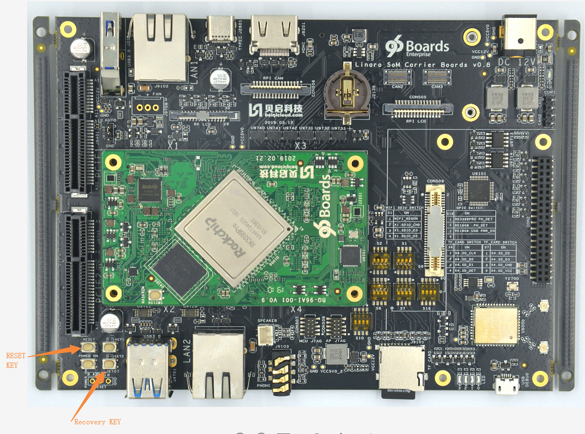

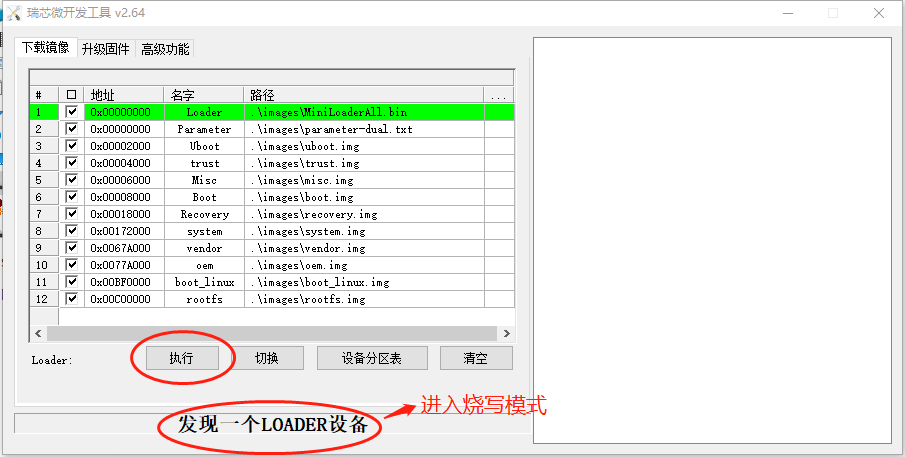

5、双击如下图所示的每一行，选择好固件路径，然后点击“执行”按钮，开始烧写升级。

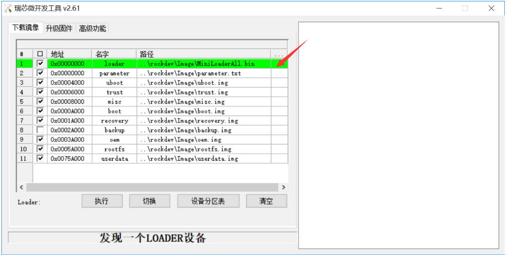

#### Linux主机烧写固件

1、Type-C线连接主机端的USB接口和RK1808 TB-96AIoT开发板的Type-C接口，长按RK1808 TB-96AIoT开发板上recovery按键后重启机器，直到系统进入Loader模式，如下所示：


2、将固件解压到Linux_Upgrade_Tool_v1.38/images目录下。

3、运行 upgrade_tool 不带任何参数则进入工具模式。 执行后，需要先进行选择设备(图 1),

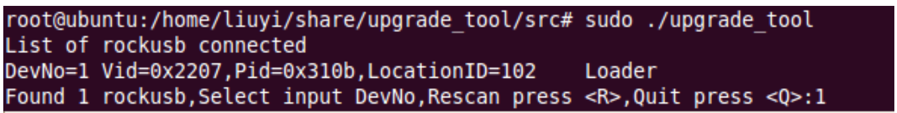

输入DevNo 设备号输入回车完成选择，进入工具模式主界面：

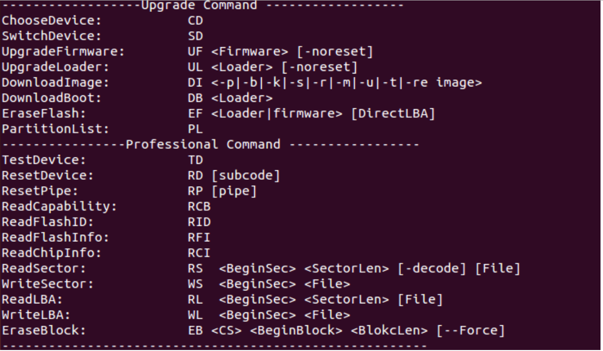

a.download loader

```
ul ./images/MiniLoaderAll.bin
```

b.DI command: burn partition image

```
(1) Parameter
di –p ./images/parameter.txt

(2) Uboot
di –u ./images/uboot.img

(3) Trust
di –t ./images/turst.img

(4) Misc
di –m ./images/misc.img

(5) Boot
di –b ./images/boot.img

(6) Recovery
di –r ./images/recovery.img

(7) Oem
di –oem ./images/oem.img

(8) Rootfs
di –rootfs ./images/rootfs.img

(9) Userdata
di –userdata ./images/userdata.img

(10) Reboot
rd
```

### 烧写固件-Debian10固件

下载固件

下载固件到Flash\Images目录下，固件包含：

1. MiniLoaderAll.bin: 一级Loader
2. uboot.img: U-Boot固件， 二级Loader
3. trust.img: 安全OS固件
4. boot_linux.img: 内核固件和内核设备树
5. rootfs.img: Debian10根文件系统
6. parameter.txt: 分区信息

#### Window主机烧写固件

1、安装Windows PC端USB驱动(首次烧写执行)。

2、双击DriverAssitant_v4.8/DriverInstall.exe打开安装程序，点击“驱动安装”按提示安装驱动即可，安装界面如下所示:

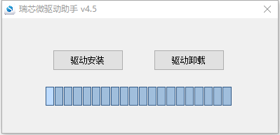

3、双击AndroidTool_Release_v2.61/AndroidTool.exe启动烧写工具（注意Buildroot固件烧写工具和Debian固件烧写工具是不同的）。

4、Type-C线连接主机端的USB接口和RK1808 TB-96AIoT开发板的Type-C接口，长按RK1808 TB-96AIoT开发板上recovery按键后重启机器，直到系统进入Loader模式，如下所示：


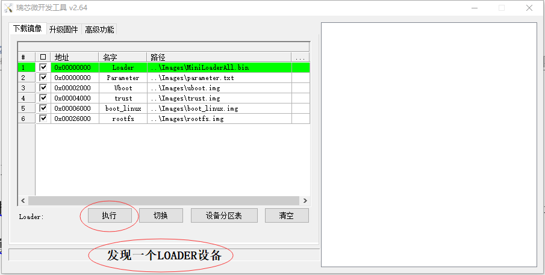

5、点击烧写工具上的“执行”按钮，开始烧写固件

1. 烧写完成后，系统自动重启

#### Linux主机烧写固件

1、Type-C线连接主机端的USB接口和RK1808 TB-96AIoT开发板的Type-C接口，长按RK1808 TB-96AIoT开发板上recovery按键后重启机器，直到系统进入Loader模式，如下所示：


2、下载网盘链接Linux烧写工具linux-flashTool.tar.gz：
链接：[https://pan.baidu.com/s/1HYKTwkkbdZaiJsuv_EifEw](https://pan.baidu.com/s/1HYKTwkkbdZaiJsuv_EifEw)
提取码：5k1x

拷贝到Linux PC，解压为linux-flashTool目录，并在该工具目录的同级目录创建images目录，并把固件放置在其中。
然后进入linux-flashTool目录，运行./linux_flash.sh，根据提示，输入sudo的密码，等待烧写完。

### 烧写固件-Debian9固件

#### 烧写固件

1、Debian9固件的烧写工具及步骤，与Buildroot固件的烧写过程一样。

### 串口调试

#### SecureCRT串口工具

将RK1808 TB-96AIoT开发板的Debug口（microUSB口）连接到主机端的USB口，打开设备管理器获取USB Serial Port的端口号，如下图所示：

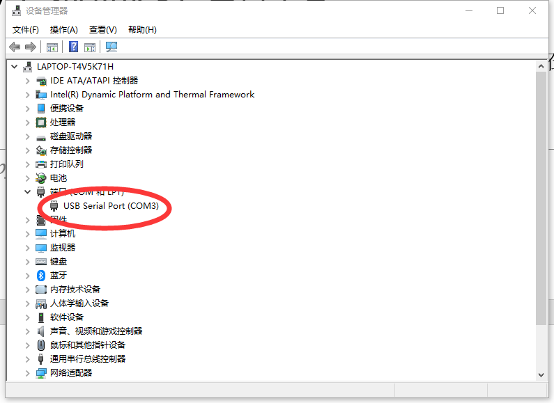

注意：如果设备管理器里面显示驱动异常信息，请选择更新驱动信息即可。

打开串口工具“SecureCRT”，点击“快速连接”按钮。

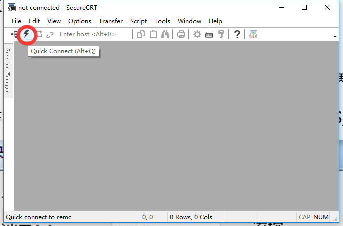

配置串口信息，端口选择连接开发板的端口号，设置波特率为1500000，不勾选流控RTS/CTS，如下图所示：

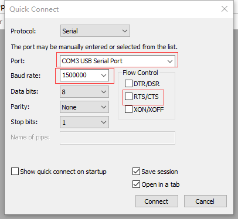

点击连接，就可以正常查看系统调试信息和输入用户命令。

#### Minicom串口工具

1、将RK1808 TB-96AIoT开发板的Debug口连接到主机端的USB口。

2、以root权限打开minicom： sudo minicom -s。

3、打开Minicom菜单：输入CTRL-A + z。

4、进入Minicom配置界面：输入“O”选择“Configure Minicom”。

5、进入串口设置：选择“Serial port setup”。

6、设置串口设备：输入“A”，写入“/dev/ttyUSB0”，按回车确定。

7、禁止流控：输入“F”，按回车确定。

8、设置波特率：输入“E”，再输入“A”直到显示“Current 1500000 8N1”，然后回车确定。

9、保存设置：选择“Save setup as dfl”。

10、退出设置：选择“Exit”。

### 开机启动-Buildroot固件

可以adb远程登陆或者ssh远程登陆

用户名root，密码rockchip

RK1808 TB-96AIoT开发板，若有接配套屏幕，购买链接 [https://item.taobao.com/item.htm?spm=a1z10.1-c-s.w4004-21746724073.14.671a196cU5BLeP&id=596790859176](https://item.taobao.com/item.htm?spm=a1z10.1-c-s.w4004-21746724073.14.671a196cU5BLeP&id=596790859176)

开机启动后有个默认的QT界面，如下图所示。

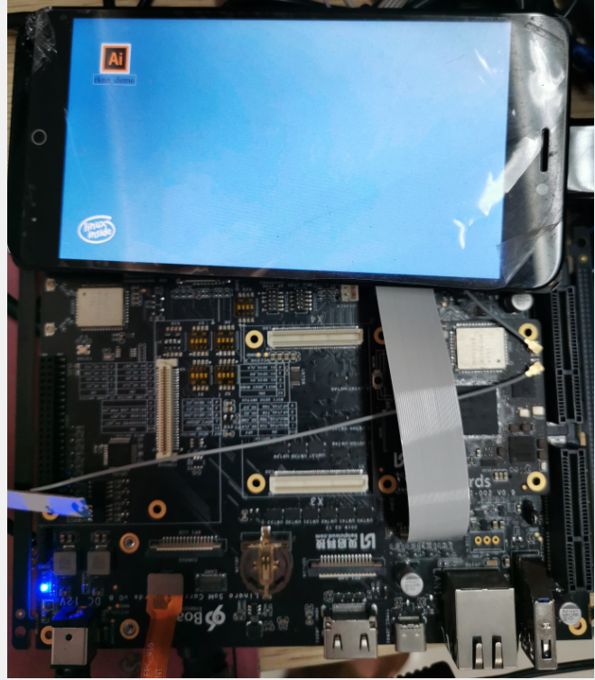

## Linux-Buildroot开发

## Linux-Buildroot开发

### Buildroot编译开发

1. 进入/buildroot目录，通过：make menuconfig查看编译选项；
2. 找到需要添加或删除的编译选项，直接修改/buildroot/configs/rockchip_rk1808_defconfig
3. 自定义添加的	pkg可放在/buildroot/package这个目录下
4. 单独编译某个pkg的编译命令是:

```
make [pkg-name]
make [pkg-name]-dirclean
make [pkg-name]-rebuild
```

1. 在 根目录执行这个./build.sh rootfs可重新打包生成rootfs.img，生成的rootfs.img在/rockdev目录下；

### RKNN SDK 开发流程

在使用 RK1808 RKNN SDK 之前， 用户首先需要在 PC 上使用 RKNN-Toolkit 工具将用户的模型转换为 RKNN 模型，
用户可以在/external/rknpu/rknn-toolkit/目录获取工具的完整安装包， RKNN-Toolkit 的使用
请参考《RKNN-Tookit 使用指南》 文档。

成功转换生成 RKNN 模型之后，用户可以先通过 RKNN-Toolkit 连接 RK1808 开发板进行联机调试，确保模型的精度
性能符合要求。得到 RKNN 模型文件之后，用户可以选择使用 C 或 Python 接口在 RK1808 平台开发应用。

### RKNN AI DEMO

**概述**

rknn_demo 模块代码位于/external/rknn_demo 目录下。 主要实现通过 camera 采集图像，
送到 NPU 进行处理， 并通过 minigui 显示结果。 当前 Demo 默认使用的模型为 ssd_inception_v2。
也可以直接替换为其他 SSD 的模型文件。

**NPU 相关**

SDK 中， 相关模型文件已经默认编译到板子中。 对应的文件宏和目录为：
#define MODEL_NAME "/usr/share/rknn_demo/ssd_inception_v2.rknn"
#define BOX_PRIORS_TXT_PATH " /usr/share/rknn_demo/box_priors.txt"
#define LABEL_NALE_TXT_PATH " /usr/share/rknn_demo/coco_labels_list.txt"

MODEL_NAME 对应模型文件， LABEL_NALE_TXT_PATH 对应结果类别列表文件，
BOX_PRIORS_TXT_PATH 对应加载框权重文件。

**编译**

可以在 SDK 目录中， 通过命令./build.sh rknn_demo 进行模块编译， 会生成 rknn_demo 执行文件。

**运行**

在串口或ssh中执行如下命令可运行demo：

1. 连接USB摄像头时  rknn_demo
2. 连接MIPI摄像头时（[购买链接](https://item.taobao.com/item.htm?spm=a1z10.1-c-s.w4004-21746724073.8.671a196cU5BLeP&id=596430905803))  rknn_demo --device mipi

**更多**

更多详情，请查阅/docs/SoC platform related/RK1808/Rockchip RKNN_DEMO模块开发指南V0.2.pdf

## Linux-Debian10开发

## Linux-Debian10开发

### Debian10系统

用户登录

```
用户名：toybrick
密码：toybrick
SSH登录：ssh toybrick@192.168.180.8
```

软件升级

```
sudo apt update
sudo apt upgrade
```

系统设置

1. 配置USB Functions： 命令：[toybrick-set.py](http://toybrick-set.py) func FUNCTIONS  参数说明：  FUCTIONS=&#123;rndis,ntb,mass,uart,touch,keyboard,mouse,custom&#125;，以逗号隔开 ``` 1) rndis: USB虚拟以太网卡，必选项 2) ntb: USB ntb设备，必选项 3) mass: 虚拟USB存储设备，挂载点/var/doc.img 4) touch: 虚拟触摸屏 5) keyboard：虚拟键盘 6) mouse：虚拟鼠标 7) custom：用户自定义虚拟设备。此项选择后，系统调用用户编写的自定义虚拟设备的执行脚本/usr/bin/custom_func.sh。 ```  默认值：rndis,ntb,mass  例子：[toybrick-set.py](http://toybrick-set.py) func rndis,ntb,mass

### TYPEC连接上位机USB虚拟网卡

通过TYPEC USB连接到上位机USB HOST，TB-96AIoT可以虚拟出USB网卡与上位机进行网络通讯，同时可以共享上位机的网络；
详见：[http://t.rock-chips.com/wiki.php?mod=view&id=76](http://t.rock-chips.com/wiki.php?mod=view&id=76)

开启配置TB-96AIoT USB虚拟网卡共享上位机网络
sudo [toybrick-set.py](http://toybrick-set.py) func rndis,ntb
sudo [toybrick-set.py](http://toybrick-set.py) network rndis static addr 192.168.180.8/24 gateway 192.168.180.1 dns 180.76.76.76,8.8.8.8
sudo reboot

这种配置下，可以使用类似计算棒的主动模式和被动模式

### 配置以太网

TB-96AIoT开发板底板的LAN2口是TB-96AIoT使用的。

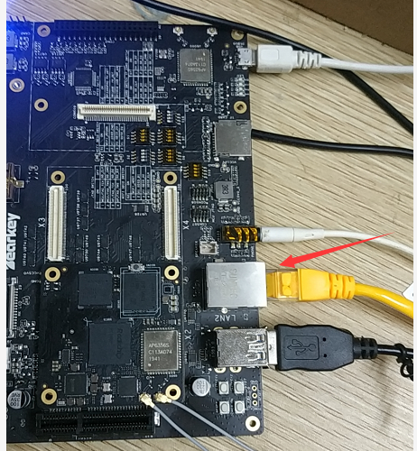

1. 配置以太网自动获取IP地址； sudo [toybrick-set.py](http://toybrick-set.py) func none sudo [toybrick-set.py](http://toybrick-set.py) network ethernet dhcp sudo reboot
2. 配置以太网静态IP; 举例配置静态ip为192.168.179.8，默认网关为192.168.179.1 sudo [toybrick-set.py](http://toybrick-set.py) func none sudo [toybrick-set.py](http://toybrick-set.py) network ethernet static addr 192.168.179.8/24 gateway 192.168.179.1 dns 180.76.76.76,8.8.8.8 sudo reboot

这种配置下，可以使用类似计算棒的主动模式

### 配置WiFi

TB-96AIoT开发板配置WiFi命令如下：

```
wpa_passphrase 'WIFI-SSID-NAME' 'WIFI-PASSWORD'>> /etc/wpa_supplicant/wpa_supplicant.conf
wpa_supplicant -B -i wlan0 -c /etc/wpa_supplicant/wpa_supplicant.conf
sudo dhclient wlan0
```

然后查看ifconfig wlan0及ip ro命令确认获取到的ip地址及路由器网关地址；
目前需要手动添加WiFi路由器作为TB-96AIoT开发板的默认路由；
route add default gw xxx.yyy.zzz.aaa
xxx.yyy.zzz.aaa是WiFi路由器的IP地址

### 音频功能

耳机播放音乐，执行以下两条命令

```
amixer cset numid=1 4
aplay fyq.wav
```

注：fyq.wav是播放的音频文件名称，aplay工具只能播放wav格式的音频文件

录音功能，执行以下两条命令：

```
amixer cset numid=2 2
arecord test.wav -r 48000 -f cd
```

### Mipi摄像头或USB摄像头调用

摄像头抓图，串口执行以下命令：

```
v4l2-ctl -d /dev/video0 \
--set-fmt-video=width=1920,height=1080,pixelformat=YU12 \
--stream-mmap=3 \
--stream-skip=3 \
--stream-to=/tmp/test3.yuv \
--stream-count=1 \
--stream-poll
```

/dev/video0为摄像头的设备节点，mipi摄像头和usb摄像头对应的节点不同。Width和height为抓图的分辨率大小。Pixelformat为抓图的格式，/tmp/test3.yuv 为图片的存放路径

### 系统软件库

#### DRM内存分配

1. 安装DRM内存库

```
sudo apt install rockchip-drm-dev libdrm-dev
```

1. 编译链接：

```
LDDFLAGS := -lrockchip_drm
```

1. 包含头文件：

```
#include <rockchip/rockchip_drm.h>
```

1. 示例代码：

```
/usr/share/rockchip_drm/example
```

1. 重要数据结构

```
tpyedef struct _DrmBuffer {
int fd;  // DRM/CMA内存的文件描述符
unsigned int handle; // DRM/CMA内存的句柄
void *ptr; // DRM/CMA内存映射到用户空间的虚拟地址
size_t size; // DRM/CMA内存的大小，单位：字节
unsigned long phys; // DRM/CMA内存的物理地址
} DrmBuffer, CmaBuffer;
```

1. DRM接口说明: 详见/usr/include/rockchip/rockchip_drm.h

```
1）RockchipDrmOpen: 打开设备节点

    示例：int fd = RockchipDrmOpen();

2）RockchipDrmClose: 关闭设备节点

    示例：RockchipDrmClose(fd);

    注：必须释放所有fd分配的内存后，才能关闭设备节点

3）RockchipDrmAlloc：分配DRM内存，物理地址不连续

    示例：DrmBuffer *buf = RockchipDrmAlloc(fd, V4L2_PIX_FMT_NV12, 1920, 1080);

4）RockchipDrmFree：释放DRM内存

    示例：RockchipDrmFree(fd, buf);

5）RockchipCmaAlloc：分配CMA内存，物理地址连续

    示例：CmaBuffer *buf = RockchipCmaAlloc(fd, size);

6）RockchipCmaFree：释放CMA内存

    示例：RockchipCmaFree(fd, buf);
```

#### RGA 2D图形加速

1. 安装RGA 2D图形加速库

```
sudo apt install rockchip-rga-dev
```

1. 编译链接：

```
LDDFLAGS := -lrockchip_rga
```

1. 包含头文件：

```
#include <rockchip/rockchip_rga.h>
```

1. 示例代码：

```
/usr/share/rockchip_rga/example
```

1. 重要数据结构：

```
tpyedef struct _RgaBuffer {
int fd;  // RGA内存的文件描述符
unsigned int handle; // RGA内存的句柄
void *ptr; // RGA内存映射到用户空间的虚拟地址
size_t size; // RGA内存的大小，单位：字节
unsigned long phys; // RGA内存的物理地址
};
```

1. RGA接口说明：详见/usr/include/rockchip/rockchip_rga.h

```
 1)   RgaCreate：创建RGA实例，返回RGA结构指针

  示例：RockchipRga *rga = RgaCreate();

 2)   RgaDestory：销毁RGA实例

  示例：RgaDestroy(rga);

 3)   initCtx：清空RGA上下文

  示例：rga->ops->initCtx(rga);

  注：如果不清空上下文，下次执行RGA操作时会沿用之前设置图像参数。

 4)   setRotate设置选择旋转角度

  示例：rga->ops->setRotate(rga, rotate);

  rotate参数说明：

                         a)   RGA_ROTATE_NONE：不旋转

                         b)   RGA_ROTATE_90：逆时针旋转90度

                         c)   RGA_ROTATE_180：逆时针旋转180度

                         d)   RGA_ROTATE_270：逆时针旋转270度

                         e)   RGA_ROTATE_VFLIP：垂直镜像

                         f)   RGA_ROTATE_HFLIP：水平镜像

 5)   setFillColor：设置色彩填充

 示例：rga->ops->setFillColor(rga, color);

 color参数说明：

                       a)   蓝色：0xffff0000

                       b)   绿色：0xff00ff00

                       c)   红色：0xff0000ff

  6)   setSrcCrops/setDstCrop：设置源/目的剪切窗口

  示例：rga->ops->setSrcCrop(rga, cropX, cropY, cropW, cropH);

            rga->ops->setSrcCrop(rga, cropX, cropY, cropW, cropH);

  参数说明：

                a)   cropX：原点横坐标

                b)   cropY：原点纵坐标

                c)   cropW：窗口宽度

                d)   cropH：窗口高度

  7)   setSrcFormat/setDstFormat：设置源/目的图像格式

  示例：rga->ops->setSrcFormat(rga, v4l2Format, width, height);

            rga->ops->setDstFormat(rga, v4l2Format, width, height);

  参数说明：

               a)   V4l2Format：v4l2图像格式，支持的格式见 /usr/include/rockchip/rockchip_rga.h

               b)   Width：图像宽度

               c)   Height：图像高度

  8)   setSrcBufferFd/setDstBufferFd：设置图像Buffer的文件描述符

  示例：int fd = RockchipDrmOpen();

  DrmBuffer *buf = RockchipDrmAlloc(fd, V4L2_PIX_FMT_NV12, 1920, 1080);

  rga->ops->setSrcBufferFd(rga, buf->fd);

  9)   setSrcBufferPtr/setDstBufferPtr:设置图像Buffer的内存指针

  示例：Void *buf = malloc(size);

            rga->ops->setSrcBufferPtr(rga, buf);

  10)  setSrcBufferPhys/setDstBufferPhys:设置图像Buffer的物理地址

  示例：int fd = RockchipDrmOpen();

            CmaBuffer *buf = RockchipCmaAlloc(fd, size);

            rga->ops->setSrcBufferPhys(rga, buf->phys);

  注：分配的内存必须是物理连续的内存

  11)  执行图像处理操作

  示例：rga->ops->go(rga);
```

#### MPP视频编解码

1. 安装MPP视频编解码库

```
sudo apt install rockchip-mpp-dev
```

1. 编译链接：

```
LDDFLAGS := -lrockchip_mpp
```

1. 包含头文件：

```
#include <rockchip/rockchip_mpp.h>
```

1. 示例代码：

```
/usr/share/rockchip_mpp/example
```

1. 重要数据结构：

```
1)   typedef struct _DecFrame {
        MppFrame mppFrame; // 内部使用
        __u32 v4l2Format; // 解码后的图像格式，目前只支持V4L2_PIX_FMT_NV12
        __u32 width; // 解码的图像宽度
        __u32 height; // 解码的图像高度
        __u32 coded_width; // 解码图像的实际宽度(16字节对齐)
        __u32 coded_height; // 解码图像的实际高度(16字节对齐)
        int fd; // 解码图像内存的文件描述符
        void *data; // 解码图像内存映射到用户空间的虚拟地址
        size_t size; // 解码图像的大小，单位：字节
        MppBufferGroup frameGroup; // 内部使用
        MppBuffer frameBuf; // 内部使用
} DecFrame;
```

```
2)   typedef strcut _EncPacket{
        MppPacket mppPacket; // 内部使用
        int fd; // 编码图像内存的文件描述符
        void *data; // 编码图像内存映射到用户空间的虚拟地址
        size_t size; // 编码图像的大小，单位：字节
        int is_intra; // 内部使用
} EncPacket;

3)   typedef struct _EncCtx {
__u32 v4l2Format; // 待编码图像格式
__u32 width; // 待编码图像宽度
__u32 height; // 待编码图像高度
size_t size; // 待编码图像大小，单位：字节
int fps; // 编码帧速
int bps; // 编码码率
int gop; // 关键帧间隔
EncodeRcMode mode; // RC mode, 支持CBR和VBR
EncodeQuality quality; // 编码图像质量
Union {
    int profile; // 画质，只对H264编码有效
    int quant; // 量化指标，只对MJPEG编码有效，
};
}；
```

1. MPP接口说明：详见/usr/include/rockchip/rockchip_mpp.h 1） MppDecoderCreate：创建MPP解码器实例，成功返回MPP结构指针 ```    	 示例：MppDecoder *dec = MppDecoderCreate(DECODE_TYPE_H264); ```

```
2)   MppDecoderDestroy：销毁MPP实例

			 示例：MppDecoderDestroy(dec);

3)   enqueue：解码图像入队操作

			 示例：dec->ops->enqueue(dec, data, size);

			 参数说明：

							a)   data：存放H264图像数据的BUFFER指针

							b)   size：图像大小

4)   dequeue：解码图像出队操作，阻塞直到mpp成功解码后函数返回

			 示例：DecFrame *frame = dec->ops->dequeue(dec);

5)   dequeue_timeout: 解码图像出队操作，阻塞直到mpp成功解码或超时后函数返回

			 示例：DecFrame *frame = dec->ops->dequeuer_timeout(dec, 0); // 直接返回不阻塞

					   DecFrame *frame = dec->ops->dequeuer_timeout(dec, -1); // 阻塞直到成功

					   DecFrame *frame = dec->ops->dequeuer_timeout(dec, 100); // 超时时间100ms

6)   decode：解码图像，相当于enqueue + dequeue操作

			 示例：DecFrame *frame = dec->ops->decode(dec, data, size);

7)   freeFrame：释放编码图像内存

			 示例：dec->ops->freeFrame(frame);

8)   MppEncoderCreate：创建MPP编码器实例，成功返回MPP结构指针

			 示例：EncCtx ctx;

					   ctx.v4l2format = V4L2_PIX_FMT_NV12;

					   ctx.width = 1920;

					   ctx.heigh = 1080;

					   ctx.size = 1920 * 1080 * 3 / 2;

					   ctx.fps = 25;

					   ctx.gop = 25;

					   ctx.bps = 1920 * 1080 /16 * ctx.fps;

					   ctx.mode = ENCODE_RC_MODE_CBR;

					   ctx.quality = ENCODE_QUALITY_BEST;

					   ctx.profile = ENCODE_PROFILE_HIGH;

					   MppEncoder *enc = MppEncoderCreate(ctx, ENCODE_TYPE_H264);

9)   MppEncoderDestroy：销毁MPP实例

			 示例：MppEncoderDestroy(enc);

10)  importBufferFd: 导入外部内存的文件描述符

			  示例：int fd = RockchipDrmOpen();

						DrmBuffer *buf1= RockchipDrmAlloc(fd, V4L2_PIX_FMT_NV12, 1920, 1080);

						DrmBuffer *buf2 = RockchipDrmAlloc(fd, V4L2_PIX_FMT_NV12, 1920, 1080);

						enc->ops->importBufferFd(enc, buf1->fd, 0); // 0号内存

						enc->ops->importBufferFd(enc, buf1->fd, 1); // 1号内存

11)  enqueue：待编码图像入队操作

			  示例：memcpy(buf1->ptr, data, buf1->size); //将待编码图像拷贝到buf1

						enc->ops->enqueuer(enc, 0); // 告诉MPP，编码图像保存在0号内存

12)  getExtraData: 获取sps/pps等编码头部信息

			  示例：EncPacket *packet = enc->ops->getExtraData(enc);

13)  dequeue：编码图像出队操作

			  示例：EncPacket *packet = enc->ops->dequeuer(enc);

14)  freePacket：释放编码图像内存

			  示例：enc->ops->freePacket(packet);
```

#### RTSP客户端

1. 安装RTSP客户端库

```
sudo apt install rockchip-rtsp-dev
```

1. 编译链接：

```
LDDFLAGS := -lrockchip_rtsp
```

1. 包含头文件：

```
#include <rockchip/rockchip_rtsp.h>
```

1. 示例代码：

```
/usr/share/rockchip_rtsp/example
```

1. Rtspclient接口说明：详见/usr/include/rockchip/rockchip_rtsp.h 1)   构造函数： ```    	 定义：RtspClient(std::string url, std::string username = "", std::string password = "", bool useTCP=false);    	 示例：Rtsplcient client(“rtsp://192.168.180.8”, “username”, “password”);    	 参数说明：    				   Url：IPC摄像头的RTSP网络地址    				   Username：IPC摄像头的用户名，默认为空    				   Password：IPC摄像头的密码，默认为空    				   useTCP：传输协议释放是TCP，默认为UDP ```

```
2)   设置回调函数：

			定义：setDataCallback(FRtspCallBack callBack);

3)   开始获取RTSP流：

			示例：client.enable();

4)   停止获取RTSP流：

			示例：client.disable();
```

### 主动模式和被动模式开发

开发指南详见：
[http://t.rock-chips.com/wiki.php?mod=view&id=64](http://t.rock-chips.com/wiki.php?mod=view&id=64)
[http://t.rock-chips.com/wiki.php?mod=view&id=66](http://t.rock-chips.com/wiki.php?mod=view&id=66)

示例详见：
[http://t.rock-chips.com/wiki.php?mod=view&id=71](http://t.rock-chips.com/wiki.php?mod=view&id=71)

## Linux-Debian9开发

## Linux-Debian9开发

### Debian9系统

用户登录

```
用户名：bearkey
密码：bearkey

用户名：root
密码：bearkey
```

### ADB接口和SSH远程登录

通过TYPEC USB连接到电脑，在电脑上可以看到adb设备，可以通过adb shell执行命令；

确认设备IP，电脑与设备在同一个局域网，电脑可以通过ssh [bearkey@xxx.xxx.xxx.xxx](mailto:bearkey@xxx.xxx.xxx.xxx) 远程登陆设备，密码默认为bearkey。

### 以太网和WiFi

TB-96AIoT开发板底板的LAN2口是TB-96AIoT使用的。TB-96AIoT的WiFi接口支持2.4/5.8 Ghz频段，默认作为WiFi client;

可以通过Debian9 桌面进行以太网/WiFi 网络连接的配置

### 蓝牙接口

使用Debian9桌面Bluetooth Manager，将设备与手机或音箱的蓝牙配对，

手机播放音乐，设备可以通过耳机或喇叭播放出声音来

或者设备播放音乐，音箱可以播放出声音来，

另外手机和设备可以通过蓝牙传输文件。

### 音频功能

使用Debian9桌面mpv Media Player播放器，打开PulseAudio Volume control，

在Output Devices界面选择Speaker Playback，喇叭和耳机都有声音播放出来，

选择Headphone Playback，只有耳机可以播放出声音。

### Mipi摄像头或USB摄像头

可以通过Debian9桌面cheese工具预览或拍照Mipi摄像头或USB摄像头。

### Debian9系统软件库

已默认预装RGA、MPP、Gstreamer、OPENCV等Rockchip硬件加速库及第三方软件库

#### RGA 2D图形加速

1. 编译链接：

```
LDDFLAGS := -lrga
```

1. 包含头文件：

```
#include <rockchip/RgaApi.h>
```

1. 示例代码：

```
/home/bearkey/test/rga_test/
```

1. 开发文档：

```
 详见/home/bearkey/test/rga_test/Linux rga说明文档.pdf
```

#### MPP视频编解码

1. 编译链接：

```
LDDFLAGS := -lrockchip_mpp
```

1. 包含头文件：

```
#include "rockchip/mpp_buffer.h"
#include "rockchip/mpp_frame.h"
```

1. 示例代码：

```
/home/bearkey/test/mpp_test/
```

1. 开发文档：

```
 详见/home/bearkey/test/mpp_test/MPP 开发参考_v0.3.pdf
```

#### OPENCV软件库

1. 示例代码：

```
/home/bearkey/test/opencv_test/
```

#### Gstreamer软件库

1. 示例调用：

```
gst-launch-1.0 playbin uri=file:///home/bearkey/Music/ok.wav
```

### NPU开发

1. 资料下载： 系统默认预装rknn driver 1.3.3，对应的rknn toolkit可以从以下链接获取

```
链接：https://pan.baidu.com/s/1Q-REnYuMtLfPfTTuCEMsEw
提取码：bd1x
```

1. 示例代码：

```
/home/bearkey/test/python_npu_test/
```
