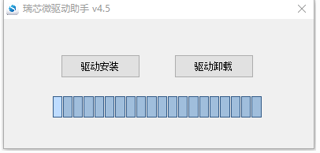
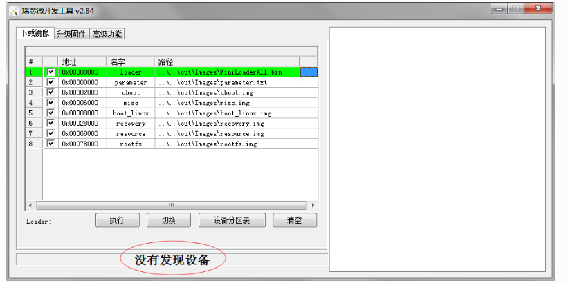
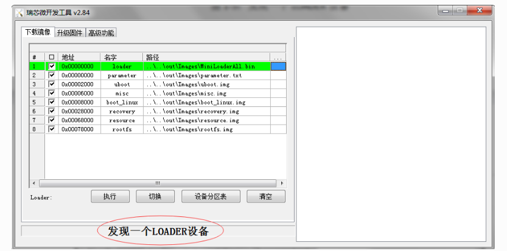
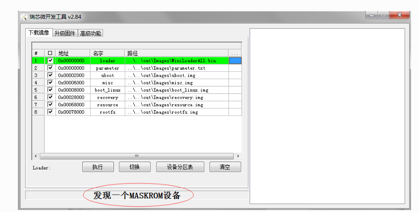
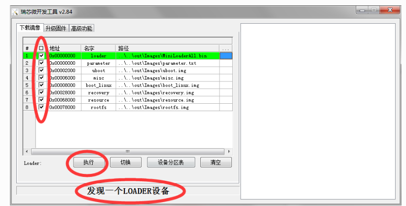
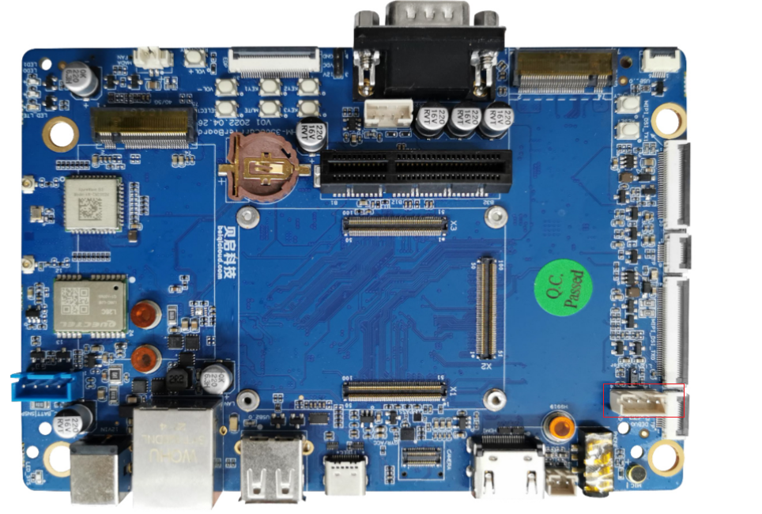
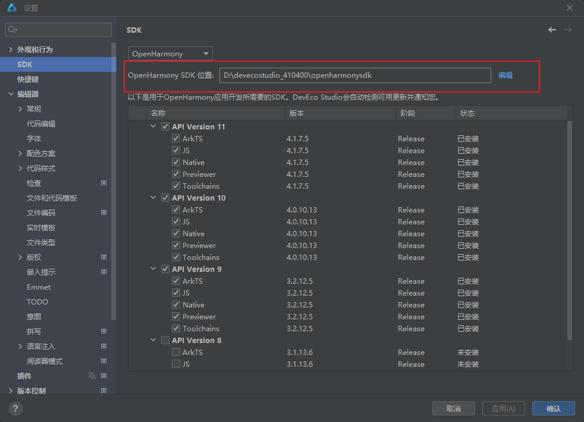
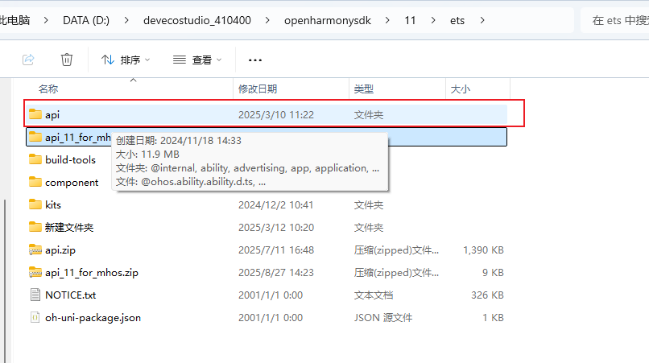

# RK3568主板

## 一、快速上手

## 产品优势

1.OpenHarmony 主线上的软件下载后可以直接运行，跟随主线软件更新；
2.完善的专业技术支持，可提供配套教程、技术资料；
3.可直接使用在终端客户，实现产品快速量产；
4.从主线上下载，及时更新维护；
5.厚度薄，可以直接做产品；
6.一体化低成本；
7.主线产品的外围设备，屏幕，摄像头等可以直接使用。

## 产品规格书

https://www.bearkey.com.cn/product/RK3568%E4%B8%BB%E6%9D%BF.html

## 固件烧写

一般采用Loader模式烧写固件，如果无法进入loader烧写模式，仍可以进入 MaskRom 模式来烧写固件。

### 进入烧写模式

### 准备程序

RK3568开发板

电脑主机

Type-C 数据线

12v电源适配器

### 安装Windows RK USB驱动程序

先从网盘下载 driverAssitant_v5.1.1.zip 至电脑上，解压目录运行里面的 DriverInstall.exe 。先选择驱动卸载，然后再选择驱动安装。

### 进入loader烧写模式

1.接入12V电源适配器给予开发板供电，Type-C数据一端接在开发板上一端接到电脑PC端的USB接口上。

2.按住主板的Recovery按键不放。

3.电源适配器上电后，按下复位(Reset)按键。

4.当开发板进入loader模式后，松开按键。

### 进入maskrom烧写模式

1.接入12V电源适配器给予开发板供电，Type-C数据一端接在开发板上一端接到电脑PC端的USB接口上。

2.按住主板的Maskrom按键不放。

3.电源适配器上电后，按下复位(Reset)按键。

4.当开发板进入loader模式后，松开按键。

## 查询烧写状态

#### Linux主机查询

先从网盘下载得到 edge工具 至电脑上，执行如下命令查询烧写状态:

./edge flash -q
1.none：表示开发板未进入烧写模式。

2.loader：表示开发板进入loader烧写模式。

3.maskrom：表示开发板进入maskrom烧写模式。

#### Windows主机查询

下载网盘 RKDevTool_Release_v2.84 工具至电脑上。双击打开RKDevTool_Release_v2.84目录下的 RKDevTool.exe

没有发现设备（如果图1-4所示）：表示开发板未进入烧写模式。

发现一个LOADER设备（如图1-5所示）：表示开发板进入loader烧写模式。

发现一个MASKROM设备（如图1-6所示）：表示开发板进入maskrom烧写模式。

## Linux主机烧写镜像

烧写所有镜像
烧写所有镜像包括： MiniLoaderAll.bin ， parameter.txt ， uboot.img ， misc.img ， boot_linux.img ， recovery.img ， resource.img 和 rootfs.img

./edge flash -a
烧写uboot镜像
烧写镜像：MiniLoaderAll.bin，uboot.img

./edge flash -u
烧写kernel镜像
烧写镜像：resource.img，boot_linux.img和recovery.img

./edge flash -k
烧写misc镜像
烧写镜像：misc.img

./edge flash -m
烧写文件系统镜像
烧写镜像：rootfs.img

./edge flash -r
查看烧写帮助
查看支持的烧写参数：

./edge flash -h

## Windows主机烧写镜像

双击打开RKDevTool_Release_v2.84目录下的RKDevTool.exe。

确认开发板已经进入loader或者maskrom烧写模式。

打勾选择需要烧写的镜像。

Loader和Parmeter选项建议打勾选择，其他选项根据需要打勾选择。

点击“执行”按钮，开始烧写固件

## 串口调试

开发板调试口：开发板的Debug口

波特率(B) :150000数据位(D) :8
停止位(S) :1
奇偶校验(A) :无
流控制(F) :无

## 在线文档

https://www.bearkey.net/thread-84-1-1.html

## 二、Openharmony开发

## 三、Mineharmony

## 矿鸿api添加步骤

- 确认openharmonySDK存放路径,打开DevEco Studio4.1--&gt;设置-&gt;

设置 X
Qr SDK ←
〉外观和行为 OpenHarmonySDK快捷键 OpenHarmony SDK位置: D:\devecostudio_410400\openharmonysdk 编辑
√编辑器 以下是用于OpenHarmony应用开发所需要的SDK。DevEco Studio会自动检测可用更新并通知您。&gt;常规 名称 版本 阶段 状态代码编辑 vAPI Version 11字体 √ ArkTS 4.1.7.5 Release 已安装〉配色方案 4.1.7.5 Release 已安装&gt;代码样式 Nervier 4.7.5 Releasse 已安装检查 回 √Toolchains 4,1.7.5 Release 已安装文件和代码模板 API Version 10文件编码 实时模板 回 ArkTS Nstive 4.0.10.13 4.0.10.13 Release Release 已安装 已安装文件类型 √ Previewer 4.0.10.13 Release 已安装&gt;版权 回 √Toolchains 4.0.10.13 Release 已安装嵌入摄示 回 API Version 9ArkTS 3.2.12.5 Release 已安装Emmet JS 3.2.12.5 Release 已安装TODO Native 3.2.12.5 Release 已安装意图 Previewer 3.2.12.5 Release 已安装拼写 回 Toolchains 3.2.12.5 Release 已安装〉语言注入 回 ]API Version 8 ]ArkTS 3.1.13.6 Release 未安装阅读器模式 回 JS 3.1.13.6 Release 未安装插件 刘回

把解压出来的ts文件拷贝到api目录下

比电脑 &gt; DATA(D:) &gt; devecostudio_410400 &gt; openharmonysdk &gt; 11 &gt; ets &gt; 在ets 中搜排序 三查看 ...名称 入 修改日期 类型 大小api 2025/3/10 11:22 文件夹api_11 for _mh创建日期: 2024/11/18 14:33build-toolscomponent 文件:@ohos.abilty,ability.d.ts.kits 2024/12/2 10:41 文件夹新建文件夹 2025/3/12 10:20 文件夹api.zip 2025/7/11 16:48 压缩(zipped)文件.. 1,390 KBapi_11_for_mhos.zip 2025/8/27 14:23 压缩(zipped)文件.. 9 KBNOTICE.txt 2001/1/1 0:00 文本文档 326KBoh-uni-packagejson 2001/1/1 0:00 JSON源文件 1KB

进入api目录,device-define目录下

添加一下SystemCapability.Hcp

D:&gt; devecostudio_410400 &gt;openharmonysdk &gt; 11 &gt; ets &gt; api &gt;device-define &gt; &#123;&#125;defaultjson &gt;... 2 "SysCaps": create 211 "SystemCapability. BundleManager . BundleFramework. Launcher" 212 "SystemCapability. BundleManager. BundleFramework. SandboxApp", 213 "SystemCapability. BundleManager. BundleFramework. QuickFix", 214 "SystemCapability. BundleManager. BundleFramework.AppControl" 215 "SystemCapability.Ability.AbilityRuntime.QuickFix", 216 "SystemCapability.Graphic.Graphic2D.ColorManager.Core" 217 "SystemCapability. ResourceSchedule. BackgroundTaskManager. EfficiencyResourcesApply'" 218 "SystemCapability.Msdp.DeviceStatus .Stationary", 219 "SystemCapability.XTS.DeviceAttest", 220 "SystemCapability. Request.FileTransferAgent", 221 "SystemCapability.ResourceSchedule. DeviceStandby", 222 "SystemCapability.DistributedDataManager.UDMF.Core" 223 "SystemCapability.Print.PrintFramework", 224 "SystemCapability.Multimedia.Media.AVScreenCapture" 225 "SystemCapability.AI. IntelligentVoice.Core" 226 "SystemCapability.Multimedia.Media.SoundPool", 227 "SystemCapability.Multimedia.Audio.Spatialization" 228 "SystemCapability.Multimedia.AudioHaptic.Core", 229 "SystemCapability.ArkUi.Graphics3D",
• 230 "SystemCapability.AI.MindSporeLite",
3 231 "SystemCapability. Graphics. Drawing 232 "SystemCapability.Hcp" 233 234 235

## 四、第三方应用及环境搭建

## 第三方应用功能介绍

### 第三方应用

1、application_rtspcamera.hap

用于多路rtsp相机拉流播放的测试和演示

具体环境搭建参考测试环境目录

2、bq_hello.hap

用于新手对arkui界面的学习和展示

3、bq_led.hap

用于led控制的演示

4、bq_uart.hap

用于测试应用通过485和232串口发送数据给其他设备

5、multiple_cameras.hap

用于测试多路相机显示，具体环境搭建参考测试环境目录下的介绍

6、MultiScreenDisplay.hap
用于测试多屏同显/多屏异显功能，具体环境搭建参考测试环境目录下的介绍

7、ProjectionScreen.hap

用于测试投屏反控功能

8、recorder4_0.hap

用于测试录音功能

9、webSocket.hap

用于测试实时音视频

具体环境搭建参考测试环境目录下的介绍

## RTSP推流环境搭建步骤

###### RTSP推流环境搭建步骤

##### 1、进入”RTSP推流“目录，解压 “ffmpeg-6.0-full_build-shared.7z”

##### 2、进入解压出来的ffmpeg-6.0-full_build-shared目录，打开cmd命令行窗口，输入以下命令：

~~~
ffmpeg -re  -stream_loop -1 -i "..\..\video\basa.h264"  -c copy -rtsp_transport tcp -f rtsp rtsp://127.0.0.1:8554/stream
~~~

ffmpeg：这是命令行工具的名称，用于处理视频和音频文件。

 -re：这个参数告诉 FFmpeg 以本地播放速度（real-time）读取输入文件，即按正常速度播放。

 -stream_loop -1：这个参数设置流循环次数。-1 表示无限循环。

-i "..\..\video\basa.h264"：这是输入文件的路径。-i 表示输入（input），后面跟着的是文件的路径。这里指定了一个位于 D 盘的名为 1731_4K.mp4 的视频文件。

-c copy：这个参数指定了编解码器的复制模式。-c 表示编码器（codec），copy 表示不对视频和音频流进行重新编码，直接复制原始流。

-rtsp_transport tcp：这个参数指定 RTSP 传输协议。-rtsp_transport 后面跟着的是协议类型，这里使用 TCP 协议。

-f rtsp：这个参数指定输出格式。-f 表示格式（format），rtsp 表示输出格式为 RTSP。 rtsp://127.0.0.1:8554/stream：这是输出流的 URL。rtsp:// 是 RTSP 协议的前缀，127.0.0.1 是本地回环地址（localhost），8554 是 RTSP 服务器监听的端口号，/stream 是流的名称。

##### 3、解压“mediamtx_v0.23.5_windows_amd64.zip”

##### 4、进入“mediamtx_v0.23.5_windows_amd64”目录，双击mediamtx.exe程序，运行rtsp推流

##### 6、在板子上安装并打开application_rtspcamera.hap应用，点击加号在弹出框中将IP改成电脑的IP：

## 实时音视频通话搭建

#### 实时音视频通话环境搭建步骤

1、进入实时音视频通话，在PC端安装SRS应用，安装完成后在windows双击运行SRS

2、双击运行另外一个应用：WebrtcConServer.exe

3、开发板安装webSocket.hap应用，并打开进行相关设置

3.1进入应用：

3.2 查看PC端的ip地址：

​		注意：两台开发板和PC端必须连接到同一网络下

​		PC端查看同一网络下的ip地址：

3.3 开发板上修改  SRS Url和MQTT ip

3.4 开发板点击连接：

3.5 PC端页面显示连接成功：

## 五、常见问题

## FAQs

Todo

&gt; 可通过beiqi@beiqicloud.com联系我们!
