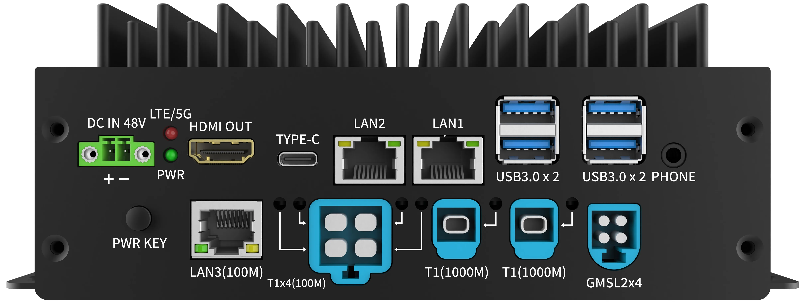
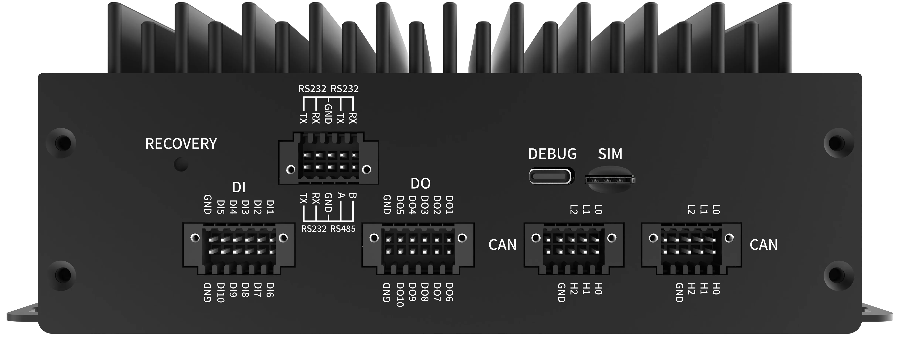
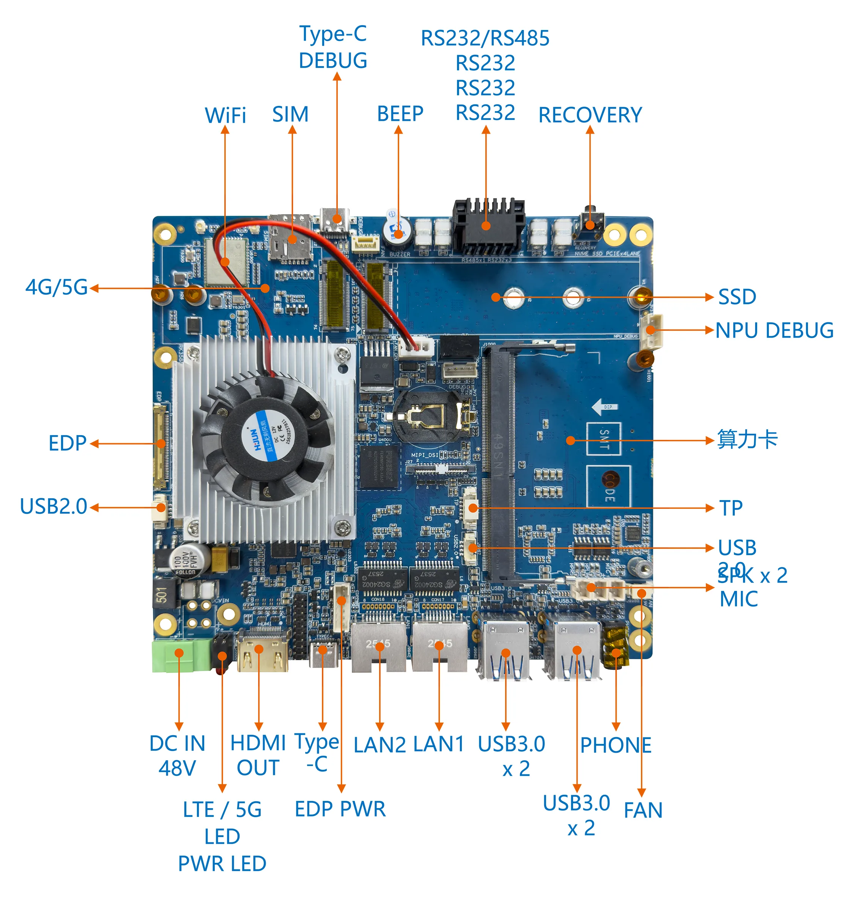
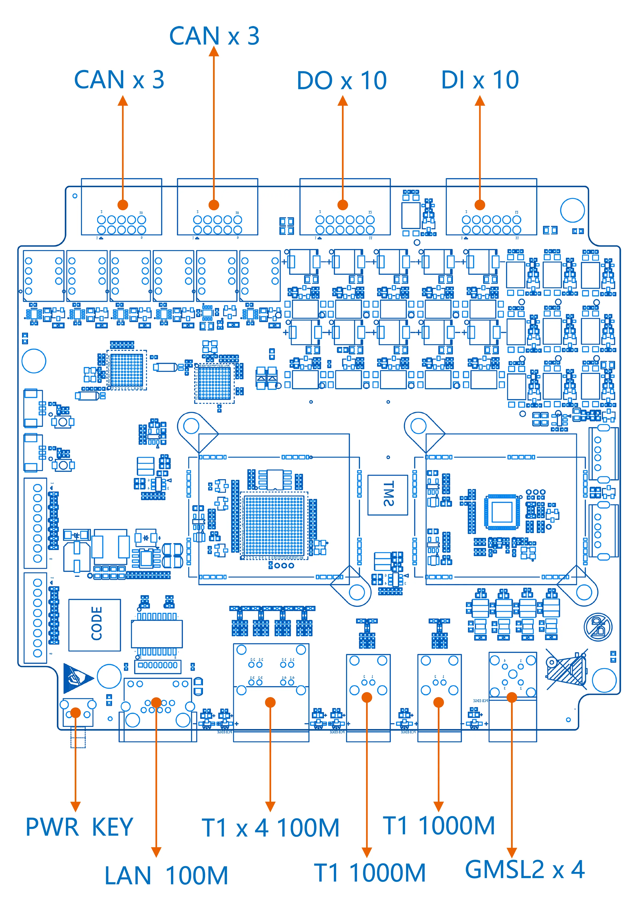
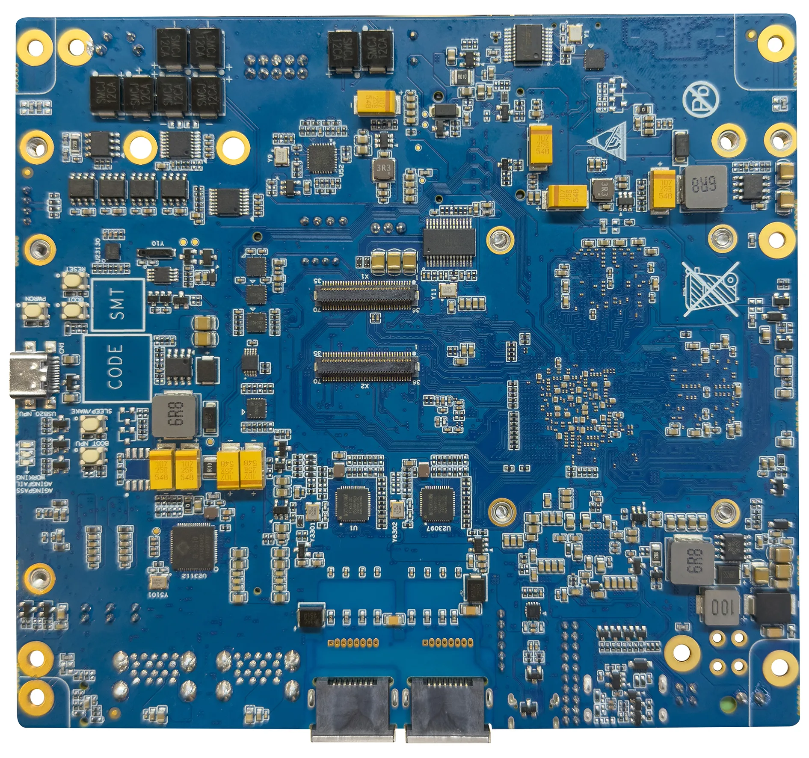

# 贝启Robo3588机器人开发板主板

## **简介**

贝启Robo3588机器人开发板是一款瑞芯微 RK3588+RK1828 平台的具身智能机器人开发板，专为边缘计算与机器人交互场景打造，集成高性能算力与丰富工业级接口。主板搭载双风扇主动散热，支持 4G/5G 与 Wi-Fi 无线连接，配备双路千兆 LAN、多路 USB3.0/2.0、RS232/RS485 串口、麦克风喇叭及 HDMI 、MIPI、EDP显示输出，可快速实现机器人视觉感知、运动控制与人机交互；搭配拓展板后更扩展出 6 路 CAN、10 路 DI+10路DO、4路百兆车载T1以太网、2路千兆车载T1以太网、1路普通百兆RJ45以太网口及 4路GMSL2 接口，满足复杂场景下的多传感器融合与实时控制需求，是开发服务机器人、工业 AGV、自主导航机器人等具身智能应用的高效平台。

贝启Robo3588机器人开发板外观图如图1所示：





​																						图1：   贝启Robo3588机器人开发板外观图

## **一、开发板详情**

**1、   贝启Robo3588机器人开发板正面接口示意图**



​																					图2：   贝启Robo3588机器人开发板正面接口示意图

**2、   贝启Robo3588机器人开发板反面接口示意图**



​                                                                           图3：   贝启Robo3588机器人开发板反面接口示意图

**3、 贝启Robo3588机器人拓展板接口示意图**


图4：   贝启Robo3588机器人拓展板接口示意图

## **二、开发板规格**

Rockchip RK3588集成四核Cortex-A76和四核Cortex-A55核心，主频高达2.4GHz，可广泛应用于嵌入式人工智能领域。

Robo3588机器人开发板核心规格如表1所示：

| 芯片、处理器、存储 |  |
| --- | --- |
| SoC | Rockchip RK3588 |
| CPU | ARM Cortex-A76×4+ARM Cortex-A55×4 |
| GPU | G610 支持OpenGLES 1.1, 2.0, and 3.2, OpenCL up to 2.2 and Vulkan1.2，专有2D硬件加速引擎 |
| NPU | 6.0TOPs |
| RAM | 8GB 及以上 LPDDR5 |
| ROM | 64GB eMMC 5.1 |

​																表1    贝启Robo3588机器人开发板核心规格清单

贝启Robo3588机器人开发板接口规格说明如表2所示：

| 贝启Robo3588机器人开发板主板接口规格说明 |  |
| --- | --- |
| 电源输入 | DC IN 48V 宽压输入 |
| 指示灯 | 1 x PWR LED 1xLTE/5G LED |
| 调试接口 | 1x 调试串口 1 x Type-C DEBUG (系统调试)、1 x NPU DEBUG (AI算力调试专用) |
| 按键 | 1 x RECOVERY (烧录/恢复)、1 x PWR KEY (电源开关键)、1 x KEY (功能键) |
| 视频输出 (Display) | 1 x HDMI OUT (8K@60Hz)、1 x EDP (4K@60Hz)、1 x TP (触摸屏接口) |
| 摄像头输入 (Camera) | 4 x GMSL2(MinFakra) 车载摄像头接口 |
| USB 接口 | 4 x USB 3.0 Type-A、1 x Type-C |
| 串口 | 3 x RS232、1 xRS485、6 x CAN 总线接口 (通过拓展板) |
| DIDO | 10 x DI (数字输入)、10 x DO (数字输出) |
| 以太网 (标准) | 1 x LAN1 (千兆)、1 x LAN2 (千兆)、1 x LAN (100M，支持TSN、EtherCAT) |
| 车载以太网 (T1) | 4 x T1 100M 接口、2 x T1 1000M 接口 |
| 蜂窝 | 1 x M.2 接口支持 4G/5G 模组 |
| 无线网络 | 支持WIFI6 5GHz/2.4GHz, 2天线 |
| 蓝牙 | BT5.0 |
| SIM 卡 | 1 x SIM（Nano-SIM） |
| 音频 | 1x HDMI音频输出、1x 耳机输出（3.5mm, CTIA）、左右声道SPK座子（2Pins）、1 x MIC座子（2Pins） |
| 蜂鸣器 | 1x蜂鸣器 |
| 固态硬盘接口 | 1 x M.2 SSD 固态硬盘接口 (NVMe) |
| 算力扩展 | 1 x 算力卡槽 (用于进一步提升AI推理能力) |
| 其它拓展接口 | 1 xDC OUT 5VCPU风扇 : 1 x FAN_CPU（12V）USB : 2 x USB2.0(4Pins座子) ：1 x I2C 触屏座子RTC电池 ：1 x BAT_RTC（独立RTC芯片） |

​																	表2    贝启Robo3588机器人开发板接口规格说明

## **三、开发板应用场景**

贝启Robo3588机器人主板凭借其独特的车载级 GMSL2 视觉输入、T1 协议以太网、多路 CAN 总线及RS232/RS485及 48V 宽压特性，广泛应用于人形机器人、高性能自动驾驶机器人、下一代自主移动机器人（AMR）、协作机器人、配送机器人与商用服务机器人、智慧边缘计算及嵌入式人工智能领域。

## **四、搭建开发环境**

**1、安装依赖工具**

安装命令如下：

```
sudo apt-get update && sudo apt-get install git ssh make gcc libssl-dev liblz4-tool expect expect-dev g++ patchelf chrpath gawk texinfo diffstat binfmt-support qemu-user-static live-build bison flex fakeroot cmake gcc-multilib g++-multilib unzip device-tree-compiler ncurses-dev libgucharmap-2-90-dev bzip2 expat gpgv2 cpp-aarch64-linux-gnu libgmp-dev libmpc-dev bc python-is-python3 python2 git-core gnupg build-essential zip curl zlib1g-dev libc6-dev-i386 libncurses5 lib32ncurses5-dev x11proto-core-dev libx11-dev lib32z1-dev libgl1-mesa-dev libxml2-utils xsltproc fontconfig vim git-lfs ruby openssl libtinfo5 genext2fs openjdk-11-jdk ccache nodejs default-jdk u-boot-tools mtools mtd-utils scons gcc-arm-none-eabi libelf-dev libglvnd-dev doxygen
```

**说明：**
以上安装命令适用于Ubuntu22.04，其他版本请根据安装包名称采用对应的安装命令。

**2、获取标准系统源码**

**前提条件**

1）注册码云gitcode账号。

2）注册gitcode SSH公钥，请参考[帮助中心][https://docs.gitcode.com/docs/help/home/user_center/security_management/ssh](https://docs.gitcode.com/docs/help/home/user_center/security_management/ssh)

3）安装[git客户端](http://git-scm.com/book/zh/v2/%E8%B5%B7%E6%AD%A5-%E5%AE%89%E8%A3%85-Git)和[git-lfs](https://gitee.com/vcs-all-in-one/git-lfs?_from=gitee_search#downloading)并配置用户信息。

```
git config --global user.name "yourname"

git config --global user.email "your-email-address"

git config --global credential.helper store
```

4）安装码云repo工具，可以执行如下命令。

```
curl -s https://gitee.com/oschina/repo/raw/fork_flow/repo-py3 \>
/usr/local/bin/repo \#如果没有权限，可下载至其他目录，并将其配置到环境变量中

chmod a+x /usr/local/bin/repo

pip3 install -i https://repo.huaweicloud.com/repository/pypi/simple requests
```

**获取源码操作步骤**

1） 通过repo + ssh 下载（需注册公钥，请参考码云帮助中心）。

```
repo init -u git@gitcode.com:openharmony-robot/manifest.git -b OpenHarmony-Embodied-1.0.1 -m chipsets/bq3588.xml --no-repo-verify

repo sync -c

repo forall -c 'git lfs pull'
```

2） 通过repo + https 下载。

```
repo init -u https://gitcode.com/openharmony-robot/device_board_bearkey/tree/OpenHarmony-5.1.0-Release-tag/bq3588

repo sync -c

repo forall -c 'git lfs pull'
```

**执行prebuilts**

在源码根目录下执行脚本，安装编译器及二进制工具。

```
bash build/prebuilts_download.sh
```

下载的prebuilts二进制默认存放在与OpenHarmony同目录下的OpenHarmony_2.0_canary_prebuilts下。

## **五、编译调试**

**1、编译**

在Linux环境进行如下操作:

1） 进入源码根目录，执行如下命令进行版本编译。

./build.sh -p robo3588 开始编译

2） 检查编译结果。编译完成后，log中显示如下：

```
post_process

=====build robo3588 successful.

2025-12-04 10:11:11
```

编译所生成的文件都归档在out/robo3588/目录下，结果镜像输出在out/robo3588/packages/phone/images/ 目录下。

3） 编译源码完成，请进行镜像烧录。

**2、烧录工具**

烧写工具下载及使用。

工具路径：robo3588/tools/RKDevTool_v3.28_for_window.zip

烧录说明文档见RKDevTool_v3.28_for_window.zip的 “开发工具使用文档_v1.0.pdf“
