# WiKi教程-BQ-3588-C

## 产品概况

## 产品概况

RK3588 核心板是一款由贝启科技自主研发的基于瑞芯微 RK3588 AI 芯片的智能核心板， 该核心 板性能强劲、接口丰富，可以广泛应用于 ARM 电脑、AR/VR、智能座舱、智慧大屏、边缘计算、 高端 IPC、NVR、行业高端平板等应用场景。

贝启科技提供 Linux Debian、Linux Ubuntu、Android 等操作系统 SDK，并可支持适配鸿蒙操 作系统、Linux 国产操作系统。

该核心板尺寸仅仅 85mm×50mm，可以方便的嵌入到各类设备中。

## 产品优势

## 产品优势

1.搭载 RK3588 高性能 SOC，集成了四核 Cortex-A76 和四核 Cortex-A55，主频高达 2.4G

2.算力高达 6Tops，支持 INT4/INT8/INT16/FP16 运算，满足大多数人工智能模型的算力需求

3.强大的编解码能力，最高支持 8K@60fps

4.丰富的接口类型，满足行业应用开发需求

## 芯片架构

## 芯片架构

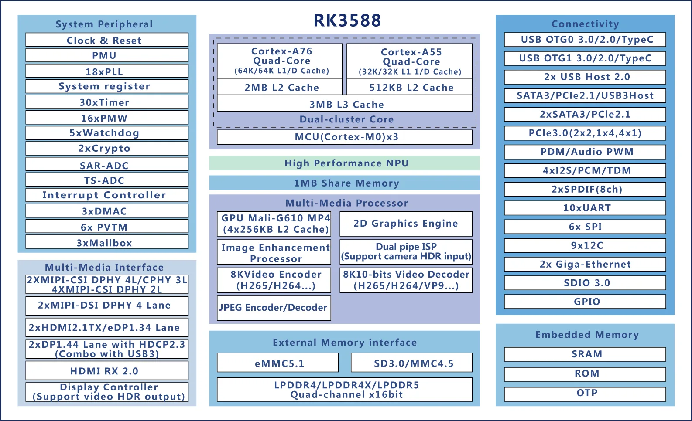

## 产品参数

## 产品参数

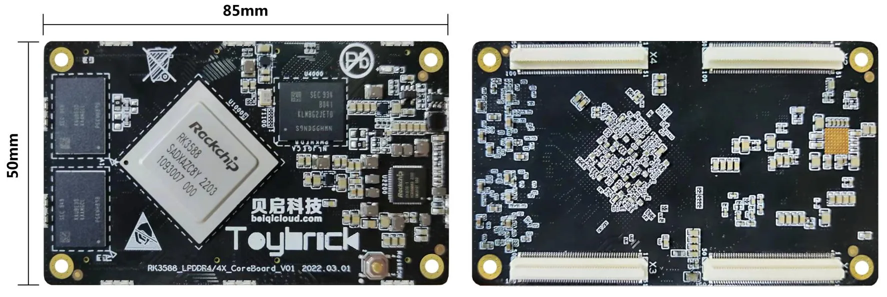

## 引线分配

## 引线分配

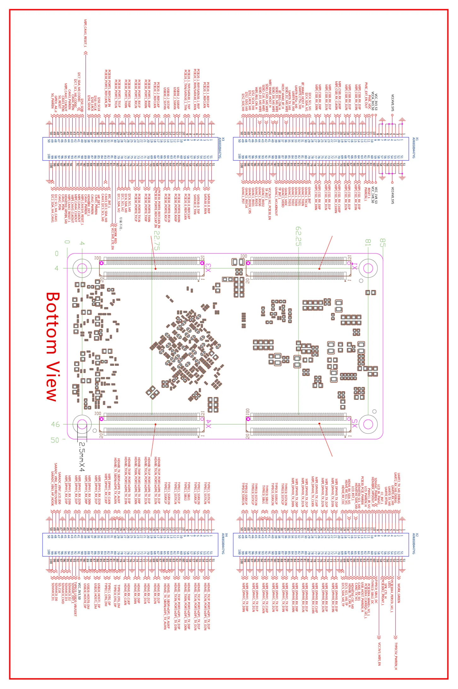

## 规格参数

## 规格参数

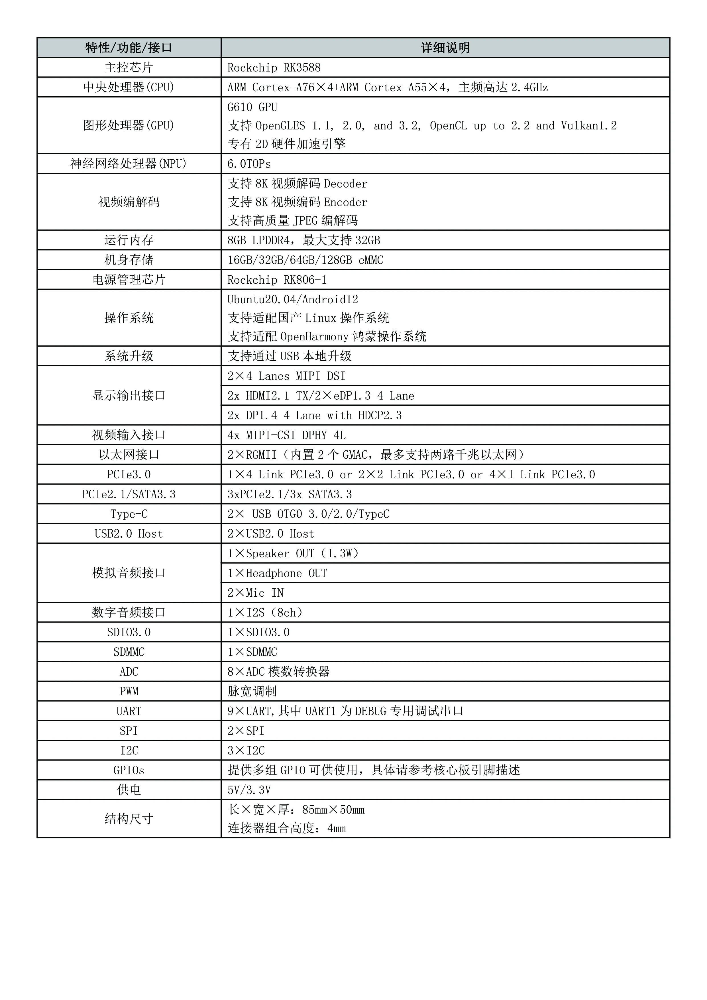

## 引脚描述

## 引脚描述


## 底板接口信息

## 底板接口信息

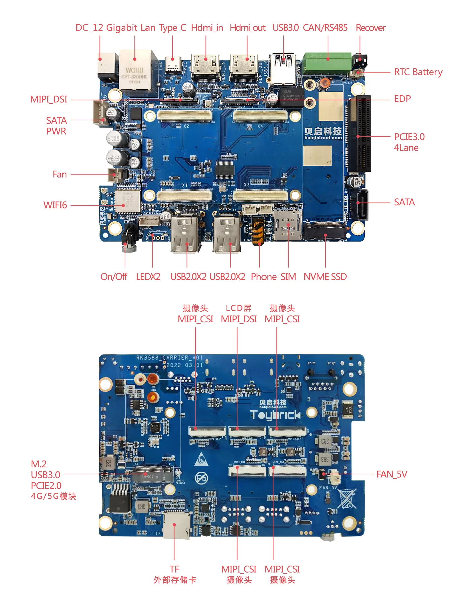

## 底板产品参数

## 底板产品参数

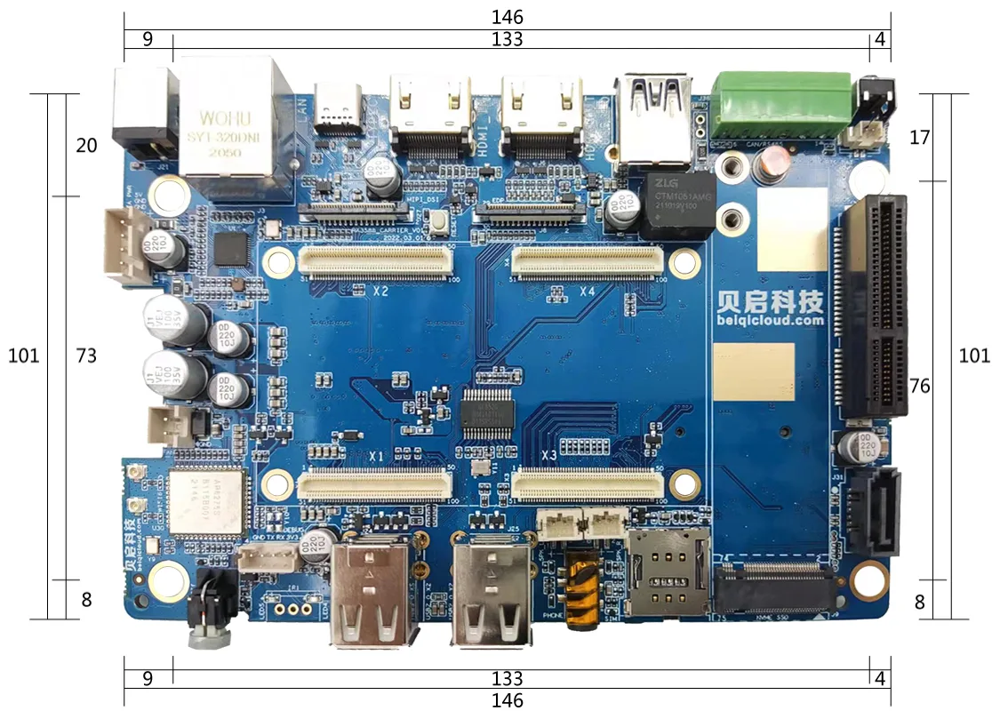

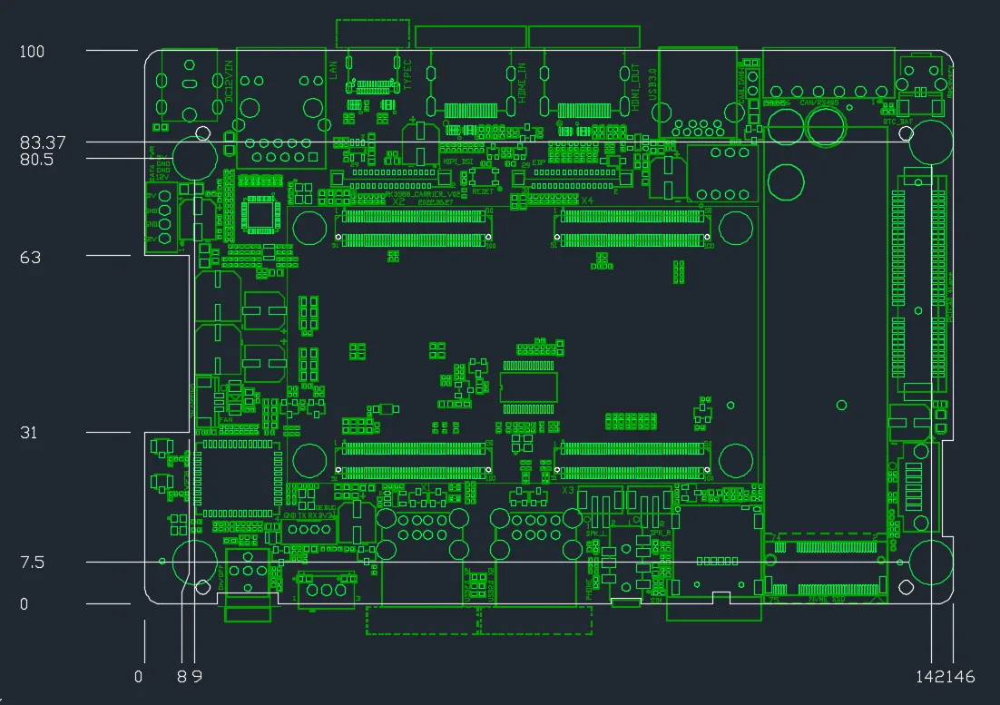

## 底板规格参数

## 底板规格参数

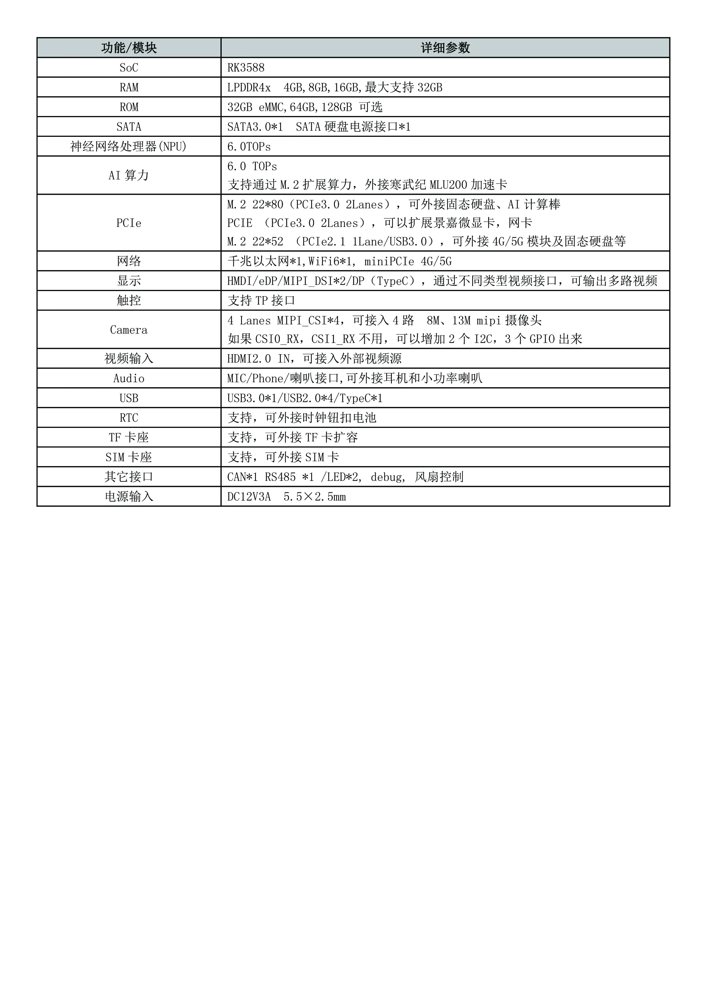

## 入门指南

## 入门指南

## 烧写固件

## 烧写固件

一般采用Loader模式烧写固件，如果无法进入loader烧写模式，仍可以进入 MaskRom 模式来烧写固件。

### 进入烧写模式

### 准备程序

- RK3588开发板
- 电脑主机
- Type-C 数据线
- 12v电源适配器

#### 安装Windows RK USB驱动程序

先从网盘下载 [driverAssitant_v5.1.1.zip](https://pan.baidu.com/s/1ZPgDx9DucAG_rSReRePOCQ?pwd=1e5z#list/path=%2Fsharelink643277584-132554420893019%2F2.%E8%BE%B9%E7%BC%98%E8%AE%A1%E7%AE%97Debian11_Ubuntu20.04%2F%E7%83%A7%E5%86%99%E5%B7%A5%E5%85%B7%E5%8F%8A%E9%A9%B1%E5%8A%A8&parentPath=%2Fsharelink643277584-132554420893019) 至电脑上，解压目录运行里面的 `DriverInstall.exe` 。先选择驱动卸载，然后再选择驱动安装。

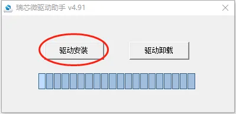

#### 进入loader烧写模式

1.接入12V电源适配器给予开发板供电，Type-C数据一端接在开发板上一端接到电脑PC端的USB接口上。

2.按住主板的Recovery按键不放。

3.电源适配器上电后，按下复位(Reset)按键。

4.当开发板进入loader模式后，松开按键。

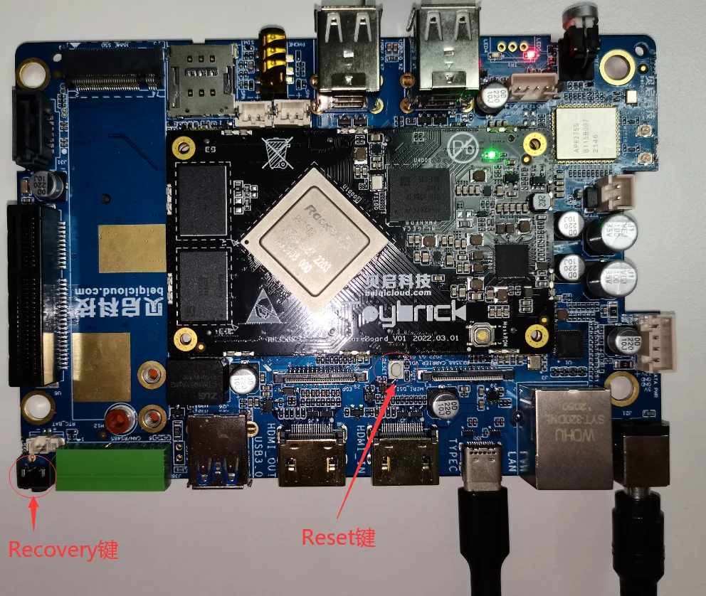

#### 进入maskrom烧写模式

1.接入12V电源适配器给予开发板供电，Type-C数据一端接在开发板上一端接到电脑PC端的USB接口上。

2.按住主板的Maskrom按键不放。

3.电源适配器上电后，按下复位(Reset)按键。

4.当开发板进入loader模式后，松开按键。

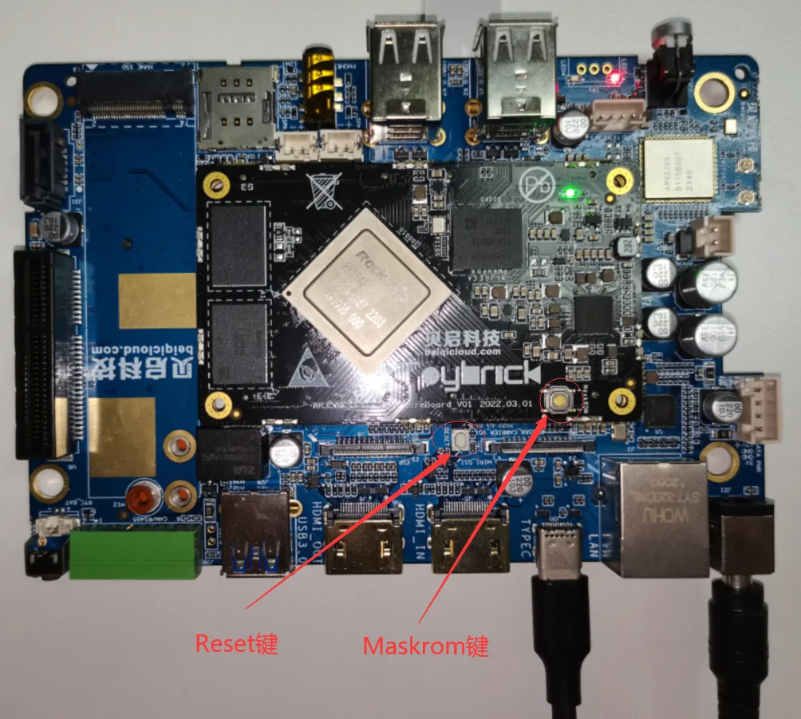

### 查询烧写状态

#### Linux主机查询

先从网盘下载得到
[edge工具](https://pan.baidu.com/s/1ZPgDx9DucAG_rSReRePOCQ?pwd=1e5z#list/path=%2Fsharelink643277584-132554420893019%2F2.%E8%BE%B9%E7%BC%98%E8%AE%A1%E7%AE%97Debian11_Ubuntu20.04%2F%E7%83%A7%E5%86%99%E5%B7%A5%E5%85%B7%E5%8F%8A%E9%A9%B1%E5%8A%A8%2Fedge%E5%B7%A5%E5%85%B7&parentPath=%2Fsharelink643277584-132554420893019) 至电脑上，执行如下命令查询烧写状态:

```
./edge flash -q
```

1.none：表示开发板未进入烧写模式。

2.loader：表示开发板进入loader烧写模式。

3.maskrom：表示开发板进入maskrom烧写模式。

#### Windows主机查询

下载网盘 [RKDevTool_Release_v2.84](https://pan.baidu.com/s/1ZPgDx9DucAG_rSReRePOCQ?pwd=1e5z#list/path=%2Fsharelink643277584-132554420893019%2F2.%E8%BE%B9%E7%BC%98%E8%AE%A1%E7%AE%97Debian11_Ubuntu20.04%2F%E7%83%A7%E5%86%99%E5%B7%A5%E5%85%B7%E5%8F%8A%E9%A9%B1%E5%8A%A8%2FFlashTool&parentPath=%2Fsharelink643277584-132554420893019) 工具至电脑上。双击打开RKDevTool_Release_v2.84目录下的 `RKDevTool.exe`

- 没有发现设备（如果图1-4所示）：表示开发板未进入烧写模式。
- 发现一个LOADER设备（如图1-5所示）：表示开发板进入loader烧写模式。
- 发现一个MASKROM设备（如图1-6所示）：表示开发板进入maskrom烧写模式。

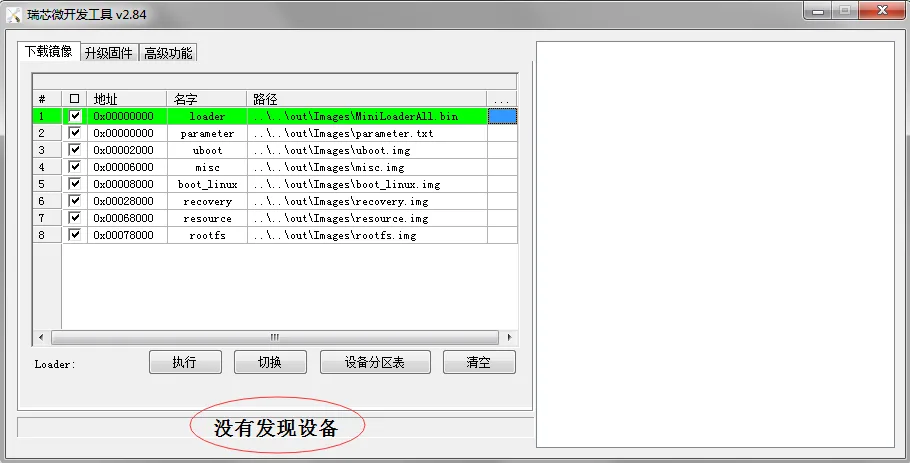
图1-4：没有发现设备

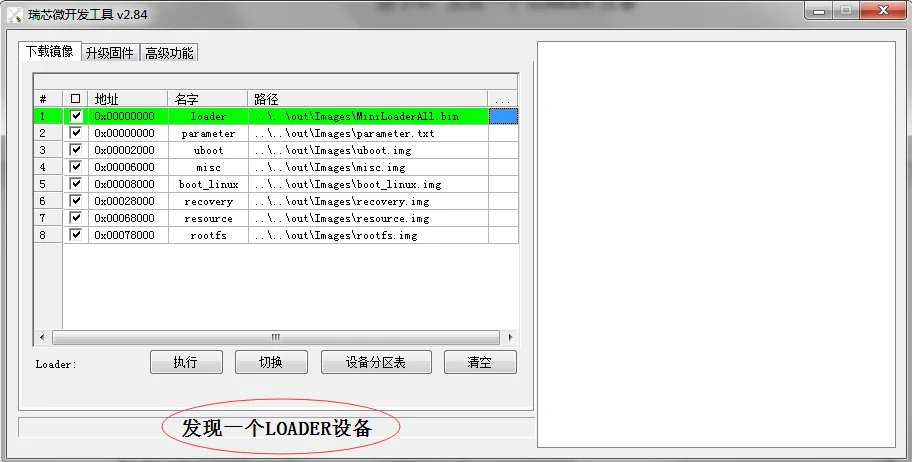
图1-5：发现一个LOADER设备

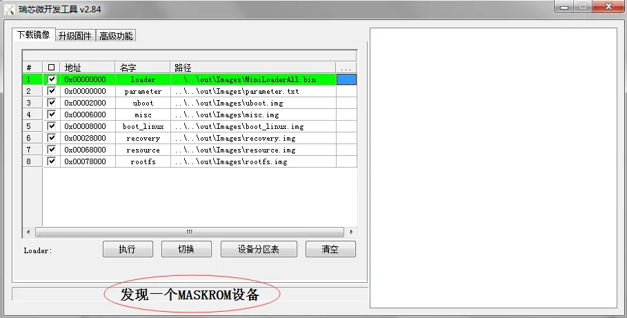
图1-6：发现一个MASKROM设备

### Linux主机烧写镜像

#### 烧写所有镜像

烧写所有镜像包括： `MiniLoaderAll.bin` ， `parameter.txt` ， `uboot.img` ， `misc.img` ， `boot_linux.img` ， `recovery.img` ， `resource.img` 和 `rootfs.img`

```
./edge flash -a
```

#### 烧写uboot镜像

烧写镜像：MiniLoaderAll.bin，uboot.img

```
./edge flash -u
```

#### 烧写kernel镜像

烧写镜像：resource.img，boot_linux.img和recovery.img

```
./edge flash -k
```

#### 烧写misc镜像

烧写镜像：misc.img

```
./edge flash -m
```

#### 烧写文件系统镜像

烧写镜像：rootfs.img

```
./edge flash -r
```

#### 查看烧写帮助

查看支持的烧写参数：

```
./edge flash -h
```

### Windows主机烧写镜像

- 双击打开RKDevTool_Release_v2.84目录下的RKDevTool.exe。
- 确认开发板已经进入loader或者maskrom烧写模式。
- 打勾选择需要烧写的镜像。

##### 注解

Loader和Parmeter选项建议打勾选择，其他选项根据需要打勾选择。

- 点击“执行”按钮，开始烧写固件（如图1-7所示）。  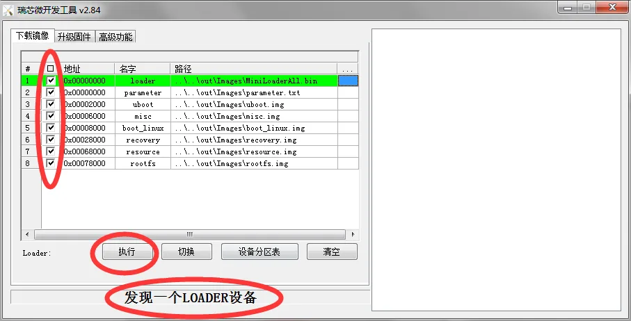 图1-7：烧写固件

## Linux开发

## Linux开发

## 开机登录账户

## 开机登录账户

Debian11默认的登录账号是：bearkey，登录密码是：bearkey

## 远程登录调试

## 远程登录调试

RK3588开发板出厂debian11固件默认支持两种远程登录：adb和ssh

### adb登录

Linux电脑主机通过USB（主机的USB Host连接开发板的USB OTG口）

执行命令adb shell指令即可登录RK3588开发板的debian系统中。

##### 提示

*开发板的OTG口通常是标有”TYPE_C” 或”DOWNLOAD”的丝印，接口类似是Type-C。*

### ssh登录

Linux电脑主机通过网络，执行如下命令远程(ip获取方法)登录RK3588开发板的debian系统：

`ssh bearkey@xxx.xxx.xxx.xxx               //xxx.xxx.xxx.xxx是开发板的IP地址`

## 常用命令行操作

## 常用命令行操作

### 网络连接

插入网线。

查看以太网接口名命令：

```
ip a
```

动态分配IP地址(假设以太网接口为eth1) 命令：

```
dhclient eth1
```

### 挂载U盘

`mount /dev/sda1 /mnt   //假设U盘为：/dev/sda1`

### 远程拷贝

`scp $LOCAL_FILE $USER@$IP:/$REMOTE_PATH`

### 重要文件备份

挂载rootfs分区到/sysroot目录：进入紧急模式后系统自动挂载rootfs分区到/sysroot，用户无需重复操作。

将重要文件拷贝到U盘或拷贝的远程主机上：

```
cp $FILE /mnt/
scp $LOCAL_FILE $USER@$IP:/$REMOTE_PATH
```

### 系统还原

1、将待还原的镜像rootfs.img拷贝到U盘上，并将U盘挂载到/mnt目录。

```
$cp rootfs.img $Udisk
mount /dev/sda1 /mnt
```

2 执行如下命令还原：

```
umount /sysroot
dd if=/mnt/rootfs.img of=/dev/disk/by-partlabel/rootfs
```

### 紧急模式

该模式在用户异常行为破坏系统文件时，导致系统无法正常启动时使用。非必要使用此模式。

拔出设备OTG口的Type-C的线，长按recovery按键后重启设备，系统将进入紧急模式的命令行，如图所示：

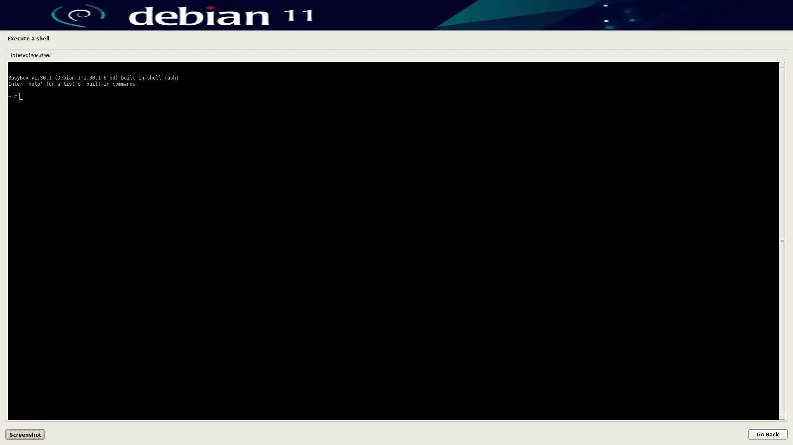

## 制作客制化Debian11固件

## 制作客制化Debian11固件

当用户在RK3588开发板完成产品化软件部署后，可以按照本章节自主裁剪debian11固件，生产自定义rootfs.img，用于产品批量生产。

### 制作根文件系统

以下操作均直接在RK3588开发板执行，如下步骤制作根文件系统：

挂载rootfs分区到sysroot目录：进入紧急模式后系统自动挂载rootfs分区到sysroot，用户无需重复操作。

插入U盘（请确保足够容量），挂载U盘到/mnt目录：

```
mount /dev/sda1 /mnt
```

打包根文件系统所有文件：

```
cd /sysroot
tar cvpfJ ../mnt/rootfs.tar.xz *cd -
```

创建空文件系统并格式化为EXT4文件系统：

```
dd if=/dev/zero of=/mnt/rootfs.img bs=2K count=3M   // 创建文件系统大小为6G（2K * 3M），用户可以修改count的大小设置文件系统大小
mkfs.ext4 /mnt/rootfs.img
```

挂载空文件系统到/rootfs目录：

```
mkdir /rootfs
mount /mnt/rootfs.img /rootfs
```

解压打包文件到/rootfs目录

```
tar xvpfJ /mnt/rootfs.tar.xz /rootfs
```

卸载/rootfs目录和U盘：

```
umount /rootfs
umount /mnt
```

至此得到rootfs.img于U盘内。

## 系统软件包

## 系统软件包

BQ-3588-C预装的debian11内预置了以下常用到的各种软件包

### Toybrick Property

#### 软件包说明

Toybrick Property基于D-BUS实现安卓系统属性的相关接口：getprop、setprop和C/C++库函数。

#### 软件包

##### toybrick-prop

1.包含运行时链接库（路径：/usr/lib/aarch64-linux-gnu）：libtoybrick_prop.so.0和libtoybrick_prop.so.0.0.0

2.执行如下命令安装：

```
sudo -y install toybrick-prop toybrick-log
```

##### toybrick-prop-bin

1.包含可执行文件和启动服务：

```
1.可执行文件（路径：/usr/bin）：toybrick_propd，getprop，setprop，toybrick-prop.sh

2.启动服务（路径：/usr/lib/systemd/system）：toybrick-prop.service
```

2.执行如下命令安装：

```
sudo -y install toybrick-prop-bin
```

3.开机启动服务：

```
sudo systemctl enable toybrick-prop.service
```

4.Prop命令使用帮助：

```
* 列出所有系统属性
```

```
getprop

[persist.dev.model]: [TB-RK3588B0]
[persist.sys.usb.config]: [adb]
[dev.model]: [TB-RK3588B0]
[sys.usb.config]: [adb]
[sys.usb.touch.width]: [1920]
[sys.usb.touch.height]: [1080]
[sys.usb.touch.points]: [10]
[sys.usb.touch.in]: [/dev/hidg2]
[sys.usb.touch.report.id]: [4]
[sys.usb.touch.report.size]: [64]
[sys.usb.touch.feature.id]: [2]
[sys.usb.keyboard.in]: [/dev/hidg0]
[sys.usb.mouse.in]: [/dev/hidg1]
```

**说明：以persist开头的系统属性会保存在/etc/prop/目录下，重启系统系统会自动加载导入配置。**

- 列出所有前缀为指定字段的系统属性

```
getprop list sys.usb

[sys.usb.config]: [adb]
[sys.usb.touch.width]: [1920]
[sys.usb.touch.height]: [1080]
[sys.usb.touch.points]: [10]
[sys.usb.touch.in]: [/dev/hidg2]
[sys.usb.touch.report.id]: [4]
[sys.usb.touch.report.size]: [64]
[sys.usb.touch.feature.id]: [2]
[sys.usb.keyboard.in]: [/dev/hidg0]
[sys.usb.mouse.in]: [/dev/hidg1]
```

- 查看单个系统属性

```
getprop sys.usb.config

adb
```

- 设置系统属性（需要root权限）

```
sudo setprop dev.version v0.1    // 设置dev.version属性，重启后丢失
sudo setprop persist.dev.version v0.1   //设置persist.dev.version属性，保存在/etc/prop/dev.json
```

- 删除指定的property

```
sudo setprop dev.version   //删除dev.version属性
sudo setprop persist.dev.version //删除dev.version属性, 同时删除/etc/prop/dev.json里的相关配置
```

##### toybrick-prop-dev

1.包含编译连接所需的相关文件：

```
* 头文件（路径：/usr/include/toybrick）：toybrick_properties.h，properties.h和system_properties.h

* 编译时链接库（路径：/usr/lib/aarch64-linux-gnu）：libtoybrick_prop.so

* pkgconfig（路径：/usr/lib/aarch64-linux-gnu/pkgconfig）：toybrick_prop.pc
```

2.执行如下命令安装：

```
sudo -y install toybrick-prop-dev toybrick-log
```

3.编译链接选项：

```
LDDFLAG=`pkg-config --libs toybrick_prop`
CFLAG=`pkg-config --cflags toybrick_prop`
```

4.包含头文件：

```
#include <toybrick/toybrick_properties.h>
#include <toybrick/properties.h>
#include <toybrick/system_properties.h>
```

5.示例代码：test.c

```
#include <toybrick/toybrick_properties.h>
#include <stdio.h>
int main(int argc, char **argv)
{
    const char *key = "dev.model";
    const char *default_value = "TB-RK3588B0";
    char value[PROPERTY_VALUE_MAX];
    int ret;

    ret = property_get(key, value, default_value);
    printf("key %s, value %s, len %d\n", key, value, ret);
    return ret;
}
```

编译命令：

```
gcc test.c `pkg-config --libs toybrick_prop` `pkg-config --cflags toybrick_prop` -o test
```

### Toybrick Usbconfig

#### 软件包说明

Toybrick Usbconfig基于Type-C OTG口实现虚拟USB设备如：adb ,ntb, rndis网卡，虚拟摄像头，虚拟声卡，虚拟键盘鼠标和触摸屏等。

#### 软件包

##### toybrick-usbd

包含可执行文件和启动服务。

- 可执行文件（路径：/usr/bin）：toybrick_usbd，toybrick_adbd等
- 启动服务（路径：/usr/lib/systemd/system）：toybrick-usb.service
- 执行如下命令安装：

`sudo apt -y install toybrick-usbd`

- 开机启动服务：

`sudo systemctl enable toybrick-usb.service`

- USB Config配置

```
sudo setprop sys.usb.config adb  //当前支持adb功能，下个版本计划支持adb,ntb,rdnis,key,touch,keyboard,uvc,uvc等
sudo setprop persist.sys.usb.config adb  //写入磁盘，永久生效。
```

### Rockchip ISP

#### 软件包说明

Rockchip ISP运行RKISP 3A tunning服务和camera示例代码，默认支持imx327，imx415，imx464，os04a10hk，ov3855和ov50c40模组。

#### 软件包

##### rockchip-isp

包含可执行文件，iqfile文件和启动服务

- 可执行文件（路径：/usr/bin）：rkaiq_3A_server
- 启动服务（路径：/usr/lib/systemd/system）：rockchip-isp.service
- 执行如下命令安装：

`sudo apt -y install rockchip-isp`

- 开机服务器：

`sudo systemctl enable rockchip-isp.service`

- 新增iqfile：将iqfile文件拷贝到/etc/iqfiles目录下，重启服务。

```
cp ${IQFILE} /etc/iqfiles/
sudo systemctl restart rockchip-isp.service
```

##### rockchip-isp-sampl

1.包含camera示例代码(路径：/usr/share/camera)

2.编译示例代码

```
cp -r /usr/share/camera ./
cd camera
make
```

### Edge Utils

#### 软件包说明

Edge Utils包含蓝牙、WIFI、IO、网络配置、显示、camera等实用工具。

#### 软件包

##### edge-utils

包含系统相关工具(路径：/usr/local/bin)

执行如下命令安装：

```
sudo apt -y install edge-utils
```

### Toybrick Vendor

#### 软件包说明

Toybrick vendor提供/dev/vendor-storage的SN、MAC等的读写命令、C语言调用接口和示例代码。

#### 软件包

##### toybrick-vendor-bin

- 包含/dev/vendor-storage的SN、MAC等的读写命令（/usr/bin/toybrick_vendor）
- 执行如下命令安装：

`sudo apt -y install toybrick-vendor-bin`

- 命令帮助：

```
toybrick_vendor --help
Usage:
toybrick_vendor get {sn | product | id } len
toybrick_vendor set {sn | product | id } data
toybrick_vendor get mac count
toybrick_vendor set mac mac0 mac1 ...
e.g.
toybrick_vendor set mac 329bb75e915e 329bb75e915f        //写入两个mac地址
toybrick_vendor get mac 2                                //读取两个mac地址
toybrick_vendor set sn xxxxxxxx                          //写入SN号
toybrick_vendor get sn 16                                //读取SN号，count值必须大于实际SN号的长度
```

##### toybrick-vendor-dev

1.包含编译连接所需的相关文件：

```
* 头文件（路径：/usr/include/toybrick）：toybrick-vendor.h

* 编译时链接库（路径：/usr/lib/aarch64-linux-gnu）：libtoybrick_vendor.so

* pkgconfig（路径：/usr/lib/aarch64-linux-gnu/pkgconfig）：toybrick_vendor.pc
```

2.执行如下命令安装：

`sudo -y install toybrick-vendor-dev`

3.编译链接选项：

```
LDDFLAG=`pkg-config --libs toybrick_vendor`
CFLAG=`pkg-config --cflags toybrick_vendor`
```

4.包含头文件：

`#include &lt;toybrick/toybrick-vendor.h&gt;`

5.示例代码：test.c

```
#include <toybrick/toybrick-vendor.h>
#include <stdio.h>

int main(int argc, char **argv)
{
    const char *sn = "xxxxxxxx";

    return vendor_set_sn(sn, strlen(sn));
}
```

编译命令：

```
gcc test.c `pkg-config --libs toybrick_vendor` `pkg-config --cflags toybrick_vendor` -o test`
```

### Vendor Firmware

#### 软件包说明

Vendor Firmware包含WIFI，蓝牙模组的firmware固件。

#### 软件包

##### vendor-firmware

1.包含系统相关工具(路径：/vendor，/system)

2.执行如下命令安装：

`sudo apt -y install vendor-firmware`

### Toybrick Server

#### 软件包说明

Toybrick Server集成启动服务，开启启动执行toybrick-server.sh脚本，启动蓝牙服务，并调用/usr/local/bin/toybrick-custom.sh

*注意：toybrick-server.sh会因为软件包升级而被覆盖，如果用有需要添加开机启动脚本请新建/修改/usr/local/bin/toybrick-custom.sh。*

#### 软件包

##### toybrick-server

包含可执行文件和启动服务

- 可执行文件（路径：/usr/bin）：[toybrick-server.sh](http://toybrick-server.sh)
- 启动服务（路径：/usr/lib/systemd/system）：toybrick.service
- 执行如下命令安装：

`sudo apt -y install toybrick-server`

- 开机启动服务：

`sudo systemctl enable toybrick.service`

### Rockchip MPP

#### 软件包说明

Rockchip MPP集成VPU视频编解码库、开发头文件和测试命令。

*开发指导详见：边缘计算SDK工程的docs/common/MPP/目录下文档。*

#### 软件包

##### rockchip-mpp

1.包含运行时链接库（路径：/usr/lib/aarch64-linux-gnu）：librockchip_mpp*.so.*

2.执行如下命令安装：

`sudo -y install rockchip-mpp`

##### rockchip-mpp-tests

1.包含可执行文件：

```
可执行文件（路径：/usr/bin）：mpi_dec_test，mpi_enc_test等
```

2.执行如下命令安装：

`sudo -y install rockchip-mpp-tests`

##### rockchip-mpp-dev

1.包含编译连接所需的相关文件：

```
* 头文件（路径：/usr/include/rockchip）：MPP相关头文件

* 编译时链接库（路径：/usr/lib/aarch64-linux-gnu）：librockchip_mpp.so

* pkgconfig（路径：/usr/lib/aarch64-linux-gnu/pkgconfig）：rockchip_mpp.pc
```

2.执行如下命令安装：

`sudo -y install rockchip-mpp-dev`

3.编译链接选项：

```
LDDFLAG=`pkg-config --libs rockchip_mpp`
CFLAG=`pkg-config --cflags rockchip_mpp`
```

### Rockchip RGA

#### 软件包说明

Rockchip RGA集成RGA 2D图像加速库、开发头文件和测试命令。

*开发指导详见：边缘计算SDK工程的docs/edge/rga/目录下文档。*

#### 软件包

##### rockchip-rga

1.包含运行时链接库（路径：/usr/lib/aarch64-linux-gnu）：librga*.so.*

2.执行如下命令安装：

`sudo -y install rockchip-rga`

##### rockchip-rga-bin

1.包含可执行文件：

```
可执行文件（路径：/usr/bin）：rgaImDemo等
```

2.执行如下命令安装：

`sudo -y install rockchip-rga-bin`

##### rockchip-rga-dev

1.包含编译连接所需的相关文件：

```
* 头文件（路径：/usr/include/rockchip）：RGA相关头文件

* 编译时链接库（路径：/usr/lib/aarch64-linux-gnu）：librga.so

* pkgconfig（路径：/usr/lib/aarch64-linux-gnu/pkgconfig）：rockchip_rga.pc
```

2.执行如下命令安装：

`sudo -y install rockchip-rga-dev`

3.编译链接选项：

```
LDDFLAG=`pkg-config --libs rockchip_rga`
CFLAG=`pkg-config --cflags rockchip_rga`
```

## 特色软件包

## 特色软件包

### Docker软件包

BQ-3588-C预置debian11固件内可直接支持Docker功能。

#### 安装软件包

`sudo apt -y install toybrick-server`

#### 安装docker

执行如下脚本安装docker：

```
toybrick-install.sh docker
```

#### 打开docker配置

docker配置需要先打开kernel内的docker相关的配置。

**具体配置方法 请参考 编译源代码 –&gt; 编译配置 –&gt; 设置配置信息 ，根据 配置信息说明 打开docker配置。**

#### Docker使用

##### 查找镜像

执行以下命令从 [Docker镜像站](https://hub.docker.com/) 中查找镜像

```
docker search $IMAGE
```

##### 下载镜像

执行以下命令从 [Docker镜像站](https://hub.docker.com/) 中下载镜像

```
docker pull $IMAGE
```

##### 导入已有容器或镜像

执行以下命令导入已有容器/镜像

```
docker load < $IMAGE.tar
```

##### 使用容器

执行以下命令新建一个容器，并以命令行模式进入该容器：

```
doocker run -it $IMAGE bash
```

执行以下命令新建一个容器并映射本地端口/路径到容器内部：

```
docker run -d -v $LOCAL_PATH:$DOCKER_PATH -p $LOCAL_PORT:$DOCKER_PORT $IMAGE
```

执行以下命令启动已有容器：

```
docker start $IMAGE
```

执行以下命令以命令行模式进入已有容器：

```
docker exec -it $IMAGE bash
```

执行以下命令查看容器/镜像

```
docker ps -a  #查看全部容器
docker images #查看全部镜像
```

执行以下命令停止正在运行的容器

```
docker stop $IMAGE
```

其它用法详见： [官方文档](https://docs.docker.com/)

说明：

*$IMAGE：镜像名称*

*$LOCAL_PATH：本地路径*

*$DOCKER_PATH：docker容器内部路径*

*$LOCAL_PORT：本地端口*

*$DOCKER_PORT：docker内部端口*

### ROS1/ROS2软件包

BQ-3588-C预置debian11固件内可直接支持ROS1/ROS2功能。

#### 安装软件包

##### ROS1安装命令

```
#安装ros1
toybrick-install.sh ros1
#查看帮助命令
toybrick-install.sh --help
```

##### ROS2安装命令

```
#安装ros2-foxy
sudo apt -y install ros2-foxy
#安装辅助软件包
ros2.sh prebuild
```

#### ROS2通信测试

- 依次打开两个新的终端运行如下命令：

```
#终端1 listener
ros2 run demo_nodes_cpp listener
#终端2 talker
ros2 run demo_nodes_py talker
```

- 若两个终端能正常通信，显示如下日志，则说明编译成功：

```
#终端1 listener
[INFO] [1642061058.658442093] [listener]: I heard: [Hello World: 1]
[INFO] [1642061059.638045379] [listener]: I heard: [Hello World: 2]
[INFO] [1642061060.638299705] [listener]: I heard: [Hello World: 3]
[INFO] [1642061061.638672438] [listener]: I heard: [Hello World: 4]
[INFO] [1642061062.639527715] [listener]: I heard: [Hello World: 5]
[INFO] [1642061063.639907756] [listener]: I heard: [Hello World: 6]
[INFO] [1642061064.640647545] [listener]: I heard: [Hello World: 7]
[INFO] [1642061065.640954641] [listener]: I heard: [Hello World: 8]
[INFO] [1642061066.641028633] [listener]: I heard: [Hello World: 9]
#终端2 talker
[INFO] [1642061058.636212156] [talker]: Publishing: 'Hello World: 1'
[INFO] [1642061059.635725887] [talker]: Publishing: 'Hello World: 2'
[INFO] [1642061060.635657118] [talker]: Publishing: 'Hello World: 3'
[INFO] [1642061061.635704049] [talker]: Publishing: 'Hello World: 4'
[INFO] [1642061062.635686631] [talker]: Publishing: 'Hello World: 5'
[INFO] [1642061063.635791621] [talker]: Publishing: 'Hello World: 6'
[INFO] [1642061064.635742135] [talker]: Publishing: 'Hello World: 7'
[INFO] [1642061065.635865475] [talker]: Publishing: 'Hello World: 8'
[INFO] [1642061066.635945009] [talker]: Publishing: 'Hello World: 9'
```

*说明：编译生成的软件包安装在/opt/ros2_foxy目录下*

#### 音量控制C++ Demo

- 下载sample：

`sudo apt -y install ros2-foxy-sample`

- 将sample拷贝到home目录下：

```
sudo cp /opt/ros2-foxy/sample ~/sample
chown -R toybrick:toybrick  ~/sample/
```

- 编译service,源码实现在sample/src/volume_control目录下：

```
cd ~/sample
colcon build --packages-select volume_control
```

- 测试service,若能在屏幕上看到正确控制音量图标，则说明运行正常：

```
#终端1：server
source /opt/ros2-foxy/envsetup
source ~/sample/install/setup.sh
#运行server
ros2 run volume_control server
#终端2：client
source /opt/ros2-foxy/envsetup
source ~/sample/install/setup.sh
#控制音量+
ros2 run volume_control client 1
#控制音量-
ros2 run volume_control client 0
```

#### 音量控制python Demo

- 下载sample：

`sudo apt -y install ros2-foxy-sample`

- 将sample拷贝到home目录下：

```
sudo cp /opt/ros2-foxy/sample ~/sample
chown -R toybrick:toybrick  ~/sample/
```

- 编译service,源码实现在sample/src/py_volume_control目录下：

```
cd ~/sample
colcon build --packages-select py_volume_control
```

- 分别打开两个终端运行节点，可以在桌面上看到已经成功控制音量加减图标：

```
#终端1：server
source /opt/ros2-foxy/envsetup
source ~/sample/install/setup.sh
#运行server
ros2 run py_volume_control server
#终端2：client
source /opt/ros2-foxy/envsetup
source ~/sample/install/setup.sh
#控制音量+
ros2 run py_volume_control client 1
#控制音量-
ros2 run py_volume_control client 0
```

### Python 软件包

Toybrick Python SDK是一款专门为边缘计算打造的Python快速开发接口，接口设计上沿用了Python精简的理念和熟悉的CV命名方式，完全融合了Rockchip硬件加速模块，在接口内均以物理Buffer和零拷贝的方式运作。兼容Numpy、Opencv等常用的运算模块，方便用户快速开发和评估。

#### 使用方法

- 安装（固件已经默认预装）

`sudo apt install python3-toybrick`

- 在python中引入包

```
import toybrick as toy
```

#### 加速单元

- GPU：Mali 图形处理单元
- RGA：RK 2D图形辅助计算单元
- VPU：RK 视频硬件编解码单元

#### 模块一览

##### 全局工具函数 Utils

##### | 函数名                            | 描述                               |

##### | toy.version                       | 查看当前版本                       |

##### | frame = toy.copy_from(nparray)    | 将numpy数组拷贝建立本地物理buffer  |

##### 输入流 Capture

##### | 函数名                                           | 描述               |

##### | stream = toy.RtspCapture(url, usr, pwd, isTCP)   | 建立Rtsp输入流     |

##### | stream = toy.HdmiCapture(path)	           | 建立Hdmi-In输入流  |

##### | stream = toy.PipeCapture()	                   | 建立进程管道输入流 |

##### | ret, frame = stream.read(width, height, format)  | 读取一帧图像       |

##### 输出流 Writer

##### | 函数名                                           | 描述                   |

##### | stream = toy.RtspWriter(path, encoder, port)	   | 建立Rtsp本地服务输出流 |

##### | stream.write(frame, width ,height)	           | 输出一帧图像           |

##### 显示 Display

##### | 函数名                                                | 描述                   |

##### | disp = toy.Display(name, width, height, displayport)  | 新建显示设备           |

##### | w = disp.width()	                                | 获取显示Buffer宽度     |

##### | h = disp.height()	                                | 获取显示Buffer高度     |

##### | view = disp.addview(x, y, w, h)                       | 新增显示区域           |

##### | disp.mvview(view, x, y, w, h)                         | 移动显示区域           |

##### | disp.rmview(view)                                     | 删除显示区域           |

##### | disp.imshow(frame, view)                              | 显示一帧               |

##### 图像操作 Graphic

##### | 函数名                            | 描述                             |

##### | dst = frame.rotate(degree)        | 图像旋转                         |

##### | dst = frame.resize(width, height) | 图像缩放                         |

##### | dst = frame.crop(x, y, w, h)      | 图像剪裁                         |

##### | nparr = frame.asarray()           | 转为numpy数组，可给cv、numpy使用 |

#### 详细文档

[​ 百度云盘](https://pan.baidu.com/s/1ZPgDx9DucAG_rSReRePOCQ?pwd=1e5z#list/path=%2Fsharelink643277584-132554420893019%2F2.%E8%BE%B9%E7%BC%98%E8%AE%A1%E7%AE%97Debian11_Ubuntu20.04%2F%E8%BD%AF%E4%BB%B6%E6%96%87%E6%A1%A3&parentPath=%2Fsharelink643277584-132554420893019)

## 安卓开发

## 安卓开发

#### TODO

|
|
|
|
|
|
|
|
|
|
|
|
|
|
|
|
|
|
|
|
|
|
|
|
|

## RKNN开发

## RKNN开发

### rknn-toolkit2

RKNN-Toolkit2是为用户提供在PC平台上进行Rockchip芯片NPU模型转换、推理和性能评估的开发套件。

提示
*请先下载源代码再进行阅读本章节内容*

目录概况如下：

```
edge/external/rknn/rknn-toolkit2$ tree -L 1
.
├── doc
├── examples
├── LICENSE
├── packages
└── rknn-toolkit-lite2
```

文档位于external/rknn/rknn-toolkit2/doc 目录下

```
edge/external/rknn/rknn-toolkit2/doc$ tree -L 1
.
├── changelog-1.2.0.txt
├── requirements_cp36-1.2.0.txt
├── RKNNToolKit2_OP_Support-1.2.0.md
├── Rockchip_Quick_Start_RKNN_SDK_CN-1.2.0.pdf
├── Rockchip_Quick_Start_RKNN_Toolkit2_CN-1.2.0.pdf
├── Rockchip_Quick_Start_RKNN_Toolkit2_EN-1.2.0.pdf
├── Rockchip_User_Guide_RKNN_Toolkit2_CN-1.2.0.pdf
├── Rockchip_User_Guide_RKNN_Toolkit2_EN-1.2.0.pdf
└── RRKNNToolKit2_API_Difference_With_Toolkit1-1.2.0.md
```

注意
*请务必优先请阅读doc目录下文档！相关例程参考目录下的examples源代码*

### rknn-toolkit-lite2

RKNN Toolkit Lite2为带有Rockchip NPU平台提供 Python 编程接口，帮助用户部署使用RKNN-Toolkit2导出的RKNN模型。

提示
*请先下载源代码再进行阅读本章节内容*

RKNN Toolkit Lite2开发文档位于external/rknn/rknn-toolkit2/rknn-toolkit-lite2/doc目录下。

```
edge/external/rknn/rknn-toolkit2/rknn-toolkit-lite2/doc$ tree -L 1
.
├── change_log.txt
├── Rockchip_User_Guide_RKNN_Toolkit_Lite2_V1.2.0_CN.pdf
└── Rockchip_User_Guide_RKNN_Toolkit_Lite2_V1.2.0_EN.pdf
```

在Toybrick Debian11系统中已经预装了RKNN Toolkit Lite2的whl包。

以普通用户toybrick执行如下命令升级到最新版本：

```
pip3 install --user --upgrade rknn-toolkit-lite2
```

### rknpu2

rknpu2为带有Rockchip NPU的芯片平台提供C语言编程接口，帮助用户部署使用 RKNN-Toolkit2 导出的 RKNN 模型。

提示
*请先下载源代码再进行阅读本章节内容*

目录概况如下：

```
edge/external/rknn/rknpu2$ tree -L 1
.
├── doc
├── examples
├── LICENSE
├── README.md
├── rknn_server_proxy.md
├── rknpu.mk
└── runtime
```

rknpu2 开发文档位于 external/rknn/rknpu2/doc 目录下。

```
edge/external/rknn/rknpu2/doc$ tree -L 1
.
├── Rockchip_Quick_Start_RKNN_SDK_V1.2.0_CN.pdf
├── Rockchip_RKNPU_User_Guide_RKNN_API_V1.2.0_CN.pdf
└── Rockchip_RKNPU_User_Guide_RKNN_API_V1.2.0_EN.pdf
```

注意
*请务必优先请阅读doc目录下文档！相关例程参考目录下的examples源代码*

在Toybrick Debian11系统中已经预装了rknpu2开发包。

执行如下命令升级到最新版本：

```
sudo apt update
sudo apt -y upgrade
```
