# RK3399 Pro 核心板

## 一、快速上手

### 产品优势

1. AI算力
集成专用神经网络处理器（NPU）
兼容Caffe、TensorFlow等主流AI推理框架
2. 配置
内存配置：3GB/6GB/8GB LPDDR3可选
存储标配：16GB eMMC
3. 接口丰富全面
显示接口：MIPI CSI/DSI、eDP、HDMI、DisplayPort
数据接口：Type-C、USB3.0、USB2.0、PCIe x4、SDIO、TF卡
音频接口：I2S、Speaker、Mic、HeadPhone
通信接口：SPI、I2C、UART、LAN
其他：RTC、PWM、ADC、GPIO
4. 连接稳定可靠，4个100Pin松下高速板对板连接器；
5. 体积小巧紧凑，机械尺寸仅85mm×50mm（小于信用卡）；

### 产品规格书

https://www.bearkey.com.cn/product/RK3399Pro%E6%A0%B8%E5%BF%83%E6%9D%BF.html

### 固件烧写

1、安装Windows PC端USB驱动(首次烧写执行)。

2、双击DriverAssitant_v4.5DriverInstall.exe打开安装程序，点击“驱动安装”按提示安装驱动即可，安装界面如下所示:


3、Type-C线连接主机端的USB接口和RK3399Pro TB-96AI开发板的Type-C接口，进入烧写模式。

4、将固件解压到AndroidTool_Release_v2.64images目录下

5、双击AndroidTool_Release_v2.64AndroidTool.exe启动烧写工具，单击右键，导入config_dual 配置，此配置为双系统配置。（在AndroidTool_Release_v2.64根目录下）。

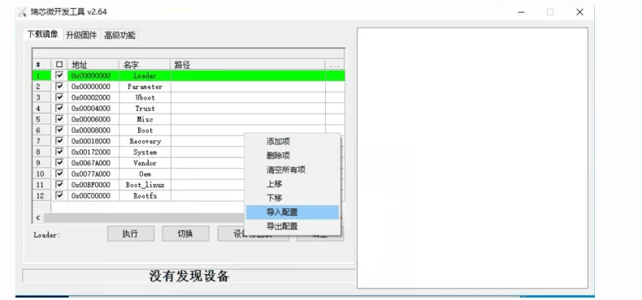

6、长按RK3399Pro TB-96AI开发板上recovery按键（KEY2键）的过程中重启机器，注意要一直长按KEY2键一直持续按，直到系统进入Loader模式，如下所示：

7、如果需要单烧linux系统，请在步骤5导入config_linux 配置。

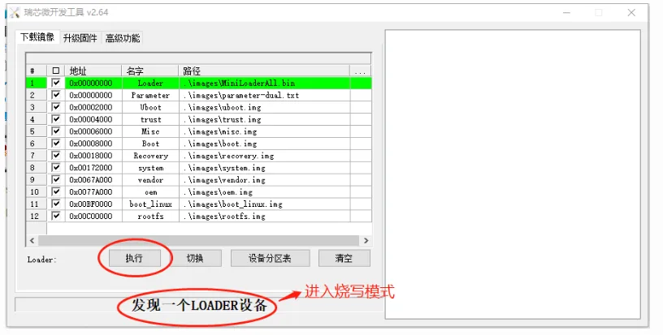

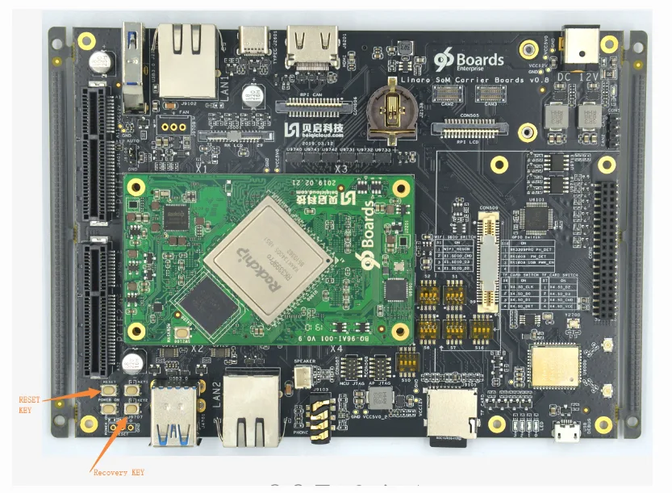

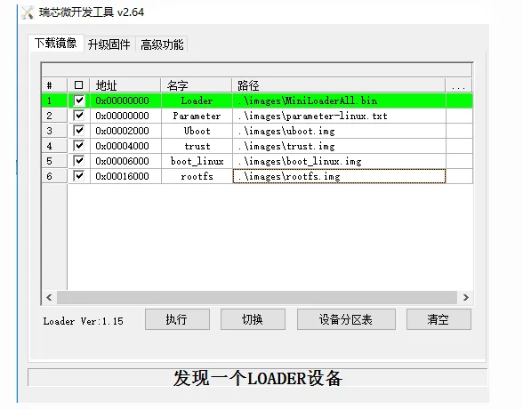

8、如果需要单烧android系统，请在步骤5导入config_android 配置。

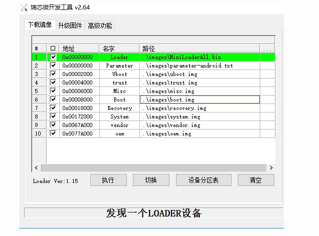

1、Type-C线连接主机端的USB接口和RK3399Pro TB-96AI开发板的Type-C接口。说明：RK3399Pro TB-96AI的Linux系统也可以作为开发主机给其他开发板烧写固件。

2、长按RK3399Pro TB-96AI开发板上recovery按键后重启机器，进入Loader模式。

3、将固件解压到linuxTool-v1.0/images目录下。

4、执行如下命令烧写固件：

1)烧写双系统固件(默认)：

烧写所有固件：

```
sudo python ./flash.py -d all
```

烧写uboot.img和trust.img:

```
sudo python ./flash.py -d uboot
```

烧写system.img:

```
sudo python ./flash.py -d system
```

烧写boot.img和boot_linux.img:

```
sudo python ./flash.py -d boot
```

烧写rootfs.img：

```
sudo python ./flash.py -d rootfs
```

2)烧写linux系统固件(单系统)：

烧写所有固件：

```
sudo python ./flash.py -l all
```

烧写uboot.img和trust.img:

```
sudo python ./flash.py -l uboot
```

烧写boot_linux.img:

```
sudo python ./flash.py -l boot
```

烧写rootfs.img：

```
sudo python ./flash.py -l rootfs
```

3)烧写android系统固件(单系统)：

烧写所有固件：

```
sudo python ./flash.py -a all
```

烧写uboot.img和trust.img:

```
sudo python ./flash.py -a uboot
```

烧写boot.img:

```
sudo python ./flash.py -a boot
```

烧写system.img：

```
sudo python ./flash.py -a system
```

4)查看帮助：

代码

```
sudo python ./flash.py --help
```

### 串口调试

开发板调试口：开发板的Debug口（microUSB口）

波特率(B) :150000数据位(D) :8
停止位(S) :1
奇偶校验(A) :无
流控制(F) :无

## 二、Linux开发

### 内核驱动

#### 内核编译

linux:

```
cd kernel
./make.sh linux 96ai
```

android:

```
cd kernel
./make.sh android 96ai
```

修改内核编译选项：

```
1. make ARCH=arm64 rockchip_linux_defconfig
2. make ARCH=arm64 menuconfig
3. 修改选项...
4. make ARCH=arm64 savedefconfig
5. cp defconfig arch/arm64/configs/rockchip_linux_defconfig
```

#### camera驱动开发

概述

RK3399Pro TB-96AI 开发板分别带有两个MIPI，一个DVP摄像头接口，MIPI支持最高4K拍照，并支持 1080P 30fps以上视频录制。此外，开发板还支持 USB 摄像头。

本文以 OV9750 摄像头为例，讲解在该开发板上的配置过程。

配置原理

由以下电路图可知，两路MIPI摄像头连接的是不同的ISP和I2C通道。

MIPI0：使用ISP0和I2C1，还需配置MIPI_MCLK0、MIPI_PDN、MIPI_RST

MIPI1：使用ISP1和I2C2，还需配置MIPI_MCLK_T2、JMIPI_PDN2、JMIPI_RST2

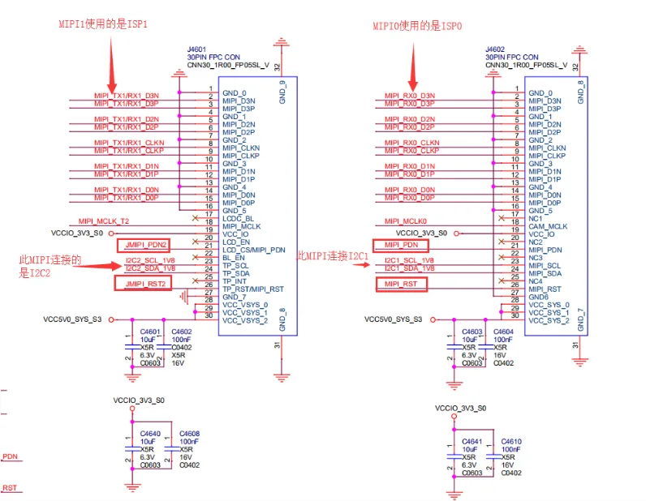

DTS配置  配置isp节点

```
cif_isp0: cif_isp@ff910000 {
            compatible = "rockchip,rk3399-cif-isp";
            rockchip,grf = <&grf>;
            reg = <0x0 0xff910000 0x0 0x4000>, <0x0 0xff968000 0x0 0x8000>;
            reg-names = "register", "dsihost-register";
            clocks =
                <&cru ACLK_ISP0_NOC>, <&cru ACLK_ISP0_WRAPPER>,
                <&cru HCLK_ISP0_NOC>, <&cru HCLK_ISP0_WRAPPER>,
                <&cru SCLK_ISP0>, <&cru SCLK_DPHY_RX0_CFG>,
                <&cru SCLK_CIF_OUT>, <&cru SCLK_CIF_OUT>,
                <&cru SCLK_MIPIDPHY_REF>;
            clock-names =
                "aclk_isp0_noc", "aclk_isp0_wrapper",
                "hclk_isp0_noc", "hclk_isp0_wrapper",
                "clk_isp0", "pclk_dphyrx",
                "clk_cif_out", "clk_cif_pll",
                "pclk_dphy_ref";
            interrupts = <GIC_SPI 43 IRQ_TYPE_LEVEL_HIGH 0>;
            interrupt-names = "cif_isp10_irq";
            power-domains = <&power RK3399_PD_ISP0>;
            rockchip,isp,iommu-enable = <1>;
            iommus = <&isp0_mmu>;
            status = "disabled";
                  };
&isp0 {
   status = "okay";
       };

&isp0_mmu {
    status = "okay";
           };
&cif_isp0 {
 rockchip,camera-modules-attached = <&camera0>;
   status = "okay";
};
```

设置CPU MCLK引脚功能

```
&pinctrl {
/* */
     cam_mclk {
          cam_default_pins: cam-default-pins {
                            rockchip,pins = <2 11 RK_FUNC_3 &pcfg_pull_none>;
                                      };
            };
          };
```

在i2c上配置camera节点，mipi0 camera连接到i2c1上

```
&i2c1 {
         status = "okay";   /* 使能i2c1 */
         /*
         * 一般写成cameraX:camera-module@ID，其中X为序号，ID为camera的7bit I2C地址
                  * camera0表示节点名，绑定isp节点时，将camera0 attach到isp0
                  */
    camera0: camera-module@10 {
       status = "okay";
       compatible = "omnivision,ov9750-v4l2-i2c-subdev";
       reg = <0x10>;             /* 7bit I2C地址 */
       device_type = "v4l2-i2c-subdev";    /* 无需修改 */
       clocks = <&cru SCLK_CIF_OUT>;     /* 无需修改，时钟源选择 */
       clock-names = "clk_cif_out";      /* 无需修改，时钟源名字 */

       pinctrl-names = "default";       /* 无需修改，通过pinctrl配置MCLK引脚 */
       pinctrl-0 = <&cam_default_pins>;      /* 无需修改，与上文的pinctrl定义一致 */

       rockchip,pd-gpio = <&gpio4 RK_PD1 GPIO_ACTIVE_LOW>;  /* PD管脚分配及有效电平 */
       rockchip,rst-gpio = <&gpio4 RK_PD2 GPIO_ACTIVE_LOW>; /* RST管脚分配及有效电平 */

       rockchip,camera-module-mclk-name = "clk_cif_out";   /* 无需修改 */
       rockchip,camera-module-facing = "back";       //前后置配置
       rockchip,camera-module-name = "MDG001";       //Camera 模组名称
       rockchip,camera-module-len-name = "NONE";      //Camera 模组镜头
       rockchip,camera-module-fov-h = "80";         //模组水平可视角度配置
       rockchip,camera-module-fov-v = "65";         //模组垂直可视角度配置
       rockchip,camera-module-orientation = <0>;      //模组角度设置
       rockchip,camera-module-iq-flip = <0>;        //IQ 上下翻转
       rockchip,camera-module-iq-mirror = <0>;       //IQ 左右镜像
       //以上 2 个属性控制摄像头的效果参数镜像配置，一般都是设置成 0，但是发现以下现象：拍摄白墙，图片的上半部偏色与下半部偏色不一致，或者左右半部偏不一致，即可以将这2个属性置成1。
       rockchip,camera-module-flip = <1>;
       rockchip,camera-module-mirror = <1>;
       //以上 2 个属性控制摄像头驱动中的镜像配置，如果图像旋转 180 度，可以将这 2 个属性修改成相反的值即可旋转 180。
       rockchip,camera-module-defrect0 = <1280 960 0 0 1280 960>; //根据摄像头分辨率进行设置

       rockchip,camera-module-flash-support = <0>;        //闪光灯支持
       rockchip,camera-module-mipi-dphy-index = <0>;       //mipi口配置，根据物理连接定义
       as-master = <0>;
  };
};
```

驱动说明  与摄像头相关的代码目录如下：

```
drivers/media/i2c/soc_camera/rockchip
|-- ov9750_v4l2-i2c-subdev.c    // OV9750驱动
|-- ov_camera_module.c       // OV系列公共函数
|-- ov_camera_module.h       //
|-- rk_camera_mclk.c        // RK Camera MCLK时钟信号管理
|-- rk_camera_mclk.h
|-- rk_camera_module.c       // RK 系列公共函数
`-- rk_camera_module_version.h   //模块版本信息
```

### IR驱动开发

概述

红外遥控的发射电路是采用红外发光二极管来发出经过调制的红外光波；红外接收电路由红外接收二极管、 三极管或硅光电池组成，它们将红外发射器发射的红外光转换为相应的电信号，再送后置放大器。鉴于家用电器的品种多样化和用户的使用特点，生产厂家对进行了严格的规范编码，这些编码各不相同，从而形成不同的编码方式，统一称为红外遥控器编码传输协议。到目前为止，红外遥控协议已多达十种， 如： RC5、SIRCS、Sy、RECS80、Denon、NEC、Motorola、Japanese、SAMSWNG 和 Daewoo 等。我国家用电器的红外遥控器的生产厂家，其编码方式多数是按上述的各种协议进行编码的，而用得较多的有 NEC 协议。目前 RK 平台也只支持 NEC 编码的红外协议。

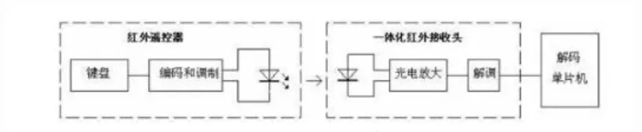

RK 平台上红外实现原理简介

PWM 有三种工作模式， reference mode, one-shot mode 和 continuousmode. 红外遥控器就采用 reference mode，这种模式下 PWM 可以捕获输入高低电平的宽度，并产生中断， CPU接收到中断后去相应的寄存器读取。

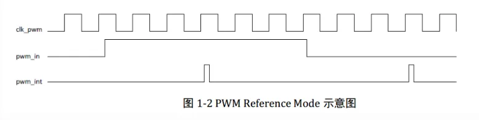

按下遥控的时候，红外接收头会产生一系列的高低电平， PWM 就会产生相应的中断， CPU 读取相应的寄存器就知道这些高低电平的时间，根据协议就可以解码出红外的用户码和键值码出来。 下图是 NEC 红外编码协议的简单示意图，详细的协议附在最后。

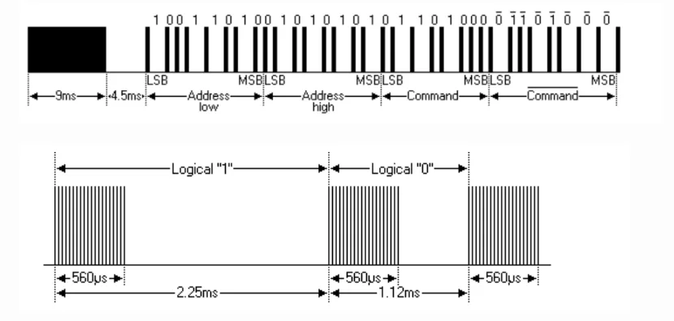

DTS配置

```
&pwm3 {
    status = "okay";
pinctrl-names = "default";//为IR rx模式，不要配置为gpio模式
    interrupts = <GIC_SPI 61 IRQ_TYPE_LEVEL_HIGH 0>;
    compatible = "rockchip,remotectl-pwm";
    remote_pwm_id = <3>;
    handle_cpu_id = <1>;
    ir_key1 {
       rockchip,usercode = <0x4040>;
       rockchip,key_table =
           <0xf2  KEY_REPLY>,
           <0xba  KEY_BACK>,
           <0xf4  KEY_UP>,
           <0xf1  KEY_DOWN>,
           <0xef  KEY_LEFT>,
           <0xee  KEY_RIGHT>,
           <0xbd  KEY_HOME>,
           <0xea  KEY_VOLUMEUP>,
           <0xe3  KEY_VOLUMEDOWN>,
           <0xe2  KEY_SEARCH>,
           <0xb2  KEY_POWER>,
           <0xbc  KEY_MUTE>,
           <0xec  KEY_MENU>,
           <0xbf  0x190>,
           <0xe0  0x191>,
           <0xe1  0x192>,
           <0xe9  183>,
           <0xe6  248>,
           <0xe8  185>,
           <0xe7  186>,
           <0xf0  388>,
           <0xbe  0x175>;
    };
    ir_key2 {
       rockchip,usercode = <0xff00>;
       rockchip,key_table =
           <0xf9  KEY_HOME>,
           <0xbf  KEY_BACK>,
           <0xfb  KEY_MENU>,
           <0xaa  KEY_REPLY>,
           <0xb9  KEY_UP>,
           <0xe9  KEY_DOWN>,
           <0xb8  KEY_LEFT>,
           <0xea  KEY_RIGHT>,
           <0xeb  KEY_VOLUMEDOWN>,
           <0xef  KEY_VOLUMEUP>,
           <0xf7  KEY_MUTE>,
           <0xe7  KEY_POWER>,
           <0xfc  KEY_POWER>,
           <0xa9  KEY_VOLUMEDOWN>,
           <0xa8  KEY_VOLUMEDOWN>,
           <0xe0  KEY_VOLUMEDOWN>,
           <0xa5  KEY_VOLUMEDOWN>,
           <0xab  183>,
           <0xb7  388>,
           <0xe8  388>,
           <0xf8  184>,
           <0xaf  185>,
           <0xed  KEY_VOLUMEDOWN>,
           <0xee  186>,
           <0xb3  KEY_VOLUMEDOWN>,
           <0xf1  KEY_VOLUMEDOWN>,
           <0xf2  KEY_VOLUMEDOWN>,
           <0xf3  KEY_SEARCH>,
           <0xb4  KEY_VOLUMEDOWN>,
           <0xbe  KEY_SEARCH>;
    };
    ir_key3 {
       rockchip,usercode = <0x1dcc>;
       rockchip,key_table =
           <0xee  KEY_REPLY>,
           <0xf0  KEY_BACK>,
           <0xf8  KEY_UP>,
           <0xbb  KEY_DOWN>,
           <0xef  KEY_LEFT>,
           <0xed  KEY_RIGHT>,
           <0xfc  KEY_HOME>,
           <0xf1  KEY_VOLUMEUP>,
           <0xfd  KEY_VOLUMEDOWN>,
           <0xb7  KEY_SEARCH>,
           <0xff  KEY_POWER>,
           <0xf3  KEY_MUTE>,
           <0xbf  KEY_MENU>,
           <0xf9  0x191>,
           <0xf5  0x192>,
           <0xb3  388>,
           <0xbe  KEY_1>,
           <0xba  KEY_2>,
           <0xb2  KEY_3>,
           <0xbd  KEY_4>,
           <0xf9  KEY_5>,
           <0xb1  KEY_6>,
           <0xfc  KEY_7>,
           <0xf8  KEY_8>,
           <0xb0  KEY_9>,
           <0xb6  KEY_0>,
           <0xb5  KEY_BACKSPACE>;
    };
};
```

字母和符号键都是 linux 的标准键值，在可以在 include/dt-bindings/input/input.h 中查找。

驱动位置

```
/kernel/drivers/input/remotectl/rockchip_pwm_remotectl.c
```

1、打开打印键值的调试开关 echo 1 &gt; sys/module/rockchip_pwm_remotectl/parameters/code_print

按遥控器的按键，记录下对应的键值 例如按向下键，有如下打印 [19634.735833] GET USERCODE=0x4040 [19634.762463] RMC_GETDATA=e9 则，该遥控器的 usercode 是 0x4040，向下键的键值就是 0xe9，如此反复，直到打印完遥控器上的所有键值。

2、有时候需要配合 echo 1 &gt; /sys/module/rockchip_pwm_remotectl/parameters/code_print 一起打印，然后看出错的时候，是哪一个或者几个 bit 引起的，有时候放宽一点判断的条件即可，一般是通过修改上下限来达到，具体可以参考代码里面 bit 值的判断地方。

3、getevent 有时候无法确定是内核按键判断出错，可以在串口下输入getevent 调试命令，该命令会打出驱动上报的所有 input 事件，如果按遥控器有打印，并且键值正确，那说明是响应的问题。

在调试平台输入 getevent 的效果，最前面会列出所有的 input 设备，按的时候会上报事件，其中 0x6c 是上报的 linux 键值，后面的 1 代表按下，如果是 0 则代表弹起。

```
shell@rk3399:/ # getevent
 add device 1: /dev/input/event0
 name: "ff680000.pwm"
 /dev/input/event0: 0001 006c 00000001
 /dev/input/event0: 0000 0000 00000000
 /dev/input/event0: 0001 006c 00000000
 /dev/input/event0: 0000 0000 00000000
```

### 显示驱动

#### eDP显示驱动

配置文件: “arch/arm64/boot/dts/rockchip/lcd-edp-for-toybrick.dtsi”

如果需要去掉eDP屏，需要在arch/arm64/boot/dts/rockchip/rk3399pro-toybrick.dtsi中删除include “lcd-edp-for-toybrick.dtsi”

电源控制：enable-gpios = &lt;&gpio4 rk_pd6=”” gpio_active_high=””&gt;;

timing时序

```
timing0: timing0 {
         clock-frequency = <200000000>;
         hactive = <1536>;
         vactive = <2048>;
         hfront-porch = <12>;
         hsync-len = <16>;
         hback-porch = <48>;
         vfront-porch = <8>;
         vsync-len = <4>;
         vback-porch = <8>;
         hsync-active = <0>;
         vsync-active = <0>;
         de-active = <0>;
         pixelclk-active = <0>;
          };
```

eDP信号从vopb输出

```
&edp_in_vopl {
        status = "disabled";
       };

&edp_in_vopb {
        status = "okay";
       };
```

触摸

```
&i2c4 {
    status = "okay";
    i2c-scl-rising-time-ns = <345>;
    i2c-scl-falling-time-ns = <11>;

    gsl3673: gsl3673@40 {
                compatible = "GSL,GSL3673";
                reg = <0x40>;
                screen_max_x = <1536>;
                screen_max_y = <2048>;
                irq_gpio_number = <&gpio4 RK_PC5 IRQ_TYPE_LEVEL_LOW>;
                rst_gpio_number = <&gpio4 RK_PC6 GPIO_ACTIVE_HIGH>;
                };
    };
```

配置文件：”arch/arm64/boot/dts/rockchip/lcd-mipi-for-toybrick.dtsi”

电源控制：enable-gpios = &lt;&gpio4 30=”” gpio_active_high=””&gt;;

#### MIPI显示驱动

MIPI屏初始化：

```
panel-init-sequence = [
      05 fa 01 11
      39 00 04 b9 f1 12 83
      39 00 1c ba 33 81 05 f9 0e 0e 00 00 00
            00 00 00 00 00 44 25 00 91 0a
            00 00 02 4f 01 00 00 37
      15 00 02 b8 25
      39 00 04 bf 02 11 00
      39 00 0b b3 0c 10 0a 50 03 ff 00 00 00
            00
      39 00 0a c0 73 73 50 50 00 00 08 70 00
      15 00 02 bc 46
      15 00 02 cc 0b
      15 00 02 b4 80
      39 00 04 b2 c8 12 30
      39 00 0f e3 07 07 0b 0b 03 0b 00 00 00
            00 ff 00 c0 10
      39 00 0d c1 53 00 1e 1e 77 e1 cc dd 67
            77 33 33
      39 00 07 c6 00 00 ff ff 01 ff
      39 00 03 b5 09 09
      39 00 03 b6 87 95
      39 00 40 e9 c2 10 05 05 10 05 a0 12 31
            23 3f 81 0a a0 37 18 00 80 01
            00 00 00 00 80 01 00 00 00 48
            f8 86 42 08 88 88 80 88 88 88
            58 f8 87 53 18 88 88 81 88 88
            88 00 00 00 01 00 00 00 00 00
            00 00 00 00
      39 00 3e ea 00 1a 00 00 00 00 02 00 00
            00 00 00 1f 88 81 35 78 88 88
            85 88 88 88 0f 88 80 24 68 88
            88 84 88 88 88 23 10 00 00 1c
            00 00 00 00 00 00 00 00 00 00
            00 00 00 00 00 30 05 a0 00 00
            00 00
      39 00 23 e0 00 06 08 2a 31 3f 38 36 07
            0c 0d 11 13 12 13 11 18 00 06
            08 2a 31 3f 38 36 07 0c 0d 11
            13 12 13 11 18
      05 32 01 29
            ];

panel-exit-sequence = [
      05 00 01 28
      05 00 01 10
            ];
```

MIPI初始化命令：一行是一条命令(tab为接上行)；

命令格式：type+命令(没有则为00)+参数数量+参数

timing时序：

```
display-timings {
         native-mode = <&timing1>;

         iming1: timing1 {
                   clock-frequency = <64000000>;
                   hactive = <720>;
                   vactive = <1280>;
                   hfront-porch = <40>;
                   hsync-len = <10>;
                   hback-porch = <40>;
                   vfront-porch = <22>;
                   vsync-len = <4>;
                   vback-porch = <11>;
                   hsync-active = <0>;
                   vsync-active = <0>;
                   de-active = <0>;
                   pixelclk-active = <0>;
                   };
          };
```

MIPI信号从vopl输出：

```
&dsi_in_vopl {
      status = "okay";
         };
&dsi_in_vopb {
       status = "disabled";
         };
```

触摸

```
&i2c4 {
     status = "okay";
     gt1x: gt1x@14 {
              status = "okay";
              compatible = "goodix,gt1x";
              reg = <0x14>;
              goodix,rst-gpio = <&gpio4 RK_PC6 GPIO_ACTIVE_LOW>;
              goodix,irq-gpio = <&gpio4 RK_PC5 IRQ_TYPE_LEVEL_LOW>;
              goodix,enable-gpio = <&gpio4 RK_PD5 GPIO_ACTIVE_HIGH>;
              };
    };
```

注意：因为HDMI，DP和eDP都是从vopb输出，所以这三个设备不能同时接入。

### I2C驱动开发

以添加设备(gsl3673为例)：

设备树

```
&i2c6 {
    status = "okay";
    gsl3673: gsl3673@40 {
                compatible = "GSL,GSL3673";
                reg = <0x40>;
                screen_max_x = <1536>;
                screen_max_y = <2048>;
                irq_gpio_number = <&gpio4 RK_PC5 IRQ_TYPE_LEVEL_LOW>;
                rst_gpio_number = <&gpio4 RK_PC6 GPIO_ACTIVE_HIGH>;
                };
    };
```

status：使能I2C6；

gsl3673: gsl3673@40：I2C6挂载的设备gsl3673，@40保持和reg一致；

compatible：用于和of_device_id匹配；

reg：I2C Slave地址；

gpio：设备的中断，IO控制；

驱动程序

路径”drivers/input/touchscreen/gsl3673.c”；

定义of_device_id：

```
static const struct of_device_id gsl_ts_ids[] = {
                   {.compatible = "GSL,GSL3673"},
                   { }
                            };
```

定义i2c_device_id：

```
static const struct i2c_device_id gsl_ts_id[] = {
                   {GSL3673_I2C_NAME, 0},
                   {}
                            };
```

定义i2c_driver：

```
static struct i2c_driver gsl_ts_driver = {
                .driver = {
                .name = GSL3673_I2C_NAME,
                .owner = THIS_MODULE,
                .of_match_table = of_match_ptr(gsl_ts_ids),
                      },
                .probe = gsl_ts_probe,
                .remove = gsl_ts_remove,
                .id_table = gsl_ts_id,
                     };
```

在系统启动时，I2C总线会在dts设备树种寻找和of_match_table匹配的设备，如果匹配成功，gsl_ts_driver的probe(gsl_ts_probe)就会被调用，做设备的初始化工作。

注：变量id_table指示该驱动所支持的设备。

### SPI驱动开发

添加设备

```
&spi5 {
    status = "okay";
    max-freq = <48000000>;   //spi internal clk, don't modify
    spi_test@00 {
           compatible = "rockchip,spi_test_bus0_cs0";
           reg = <0>;   //chip select  0:cs0  1:cs1
           id = <0>;
           spi-max-frequency = <24000000>;   //spi output clock
             };

    spi_test@01 {
           compatible = "rockchip,spi_test_bus0_cs1";
           reg = <1>;
           id = <1>;
           spi-max-frequency = <24000000>;
            };
       };
```

tatus:如果要启用SPI，则设为okay，如不启用，设为disable;

max-freq：rk3399pro SPI最大支持的速率为48000000，不要修改；

spi_test@00：如果使用CS0，设为00，如果使用CS1，则设为01，并且呀和reg字段一样；

compatible：用于和of_device_id匹配；

id：如果一个SPI驱动操作多个设备时，用于区分；

spi-max-frequency：SPI和当前设备通信速率；

驱动文件

“drivers/spi/spi-rockchip-test.c”

### GPIO驱动开发

概述

TB-96AI 开发板扩展接口里的所有的IO都可以作为GPIO使用，但是需要配置iomux。不需要配置iomux，可以直接使用的GPIO是GPIO2_D3、GPIO2_B1、GPIO2_B2。这3个GPIO默认输出的电平是1.8V，通过电平转换芯片，转成3.3V。

添加设备

1、作为普通GPIO使用（reset usb hub）

```
usbhub_reset: usbhub-reset {
         compatible = "usbhub-reset";
         uhrst-gpio = <&gpio0 6 GPIO_ACTIVE_HIGH>;
                            };
```

uhrst-gpio：驱动中通过of_get_named_gpio_flags获取GPIO号；

“6”：表示这个GPIO属于哪个bank的哪个IO；（说明：bank=6/8+A；IO=6%8；例如这里的6表示A6；如果是12表示B4；）

GPIO_ACTIVE_HIGH：高有效；

驱动文件

"drivers/usb/misc/usbhub_reset.c"
of_device_id：用于匹配dts中的设备；

platform_driver：平台驱动，并且通过platform_driver_register注册；

这个驱动很简单，就是在系统reboot时，拉低这个GPIO，通过register_reboot_notifier这个函数注册进reboot的流程中。

2、通过pinctrl使用

```
&dsi {
    reset-gpios = <&gpio4 RK_PD5 GPIO_ACTIVE_LOW>;  /* TC358775_RST */
    enable-gpios = <&gpio1 RK_PA7 GPIO_ACTIVE_HIGH>; /* STBY */
    status = "okay";
    pinctrl-names = "default";
    pinctrl-0 = <&lcd_bl_en_h>;
                   ......
};
&pinctrl {
    tc3587 {
         lcd_bl_en_h: lcd-bl-en-h {
                        rockchip,pins =
                                <1 13 RK_FUNC_GPIO &pcfg_output_high>;
                              };
        };
           };
```

pinctrl-names：这个pin state名字列表，第一个state名字对应pinctrl-0，第二个state名字对应pinctrl-1，以此类推；

pinctrl-0：List of phandles，名字自定义；

&pinctrl：详细定义pin的配置；

tc3587：自定义；

lcd_bl_en_h：之前pinctrl-0定义的名字；

rockchip,pins：pin的配置，这里表示gpio1_b5，作为GPIO功能，默认输出高电平；

对于pinctrl-names有多个state名字，需要通过pinctrl函数获取，例如：

```
pinctrl-names = "default", "pmic-sleep",
                "pmic-power-off", "pmic-reset";
                pinctrl-0 = <&pmic_int_l>;
                pinctrl-1 = <&soc_slppin_slp>, <&rk809_slppin_slp>;
                pinctrl-2 = <&soc_slppin_gpio>, <&rk809_slppin_pwrdn>;
                pinctrl-3 = <&soc_slppin_rst>, <&rk809_slppin_rst>;
```

① 获取一个pinctrl句柄：

rk808-&gt;pins-&gt;p = devm_pinctrl_get(dev);

② 获取这个pin对应pin_state

default_st = pinctrl_lookup_state(rk808-&gt;pins-&gt;p, PINCTRL_STATE_DEFAULT);

③ 设置引脚为为某个stata

pinctrl_select_state(rk808-&gt;pins-&gt;p, default_st);

3、作为中断使用

```
gpio {
    compatible = "irq-test-gpio";
    irq-gpio = <&gpio4 29 IRQ_TYPE_EDGE_RISING>;  /* GPIO4_D5 */
};
```

IRQ_TYPE_EDGE_RISING表示中断由上升沿触发，当该引脚接收到上升沿信号时可以触发中断函数。

这里还可以配置成如下：

IRQ_TYPE_NONE //默认值，无定义中断触发类型

IRQ_TYPE_EDGE_RISING //上升沿触发

IRQ_TYPE_EDGE_FALLING //下降沿触发

IRQ_TYPE_EDGE_BOTH //上升沿和下降沿都触发

IRQ_TYPE_LEVEL_HIGH //高电平触发

IRQ_TYPE_LEVEL_LOW //低电平触发

probe函数中对DTS所添加的资源进行解析，再做中断的注册申请，代码如下：

```
static int test_gpio_probe(struct platform_device *pdev)
{
    int ret;
    int gpio;
    enum of_gpio_flags flag;
    struct test_gpio_info *gpio_info;
    struct device_node * test_gpio_node = pdev->dev.of_node;
    ......

    gpio_info-> test_irq_gpio = gpio;
    gpio_info-> test_irq_mode = flag;
    gpio_info-> test_irq = gpio_to_irq(gpio_info-> test_irq_gpio);
    if (gpio_info-> test_irq) {
       if (gpio_request(gpio, "irq-test-gpio")) {
          printk("gpio %d request failed!\n", gpio); gpio_free(gpio); return IRQ_NONE;
        }
        ret = request_irq(gpio_info-> test_irq, test_gpio_irq, flag, "irq-test-gpio", gpio_info);
        if (ret != 0) free_irq(gpio_info-> test_irq, gpio_info);
           dev_err(&pdev->dev, "Failed to request IRQ: %d\n", ret);
     }
     return 0;
}
static irqreturn_t test_gpio_irq(int irq, void *dev_id) //中断函数
{
    printk("Enter irq test gpio irq test program!\n");
    return IRQ_HANDLED;
}
```

调用gpio_to_irq把GPIO的PIN值转换为相应的IRQ值，调用gpio_request申请占用该IO口，调用request_irq申请中断，如果失败要调用free_irq释放，该函数中gpio_info-&gt; test_irq是要申请的硬件中断号，test_gpio_irq是中断函数，gpio_info-&gt; test_irq_mode是中断处理的属性，”irq-test-gpio”是设备驱动程序名称，gpio_info是该设备的device结构，在注册共享中断时会用到。

### Mini PCI-E驱动开发

目前以Quectel EC20 4G模组为例。

驱动支持

首先需要对Linux内核驱动进行修改来支持EC20。

```
drivers/usb/serial/option.c

/* Quectel products using Quectel vendor ID */
{ USB_DEVICE(QUECTEL_VENDOR_ID, QUECTEL_PRODUCT_EC21),
  .driver_info = RSVD(4) },
{ USB_DEVICE(QUECTEL_VENDOR_ID, QUECTEL_PRODUCT_EC25),
  .driver_info = RSVD(4) },
{ USB_DEVICE(QUECTEL_VENDOR_ID, QUECTEL_PRODUCT_BG96),
  .driver_info = RSVD(4) },
{ USB_DEVICE(QUECTEL_VENDOR_ID, QUECTEL_PRODUCT_EP06),
  .driver_info = RSVD(4) | RSVD(5) },
```

模块测试

将重新编译好的内核下载到开发板之后，重新启动，在/dev/目录下会出现如下设备节点：

```
/dev/ttyUSB0
/dev/ttyUSB1
/dev/ttyUSB2
/dev/ttyUSB3
```

EC20的AT端口是/dev/ttyUSB2，使用AT测试，结果如下：

```
#cat /dev/ttyUSB2 &
#echo -e “AT\r\n” > /dev/ttyUSB2
#AT
```

拨号通过几个不同的配置文件，在拨号的时候选择相应的配置文件，现将配置文件列举如下： 编辑好这几个文件之后，便可以通过pppd进行拨号：

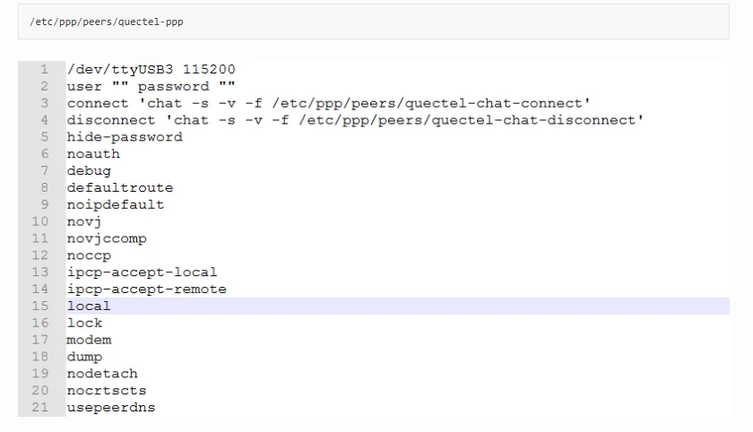

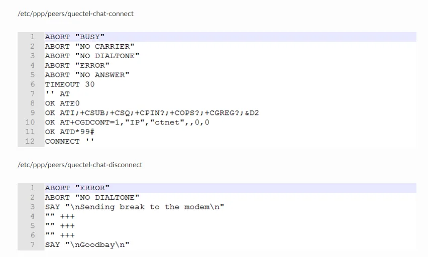

通过pppd进行拨号：

```
# pppd call quectel-ppp &
```

如果拨号成功会出现以下打印：

```
pppd options in effect:
debug           # (from /etc/ppp/peers/quectel-ppp)
nodetach                # (from /etc/ppp/peers/quectel-ppp)
dump            # (from /etc/ppp/peers/quectel-ppp)
noauth          # (from /etc/ppp/peers/quectel-ppp)
user test               # (from /etc/ppp/peers/quectel-ppp)
password ??????         # (from /etc/ppp/peers/quectel-ppp)
remotename 3gppp                # (from /etc/ppp/peers/quectel-ppp)
/dev/ttyUSB3            # (from /etc/ppp/peers/quectel-ppp)
115200          # (from /etc/ppp/peers/quectel-ppp)
lock            # (from /etc/ppp/peers/quectel-ppp)
connect chat -s -v -f /etc/ppp/peers/quectel-chat-connect               # (from /etc/ppp/peers/quectel-ppp)
disconnect chat -s -v -f /etc/ppp/peers/quectel-chat-disconnect         # (from /etc/ppp/peers/quectel-ppp)
nocrtscts               # (from /etc/ppp/peers/quectel-ppp)
modem           # (from /etc/ppp/peers/quectel-ppp)
hide-password           # (from /etc/ppp/peers/quectel-ppp)
novj            # (from /etc/ppp/peers/quectel-ppp)
novjccomp               # (from /etc/ppp/peers/quectel-ppp)
ipcp-accept-local               # (from /etc/ppp/peers/quectel-ppp)
ipcp-accept-remote              # (from /etc/ppp/peers/quectel-ppp)
ipparam 3gppp           # (from /etc/ppp/peers/quectel-ppp)
noipdefault             # (from /etc/ppp/peers/quectel-ppp)
ipcp-max-failure 30             # (from /etc/ppp/peers/quectel-ppp)
defaultroute            # (from /etc/ppp/peers/quectel-ppp)
usepeerdns              # (from /etc/ppp/peers/quectel-ppp)
noccp           # (from /etc/ppp/peers/quectel-ppp)
abort on (BUSY)
abort on (NO CARRIER)
abort on (NO DIALTONE)
abort on (ERROR)
abort on (NO ANSWER)
timeout set to 30 seconds
send (AT^M)
expect (OK)
AT^M^M
OK
 -- got it

send (ATE0^M)
expect (OK)
^M
ATE0^M^M
OK
 -- got it

send (ATI;+CSUB;+CSQ;+CPIN?;+COPS?;+CGREG?;&D2^M)
expect (OK)
^M
^M
Quectel^M
EC20F^M
Revision: EC20CEFDR02A09M4G^M
^M
SubEdition: V04^M
^M
+CSQ: 14,99^M
^M
+CPIN: READY^M
^M
+COPS: 0^M
^M
+CGREG: 0,0^M
^M
OK
 -- got it

send (AT+CGDCONT=1,"IP","3gnet",,0,0^M)
expect (OK)
^M
^M
OK
 -- got it

send (ATD*99#^M)
expect (CONNECT)
^M
^M
CONNECT
 -- got it

Script chat -s -v -f /etc/ppp/peers/quectel-chat-connect finished (pid 785), status = 0x0
Serial connection established.
using channel 1
Using interface ppp0
Connect: ppp0 <--> /dev/ttyUSB3
sent [LCP ConfReq id=0x1 <asyncmap 0x0> <magic 0x1f2b413> <pcomp> <accomp>]
rcvd [LCP ConfReq id=0x0 <asyncmap 0x0> <auth chap MD5> <magic 0xd11eadc2> <pcomp> <accomp>]
sent [LCP ConfAck id=0x0 <asyncmap 0x0> <auth chap MD5> <magic 0xd11eadc2> <pcomp> <accomp>]
rcvd [LCP ConfAck id=0x1 <asyncmap 0x0> <magic 0x1f2b413> <pcomp> <accomp>]
rcvd [LCP DiscReq id=0x1 magic=0xd11eadc2]
rcvd [CHAP Challenge id=0x1 <40aedf97298706e7675d614c0cea9175>, name = "UMTS_CHAP_SRVR"]
sent [CHAP Response id=0x1 <1bf312e7aa43615e474c49c28fbbaca5>, name = "test"]
rcvd [CHAP Success id=0x1 ""]
CHAP authentication succeeded
CHAP authentication succeeded
sent [IPCP ConfReq id=0x1 <addr 0.0.0.0> <ms-dns1 0.0.0.0> <ms-dns2 0.0.0.0>]
rcvd [IPCP ConfReq id=0x0]
sent [IPCP ConfNak id=0x0 <addr 0.0.0.0>]
rcvd [IPCP ConfNak id=0x1 <addr 10.35.149.45> <ms-dns1 218.4.4.4> <ms-dns2 218.2.2.2>]
sent [IPCP ConfReq id=0x2 <addr 10.35.149.45> <ms-dns1 218.4.4.4> <ms-dns2 218.2.2.2>]
rcvd [IPCP ConfReq id=0x1]
sent [IPCP ConfAck id=0x1]
rcvd [IPCP ConfAck id=0x2 <addr 10.35.149.45> <ms-dns1 218.4.4.4> <ms-dns2 218.2.2.2>]
Could not determine remote IP address: defaulting to 10.64.64.64
local  IP address 10.35.149.45
remote IP address 10.64.64.64
primary   DNS address 218.4.4.4
secondary DNS address 218.2.2.2
```

### ADC驱动开发

概述

TB-96AI开发板上的 AD 接口有两种，分别为：温度传感器 (Temperature Sensor)、逐次逼近ADC (Successive Approximation Register)。

其中：

TS-ADC(Temperature Sensor)：支持两通道，时钟频率必须低于800KHZ

SAR-ADC(Successive Approximation Register)：支持六通道单端10位的SAR-ADC，时钟频率必须小于13MHZ。

下面以SAR-ADC为例子，介绍 ADC 的基本配置方法。

设备树

```
rk_headset: rk-headset {
         compatible = "rockchip_headset";
         headset_gpio = <&gpio4 28 GPIO_ACTIVE_HIGH>;
         spk_con_gpio = <&gpio0 11 GPIO_ACTIVE_HIGH>;
         pinctrl-names = "default";
         pinctrl-0 = <&hp_det>;
         io-channels = <&saradc 2>;
};
```

compatible：用于匹配驱动的of_device_id；

io-channels：使用的adc通道；驱动：

驱动文件：”drivers/headset_observe/rockchip_headset_core.c”

定义of_device_id结构体数组：

```
static const struct of_device_id rockchip_headset_of_match[] = {
        { .compatible = "rockchip_headset", },
        {},
};
```

定义platform_driver结构体：

```
static struct platform_driver rockchip_headset_driver = {
        .probe  = rockchip_headset_probe,
        .remove = rockchip_headset_remove,
        .resume = rockchip_headset_resume,
        .suspend = rockchip_headset_suspend,
        .driver = {
                .name   = "rockchip_headset",
                .owner  = THIS_MODULE,
                .of_match_table = of_match_ptr(rockchip_headset_of_match),
        },
};
```

定义probe函数：

主要是获取硬件资源，注册设备，初始化设备，这里最重要的是获取ADC设备，

pdata-&gt;chan = iio_channel_get(&pdev-&gt;dev, NULL)；

获取数据：

通过iio_read_channel_raw接口获取数据，使用标准电压将 AD 转换的值转换为用户所需要的电压值。

其计算公式如下：

Vref / (2^n-1) = Vresult / raw

注：

Vref ：标准电压

n ： AD 转换的位数

Vresult ：用户所需要的采集电压

raw ：AD 采集的原始数据

例如，标准电压为 1.8V，AD 采集位数为 10 位，AD 采集到的原始数据为 568，则：Vresult = (1800mv * 568) / 1023;

### PCI-E驱动开发

概述

TB-96AI开发板上支持GEN2，4lane的标准PCIE接口。

设备树

```
&pcie0 {
        ep-gpios = <&gpio0 12 GPIO_ACTIVE_HIGH>;
        num-lines = <4>;
        max-link-speed = <2>;
        pinctrl-names = "default";
        pinctrl-0 = <&pcie_clkreqn_cpm &pcie_ep>;
        status = "okay";
};
```

ep-gpios：PERST；

num-lines：支持的lane数量，最大支持4lanes；

max-link-speed：支持的速率，1：GEN1，2：GEN2

配置驱动（以rtl8169为例）：

在menuconfig选择插入PCIE的设备驱动：

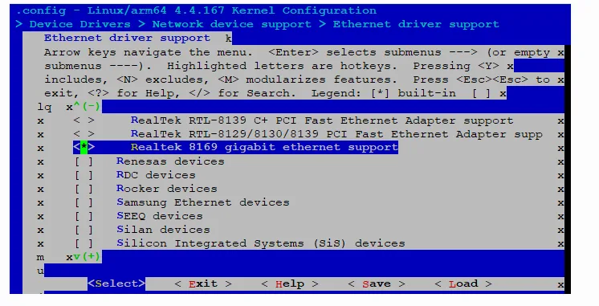

lspci可以看到系统检测到的pcie设备：

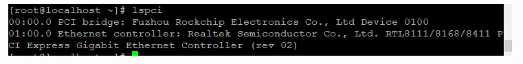

查看网口设备:

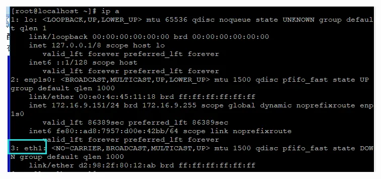

### Fedora

#### RPM包安装升级

1. 添加Rockhip官方源

```
sudo dnf localinstall --nogpgcheck http://repo.rock-chips.com/fedora/rockchip-repo-1.0-3.fc28.aarch64.rpm
```

2. 安装软件包：

```
example-devel-1.0.1-2.fc28.aarch64.rpm
sudo dnf install example-devel
```

3. 卸载软件包：

```
example-devel-1.0.1-2.fc28.aarch64.rpm
sudo dnf remove example-devel
```

4. 升级软件包：

```
sudo dnf clean all
sudo dnf update
```

### 系统软件包

#### ISP系统库

##### ISP安装编译

1、安装ISP库：

```
sudo dnf install librockchip_isp
```

2、编译链接：

```
LDDFLAGS: = -lcam_engine_cifisp -lcam_ia
```

3、包含头文件：

```
#include <rockchip/rockchip_isp.h>
```

##### ISP接口说明

（1）rkisp_start: 创建ISP引擎实例

```
int rkisp_start(void* &engine, int vidFd, const char* ispNode, const char* tuningFile);

    参数说明：

    1)Engine：ISP引擎实例地址，rkisp_start创建引擎实例后，由该参数返回实例地址。

    2)vidFd：Video stream fd，用户捕获图像时，使用的video节点句柄。

    3)ispNode：ISP节点名，例如”/dev/video1”，该节点与用户捕获图像的节点不同。

    4)tuningFile：IQ xml 文件。例如”/etc/cam_iq_ov9750.xml”，里面记录了摄像头3A（自动白平衡，自动曝光，自动对焦）操作所需的参数。

    返回值：成功返回0且engine不为NULL。

    注意：

    1、对于内置摄像头而言，n个摄像头会枚举出4个video节点。

    video(4*(n-1)+2)节点为用户捕获图像操作的video节点，如video2，video6。

    video(4*(n-1)+1)节点为ISP库进行3A操作的video节点，如video1，video5。

    2、 使用结束后必须使用rkisp_stop停止ISP引擎，释放占用的资源。

    3、必须选择与摄像头相互匹配的tuningFile，否则ISP引擎无法工作。

    4、目前ISP摄像头获取的图像格式V4L2_PIX_FMT_NV12
```

（2）rkisp_stop：停止并销毁ISP引擎实例，释放占用的资源

```
int rkisp_stop(void* &engine)

    参数说明：

    engine: ISP引擎实例地址，由rkisp_start创建

    返回值：成功返回0。
```

（3）rkisp_setFocusMode：设置对焦模式

```
int rkisp_setFocusMode(void* &engine, enum HAL_AF_MODE fcMode);

    参数说明：

     1)engine: ISP引擎实例地址，由rkisp_start创建

     2)fcMode：对焦模式设置

     HAL_AF_MODE_NOT_SET：关闭对焦功能

     HAL_AF_MODE_CONTINUOUS_VIDE：设置持续对焦

    返回值：成功返回0。

    注意：OV9750不支持自动对焦，不允许设置对焦模式（默认关闭即可），否则会出错。
```

### MPP系统库

#### MPP安装编译

1、安装MPP库：

```
sudo dnf install librockchip_mpp-devel
```

2、编译链接：

```
LDDFLAGS: = -lrockchip_mpp
```

3、包含头文件：

```
#include <rockchip/rockchip_mpp.h>
```

#### MPP接口说明

1、创建MPP解码器实例：MppDecoderCreate, 成功返回MPP结构指针

```
MppDecoder *dec = MppDecoderCreate();
```

2、销毁MPP实例：MppDecoderDestroy

```
MppDecoderDestroy(dec);
```

3、解码图像入队操作：enqueue

```
dec->ops->enqueue(dec, data, size)

    参数说明：

     1)data：存放H264图像数据

     2)size：图像大小
```

4、解码图像出队操作：dequeue；阻塞直到mpp成功解码后，次函数返回。

```
DecFrame *frame = dec->ops->dequeue(dec);

    DecFrame结构成员说明：

    1)v4l2Format：解码出来的图像格式，目前只支持V4L2_FIX_FMT_NV12

    2)width：图像的宽度

    3)height：图像的高度
```

5、释放DecFrame指针：freeFrame；成功解码并处理图像后，必须调用此函数释放内存。

```
dec->ops->freeFrame(dec, frame);
```

### RGA系统库

#### RGA安装编译

1、安装RGA库：

```
sudo dnf install librockchip_rga-devel
```

2、编译链接：

```
LDDFLAGS: = -lrockchip_rga -ldrm
```

3、包含头文件：

```
extern “c” {
#include <rockchip/rockchip_rga.h>
}
```

#### RGA接口说明

1、RgaCreate：创建RGA实例，返回RGA结构指针

```
RockchipRga *rga = rgaCreate();
```

2、RgaDestory：销毁RGA实例

```
RgaDestory(rga);
```

3、initCtx：清空RGA上下文

```
rga->ops->initCtx(rga);
```

注意：如果不清空上下文，下次执行RGA操作时会沿用之前设置图像参数。

4、setRotate设置选择旋转角度

```
rga->ops->setRotate(rga, rotate);

    参数说明：

    1)rotate: 旋转角度

    RGA_ROTATE_NONE：不旋转

    RGA_ROTATE_90：逆时针旋转90度

    RGA_ROTATE_180：逆时针旋转180度

    RGA_ROTATE_270：逆时针旋转270度

    RGA_ROTATE_VFLIP：垂直镜像

    RGA_ROTATE_HFLIP：水平镜像
```

5、setFillColor：设置色彩填充

```
rga->ops->setFillColor(rga, color);

    参数说明：

    Color：颜色值

    蓝色：0xffff0000

    绿色：0xff00ff00

    红色：0xff0000ff
```

6、setCrops：设置剪切窗口

```
#设置源图像剪切窗口：
rga->ops->setSrcCrop(rga, cropX, cropY, cropW, cropH);
#设置目标图像剪切窗口：
rga->ops->setSrcCrop(rga, cropX, cropY, cropW, cropH);

    参数说明：

     1)、cropX：原点横坐标

     2)、cropY：原点纵坐标

     3)、cropW：窗口宽度

     4)、cropH：窗口高度
```

7、 setFormat：设置图像格式

```
#设置源图像格式：
rga->ops->setSrcFormat(rga, v4l2Format, width, height);
#设置目标图像格式：
rga->ops->setDstFormat(rga, v4l2Format, width, height);

    参数说明：

     1)、V4l2Format：v4l2图像格式，支持的格式见/usr/include/rockchip/rockchip_rga.h

     2)、Width：图像宽度

     3)、Height：图像高度
```

8、setBuffer：设置图像Buffer

```
设置源图像Buffer的文件描述符(DMA内存fd)：

rga->ops->setSrcBufferFd(rga, fd);
设置源图像Buffer指针(用户空间内存指针)：

rga->ops->setSrcBufferPtr(rga, ptr);
设置目标图像Buffer的文件描述符(DMA内存fd)：

rga->ops->setDstBufferFd(rga, fd);
设置目标图像Buffer指针(用户空间内存指针)：

rga->ops->setDstBufferPtr(rga, ptr);
```

9、执行图像处理操作

```
执行操作：

rga->ops->go(rga);
```

### Rtspclient系统库

#### Rtspclient安装编译

1、安装RTSP库：

```
librockchip_rtsp-devel
```

2、编译链接：

```
LDDFLAGS: = -lrockchip_rtsp
```

3、 包含头文件：

```
#include <rockchip/rockchip_rtsp.h>
```

#### Rtspclient接口说明

1、构造函数：

```
RtspClient(std::string url, std::string username = "", std::string password = "");
Rtsplcient client(“rtsp://xxx.xxx.xxx.xxx/xxx”, “username”, “password”);

    参数说明：

     1)、Url：IPC摄像头的RTSP网络地址

     2)、Username：IPC摄像头的用户名，默认为空

     3)、Password：IPC摄像头的密码，默认为空
```

2、设置回调函数：

```
setDataCallback(FRtspCallBack callBack);
client.setDataCallback(std::bind(&priv_class::onRstpHandle, priv_point, std::placeholders::_1, std::placeholders:_2));

    参数说明：

    1)、priv_class类回调函数：void onRtspHandle(unsigned char *buf, size_t len)

    说明：Rtspclient每接收到一帧都会回调此函数；

    其中buf存放H264图像数据，len为图像的大小。

    2)、priv_point：类指针

    3)、 _1&&_2：占位符
```

3、开始获取RTSP流：

```
enable();
client.enable();
```

4、停止获取RTSP流：

```
disable();
client.disable();
```

## 三、Debian10开发

### 用户登录

用户名：toybrick

密码 ： toybrick

### 软件升级

sudo apt update

sudo apt upgrade

### 系统软件库

#### DRM内存分配

1. 安装DRM内存库

```
sudo apt install rockchip-drm-dev libdrm-dev
```

2. 编译链接：

```
LDDFLAGS := -lrockchip_drm
```

3. 包含头文件：

```
#include <rockchip/rockchip_drm.h>
```

4. 示例代码：

```
/usr/share/rockchip_drm/example
```

5. 重要数据结构

```
tpyedef struct _DrmBuffer {
    int fd;  // DRM/CMA内存的文件描述符
    unsigned int handle; // DRM/CMA内存的句柄
    void *ptr; // DRM/CMA内存映射到用户空间的虚拟地址
    size_t size; // DRM/CMA内存的大小，单位：字节
    unsigned long phys; // DRM/CMA内存的物理地址
} DrmBuffer, CmaBuffer;
```

6.DRM接口说明: 详见/usr/include/rockchip/rockchip_drm.h

```
#1) RockchipDrmOpen: 打开设备节点.示例：

int fd = RockchipDrmOpen();
#2) RockchipDrmClose: 关闭设备节点，示例：

RockchipDrmClose(fd);

#注：必须释放所有fd分配的内存后，才能关闭设备节点
#3) RockchipDrmAlloc：分配DRM内存，物理地址不连续，示例：

DrmBuffer *buf = RockchipDrmAlloc(fd, V4L2_PIX_FMT_NV12, 1920, 1080);
#4) RockchipDrmFree：释放DRM内存，示例：

RockchipDrmFree(buf);
#5) RockchipCmaAlloc：分配CMA内存，物理地址连续，示例：

CmaBuffer *buf = RockchipCmaAlloc(fd, size);
#6) RockchipCmaFree：释放CMA内存，示例：

RockchipCmaFree(buf);
```

#### RGA 2D图形加速

1. 安装RGA 2D图形加速库

```
sudo apt install rockchip-rga-dev
```

2. 编译链接：

```
LDDFLAGS := -lrockchip_rga
```

3. 包含头文件：

```
#include <rockchip/rockchip_rga.h>
```

4. 示例代码：

```
/usr/share/rockchip_rga/example
```

5. 重要数据结构：

```
tpyedef struct _RgaBuffer {
     int fd;  // RGA内存的文件描述符
     unsigned int handle; // RGA内存的句柄
     void *ptr; // RGA内存映射到用户空间的虚拟地址
     size_t size; // RGA内存的大小，单位：字节
     unsigned long phys; // RGA内存的物理地址
 };
```

6.RGA接口说明：详见/usr/include/rockchip/rockchip_rga.h

```
#1) RgaCreate：创建RGA实例，返回RGA结构指针，示例：

RockchipRga *rga = RgaCreate();
#2) RgaDestory：销毁RGA实例，示例：

RgaDestroy(rga);
#3) initCtx：清空RGA上下文，示例：

rga->ops->initCtx(rga);
注：如果不清空上下文，下次执行RGA操作时会沿用之前设置图像参数。

#4) setRotate设置选择旋转角度，示例：

 rga->ops->setRotate(rga, rotate);

#rotate参数说明：

#a) RGA_ROTATE_NONE：不旋转

#b) RGA_ROTATE_90：逆时针旋转90度

#c) RGA_ROTATE_180：逆时针旋转180度

#d) RGA_ROTATE_270：逆时针旋转270度

#e) RGA_ROTATE_VFLIP：垂直镜像

#f) RGA_ROTATE_HFLIP：水平镜像
#5) setFillColor：设置色彩填充，示例：
rga->ops->setFillColor(rga, color);

#color参数说明：

#a) 蓝色：0xffff0000

#b) 绿色：0xff00ff00

#c) 红色：0xff0000ff
#6) setSrcCrops/setDstCrop：设置源/目的剪切窗口，示例：

rga->ops->setSrcCrop(rga, cropX, cropY, cropW, cropH);
rga->ops->setSrcCrop(rga, cropX, cropY, cropW, cropH);

#参数说明：

#a) cropX：原点横坐标

#b) cropY：原点纵坐标

#c) cropW：窗口宽度

#d) cropH：窗口高度
#7) setSrcFormat/setDstFormat：设置源/目的图像格式，示例：

 rga->ops->setSrcFormat(rga, v4l2Format, width, height);
 rga->ops->setDstFormat(rga, v4l2Format, width, height);

#参数说明：

#a) V4l2Format：v4l2图像格式，支持的格式见：/usr/include/rockchip/rockchip_rga.h

#b) Width：图像宽度

#c) Height：图像高度
#8) setSrcBufferFd/setDstBufferFd：设置图像Buffer的文件描述符，示例：

int fd = RockchipDrmOpen();
DrmBuffer *buf = RockchipDrmAlloc(fd, V4L2_PIX_FMT_NV12, 1920, 1080);
rga->ops->setSrcBufferFd(rga, buf->fd);
#9) setSrcBufferPtr/setDstBufferPtr:设置图像Buffer的内存指针，示例：

Void *buf = malloc(size);
rga->ops->setSrcBufferPtr(rga, buf);
#10) setSrcBufferPhys/setDstBufferPhys:设置图像Buffer的物理地址，示例：

int fd = RockchipDrmOpen();
CmaBuffer *buf = RockchipCmaAlloc(fd, size);
rga->ops->setSrcBufferPhys(rga, buf->phys);

 # 注：分配的内存必须是物理连续的内存
#11) 执行图像处理操作，示例：

rga->ops->go(rga);
```

#### MPP视频编解码

1. 安装MPP视频编解码库

```
sudo apt install rockchip-mpp-dev
```

2. 编译链接：

```
LDDFLAGS := -lrockchip_mpp
```

3. 包含头文件：

```
#include <rockchip/rockchip_mpp.h>
```

4. 示例代码：

```
/usr/share/rockchip_mpp/example
```

5. 重要数据结构：

```
1）

typedef struct _DecFrame {
    MppFrame mppFrame; // 内部使用
    __u32 v4l2Format; // 解码后的图像格式，目前只支持
    V4L2_PIX_FMT_NV12__u32 width; // 解码的图像宽度
    __u32 height; // 解码的图像高度
    __u32 coded_width; // 解码图像的实际宽度(16字节对齐)
    __u32 coded_height; // 解码图像的实际高度(16字节对齐)
    int fd; // 解码图像内存的文件描述符
    void *data; // 解码图像内存映射到用户空间的虚拟地址
    size_t size; // 解码图像的大小，单位：字节
    MppBufferGroup frameGroup; // 内部使用
    MppBuffer frameBuf; // 内部使用
 } DecFrame;

2)

typedef strcut _EncPacket{
    MppPacket mppPacket; // 内部使用
    int fd; // 编码图像内存的文件描述符
    void *data; // 编码图像内存映射到用户空间的虚拟地址
    size_t size; // 编码图像的大小，单位：字节
    int is_intra; // 内部使用
} EncPacket;

3)

typedef struct _EncCtx {
    __u32 v4l2Format; // 待编码图像格式
    __u32 width; // 待编码图像宽度
    __u32 height; // 待编码图像高度
    size_t size; // 待编码图像大小，单位：字节
    int fps; // 编码帧速
    int bps; // 编码码率
    int gop; // 关键帧间隔
    EncodeRcMode mode; // RC mode, 支持CBR和VBR
    EncodeQuality quality; // 编码图像质量
    Union {
        int profile; // 画质，只对H264编码有效
        int quant; // 量化指标，只对MJPEG编码有效，
    };
};

```

6.MPP接口说明：详见/usr/include/rockchip/rockchip_mpp.h

```
#1) MppDecoderCreate：创建MPP解码器实例，成功返回MPP结构指针，示例：

MppDecoder *dec = MppDecoderCreate(DECODE_TYPE_H264);
#2) MppDecoderDestroy：销毁MPP实例，示例：

MppDecoderDestroy(dec);
#3) enqueue：解码图像入队操作，示例：

 dec->ops->enqueue(dec, data, size);

参数说明：

#a) data：存放H264图像数据的BUFFER指针

#b) size：图像大小
#4) dequeue：解码图像出队操作，阻塞直到mpp成功解码后函数返回，示例：

DecFrame *frame = dec->ops->dequeue(dec);
#5) dequeue_timeout: 解码图像出队操作，阻塞直到mpp成功解码或超时后函数返回，示例：

DecFrame *frame = dec->ops->dequeuer_timeout(dec, 0); // 直接返回不阻塞
DecFrame *frame = dec->ops->dequeuer_timeout(dec, -1); // 阻塞直到成功
DecFrame *frame = dec->ops->dequeuer_timeout(dec, 100); // 超时时间100ms
#6) decode：解码图像，相当于enqueue + dequeue操作，示例：

DecFrame *frame = dec->ops->decode(dec, data, size);
#7) freeFrame：释放编码图像内存，示例：

dec->ops->freeFrame(frame);
#8) MppEncoderCreate：创建MPP编码器实例，成功返回MPP结构指针，示例：

EncCtx ctx;
ctx.v4l2format = V4L2_PIX_FMT_NV12;
ctx.width = 1920;
ctx.heigh = 1080;
ctx.size = 1920 * 1080 * 3 / 2;
ctx.fps = 25;
ctx.gop = 25;
ctx.bps = 1920 * 1080 /16 * ctx.fps;
ctx.mode = ENCODE_RC_MODE_CBR;
ctx.quality = ENCODE_QUALITY_BEST;
ctx.profile = ENCODE_PROFILE_HIGH;
MppEncoder *enc = MppEncoderCreate(ctx, ENCODE_TYPE_H264);
#9) MppEncoderDestroy：销毁MPP实例，示例：

MppEncoderDestroy(enc);
#10) importBufferFd: 导入外部内存的文件描述符，示例：

int fd = RockchipDrmOpen();
DrmBuffer *buf1= RockchipDrmAlloc(fd, V4L2_PIX_FMT_NV12, 1920, 1080);
DrmBuffer *buf2 = RockchipDrmAlloc(fd, V4L2_PIX_FMT_NV12, 1920, 1080);
enc->ops->importBufferFd(enc, buf1->fd, 0); // 0号内存
enc->ops->importBufferFd(enc, buf1->fd, 1); // 1号内存
#11) enqueue：待编码图像入队操作，示例：

memcpy(buf1->ptr, data, buf1->size); //将待编码图像拷贝到
buf1enc->ops->enqueuer(enc, 0); // 告诉MPP，编码图像保存在0号内存
#12) getExtraData: 获取sps/pps等编码头部信息，示例：

EncPacket *packet = enc->ops->getExtraData(enc);
#13) dequeue：编码图像出队操作，示例：

EncPacket *packet = enc->ops->dequeuer(enc);
#14) freePacket：释放编码图像内存，示例：

enc->ops->freePacket(packet);
```

#### RTSP客户端

1. 安装RTSP客户端库

```
sudo apt install rockchip-rtsp-dev
```

2. 编译链接：

```
LDDFLAGS := -lrockchip_rtsp
```

3. 包含头文件：

```
#include <rockchip/rockchip_rtsp.h>
```

4. 示例代码：

```
/usr/share/rockchip_rtsp/example
```

5.Rtspclient接口说明：详见/usr/include/rockchip/rockchip_rtsp.h

```
#1) 构造函数：

 #定义：

 RtspClient(std::string url, std::string username = "", std::string password = "", bool useTCP=false);

 #示例：

 Rtsplcient client(“rtsp://192.168.180.8”, “username”, “password”);

#参数说明：
#Url：IPC摄像头的RTSP网络地址

#Username：IPC摄像头的用户名，默认为空

#Password：IPC摄像头的密码，默认为空

#useTCP：传输协议释放是TCP，默认为UDP

#设置回调函数：

#定义：

setDataCallback(FRtspCallBack callBack);

#开始获取RTSP流：

#示例：

client.enable();

#停止获取RTSP流：

#示例：

client.disable();
```

## 四、Android开发

### ADB使用

#### 1.安装adb

可以通过 apt-get install android-tools-adb 来安装adb。

#### 2.将android设备连接至电脑，通过lsusb查看usb设备，如下红色部分对应的就是android设备

Bus 002 Device 001: ID 1d6b:0003 Linux Foundation 3.0 root hub

Bus 001 Device 005: ID 0bda:0821 Realtek Semiconductor Corp

Bus 001 Device 004: ID 0bda:0129 Realtek Semiconductor Corp. RTS5129 Card Reader Controller

Bus 001 Device 003: ID 5986:06b2 Acer, Inc

Bus 020 Device 002: ID 2207:0006 Fuzhou Rockchip Electronics Co., Ltd.

Bus 001 Device 002: ID 093a:2510 Pixart Imaging, Inc. Optical Mouse

Bus 001 Device 001: ID 1d6b:0002 Linux Foundation 2.0 root hub

#### 3.如果未出现该设备，可以尝试创建adb_usb.ini文件，写入android设备的VID

echo 0x2207 &gt; ~/.android/adb_usb.ini

#### 4.重启adb服务，并执行adb devices命令，如有设备则说明adb配置成功了。

adb kill-server

adb start-server

adb devices

List of devices attached

69T7N15823003216 device

### Windows下的 ADB 安装

1、从 http://adbshell.com/download/download-adb-for-windows.html下载 adb.zip，

2、解压到C:adb

3、设置环境变量

4、打开命令行窗口，输入：adb shell

如果一切正常，就可以进入adb shell，在设备上面运行命令。

#### 连接方式

通过type c线直连

1、列出所有连接设备及其序列号adb devices

List of devices attach

G1XXI2YZXK device

G2XXI2YZXK device

2、连接其中一台设备

adb –s G1XXI2YZXK shell（如果仅有一台设备连接，直接adb shell） 通过网络连接

1、在设备串口上输入：

setprop service.adb.tcp.port 5555

stop adbd

start adbd

2、在设备串口上输入ip a，获取设备地址（172.16.9.76）

3、在主机上输入adb connect 172.16.9.76

4、在主机上输入adb shell

#### 安装/卸载apk

1、adb install [选项] *.apk

可带如下参数：

-l: forward lock application

-r: replace existing application

-t: allow test packages

-s: install application on sdcard

-d: allow version code downgrade

2、 adb uninstall *.apk

#### 其它adb 命令

请用adb –help获取对应帮助

## 五、人工智能

### 模型转换

Rockchip提供RKNN-Toolkit开发套件进行模型转换、推理运行和性能评估。

用户通过提供的 python 接口可以便捷地完成以下功能：

1）模型转换：支持 Caffe、Tensorflow、TensorFlow Lite、ONNX、Darknet 模型，支持RKNN 模型导入导出，后续能够在硬件平台上加载使用。

2）模型推理：能够在 PC 上模拟运行模型并获取推理结果，也可以在指定硬件平台RK3399Pro（或 RK3399Pro Linux）上运行模型并获取推理结果。

3）性能评估：能够在 PC 上模拟运行并获取模型总耗时及每一层的耗时信息，也可以通过联机调试的方式在指定硬件平台 RK3399Pro（或 RK3399Pro Linux）上运行模型，并获取模型在硬件上运行时的总时间和每一层的耗时信息。

本章节主要讲解如何在Toybrick RK3399Pro开发板上进行模型转换，若需要了解其他功能说明请参考RKNN-Toolkit使用指南文档：《RKNN-Toolkit使用指南_V*.pdf》。

安装准备

```
sudo dnf install -y cmake gcc gcc-c++ protobuf-devel protobuf-compiler lapack-devel

sudo dnf install -y python3-devel python3-opencv python3-numpy-f2py python3-h5py python3-lmdb  python3-grpcio

pip3 install scipy-1.2.0-cp36-cp36m-linux_aarch64.whl

pip3 install onnx-1.4.1-cp36-cp36m-linux_aarch64.whl

pip3 install tensorflow-1.10.1-cp36-cp36m-linux_aarch64.whl
```

安装完以上基础包后，安装rknn-toolkit wheel包。

RKNN轮子包和其他Python轮子包请到百度网盘下载：https://eyun.baidu.com/s/3nw94bjV

由于pip没有现成的aarch64版本scipy与onnx轮子包，因此我们提供了编译好的轮子包。

若想要最新版本的轮子包或者发现预编译的轮子包有问题，可以自行用pip安装，这样会源码编译安装轮子包，耗时会较久，需耐心等待。

```
pip3 install scipy
pip3 install onnx
```

若安装遇到报错，请视报错信息安装对应的软件包。

API调用流程

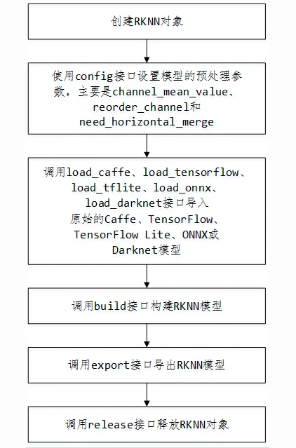

示例

```
from rknn.api import RKNN

INPUT_SIZE = 64

if __name__ == '__main__':
    # 创建RKNN执行对象
    rknn = RKNN()
# 配置模型输入，用于NPU对数据输入的预处理
# channel_mean_value='0 0 0 255'，那么模型推理时，将会对RGB数据做如下转换
# (R - 0)/255, (G - 0)/255, (B - 0)/255。推理时，RKNN模型会自动做均值和归一化处理
# reorder_channel=’0 1 2’用于指定是否调整图像通道顺序，设置成0 1 2即按输入的图像通道顺序不做调整
# reorder_channel=’2 1 0’表示交换0和2通道，如果输入是RGB，将会被调整为BGR。如果是BGR将会被调整为RGB
#图像通道顺序不做调整
    rknn.config(channel_mean_value='0 0 0 255', reorder_channel='0 1 2')

# 加载TensorFlow模型
# tf_pb='digital_gesture.pb'指定待转换的TensorFlow模型
# inputs指定模型中的输入节点
# outputs指定模型中输出节点
# input_size_list指定模型输入的大小
    print('--> Loading model')
    rknn.load_tensorflow(tf_pb='digital_gesture.pb',
                         inputs=['input_x'],
                         outputs=['probability'],
                         input_size_list=[[INPUT_SIZE, INPUT_SIZE, 3]])
    print('done')

# 创建解析pb模型
# do_quantization=False指定不进行量化
# 量化会减小模型的体积和提升运算速度，但是会有精度的丢失
    print('--> Building model')
    rknn.build(do_quantization=False)
    print('done')

    # 导出保存rknn模型文件
    rknn.export_rknn('./digital_gesture.rknn')

    # Release RKNN Context
    rknn.release()
```

### 模型推理

本章节主要讲解如何在Toybrick rk3399Pro开发板上调用RKNN Python API进行模型推理。

API调用流程

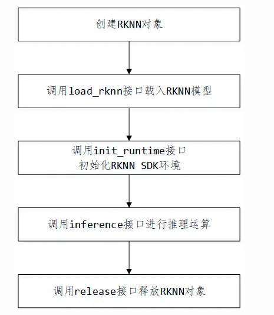

示例

```
import numpy as np
from PIL import Image
from rknn.api import RKNN
# 解析模型的输出，获得概率最大的手势和对应的概率
def get_predict(probability):
    data = probability[0][0]
    data = data.tolist()
    max_prob = max(data)

return data.index(max_prob), max_prob;
def load_model():
    # 创建RKNN对象
    rknn = RKNN()
    # 载入RKNN模型
    print('-->loading model')
    rknn.load_rknn('./digital_gesture.rknn')
    print('loading model done')
    # 初始化RKNN运行环境
    print('--> Init runtime environment')
    ret = rknn.init_runtime(target='rk3399pro')
    if ret != 0:
       print('Init runtime environment failed')
       exit(ret)
    print('done')
    return rknn
def predict(rknn):
    im = Image.open("../picture/6_7.jpg")   # 加载图片
    im = im.resize((64, 64),Image.ANTIALIAS)  # 图像缩放到64x64
    mat = np.asarray(im.convert('RGB'))    # 转换成RGB格式
    outputs = rknn.inference(inputs=[mat])   # 运行推理，得到推理结果
    pred, prob = get_predict(outputs)     # 将推理结果转化为可视信息
    print(prob)
    print(pred)

if __name__=="__main__":
    rknn = load_model()
    predict(rknn)

    rknn.release()
```

### AI应用开发

#### 基于TensorFlow/Caffe等框架开发

开发板Linux系统安装aarch64版本TensorFlow后即可调用TensorFlow API进行开发；同时，由于开发板预装的是标准的Fedora系统，也可以基于Caffe等各种开源框架进行开发，与PC无异。

#### 基于RKNN API开发

Python API开发

Python开发只需要调用RKNN-Toolkit包中的API即可完成Python应用开发。 C API开发

Rockchip提供了一套RKNN API SDK，该SDK为基于 RK3399Pro Linux/Android 的神经网络NPU硬件的一套加速方案，可为采用RKNN API 开发的AI相关应用提供通用加速支持。

##### 1、Linux 平台

需要先安装rknn-api开发包：

```
sudo dnf install –y rknn-api
```

若安装失败则到百度网盘下载：rknn_api_sdk

安装成功后系统目录中存在RKNN头文件rknn_api.h以及库文件librknn_api.so。应用程序只需要包含该头文件和动态库，就可以编写相关的AI应用。

引用头文件：

```
#include <rockchip/rknn_api.h>
```

链接库文件：

```
LDFLAGS = -lrknn_api
```

##### 2、Android平台

进入Android/RKNPUTools/rknn-api/Android/rknn_api目录，RKNN API的定义在include/rknn_api.h的头文件里。RKNN API的动态库路径为lib64/librknn_api.so和lib/librknn_api.so。应用程序只需要包含该头文件和动态库，就可以编写相关的AI应用的JNI库。目前Android上只支持采用JNI的开发方式。

RKNN API SDK相关API介绍请参考文档《RK3399Pro_Linux&Android_RKNN_API_V*.pdf》。

### Rock-X

1、 主要功能说明 Rock-X SDK是基于RK3399Pro平台的一套AI组件库。开发者通过Rock-XSDK提供的API接口能够快速构建AI应用。 当前SDK提供的功能如表1-1所示。 表1-1 Rock-X SDK主要功能


2 、 系统依赖说明2.1 RK3399Pro系统依赖 在RK3399Pro平台上，SDK所提供的库和应用程序需要RKNN驱动版本为0.9.6。在RK3399Pro Android/Linux平台上运行Demo应用以后，通过日志能够看到如下的驱动信息，请确保DRV版本为0.9.6。

```
==============================================
RKNNVERSION:
   API: 0.9.5 (a949908 build: 2019-05-0722:20:52)
   DRV: 0.9.6 (c12de8a build: 2019-05-0620:10:17)
==============================================
```

3、更多使用介绍请参考： http://t.rock-chips.com/wiki/rockx_api_doc/

## 六、常见问题

### FAQs

Todo

&gt; 可通过beiqi@beiqicloud.com联系我们!
