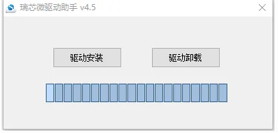
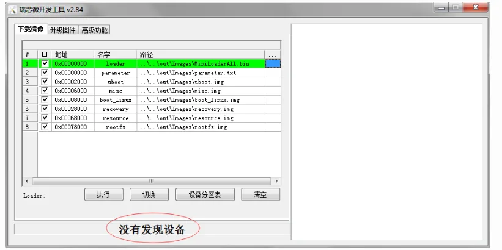
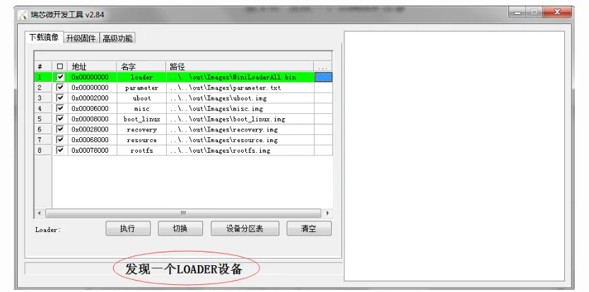
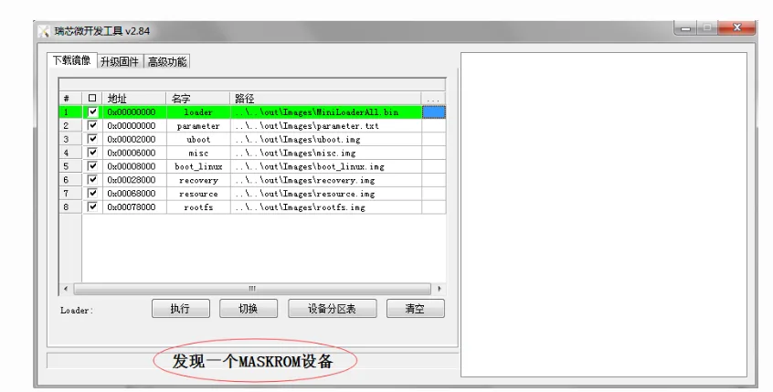
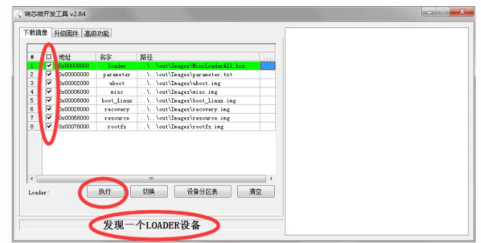
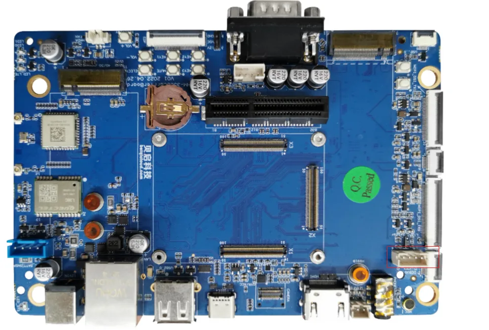

# 一、快速上手

### 产品优势

1. 面积小，厚度薄（厚度＜4.2mm，约等于两个一元硬币厚度大小）
2. 适用于各类平板
3.PintoPin连接
4.宽温在-40°C至85°C工作温度下可长时间稳定运行，可靠性强。

### 产品规格书

https://www.bearkey.com.cn/product/RK3568%E5%B7%A5%E4%B8%9A%E7%BA%A7%E6%A0%B8%E5%BF%83%E6%9D%BF.html

### 固件烧写

一般采用Loader模式烧写固件，如果无法进入loader烧写模式，仍可以进入 MaskRom 模式来烧写固件。

#### 进入烧写模式

#### 准备程序

RK3568开发板

电脑主机

Type-C 数据线

12v电源适配器

#### 安装Windows RK USB驱动程序

先从网盘下载 driverAssitant_v5.1.1.zip 至电脑上，解压目录运行里面的 DriverInstall.exe 。先选择驱动卸载，然后再选择驱动安装。

#### 进入loader烧写模式

1.接入12V电源适配器给予开发板供电，Type-C数据一端接在开发板上一端接到电脑PC端的USB接口上。

2.按住主板的Recovery按键不放。

3.电源适配器上电后，按下复位(Reset)按键。

4.当开发板进入loader模式后，松开按键。

#### 进入maskrom烧写模式

1.接入12V电源适配器给予开发板供电，Type-C数据一端接在开发板上一端接到电脑PC端的USB接口上。

2.按住主板的Maskrom按键不放。

3.电源适配器上电后，按下复位(Reset)按键。

4.当开发板进入loader模式后，松开按键。

### 查询烧写状态

##### Linux主机查询

先从网盘下载得到 edge工具 至电脑上，执行如下命令查询烧写状态:

./edge flash -q
1.none：表示开发板未进入烧写模式。

2.loader：表示开发板进入loader烧写模式。

3.maskrom：表示开发板进入maskrom烧写模式。

##### Windows主机查询

下载网盘 RKDevTool_Release_v2.84 工具至电脑上。双击打开RKDevTool_Release_v2.84目录下的 RKDevTool.exe

没有发现设备（如果图1-4所示）：表示开发板未进入烧写模式。

发现一个LOADER设备（如图1-5所示）：表示开发板进入loader烧写模式。

发现一个MASKROM设备（如图1-6所示）：表示开发板进入maskrom烧写模式。

### Linux主机烧写镜像

烧写所有镜像
烧写所有镜像包括： MiniLoaderAll.bin ， parameter.txt ， uboot.img ， misc.img ， boot_linux.img ， recovery.img ， resource.img 和 rootfs.img

./edge flash -a
烧写uboot镜像
烧写镜像：MiniLoaderAll.bin，uboot.img

./edge flash -u
烧写kernel镜像
烧写镜像：resource.img，boot_linux.img和recovery.img

./edge flash -k
烧写misc镜像
烧写镜像：misc.img

./edge flash -m
烧写文件系统镜像
烧写镜像：rootfs.img

./edge flash -r
查看烧写帮助
查看支持的烧写参数：

./edge flash -h

### Windows主机烧写镜像

双击打开RKDevTool_Release_v2.84目录下的RKDevTool.exe。

确认开发板已经进入loader或者maskrom烧写模式。

打勾选择需要烧写的镜像。

Loader和Parmeter选项建议打勾选择，其他选项根据需要打勾选择。

点击“执行”按钮，开始烧写固件

### 串口调试

开发板调试口：开发板的Debug口（microUSB口）

波特率(B) :150000数据位(D) :8
停止位(S) :1
奇偶校验(A) :无
流控制(F) :无
