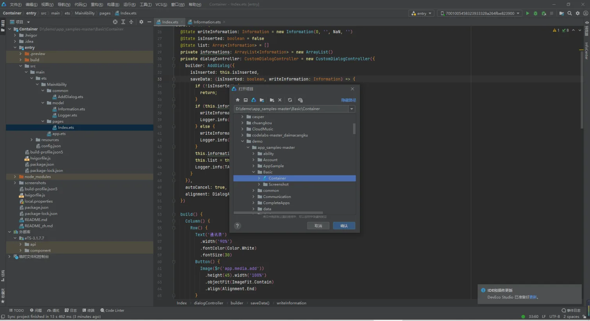
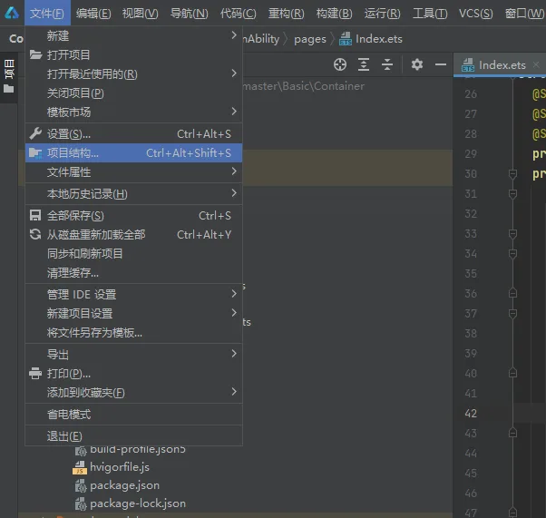
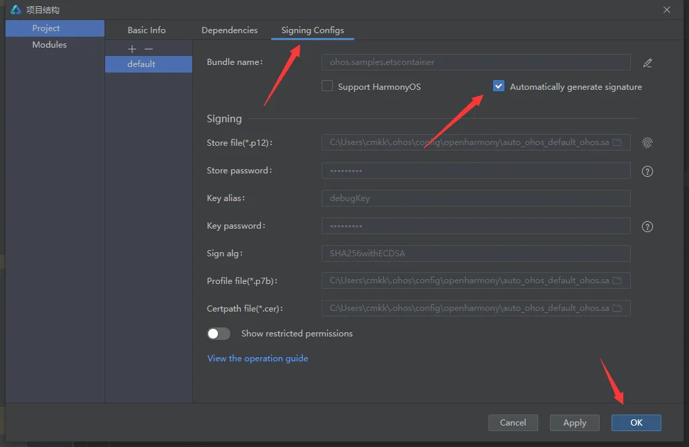
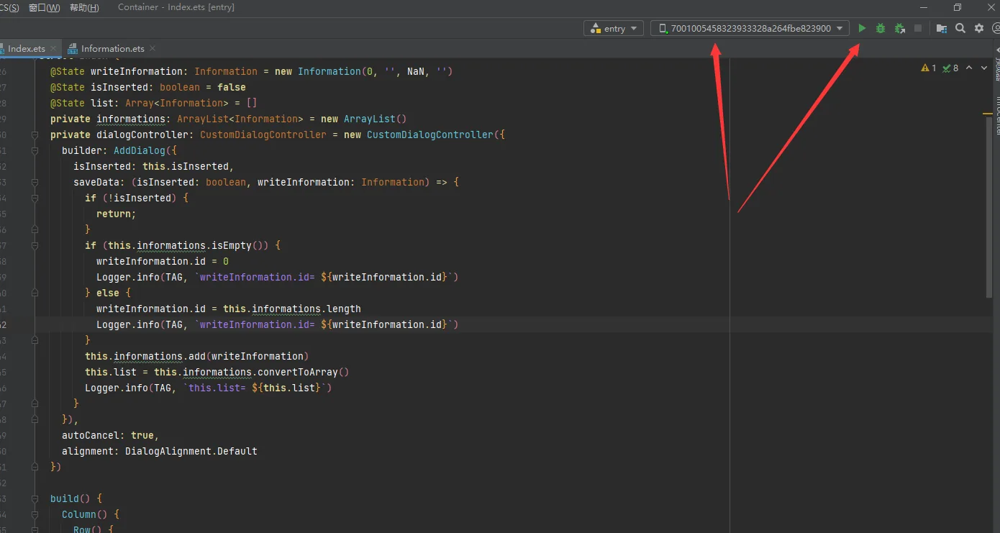
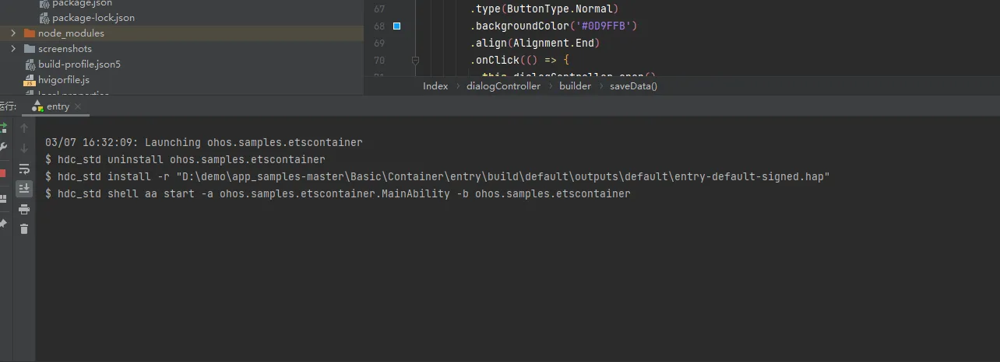

# 二、OpenHarmony开发

### Demo编译

#### 前提准备

1.编译hdc工具
编译命令：./build.sh --product-name ohos-sdk   #在源码根路径下执行获取路径：成功编译后，可在路径下./out/sdk/ohos-sdk/linux/toolchains/ #下载hdc_std到本地
注：可将hdc_std重命名为hdc
2.在系统环境变量里面配置hdc工具的路径
3.打开cmd，执行hdc -v，输出版本号（例如：Ver: 1.1.1e）hdc工具即可生效

#### 演示步骤

视频操作步骤：

https://www.bilibili.com/video/BV1ps4y1o7gj/?spm_id_from=333.999.0.0&vd_source=9a3fffe9267da83bbb02a07502ccab79

文字操作步骤：

从gitee上下载demo

https://gitee.com/openharmony/app_samples/tree/master/Basic/Container

使用DevEco Studio 3.0.0.993（具体下载步骤参考：https://developer.harmonyos.com/cn/docs/documentation/doc-guides-V3/software_install-0000001053582415-V3）

打开工程文件

1. 点击文件，项目结构对工程进行自动签名：

2. 确保设备连接的情况下点击右上角运行程序

3. 等编译完成后未报错即成功

