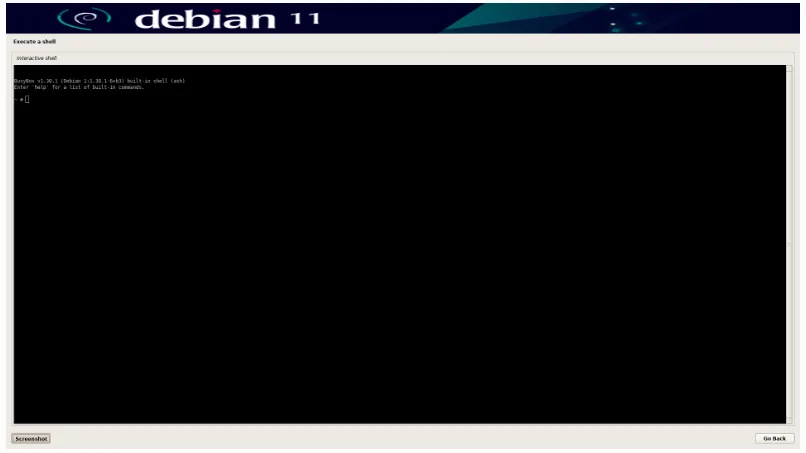

# 二、Linux开发

### 开机登录账户

Debian11默认的登录账号是：bearkey，登录密码是：bearkey

### 远程登录调试

RK3588开发板出厂debian11固件默认支持两种远程登录：adb和ssh

### adb登录

Linux电脑主机通过USB（主机的USB Host连接开发板的USB OTG口）

执行命令adb shell指令即可登录RK3588开发板的debian系统中。

### 提示

开发板的OTG口通常是标有”TYPE_C” 或”DOWNLOAD”的丝印，接口类似是Type-C。

### ssh登录

Linux电脑主机通过网络，执行如下命令远程(ip获取方法)登录RK3588开发板的debian系统：

ssh bearkey@xxx.xxx.xxx.xxx               //xxx.xxx.xxx.xxx是开发板的IP地址

### 常用命令行操作

### 网络连接

插入网线。

查看以太网接口名命令：

```
ip a
```

动态分配IP地址(假设以太网接口为eth1) 命令：

```
dhclient eth1
```

### 挂载U盘

mount /dev/sda1 /mnt   //假设U盘为：/dev/sda1

### 远程拷贝

scp $LOCAL_FILE $USER@$IP:/$REMOTE_PATH

### 重要文件备份

挂载rootfs分区到/sysroot目录：进入紧急模式后系统自动挂载rootfs分区到/sysroot，用户无需重复操作。

将重要文件拷贝到U盘或拷贝的远程主机上：

```
cp $FILE /mnt/
scp $LOCAL_FILE $USER@$IP:/$REMOTE_PATH
```

### 系统还原

1、将待还原的镜像rootfs.img拷贝到U盘上，并将U盘挂载到/mnt目录。

```
$cp rootfs.img $Udisk
mount /dev/sda1 /mnt
```

2 执行如下命令还原：

```
umount /sysroot
dd if=/mnt/rootfs.img of=/dev/disk/by-partlabel/rootfs
```

### 紧急模式

该模式在用户异常行为破坏系统文件时，导致系统无法正常启动时使用。非必要使用此模式。

拔出设备OTG口的Type-C的线，长按recovery按键后重启设备，系统将进入紧急模式的命令行，如图所示：


