# 入门指南

### 固件下载

百度云下载地址：[https://pan.baidu.com/s/1fiWUlW8rcbmRvx90XTdMlg 提取码：o7lf](https://pan.baidu.com/s/1fiWUlW8rcbmRvx90XTdMlg)

Onedrive download link：[https://1drv.ms/f/s!AhoFWWcHV7rXdXcEE2rA8xeeNYc](https://1drv.ms/f/s!AhoFWWcHV7rXdXcEE2rA8xeeNYc)

### 开发工具下载

百度云下载地址：[https://pan.baidu.com/s/1fiWUlW8rcbmRvx90XTdMlg 提取码：o7lf](https://pan.baidu.com/s/1fiWUlW8rcbmRvx90XTdMlg)

Onedrive download link：[https://1drv.ms/f/s!AhoFWWcHV7rXdXcEE2rA8xeeNYc](https://1drv.ms/f/s!AhoFWWcHV7rXdXcEE2rA8xeeNYc)

### 烧写驱动下载

百度云下载地址：[https://pan.baidu.com/s/1fiWUlW8rcbmRvx90XTdMlg 提取码：o7lf](https://pan.baidu.com/s/1fiWUlW8rcbmRvx90XTdMlg)

Onedrive download link：[https://1drv.ms/f/s!AhoFWWcHV7rXdXcEE2rA8xeeNYc](https://1drv.ms/f/s!AhoFWWcHV7rXdXcEE2rA8xeeNYc)

### 烧写固件-Buildroot固件

#### Window主机烧写固件

1、安装Windows PC端USB驱动(首次烧写执行)。

2、双击DriverAssitant_v4.8/DriverInstall.exe打开安装程序，点击“驱动安装”按提示安装驱动即可，安装界面如下所示:


3、双击AndroidTool_Release_v2.61/AndroidTool.exe启动烧写工具注意Buildroot固件烧写工具和Debian固件烧写工具是不同的。

4、Type-C线连接主机端的USB接口和RK1808 TB-96AIoT开发板的Type-C接口，长按RK1808 TB-96AIoT开发板上recovery按键后重启机器，直到系统进入Loader模式，如下所示：


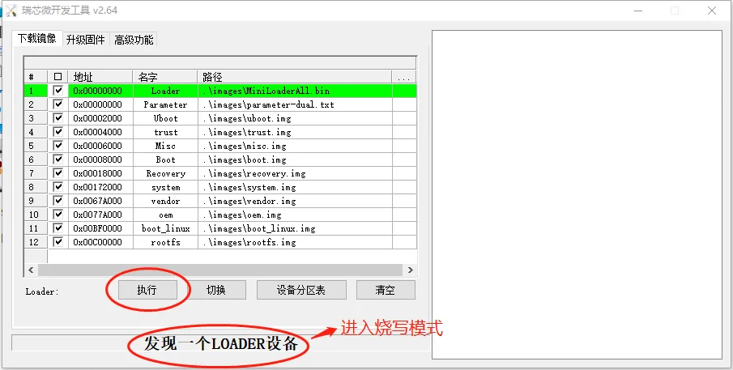

5、双击如下图所示的每一行，选择好固件路径，然后点击“执行”按钮，开始烧写升级。

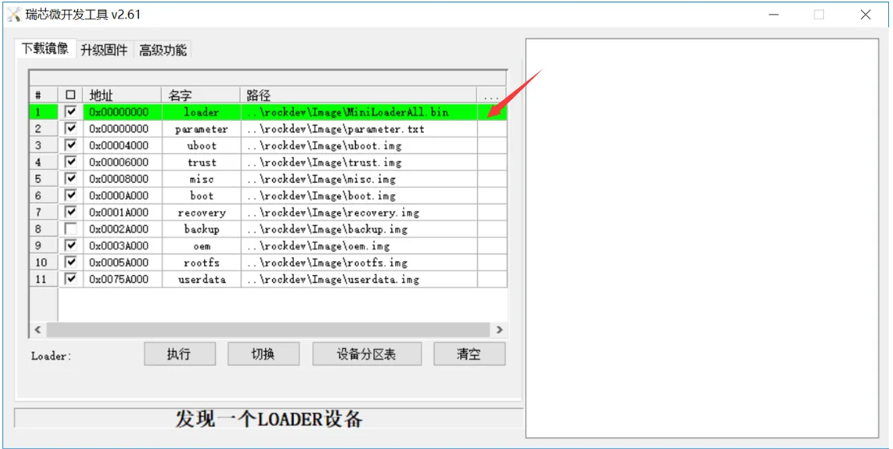

#### Linux主机烧写固件

1、Type-C线连接主机端的USB接口和RK1808 TB-96AIoT开发板的Type-C接口，长按RK1808 TB-96AIoT开发板上recovery按键后重启机器，直到系统进入Loader模式，如下所示：

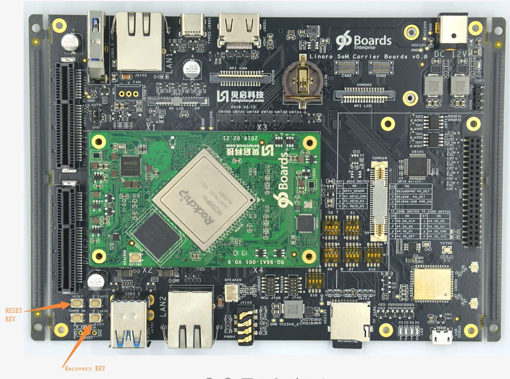

2、将固件解压到Linux_Upgrade_Tool_v1.38/images目录下。

3、运行 upgrade_tool 不带任何参数则进入工具模式。 执行后，需要先进行选择设备(图 1),

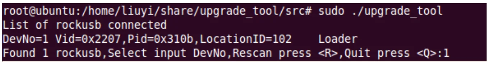

输入DevNo 设备号输入回车完成选择，进入工具模式主界面：

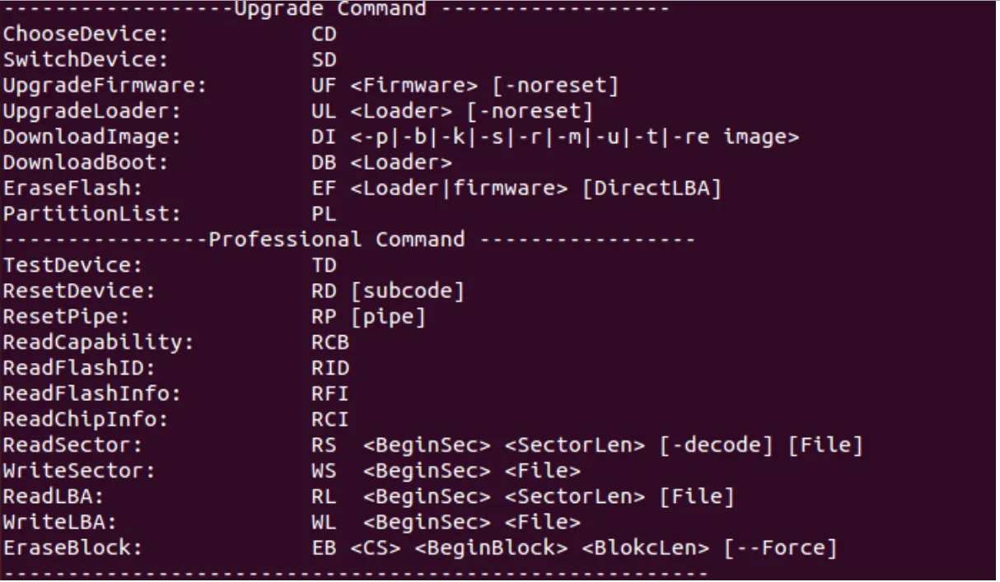

a.download loader

```
ul ./images/MiniLoaderAll.bin
```

b.DI command: burn partition image

```
(1) Parameter
di –p ./images/parameter.txt

(2) Uboot
di –u ./images/uboot.img

(3) Trust
di –t ./images/turst.img

(4) Misc
di –m ./images/misc.img

(5) Boot
di –b ./images/boot.img

(6) Recovery
di –r ./images/recovery.img

(7) Oem
di –oem ./images/oem.img

(8) Rootfs
di –rootfs ./images/rootfs.img

(9) Userdata
di –userdata ./images/userdata.img

(10) Reboot
rd
```

### 烧写固件-Debian10固件

下载固件

下载固件到Flash\Images目录下，固件包含：

1. MiniLoaderAll.bin: 一级Loader
2. uboot.img: U-Boot固件， 二级Loader
3. trust.img: 安全OS固件
4. boot_linux.img: 内核固件和内核设备树
5. rootfs.img: Debian10根文件系统
6. parameter.txt: 分区信息

#### Window主机烧写固件

1、安装Windows PC端USB驱动(首次烧写执行)。

2、双击DriverAssitant_v4.8/DriverInstall.exe打开安装程序，点击“驱动安装”按提示安装驱动即可，安装界面如下所示:

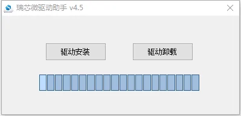

3、双击AndroidTool_Release_v2.61/AndroidTool.exe启动烧写工具（注意Buildroot固件烧写工具和Debian固件烧写工具是不同的）。

4、Type-C线连接主机端的USB接口和RK1808 TB-96AIoT开发板的Type-C接口，长按RK1808 TB-96AIoT开发板上recovery按键后重启机器，直到系统进入Loader模式，如下所示：


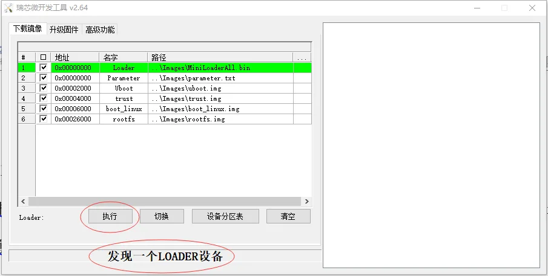

5、点击烧写工具上的“执行”按钮，开始烧写固件

1. 烧写完成后，系统自动重启

#### Linux主机烧写固件

1、Type-C线连接主机端的USB接口和RK1808 TB-96AIoT开发板的Type-C接口，长按RK1808 TB-96AIoT开发板上recovery按键后重启机器，直到系统进入Loader模式，如下所示：


2、下载网盘链接Linux烧写工具linux-flashTool.tar.gz：
链接：[https://pan.baidu.com/s/1HYKTwkkbdZaiJsuv_EifEw](https://pan.baidu.com/s/1HYKTwkkbdZaiJsuv_EifEw)
提取码：5k1x

拷贝到Linux PC，解压为linux-flashTool目录，并在该工具目录的同级目录创建images目录，并把固件放置在其中。
然后进入linux-flashTool目录，运行./linux_flash.sh，根据提示，输入sudo的密码，等待烧写完。

### 烧写固件-Debian9固件

#### 烧写固件

1、Debian9固件的烧写工具及步骤，与Buildroot固件的烧写过程一样。

### 串口调试

#### SecureCRT串口工具

将RK1808 TB-96AIoT开发板的Debug口（microUSB口）连接到主机端的USB口，打开设备管理器获取USB Serial Port的端口号，如下图所示：

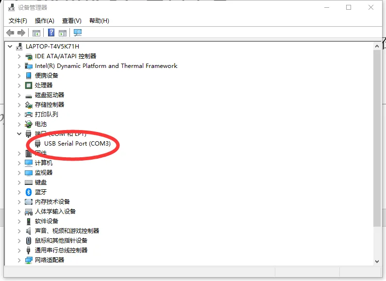

注意：如果设备管理器里面显示驱动异常信息，请选择更新驱动信息即可。

打开串口工具“SecureCRT”，点击“快速连接”按钮。

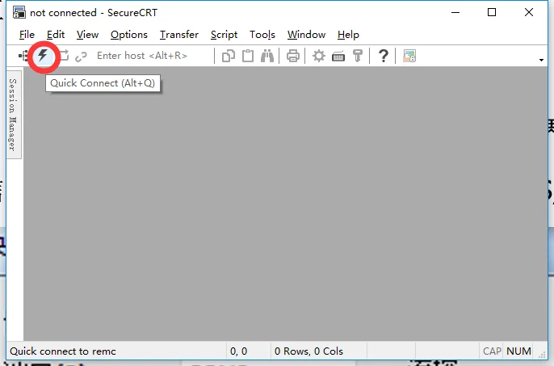

配置串口信息，端口选择连接开发板的端口号，设置波特率为1500000，不勾选流控RTS/CTS，如下图所示：

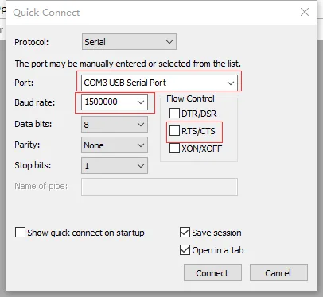

点击连接，就可以正常查看系统调试信息和输入用户命令。

#### Minicom串口工具

1、将RK1808 TB-96AIoT开发板的Debug口连接到主机端的USB口。

2、以root权限打开minicom： sudo minicom -s。

3、打开Minicom菜单：输入CTRL-A + z。

4、进入Minicom配置界面：输入“O”选择“Configure Minicom”。

5、进入串口设置：选择“Serial port setup”。

6、设置串口设备：输入“A”，写入“/dev/ttyUSB0”，按回车确定。

7、禁止流控：输入“F”，按回车确定。

8、设置波特率：输入“E”，再输入“A”直到显示“Current 1500000 8N1”，然后回车确定。

9、保存设置：选择“Save setup as dfl”。

10、退出设置：选择“Exit”。

### 开机启动-Buildroot固件

可以adb远程登陆或者ssh远程登陆

用户名root，密码rockchip

RK1808 TB-96AIoT开发板，若有接配套屏幕，购买链接 [https://item.taobao.com/item.htm?spm=a1z10.1-c-s.w4004-21746724073.14.671a196cU5BLeP&id=596790859176](https://item.taobao.com/item.htm?spm=a1z10.1-c-s.w4004-21746724073.14.671a196cU5BLeP&id=596790859176)

开机启动后有个默认的QT界面，如下图所示。

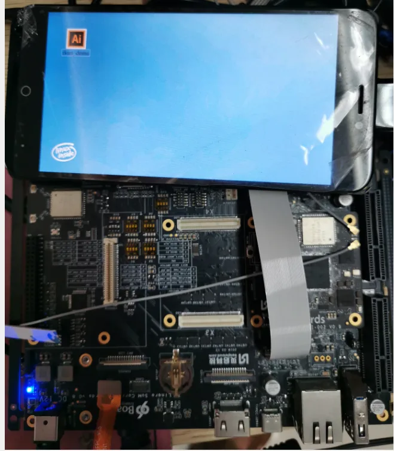
