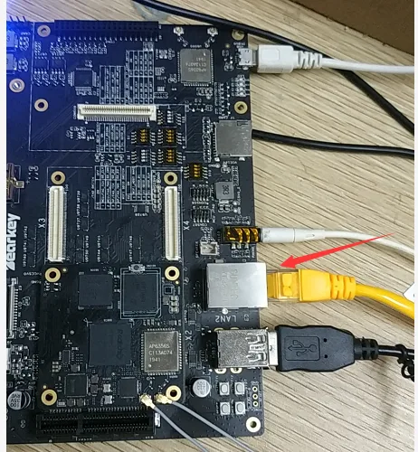

# Linux-Debian10开发

### Debian10系统

用户登录

```
用户名：toybrick
密码：toybrick
SSH登录：ssh toybrick@192.168.180.8
```

软件升级

```
sudo apt update
sudo apt upgrade
```

系统设置

1. 配置USB Functions： 命令：[toybrick-set.py](http://toybrick-set.py) func FUNCTIONS  参数说明：  FUCTIONS=&#123;rndis,ntb,mass,uart,touch,keyboard,mouse,custom&#125;，以逗号隔开 ``` 1) rndis: USB虚拟以太网卡，必选项 2) ntb: USB ntb设备，必选项 3) mass: 虚拟USB存储设备，挂载点/var/doc.img 4) touch: 虚拟触摸屏 5) keyboard：虚拟键盘 6) mouse：虚拟鼠标 7) custom：用户自定义虚拟设备。此项选择后，系统调用用户编写的自定义虚拟设备的执行脚本/usr/bin/custom_func.sh。 ```  默认值：rndis,ntb,mass  例子：[toybrick-set.py](http://toybrick-set.py) func rndis,ntb,mass

### TYPEC连接上位机USB虚拟网卡

通过TYPEC USB连接到上位机USB HOST，TB-96AIoT可以虚拟出USB网卡与上位机进行网络通讯，同时可以共享上位机的网络；
详见：[http://t.rock-chips.com/wiki.php?mod=view&id=76](http://t.rock-chips.com/wiki.php?mod=view&id=76)

开启配置TB-96AIoT USB虚拟网卡共享上位机网络
sudo [toybrick-set.py](http://toybrick-set.py) func rndis,ntb
sudo [toybrick-set.py](http://toybrick-set.py) network rndis static addr 192.168.180.8/24 gateway 192.168.180.1 dns 180.76.76.76,8.8.8.8
sudo reboot

这种配置下，可以使用类似计算棒的主动模式和被动模式

### 配置以太网

TB-96AIoT开发板底板的LAN2口是TB-96AIoT使用的。



1. 配置以太网自动获取IP地址； sudo [toybrick-set.py](http://toybrick-set.py) func none sudo [toybrick-set.py](http://toybrick-set.py) network ethernet dhcp sudo reboot
2. 配置以太网静态IP; 举例配置静态ip为192.168.179.8，默认网关为192.168.179.1 sudo [toybrick-set.py](http://toybrick-set.py) func none sudo [toybrick-set.py](http://toybrick-set.py) network ethernet static addr 192.168.179.8/24 gateway 192.168.179.1 dns 180.76.76.76,8.8.8.8 sudo reboot

这种配置下，可以使用类似计算棒的主动模式

### 配置WiFi

TB-96AIoT开发板配置WiFi命令如下：

```
wpa_passphrase 'WIFI-SSID-NAME' 'WIFI-PASSWORD'>> /etc/wpa_supplicant/wpa_supplicant.conf
wpa_supplicant -B -i wlan0 -c /etc/wpa_supplicant/wpa_supplicant.conf
sudo dhclient wlan0
```

然后查看ifconfig wlan0及ip ro命令确认获取到的ip地址及路由器网关地址；
目前需要手动添加WiFi路由器作为TB-96AIoT开发板的默认路由；
route add default gw xxx.yyy.zzz.aaa
xxx.yyy.zzz.aaa是WiFi路由器的IP地址

### 音频功能

耳机播放音乐，执行以下两条命令

```
amixer cset numid=1 4
aplay fyq.wav
```

注：fyq.wav是播放的音频文件名称，aplay工具只能播放wav格式的音频文件

录音功能，执行以下两条命令：

```
amixer cset numid=2 2
arecord test.wav -r 48000 -f cd
```

### Mipi摄像头或USB摄像头调用

摄像头抓图，串口执行以下命令：

```
v4l2-ctl -d /dev/video0 \
--set-fmt-video=width=1920,height=1080,pixelformat=YU12 \
--stream-mmap=3 \
--stream-skip=3 \
--stream-to=/tmp/test3.yuv \
--stream-count=1 \
--stream-poll
```

/dev/video0为摄像头的设备节点，mipi摄像头和usb摄像头对应的节点不同。Width和height为抓图的分辨率大小。Pixelformat为抓图的格式，/tmp/test3.yuv 为图片的存放路径

### 系统软件库

#### DRM内存分配

1. 安装DRM内存库

```
sudo apt install rockchip-drm-dev libdrm-dev
```

1. 编译链接：

```
LDDFLAGS := -lrockchip_drm
```

1. 包含头文件：

```
#include <rockchip/rockchip_drm.h>
```

1. 示例代码：

```
/usr/share/rockchip_drm/example
```

1. 重要数据结构

```
tpyedef struct _DrmBuffer {
int fd;  // DRM/CMA内存的文件描述符
unsigned int handle; // DRM/CMA内存的句柄
void *ptr; // DRM/CMA内存映射到用户空间的虚拟地址
size_t size; // DRM/CMA内存的大小，单位：字节
unsigned long phys; // DRM/CMA内存的物理地址
} DrmBuffer, CmaBuffer;
```

1. DRM接口说明: 详见/usr/include/rockchip/rockchip_drm.h

```
1）RockchipDrmOpen: 打开设备节点

    示例：int fd = RockchipDrmOpen();

2）RockchipDrmClose: 关闭设备节点

    示例：RockchipDrmClose(fd);

    注：必须释放所有fd分配的内存后，才能关闭设备节点

3）RockchipDrmAlloc：分配DRM内存，物理地址不连续

    示例：DrmBuffer *buf = RockchipDrmAlloc(fd, V4L2_PIX_FMT_NV12, 1920, 1080);

4）RockchipDrmFree：释放DRM内存

    示例：RockchipDrmFree(fd, buf);

5）RockchipCmaAlloc：分配CMA内存，物理地址连续

    示例：CmaBuffer *buf = RockchipCmaAlloc(fd, size);

6）RockchipCmaFree：释放CMA内存

    示例：RockchipCmaFree(fd, buf);
```

#### RGA 2D图形加速

1. 安装RGA 2D图形加速库

```
sudo apt install rockchip-rga-dev
```

1. 编译链接：

```
LDDFLAGS := -lrockchip_rga
```

1. 包含头文件：

```
#include <rockchip/rockchip_rga.h>
```

1. 示例代码：

```
/usr/share/rockchip_rga/example
```

1. 重要数据结构：

```
tpyedef struct _RgaBuffer {
int fd;  // RGA内存的文件描述符
unsigned int handle; // RGA内存的句柄
void *ptr; // RGA内存映射到用户空间的虚拟地址
size_t size; // RGA内存的大小，单位：字节
unsigned long phys; // RGA内存的物理地址
};
```

1. RGA接口说明：详见/usr/include/rockchip/rockchip_rga.h

```
 1)   RgaCreate：创建RGA实例，返回RGA结构指针

  示例：RockchipRga *rga = RgaCreate();

 2)   RgaDestory：销毁RGA实例

  示例：RgaDestroy(rga);

 3)   initCtx：清空RGA上下文

  示例：rga->ops->initCtx(rga);

  注：如果不清空上下文，下次执行RGA操作时会沿用之前设置图像参数。

 4)   setRotate设置选择旋转角度

  示例：rga->ops->setRotate(rga, rotate);

  rotate参数说明：

                         a)   RGA_ROTATE_NONE：不旋转

                         b)   RGA_ROTATE_90：逆时针旋转90度

                         c)   RGA_ROTATE_180：逆时针旋转180度

                         d)   RGA_ROTATE_270：逆时针旋转270度

                         e)   RGA_ROTATE_VFLIP：垂直镜像

                         f)   RGA_ROTATE_HFLIP：水平镜像

 5)   setFillColor：设置色彩填充

 示例：rga->ops->setFillColor(rga, color);

 color参数说明：

                       a)   蓝色：0xffff0000

                       b)   绿色：0xff00ff00

                       c)   红色：0xff0000ff

  6)   setSrcCrops/setDstCrop：设置源/目的剪切窗口

  示例：rga->ops->setSrcCrop(rga, cropX, cropY, cropW, cropH);

            rga->ops->setSrcCrop(rga, cropX, cropY, cropW, cropH);

  参数说明：

                a)   cropX：原点横坐标

                b)   cropY：原点纵坐标

                c)   cropW：窗口宽度

                d)   cropH：窗口高度

  7)   setSrcFormat/setDstFormat：设置源/目的图像格式

  示例：rga->ops->setSrcFormat(rga, v4l2Format, width, height);

            rga->ops->setDstFormat(rga, v4l2Format, width, height);

  参数说明：

               a)   V4l2Format：v4l2图像格式，支持的格式见 /usr/include/rockchip/rockchip_rga.h

               b)   Width：图像宽度

               c)   Height：图像高度

  8)   setSrcBufferFd/setDstBufferFd：设置图像Buffer的文件描述符

  示例：int fd = RockchipDrmOpen();

  DrmBuffer *buf = RockchipDrmAlloc(fd, V4L2_PIX_FMT_NV12, 1920, 1080);

  rga->ops->setSrcBufferFd(rga, buf->fd);

  9)   setSrcBufferPtr/setDstBufferPtr:设置图像Buffer的内存指针

  示例：Void *buf = malloc(size);

            rga->ops->setSrcBufferPtr(rga, buf);

  10)  setSrcBufferPhys/setDstBufferPhys:设置图像Buffer的物理地址

  示例：int fd = RockchipDrmOpen();

            CmaBuffer *buf = RockchipCmaAlloc(fd, size);

            rga->ops->setSrcBufferPhys(rga, buf->phys);

  注：分配的内存必须是物理连续的内存

  11)  执行图像处理操作

  示例：rga->ops->go(rga);
```

#### MPP视频编解码

1. 安装MPP视频编解码库

```
sudo apt install rockchip-mpp-dev
```

1. 编译链接：

```
LDDFLAGS := -lrockchip_mpp
```

1. 包含头文件：

```
#include <rockchip/rockchip_mpp.h>
```

1. 示例代码：

```
/usr/share/rockchip_mpp/example
```

1. 重要数据结构：

```
1)   typedef struct _DecFrame {
        MppFrame mppFrame; // 内部使用
        __u32 v4l2Format; // 解码后的图像格式，目前只支持V4L2_PIX_FMT_NV12
        __u32 width; // 解码的图像宽度
        __u32 height; // 解码的图像高度
        __u32 coded_width; // 解码图像的实际宽度(16字节对齐)
        __u32 coded_height; // 解码图像的实际高度(16字节对齐)
        int fd; // 解码图像内存的文件描述符
        void *data; // 解码图像内存映射到用户空间的虚拟地址
        size_t size; // 解码图像的大小，单位：字节
        MppBufferGroup frameGroup; // 内部使用
        MppBuffer frameBuf; // 内部使用
} DecFrame;
```

```
2)   typedef strcut _EncPacket{
        MppPacket mppPacket; // 内部使用
        int fd; // 编码图像内存的文件描述符
        void *data; // 编码图像内存映射到用户空间的虚拟地址
        size_t size; // 编码图像的大小，单位：字节
        int is_intra; // 内部使用
} EncPacket;

3)   typedef struct _EncCtx {
__u32 v4l2Format; // 待编码图像格式
__u32 width; // 待编码图像宽度
__u32 height; // 待编码图像高度
size_t size; // 待编码图像大小，单位：字节
int fps; // 编码帧速
int bps; // 编码码率
int gop; // 关键帧间隔
EncodeRcMode mode; // RC mode, 支持CBR和VBR
EncodeQuality quality; // 编码图像质量
Union {
    int profile; // 画质，只对H264编码有效
    int quant; // 量化指标，只对MJPEG编码有效，
};
}；
```

1. MPP接口说明：详见/usr/include/rockchip/rockchip_mpp.h 1） MppDecoderCreate：创建MPP解码器实例，成功返回MPP结构指针 ```    	 示例：MppDecoder *dec = MppDecoderCreate(DECODE_TYPE_H264); ```

```
2)   MppDecoderDestroy：销毁MPP实例

			 示例：MppDecoderDestroy(dec);

3)   enqueue：解码图像入队操作

			 示例：dec->ops->enqueue(dec, data, size);

			 参数说明：

							a)   data：存放H264图像数据的BUFFER指针

							b)   size：图像大小

4)   dequeue：解码图像出队操作，阻塞直到mpp成功解码后函数返回

			 示例：DecFrame *frame = dec->ops->dequeue(dec);

5)   dequeue_timeout: 解码图像出队操作，阻塞直到mpp成功解码或超时后函数返回

			 示例：DecFrame *frame = dec->ops->dequeuer_timeout(dec, 0); // 直接返回不阻塞

					   DecFrame *frame = dec->ops->dequeuer_timeout(dec, -1); // 阻塞直到成功

					   DecFrame *frame = dec->ops->dequeuer_timeout(dec, 100); // 超时时间100ms

6)   decode：解码图像，相当于enqueue + dequeue操作

			 示例：DecFrame *frame = dec->ops->decode(dec, data, size);

7)   freeFrame：释放编码图像内存

			 示例：dec->ops->freeFrame(frame);

8)   MppEncoderCreate：创建MPP编码器实例，成功返回MPP结构指针

			 示例：EncCtx ctx;

					   ctx.v4l2format = V4L2_PIX_FMT_NV12;

					   ctx.width = 1920;

					   ctx.heigh = 1080;

					   ctx.size = 1920 * 1080 * 3 / 2;

					   ctx.fps = 25;

					   ctx.gop = 25;

					   ctx.bps = 1920 * 1080 /16 * ctx.fps;

					   ctx.mode = ENCODE_RC_MODE_CBR;

					   ctx.quality = ENCODE_QUALITY_BEST;

					   ctx.profile = ENCODE_PROFILE_HIGH;

					   MppEncoder *enc = MppEncoderCreate(ctx, ENCODE_TYPE_H264);

9)   MppEncoderDestroy：销毁MPP实例

			 示例：MppEncoderDestroy(enc);

10)  importBufferFd: 导入外部内存的文件描述符

			  示例：int fd = RockchipDrmOpen();

						DrmBuffer *buf1= RockchipDrmAlloc(fd, V4L2_PIX_FMT_NV12, 1920, 1080);

						DrmBuffer *buf2 = RockchipDrmAlloc(fd, V4L2_PIX_FMT_NV12, 1920, 1080);

						enc->ops->importBufferFd(enc, buf1->fd, 0); // 0号内存

						enc->ops->importBufferFd(enc, buf1->fd, 1); // 1号内存

11)  enqueue：待编码图像入队操作

			  示例：memcpy(buf1->ptr, data, buf1->size); //将待编码图像拷贝到buf1

						enc->ops->enqueuer(enc, 0); // 告诉MPP，编码图像保存在0号内存

12)  getExtraData: 获取sps/pps等编码头部信息

			  示例：EncPacket *packet = enc->ops->getExtraData(enc);

13)  dequeue：编码图像出队操作

			  示例：EncPacket *packet = enc->ops->dequeuer(enc);

14)  freePacket：释放编码图像内存

			  示例：enc->ops->freePacket(packet);
```

#### RTSP客户端

1. 安装RTSP客户端库

```
sudo apt install rockchip-rtsp-dev
```

1. 编译链接：

```
LDDFLAGS := -lrockchip_rtsp
```

1. 包含头文件：

```
#include <rockchip/rockchip_rtsp.h>
```

1. 示例代码：

```
/usr/share/rockchip_rtsp/example
```

1. Rtspclient接口说明：详见/usr/include/rockchip/rockchip_rtsp.h 1)   构造函数： ```    	 定义：RtspClient(std::string url, std::string username = "", std::string password = "", bool useTCP=false);    	 示例：Rtsplcient client(“rtsp://192.168.180.8”, “username”, “password”);    	 参数说明：    				   Url：IPC摄像头的RTSP网络地址    				   Username：IPC摄像头的用户名，默认为空    				   Password：IPC摄像头的密码，默认为空    				   useTCP：传输协议释放是TCP，默认为UDP ```

```
2)   设置回调函数：

			定义：setDataCallback(FRtspCallBack callBack);

3)   开始获取RTSP流：

			示例：client.enable();

4)   停止获取RTSP流：

			示例：client.disable();
```

### 主动模式和被动模式开发

开发指南详见：
[http://t.rock-chips.com/wiki.php?mod=view&id=64](http://t.rock-chips.com/wiki.php?mod=view&id=64)
[http://t.rock-chips.com/wiki.php?mod=view&id=66](http://t.rock-chips.com/wiki.php?mod=view&id=66)

示例详见：
[http://t.rock-chips.com/wiki.php?mod=view&id=71](http://t.rock-chips.com/wiki.php?mod=view&id=71)
