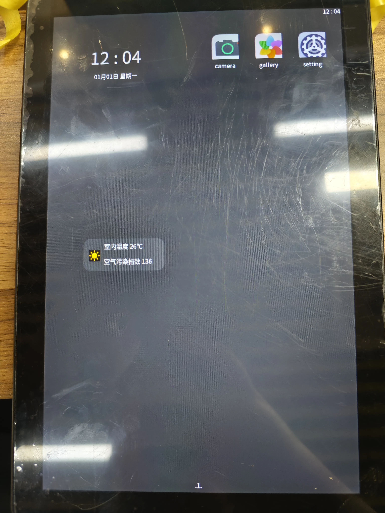
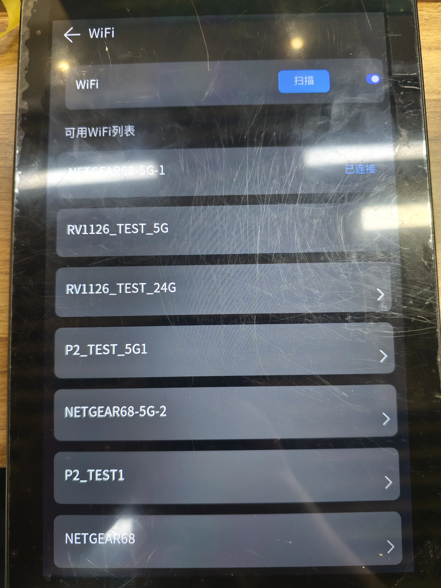

# 5. OpenHarmony

### 5.1 HDC功能使用

1.编译hdc工具
编译命令：./build.sh --product-name ohos-sdk   #在源码根路径下执行获取路径：成功编译后，可在路径下./out/sdk/ohos-sdk/linux/toolchains/ #下载hdc_std到本地
注：可将hdc_std重命名为hdc
2.在系统环境变量里面配置hdc工具的路径
3.打开cmd，执行hdc -v，输出版本号（例如：Ver: 1.1.1e）hdc工具即可生效
4.执行hdc shell即可开启hdc终端

### 5.2 开机桌面显示

DC座子接12V电源，上电后显示开机logo与开机动画，最后进入桌面，进入桌面后如图所示

### 5.3 WIFI功能使用

点击桌面上的setting hap，进入后点击WIFI选项，点击扫描即可扫描当前附件WIFI热点，点击WIFI名称进入输入密码，按回车输入完成进行连接

### 5.4 视频播放

使用如下命令 替换视频路径，即可全屏播放视频， -r为调节视频播放方向，-c为播放后自动结束播放进程，-W和-H调整播放显示区域，区域参数可不变动
rkadk_player_test -i /user/xxxxxx.mp4 -v -a 0 -s 0 -I 1 -P 0 -l 1 -c 1 -r 90 -W 800 -H 1280

### 5.5 AB分区 OTA升级

以下为AB分区OTA升级命令，--image_url后指定ota升级镜像路径，添加--reboot升级完成后自动重启
updateEngine --partition=0x3EFC00 --image_url=/storage/update-ab.img --update --reboot
