# RK3568工业控制主板

RK3568工业控制主板面向工业控制、边缘计算、设备网关等应用场景，提供 RS485、RS232、DI/DO、USB、RTC、Wi-Fi、以太网、SSD、SATA、CAN、4G、MIPI Camera 等常用工业接口。

## 一、快速上手

### 1. 接口概览

开发板整体接口如下图所示，具体接口定义以板卡丝印和随货资料为准。

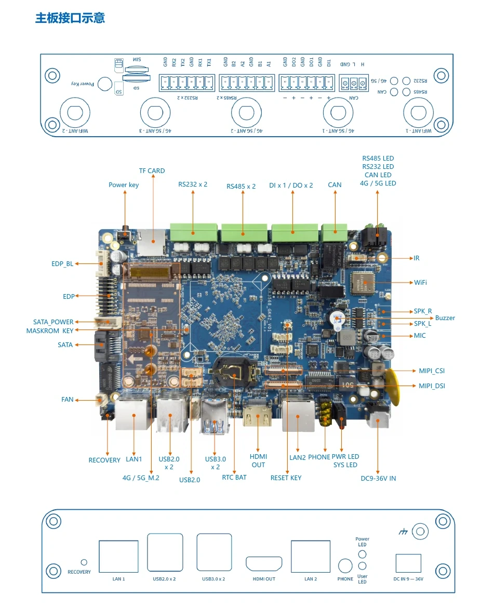


### 2. 准备工作

| 类别 | 说明 |
| --- | --- |
| 主板 | RK3568工业控制主板 |
| 电源 | 12V 电源适配器 |
| 烧写线材 | USB3.0 数据线 |
| 调试工具 | USB 转串口线、串口调试软件 |
| 显示输入 | HDMI 显示器、键盘、鼠标 |
| 可选外设 | USB 转 485、RS232/RS485 设备、CAN 设备、SSD/SATA 硬盘、4G 模块、MIPI 摄像头 |

### 3. 固件烧写

开发板一般采用 Loader 模式烧写固件。如果无法进入 Loader 烧写模式，可进入 MaskRom 模式进行烧写。

#### 3.1 进入 Loader 烧写模式

1. 使用 12V 电源适配器给开发板供电。
2. 使用 usb 数据线连接开发板和电脑 USB 接口。
3. 按住主板 `Recovery` 按键不放。
4. 上电后短按 `Reset` 按键。
5. 工具识别到 Loader 设备后松开按键。

#### 3.2 进入 MaskRom 烧写模式

1. 使用 12V 电源适配器给开发板供电。
2. 使用 usb 数据线连接开发板和电脑 USB 接口。
3. 按住主板 `Maskrom` 按键不放。
4. 上电后短按 `Reset` 按键。
5. 工具识别到 MaskRom 设备后松开按键。

#### 3.3 Linux 主机烧写

使用 `edge` 工具查询烧写状态：

```shell
./edge flash -q
```

状态说明：

| 状态 | 说明 |
| --- | --- |
| `none` | 未识别到烧写设备 |
| `loader` | 已进入 Loader 烧写模式 |
| `maskrom` | 已进入 MaskRom 烧写模式 |

烧写全部镜像：

```shell
./edge flash -a
```

按分区烧写：

```shell
# 烧写 U-Boot 相关镜像
./edge flash -u

# 烧写 Kernel 相关镜像
./edge flash -k

# 烧写 misc 镜像
./edge flash -m

# 烧写 rootfs 文件系统镜像
./edge flash -r

# 查看帮助
./edge flash -h
```

#### 3.4 Windows 主机烧写

1. 安装 RK USB 驱动。
2. 打开 `RKDevTool.exe`。
3. 确认开发板已进入 Loader 或 MaskRom 烧写模式。
4. 勾选需要烧写的镜像。
5. 建议勾选 `Loader` 和 `Parameter`，其他镜像按需选择。
6. 点击“执行”，等待烧写完成。

### 4. 串口调试

串口调试用于查看启动日志、登录系统和执行底层调试命令。将 USB 转串口线连接到开发板 Debug 口。

| 参数 | 配置 |
| --- | --- |
| 调试口 | Debug 口 |
| 波特率 | 150000 |
| 数据位 | 8 |
| 停止位 | 1 |
| 奇偶校验 | 无 |
| 流控制 | 无 |

## 二、用户与密码

### 1. 默认用户

| 项目 | 默认值 |
| --- | --- |
| 用户名 | `rockchip` |
| 密码 | `rockchip` |

首次登录后，建议根据项目安全要求修改默认密码。

### 2. 获取 root 权限

部分硬件测试需要 root 权限，登录系统后执行：

```shell
sudo su
```

### 3. SSH 登录

开发板接入网络后，可查看 IP 地址：

```shell
ip addr
```

在 PC 端执行：

```shell
ssh rockchip@<开发板IP>
```

如果无法连接 SSH，可在开发板端检查服务：

```shell
sudo systemctl status ssh
```

## 三、硬件接口使用

### 1. RS485

RS485 接口位置如下图所示。


#### 1.1 硬件连接

根据 USB 转 485 线的针脚定义，将 `A`、`B`、`GND` 分别连接到开发板 RS485 接口的 `A`、`B`、`GND`。

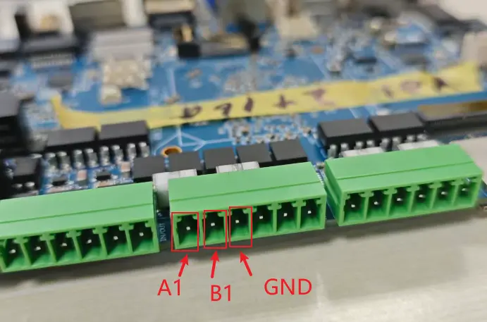

具体引脚可查看板卡背面丝印。

#### 1.2 串口连接

使用 USB 转串口线连接开发板 Debug 串口，并按本文前面的串口参数打开终端。


#### 1.3 收发测试

RS485_1 使用 `uart3`，系统节点为 `/dev/ttyS3`，RS485_2 使用 `uart4`，系统节点为 `/dev/ttyS4`


发送测试：

```shell
stty -F /dev/ttyS3 115200
echo "beiqi" > /dev/ttyS3
```

接收测试：

```shell
cat /dev/ttyS3
```

### 2. RS232

#### 2.1 硬件连接

RS232 接口连接方式如下图所示。


#### 2.2 收发测试

RS232_1 使用 `uart7`，系统节点为 `/dev/ttyS7`，RS232_2 使用 `uart9`，系统节点为 `/dev/ttyS9`


发送测试：

```shell
stty -F /dev/ttyS7 115200
echo "beiqi" > /dev/ttyS7
```

接收测试：

```shell
cat /dev/ttyS7
```

### 3. DI/DO

DI/DO 接口位置如下图所示。

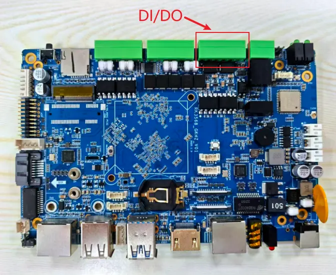

#### 3.1 DO 测试

DO 接口如下图所示。


查看和设置 DO1：

```shell
# 查看 DO1 当前电平
cat /sys/devices/platform/gpios/DOUT1

# 设置 DO1 输出高电平
echo 1 > /sys/devices/platform/gpios/DOUT1

# 设置 DO1 输出低电平
echo 0 > /sys/devices/platform/gpios/DOUT1
```

#### 3.2 DI 测试

DI 接口如下图所示。

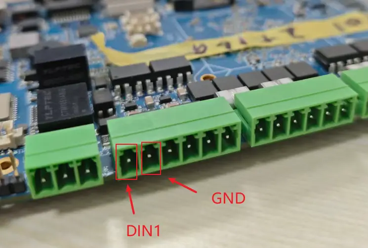

读取 DI 输入：

```shell
cat /sys/devices/platform/gpios/DIN1
```

#### 3.3 DI/DO 回环测试

如无万用表或其他测试工具，可将 `DIN1` 与 `DOUT1` 连接起来做回环测试。


输出高电平并读取输入：

```shell
echo 1 > /sys/devices/platform/gpios/DOUT1
cat /sys/devices/platform/gpios/DIN1
```


输出低电平并读取输入：

```shell
echo 0 > /sys/devices/platform/gpios/DOUT1
cat /sys/devices/platform/gpios/DIN1
```


### 4. USB

USB 接口位置如下图所示。

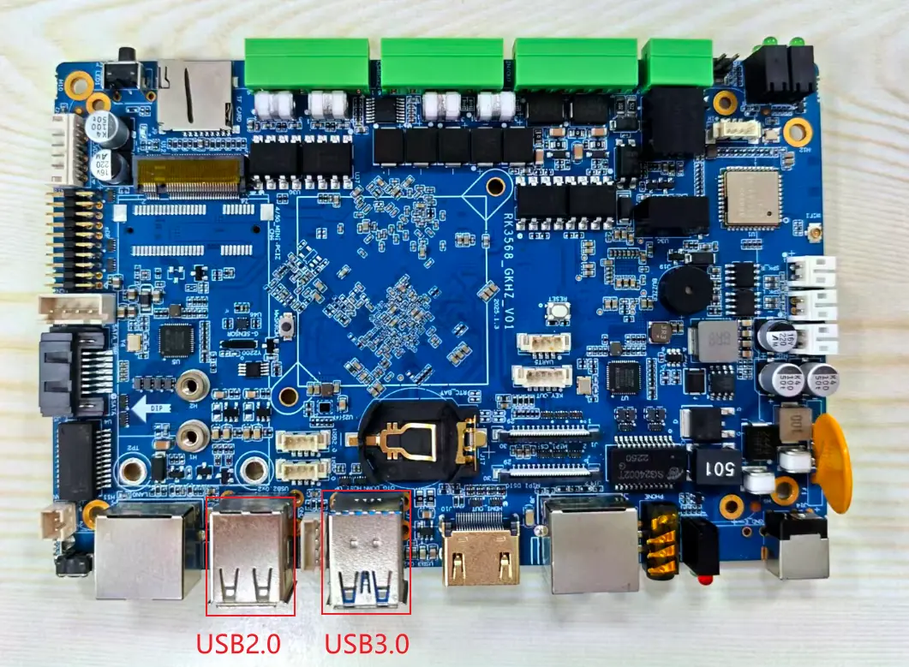

测试方法：

1. 插入鼠标或键盘，确认系统可正常识别并使用。
2. 接入 HDMI 显示器后，移动鼠标，确认屏幕中的鼠标指针可正常跟随移动。

### 5. RTC

RTC 电池接口位置如下图所示。


测试方法一：

1. 确认已连接 RTC 电池。
2. 连接网络进行时间同步。
3. 断开 Wi-Fi 与网线。
4. 关机等待几分钟。
5. 再次开机，确认系统时间是否保持准确。

测试方法二：

```shell
hwclock
```

多次执行后，观察时间是否正常递增。


### 6. 网络连接

#### 6.1 Wi-Fi

外接 HDMI 显示器进入 Ubuntu桌面后，可在系统设置中连接 Wi-Fi。


也可以使用命令行：

```shell
# 查看 Wi-Fi 列表
nmcli device wifi list

# 重新扫描 Wi-Fi
nmcli device wifi rescan
```

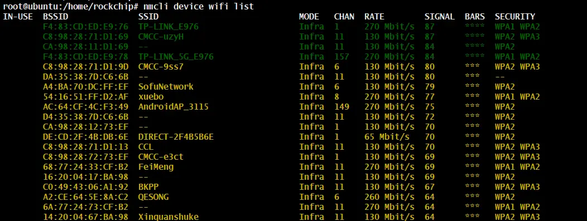

连接 Wi-Fi 并查看状态：

```shell
nmcli device wifi connect "<SSID>" password "<密码>"
nmcli device status
```


获取 IP：

```shell
ifconfig
```

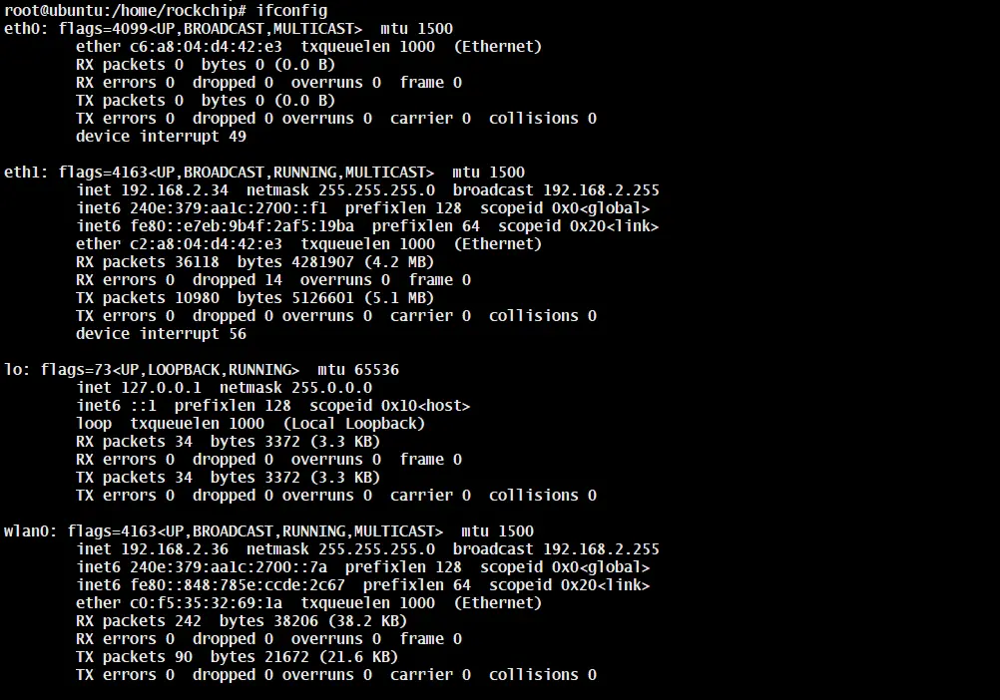

#### 6.2 以太网

接入网线后，可在 Ubuntu桌面设置中查看 Network 状态和 IP 地址。

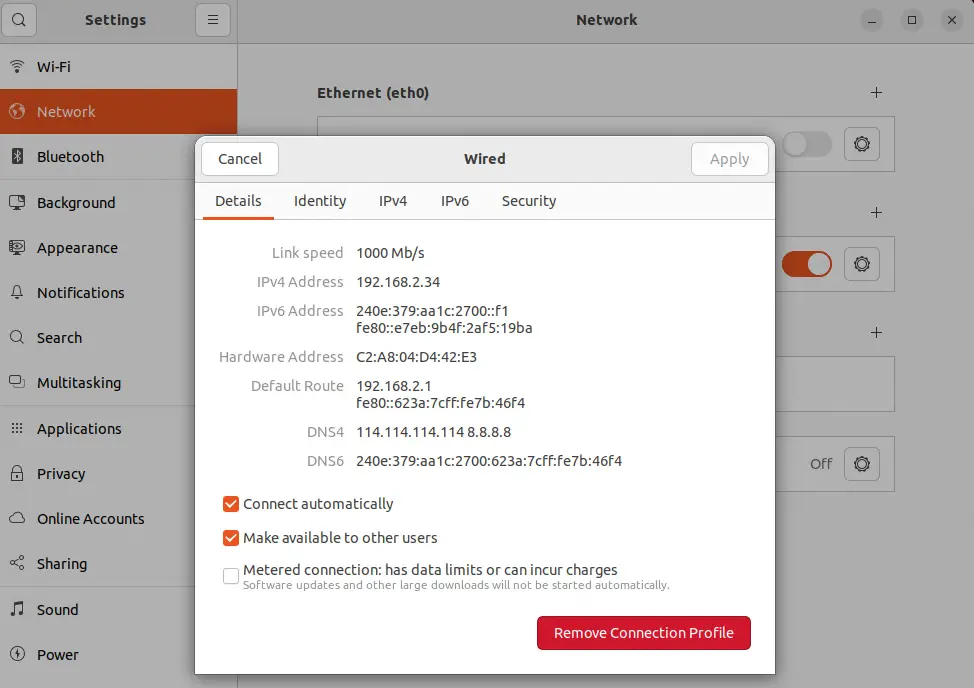

也可以使用命令查看：

```shell
ifconfig
```


### 7. SATA

#### 7.1 硬件连接

SATA 接口连接方式如下图所示。


#### 7.2 测试方法

进入 OpenEuler 桌面文件管理器，查看是否识别到额外硬盘。

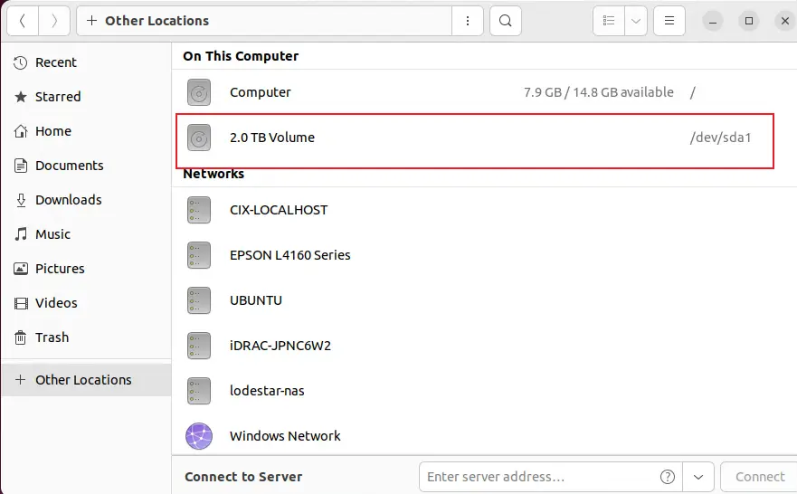

也可以使用命令查看：

```shell
lsblk
```


### 8. CAN

#### 8.1 硬件连接

CAN 接口连接方式如下图所示。

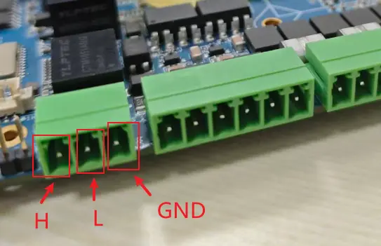

#### 8.2 收发测试

主机端或 CAN 分析仪端配置波特率为 `250000`。


RK3568 端配置 CAN：

```shell
ip link set can0 down
ip link set can0 type can bitrate 250000
ip link set can0 up
```

3568 侧使用命令进行发送和接收：

```shell
# 发送数据
./cansend can0 123#1122334455667788

# 接收数据
./candump can0
```


### 9. 蜂鸣器

使用方法：

```shell
#开启蜂鸣器
echo "1" > /sys/devices/platform/gpios/Buzzer 
#关闭蜂鸣器
echo "0" > /sys/devices/platform/gpios/Buzzer 
```

### 10. 4G

#### 11.1 硬件连接

4G 模块安装位置如下图所示。安装模块和 SIM 卡前，请先断电。


#### 11.2 测试方法

装上 4G 模块并插入 SIM 卡后，等待系统识别并自动获取 IP。


使用 `ping` 命令验证网络连通性。


### 11. camera

#### 11.1 硬件连接

MIPI Camera 接口位置如下图所示。

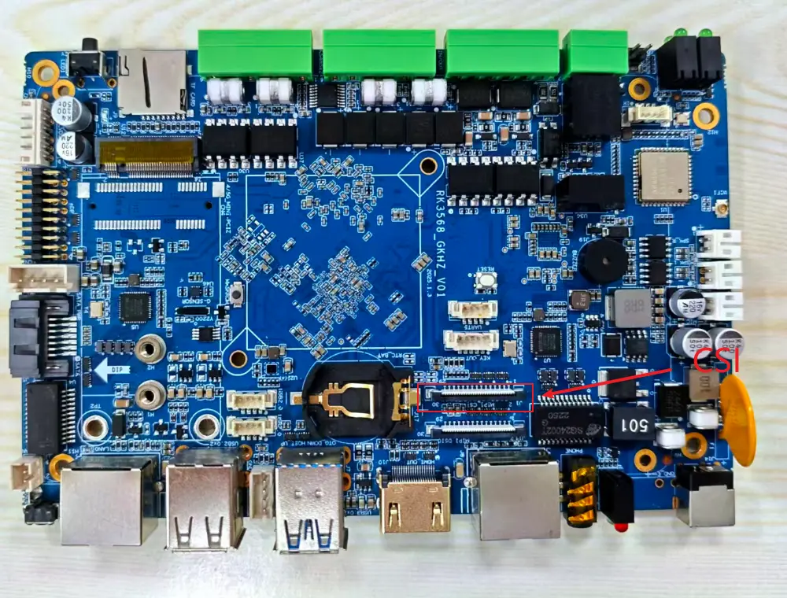

摄像头模组示例：


连接方式如下图所示。

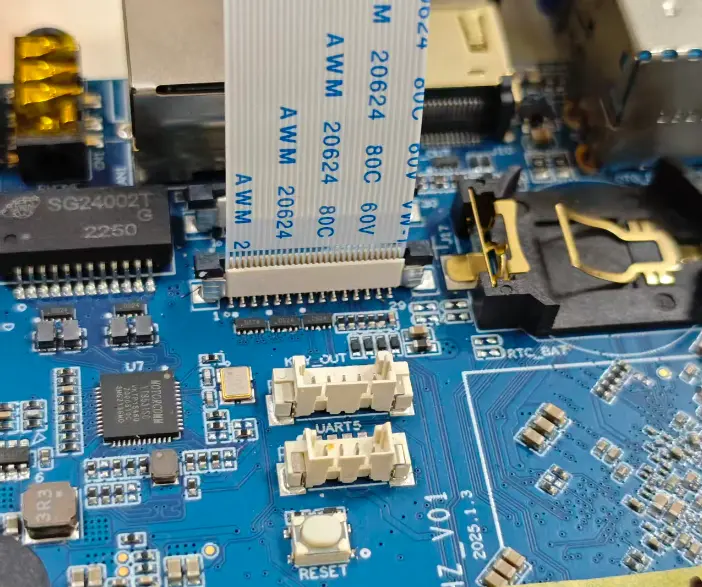

#### 11.2 查看设备节点

查看摄像头设备：

```shell
v4l2-ctl --list-devices
```

找到 `rkisp_mainpath` 对应的视频节点。示例中使用 CSI 时，Camera 节点为 `/dev/video0`。

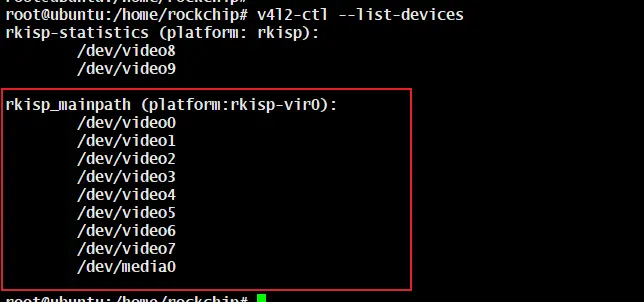

#### 11.3 gstream 测试摄像头

打开摄像头预览：

```shell
gst-launch-1.0 v4l2src device=/dev/video0 ! video/x-raw,format=NV12,width=1920,height=1080 ! videoconvert ! autovideosink
```

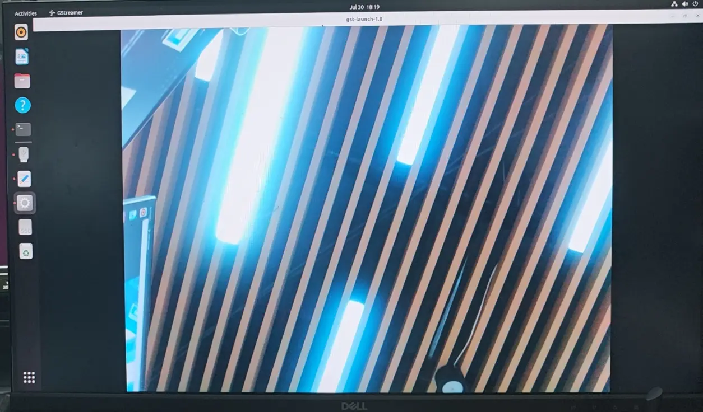

## 四、常见问题

### FAQs

Todo

&gt; 可通过beiqi@beiqicloud.com联系我们!
