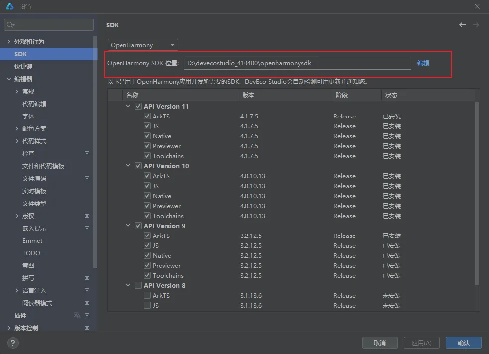
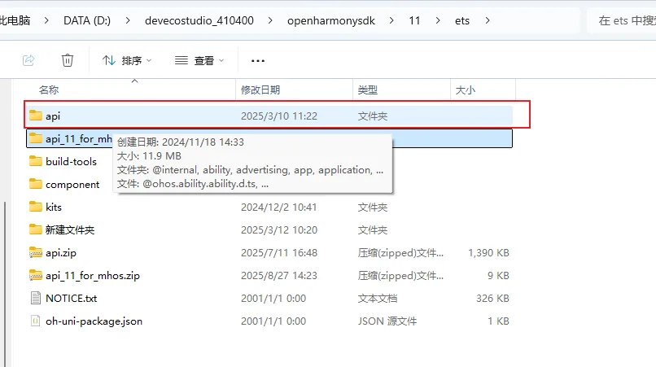

# 三、Mineharmony

### 矿鸿api添加步骤

- 确认openharmonySDK存放路径,打开DevEco Studio4.1--&gt;设置-&gt;

设置 X
Qr SDK ←
〉外观和行为 OpenHarmonySDK快捷键 OpenHarmony SDK位置: D:\devecostudio_410400\openharmonysdk 编辑
√编辑器 以下是用于OpenHarmony应用开发所需要的SDK。DevEco Studio会自动检测可用更新并通知您。&gt;常规 名称 版本 阶段 状态代码编辑 vAPI Version 11字体 √ ArkTS 4.1.7.5 Release 已安装〉配色方案 4.1.7.5 Release 已安装&gt;代码样式 Nervier 4.7.5 Releasse 已安装检查 回 √Toolchains 4,1.7.5 Release 已安装文件和代码模板 API Version 10文件编码 实时模板 回 ArkTS Nstive 4.0.10.13 4.0.10.13 Release Release 已安装 已安装文件类型 √ Previewer 4.0.10.13 Release 已安装&gt;版权 回 √Toolchains 4.0.10.13 Release 已安装嵌入摄示 回 API Version 9ArkTS 3.2.12.5 Release 已安装Emmet JS 3.2.12.5 Release 已安装TODO Native 3.2.12.5 Release 已安装意图 Previewer 3.2.12.5 Release 已安装拼写 回 Toolchains 3.2.12.5 Release 已安装〉语言注入 回 ]API Version 8 ]ArkTS 3.1.13.6 Release 未安装阅读器模式 回 JS 3.1.13.6 Release 未安装插件 刘回

把解压出来的ts文件拷贝到api目录下

比电脑 &gt; DATA(D:) &gt; devecostudio_410400 &gt; openharmonysdk &gt; 11 &gt; ets &gt; 在ets 中搜排序 三查看 ...名称 入 修改日期 类型 大小api 2025/3/10 11:22 文件夹api_11 for _mh创建日期: 2024/11/18 14:33build-toolscomponent 文件:@ohos.abilty,ability.d.ts.kits 2024/12/2 10:41 文件夹新建文件夹 2025/3/12 10:20 文件夹api.zip 2025/7/11 16:48 压缩(zipped)文件.. 1,390 KBapi_11_for_mhos.zip 2025/8/27 14:23 压缩(zipped)文件.. 9 KBNOTICE.txt 2001/1/1 0:00 文本文档 326KBoh-uni-packagejson 2001/1/1 0:00 JSON源文件 1KB

进入api目录,device-define目录下

添加一下SystemCapability.Hcp

D:&gt; devecostudio_410400 &gt;openharmonysdk &gt; 11 &gt; ets &gt; api &gt;device-define &gt; &#123;&#125;defaultjson &gt;... 2 "SysCaps": create 211 "SystemCapability. BundleManager . BundleFramework. Launcher" 212 "SystemCapability. BundleManager. BundleFramework. SandboxApp", 213 "SystemCapability. BundleManager. BundleFramework. QuickFix", 214 "SystemCapability. BundleManager. BundleFramework.AppControl" 215 "SystemCapability.Ability.AbilityRuntime.QuickFix", 216 "SystemCapability.Graphic.Graphic2D.ColorManager.Core" 217 "SystemCapability. ResourceSchedule. BackgroundTaskManager. EfficiencyResourcesApply'" 218 "SystemCapability.Msdp.DeviceStatus .Stationary", 219 "SystemCapability.XTS.DeviceAttest", 220 "SystemCapability. Request.FileTransferAgent", 221 "SystemCapability.ResourceSchedule. DeviceStandby", 222 "SystemCapability.DistributedDataManager.UDMF.Core" 223 "SystemCapability.Print.PrintFramework", 224 "SystemCapability.Multimedia.Media.AVScreenCapture" 225 "SystemCapability.AI. IntelligentVoice.Core" 226 "SystemCapability.Multimedia.Media.SoundPool", 227 "SystemCapability.Multimedia.Audio.Spatialization" 228 "SystemCapability.Multimedia.AudioHaptic.Core", 229 "SystemCapability.ArkUi.Graphics3D",
• 230 "SystemCapability.AI.MindSporeLite",
3 231 "SystemCapability. Graphics. Drawing 232 "SystemCapability.Hcp" 233 234 235
