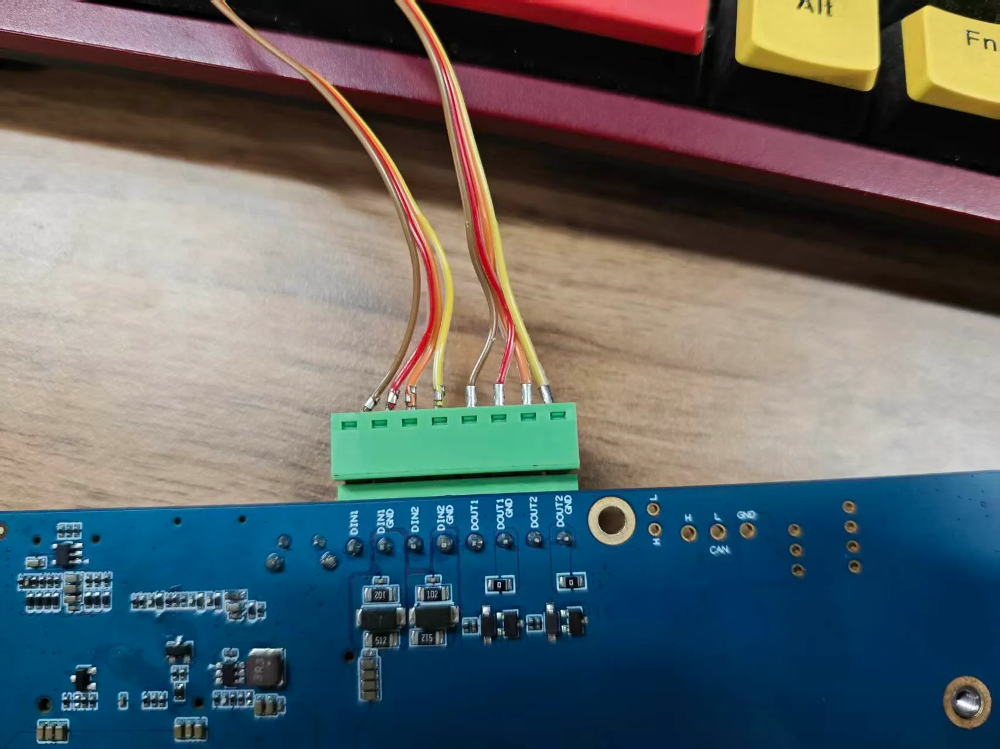
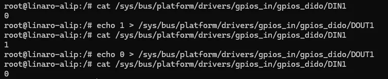
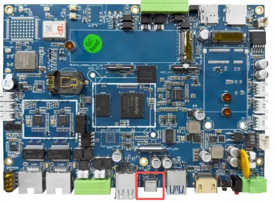
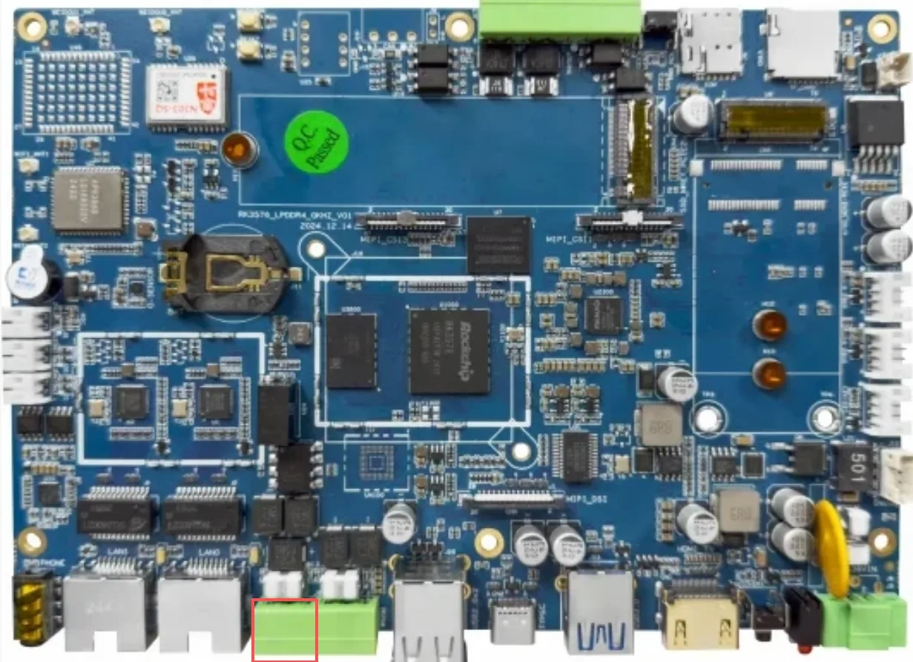
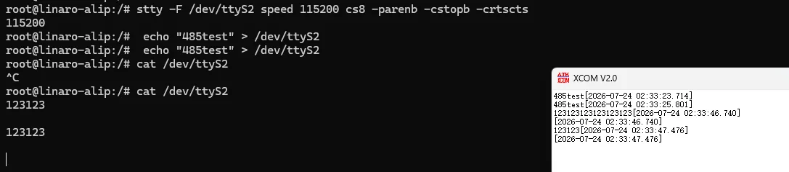
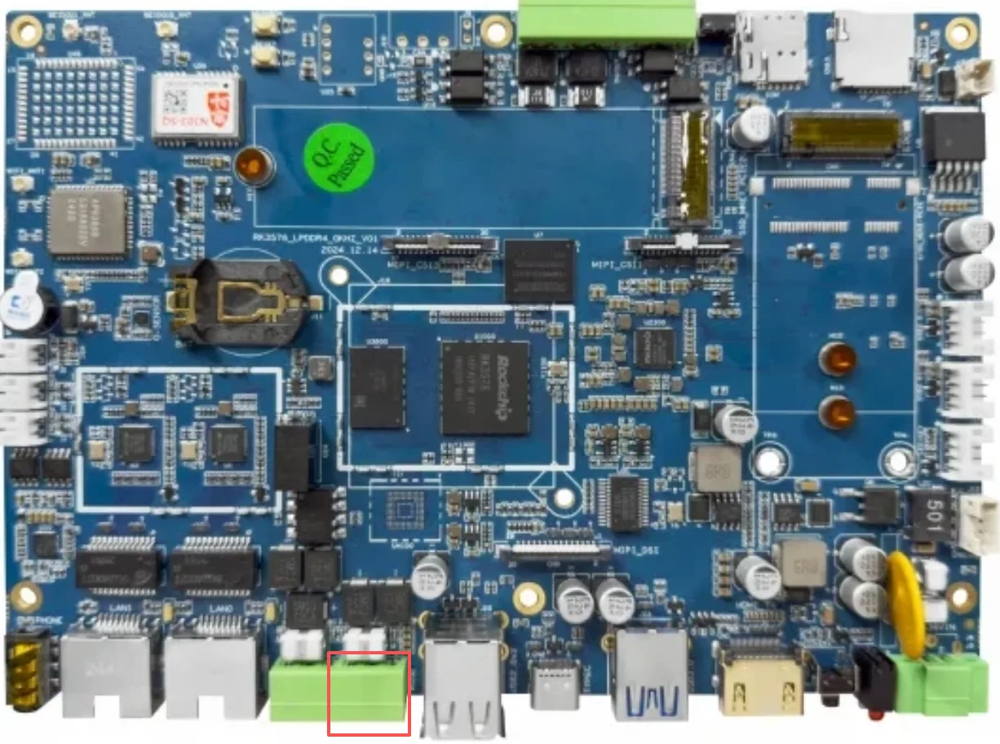

# 三、设备接口使用说明

### 1.DI\DO



接线方式参照上图，此处是将 DI1与 DO1，DI2 与 DO2 进行连接测试，可以使用凤凰头，也可以选择使用杜邦线直接进行连接，测试命令如下

```
cat /sys/bus/platform/drivers/gpios_in/gpios_dido/DIN1 #查看 DI1 的状态
echo 1/0 > /sys/bus/platform/drivers/gpios_in/gpios_dido/DOUT1 #拉高或拉低 DO1
#测试 DI2 与 DO2，将上述命令中 DIN1 修改 DIN2，DOUT1 修改为 DOUT2 即可
```

测试结果如下



### 2.type-c



接口位置如上图，用户可以使用 typc-c 转 usb-a 线缆将主板与 pc 进行连接，连接后，可以使用 adb 命令进入主板终端来进行操作

### 3.rs485



接口位置如上图，线序可在主板背面查看


```
#rs485 串口设备为 /dev/ttyS2
stty -F /dev/ttyS2 speed 115200 cs8 -parenb -cstopb -crtscts #设置波特率 115200 8位数据为 1位停止位 无校验
```

xcom 设置如下图所示


收发测试结果如下



### 4.rs232



接口位置如上图，线序可在主板背面查看


```
#rs485 串口设备为 /dev/ttyS5
stty -F /dev/ttyS5 speed 115200 cs8 -parenb -cstopb -crtscts #设置波特率 115200 8位数据为 1位停止位 无校验
```

xcom 设置如下图所示


收发测试结果如下


