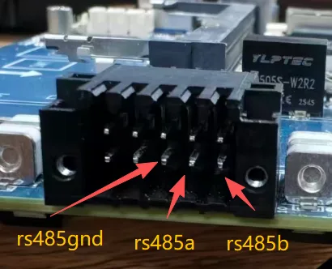
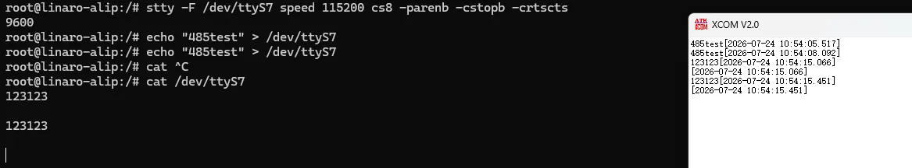
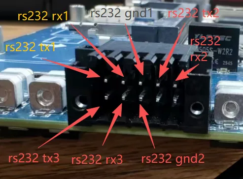
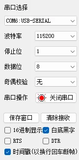
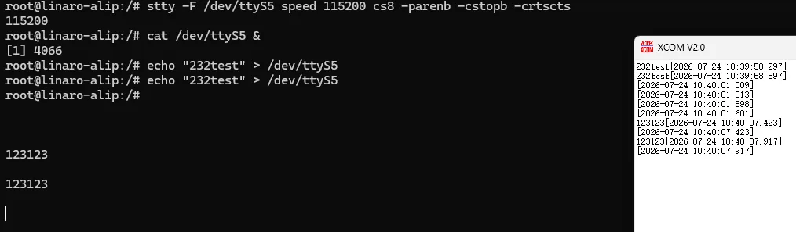

# 二、设备接口使用说明

### 1.rs485



主板有一个 rs485 串口，引脚如上图所示，从左到右分别 GND、A、B，测试时使用 485 转 usb 线缆进行连接，测试命令如下

```
#rs485 串口设备为 /dev/ttyS7
stty -F /dev/ttyS7 speed 115200 cs8 -parenb -cstopb -crtscts #设置波特率 115200 8位数据为 1位停止位 无校验
```

xcom 设置如下图所示


收发测试结果如下



### 2.rs232



主板上有三个 rs232 串口，引脚如上图所示，第一排五个引脚从左到右分别为 TX1、RX1、GND1、TX2、RX2，第二排的三个引脚从左到右分别为 TX3、RX3、GND2，其中 GND1 为 rs232 串口1 与 rs232 串口2 共用地脚，GND2 为 rs232 串口3 与前文提到的 rs485 串口共用地脚。测试时可以使用杜邦线将同一个 rs232 串口 TX 与 RX 进行短接，使用自发自收的方式进行测试，或者使用 232 转 usb 线缆进行测试，这里以 232 转 usb 举例说明，命令如下

```
# rs232rx1 rs232tx1 rs232gnd1 可以构成一个 rs232 串口，串口设备为/dev/ttyS5
# rs232rx2 rs232tx2 rs232gnd1 可以构成一个 rs232 串口，串口设备为/dev/ttyS0
# rs232rx3 rs232tx3 rs232gnd2 可以构成一个 rs232 串口，串口设备为/dev/ttyS9
#下列命令以 ttyS5 为例，其他 rk232 串口修改串口设备即可
stty -F /dev/ttyS5 speed 115200 cs8 -parenb -cstopb -crtscts #设置波特率 115200 8位数据为 1位停止位 无校验
```

xcom 设置如下图所示



收发测试结果如下



### 3.type-c


接口位置如上图，用户可以使用 typc-c 转 usb-a 线缆将主板与 pc 进行连接，连接后，可以使用 adb 命令进入主板终端来进行操作
