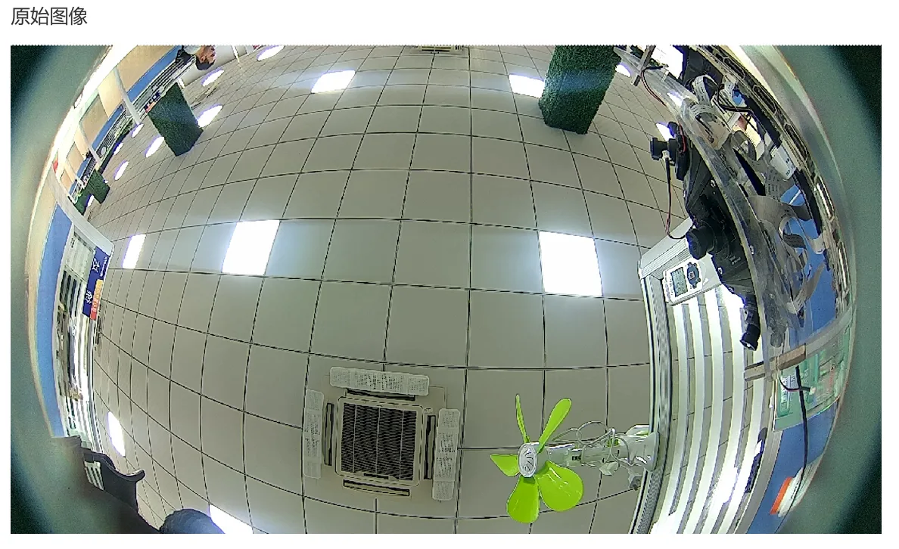
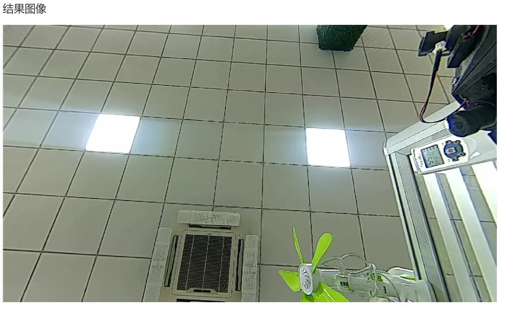

# 三、设备相关例程

设备相关例程见[贝启Robo3588机器人开发板主板linux系统相关例程](https://pan.baidu.com/s/1D6BgLyk7vCmJz5V3RMj1JQ?pwd=hume )。

链接包含如下 demo

-    rk1828 demo
-    机器人算法库 demo

客户可以通过这两个 demo 快速熟悉贝启Robo3588机器人开发板主板关于 rk1828 和 机器人相关算法的能力

### 1. rk1828 demo使用说明

本目录下包含两个文件，如下所示

rknn3-Qwen2.5-demo.tar.gz	rk1828 上的 Qwen2.5 例程，包含 C 语言部署源码、python 模型转换相关脚本、以及转换好的 Qwen2.5 rknn3 模型等

web.tar.gz   				     rk1828 上的 web 例程，可以配合 Qwen2.5 的例程实现类似豆包等其他

#### a) rknn3-Qwen2.5-demo 说明

解压命令如下

```
tar zxvf rknn3-Qwen2.5-demo.tar.gz
```

编译

```
./build-buildroot.sh
```

编译产物在 install/rk3588_linux_aarch64/rknn_Qwen2_5_demo 目录下，该目录为编译后生成

运行方式如下

```
./rknn_qwen2_5_demo model/Qwen2.5-3B-Instruct.rknn model/Qwen2.5-3B-Instruct.weight model/Qwen2.5-3B-Instruct.tokenizer.gguf model/Qwen2.5-3B-Instruct.embed.bin 0xff "prompt"
注：最后一个参数 "prompt" 为大模型的输入，可以是 "who are u" 等其他 “prompt”
```


demo 运行时，可使用如下命令查看 rk1828 温度、cpu 使用率、npu 使用率等信息

```
rknn-smi info
```

#### b) web demo 说明

解压命令如下

```
tar zxvf web.tar.gz
```

环境安装

```
./install.sh all
注：如果出现无法安装的情况，可以尝试如下源
deb https://mirrors.aliyun.com/debian/ bullseye main contrib non-free
deb https://mirrors.aliyun.com/debian-security/ bullseye-security main contrib non-free
deb https://mirrors.aliyun.com/debian/ bullseye-updates main contrib non-free

pip install openai -i https://pypi.tuna.tsinghua.edu.cn/simple
```

运行

```
python3 app.py
```

访问 http://IP:5000/ 即可访问网页

注：需要将 qwen2.5 的模型放在 /userdata/models/Common 下

### 2. 机器人算法库 demo使用说明

#### a）IDC demo

IDC是基于 GPU 的图像几何校正加速算法，实现图像重映射功能，可用于视频防抖、畸变校正、全景拼 接等视觉应用。

demo 编译步骤如下

-   解压源码包，上传到贝启Robo3588机器人开发板主板

-   在源码根目录执行

```
gcc -o demo/rkalg_idc_lut_demo demo/src/rkalg_idc_lut_demo.cpp -Iinclude  Llib/gcc-linaro-6.3.1-2017.05-aarch64 -lrkalg_idc -lm -ldl
```

测试结果如下





#### b）PCL demo

demo 编译运行步骤如下

-   解压源码包，上传到贝启Robo3588机器人开发板主板

-   修改工具链，使用板子自带的 gcc 和 g+


-   最后在源码根目录执行

```
./build.sh
```

 PCL demo 包含如下 demo

-   rkPCL_common
    -   输入：随机生成的点数
    -   输出：最大和最小的数据点
    -   随机生成10个云数据点，在其中找出最大和最小的
-   rkPCL_features
    -   输入step：用于控制角度步长（用于控制计算惯性矩时的角度步长）
    -   法线估计和边界估计，并通过惯性矩计算进一步分析了点云的几何特征
-   rkPCL_filter
    -   输入：数据集地址（需要修改源码对于名称索引）
    -   输出：
        -   Final all mean time: 所有步骤总的平均时间。
        -   Final all mean1 time: 第一步处理的平均时间（如滤波时间）。
        -   Final all mean2 time: 第二步处理的平均时间（如半径离群点去除时间）。
        -   Final all mean3 time: 第三步处理的平均时间（如统计离群点去除时间）。
        -   Final all mean4 time: 第四步处理的平均时间（如欧几里得聚类时间）
    -   云数据进行筛选
-   rkPCL_registration
    -   输入：无
    -   输出：利用 ICP（迭代最近点算法） 对点云进行对齐，并通过不同的变换矩阵输出计算结果。
-   rkPCL_search
    -   基于半径的邻域搜索操作，目标是找到每个点周围的20个最近邻点。程序输出了每个邻近点的3D坐标 和与查询点的距离平方。这种操作通常用于点云处理中的点匹配、配准或者在特定区域内查找相关点。
    -   输入：无
    -   输出：输出的数据主要包含 查询点的邻域信息，包括 点的三维坐标 和 距离，对于点云处理或三维数据 分析有很大的帮助。
-   rkPCL_segmentation
    -   输入：xyzi紧凑排列的云数据
    -   输出：输入的点云数据包数量、聚类数量、聚类包含的点
