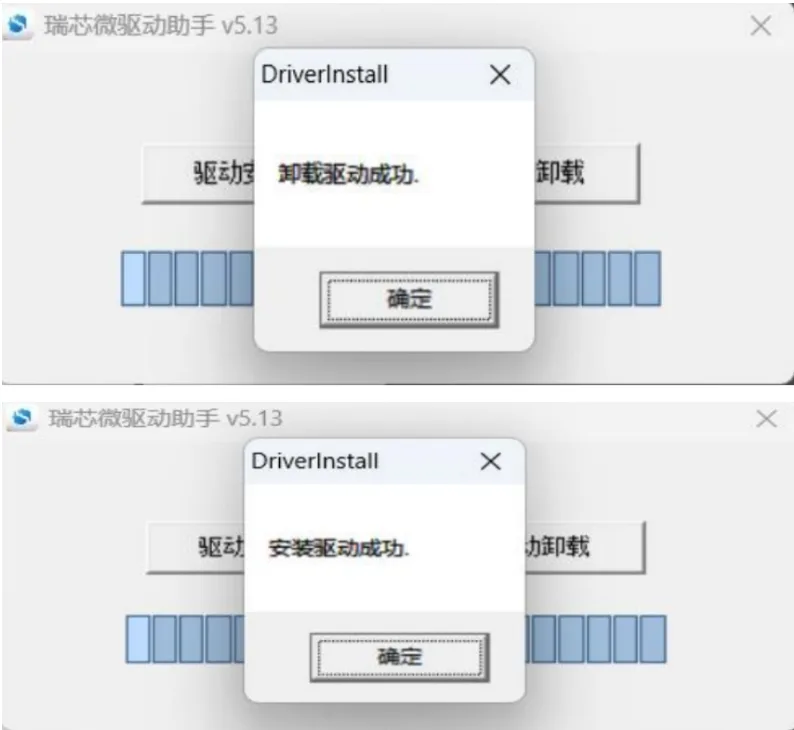
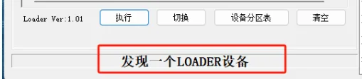
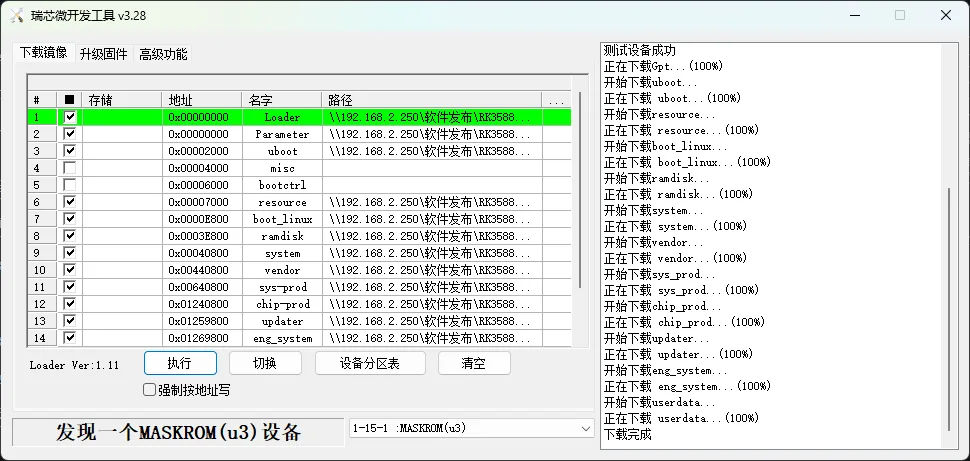

# 五、编译调试

**1、编译**

在Linux环境进行如下操作:

1） 进入源码根目录，执行如下命令进行版本编译。

./build.sh -p robo3588 开始编译

2） 检查编译结果。编译完成后，log中显示如下：

```
post_process

=====build robo3588 successful.

2025-12-04 10:11:11
```

编译所生成的文件都归档在out/robo3588/目录下，结果镜像输出在out/robo3588/packages/phone/images/ 目录下。

3） 编译源码完成，请进行镜像烧录。

**2、烧录工具**

烧写工具下载及使用。

工具路径：robo3588/tools/RKDevTool_v3.28_for_window.zip

烧录说明文档见RKDevTool_v3.28_for_window.zip的 “开发工具使用文档_v1.0.pdf“

**3、硬件清单**

- 贝启Robo3588机器人主板
- 12V DC电源
- USB Type-A 转 Type-C 数据线
- 串口小板

**4、PC环境配置**

我们会提供驱动安装包以及烧录工具包、以及烧录固件

下载方式：联系我们公司客服获取

下载完成后解压。

1） ADB工具安装

hdc的工具在bin目录下，打开系统设置环境变量到该目录即可使用hdc工具。


2） RockChip烧录驱动安装


为避免驱动安装出现问题，请先点击驱动卸载，再点击驱动安装，驱动成功安装后，如下所示



3） RockChip烧录软件安装

解压后直接运行即可（最好解压到全英文路径下面）


**5、固件烧录**

使用USB Type-A 转 Type-C 数据线连接设备OTG口和PC的USB口


如何进入烧写模式(Loader)

1. 按住设备的 recovery 键不要松开，然后按一下 reset 键系统复位，大约两秒后松开 recovery 键。
2. 连接完成OTG口后，上电设备，在PC的powershell输入 hdc shell 进入到设备终端，执行`reboot loader`命令

这时候进入到烧录工具可以看到下面这个现象



导入配置


导入完成后需要根据列出的项名字选择对应的img文件

例如


选择完成后勾选点击执行岂可。


