# 六、基础功能验证

### 6.1 USB功能测试


接上鼠标/键盘/U盘等常见usb设备能够正常使用

### 6.2 usb-otg

执行wim+r 输入cmd 打开终端，输入adb shell可以进入

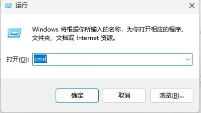


### 6.4 BUZZER

进入hdc shell 界面(或者串口界面)执行以下命令可以实现蜂鸣器的开关
```
echo 0 > /sys/devices/platform/leds/leds/buzzer_gpio/brightness (关闭)
echo 0 > /sys/devices/platform/leds/leds/buzzer_gpio/brightness (开启)
```

### 6.5 hdmi-out

接hdmi外接屏，屏幕正常显示

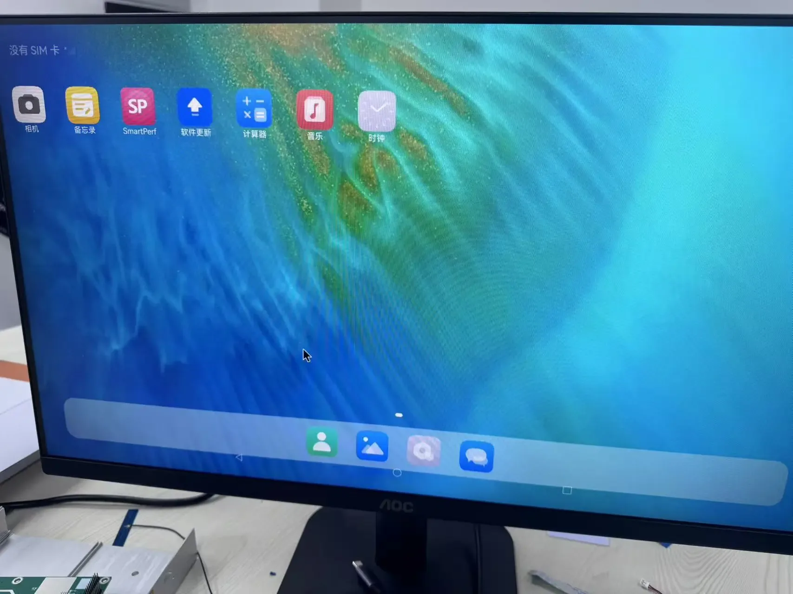


### 6.6 有线网络

设备连接网线，进入hdc shell 界面(或者串口界面)执行以下命令可以看到ip，通过ping baidu.com 能够正常联网

```
ifconfig
ping baidu.com
```


### 6.7 CPU-FAN

接上风扇外设，能够正常转动

### 6.8 RTC

进入hdc shell 界面(或者串口界面)执行以下命令可以看到rtc时间

```
hwclock
```


### 6.9 485

设备通过485串口和上位机进行通信设备，对应的串口是/dev/ttyS7

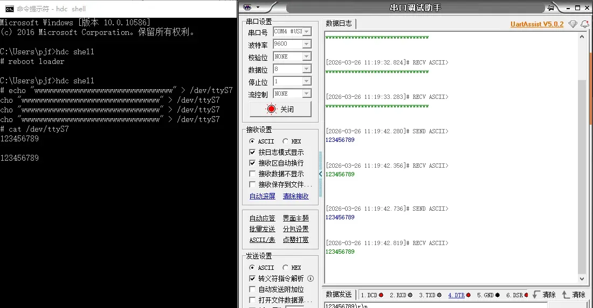

### 6.10 232

设备通过232串口和上位机进行通信设备，对应的串口是/dev/ttyS0、/dev/ttyS5、/dev/ttyS9


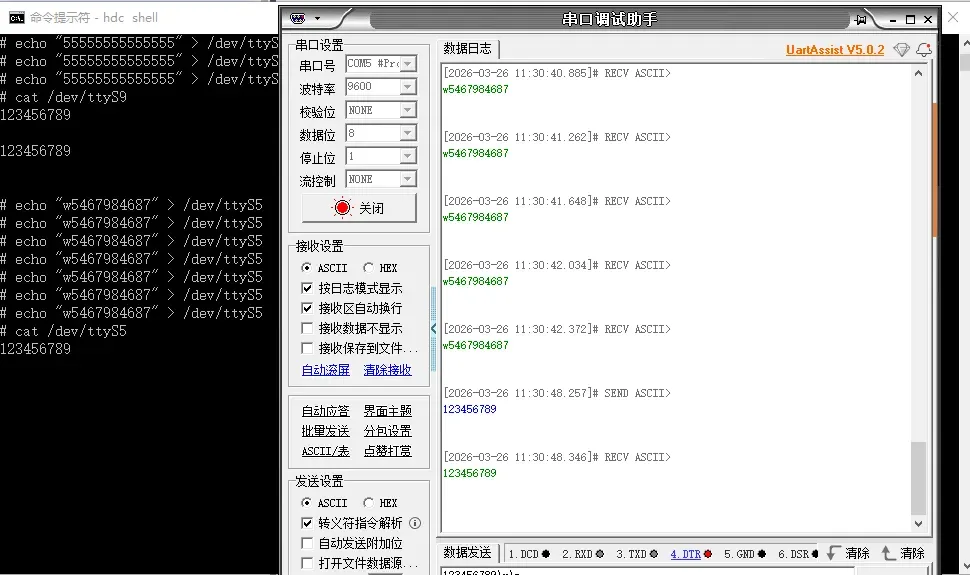
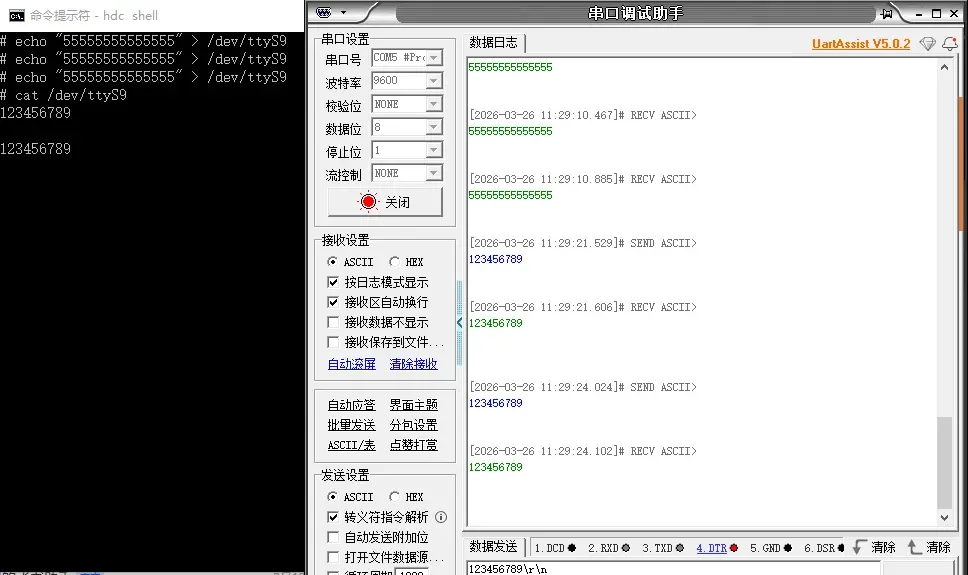

### 6.11 wifi

在桌面打开设置，选择第一个点击进入WLAN进入选择所需网络连接，能够正常上网

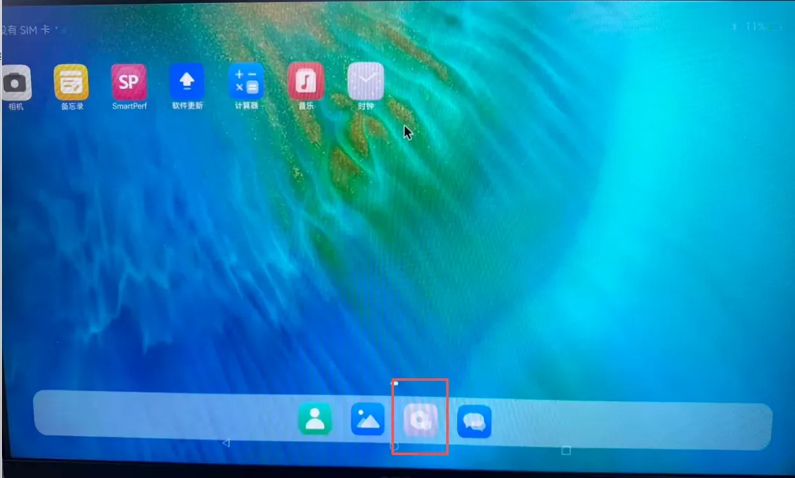
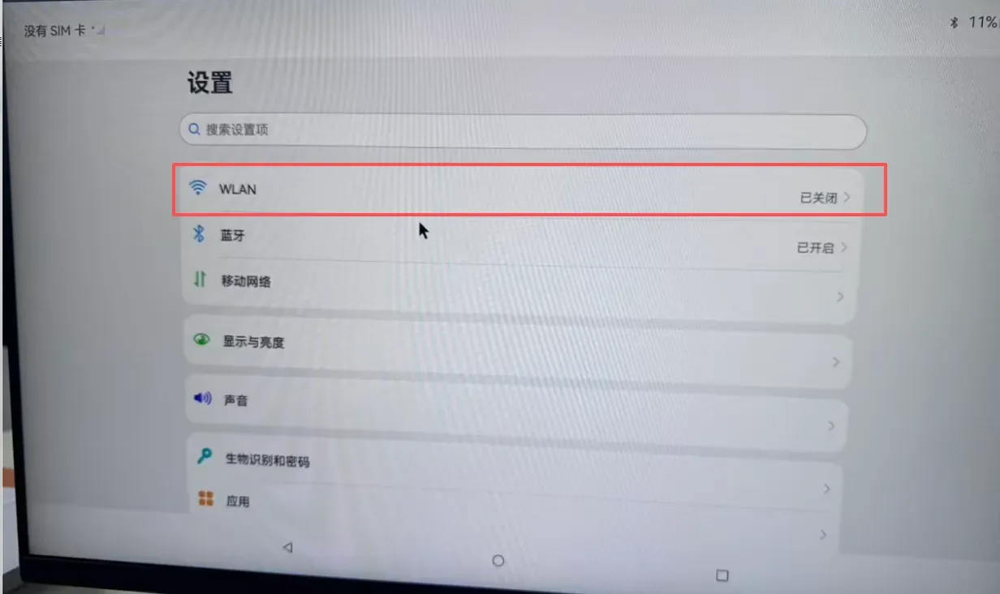
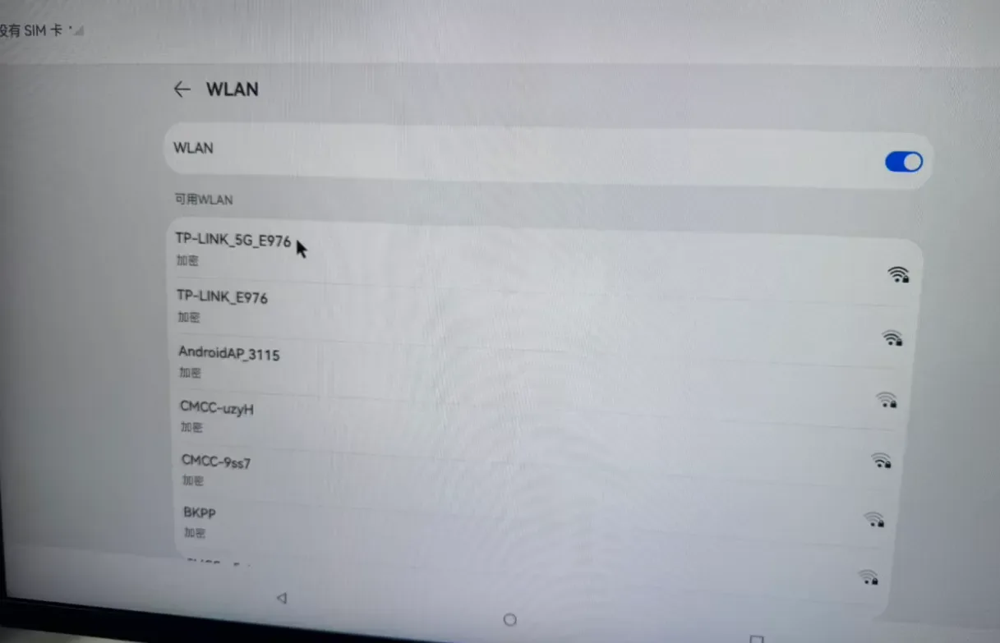

### 6.12 bluetooth

在桌面打开设置，选择第二个蓝牙点击进入选择连接对应蓝牙设备，能够正常使用


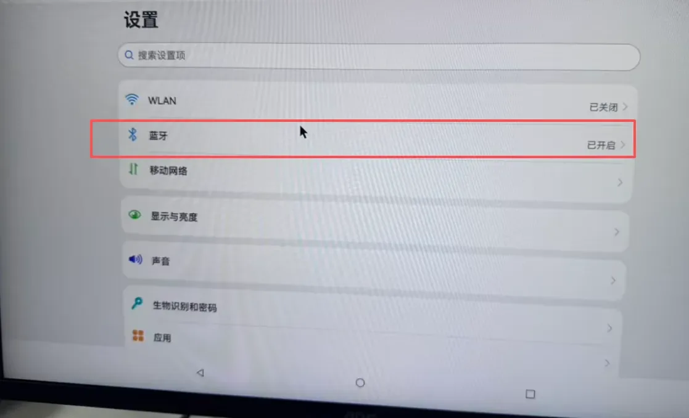
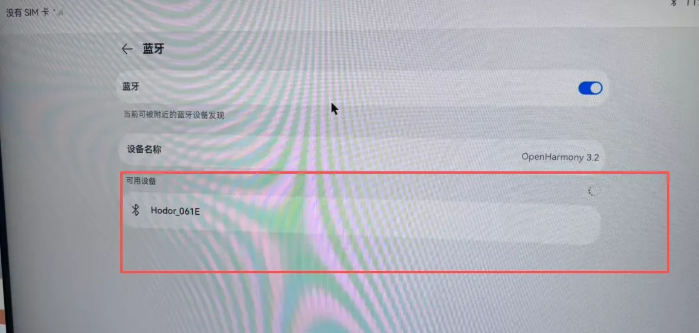

### 6.13 nvme

设备接上nvme外设，在/dev/block下面能够识别到，并且通过mount，能够实现对nvme的读写

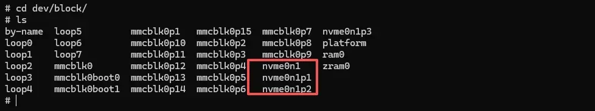

挂载和卸载命令

```
# cd dev/block/
# ls
by-name  loop5         mmcblk0p1   mmcblk0p15  mmcblk0p7  nvme0n1p3
loop0    loop6         mmcblk0p10  mmcblk0p2   mmcblk0p8  platform
loop1    loop7         mmcblk0p11  mmcblk0p3   mmcblk0p9  ram0
loop2    mmcblk0       mmcblk0p12  mmcblk0p4   nvme0n1    zram0
loop3    mmcblk0boot0  mmcblk0p13  mmcblk0p5   nvme0n1p1
loop4    mmcblk0boot1  mmcblk0p14  mmcblk0p6   nvme0n1p2
# mkdir test
#mount nvme0n1p1 test
# ls test/
EFI                           SKY1-EVB-PCIEX11.DTB
GRUB                          SKY1-EVB-PCIEX2.DTB
IMAGE                         SKY1-EVB-PCIEX4.DTB
ROOTFS.CPIO.GZ                SKY1-EVB-PCIEX8.DTB
SKY1-BATURA.DTB               SKY1-EVB-PCIE_WIDTH_X1.DTB
SKY1-CLOUDBOOK.DTB            SKY1-EVB-PCIE_WIDTH_X2.DTB
SKY1-CRB.DTB                  SKY1-EVB-PCIE_WIDTH_X4.DTB
SKY1-EMU-PM.DTB               SKY1-EVB-SOF-ALC5682-ALC1019.DTB
SKY1-EMU-SMP.DTB              SKY1-EVB-USB4_5.DTB
SKY1-EMU.DTB                  SKY1-EVB.DTB
SKY1-EVB-DISPLAY.DTB          SKY1-FPGA.DTB
SKY1-EVB-HDA-ALC256.DTB       SKY1-ORANGEPI-6-PLUS-40PIN-PWM.DTB
SKY1-EVB-ISO.DTB              SKY1-ORANGEPI-6-PLUS-40PIN.DTB
SKY1-EVB-ISP.DTB              SKY1-ORANGEPI-6-PLUS.DTB
SKY1-EVB-LT7911UXC-AUDIO.DTB  SKY1-ORION-O6-40PIN.DTB
SKY1-EVB-NPU-RESMEM.DTB       SKY1-ORION-O6.DTB
SKY1-EVB-PCIEX10.DTB          initrd.img-6.6.89-cix-build-generic
# umount test
```

### 6.14 NPU

设备接上RK1828外设，执行lspci能够识别设备

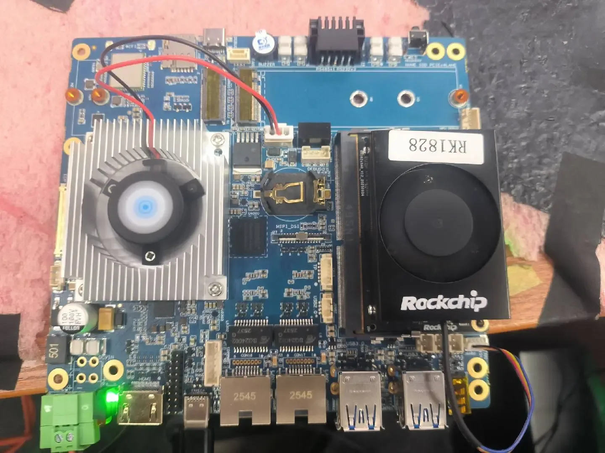


### 6.15 NPU-Fan

设备接上风扇能够正常运行

### 6.16 npu 代码测试

进入hdc shell 执行下列测试命令

```
vendor/bin/rknn_yolov5_deme
```


### 6.17 Audio

设备接上耳机或喇叭，点击桌面音乐图标播放音乐能够正常放声

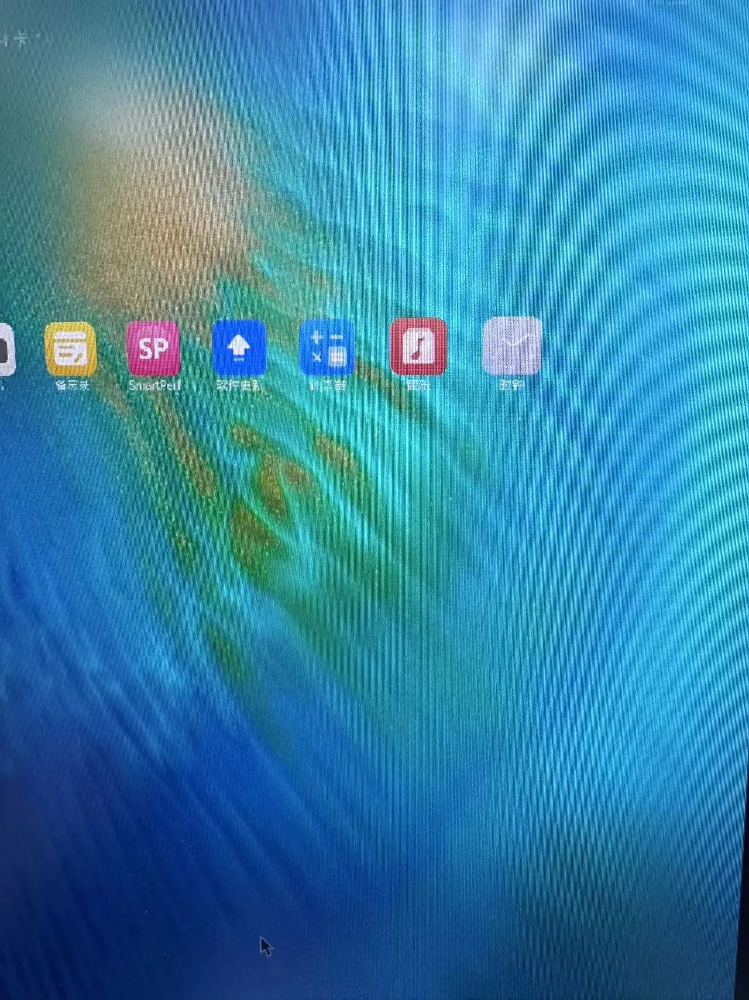

通过命令安装对应测试hap，点击录音，录音文件能够正常播放

```
hdc install C:\Users\19037\Desktop\recorder.hap
```
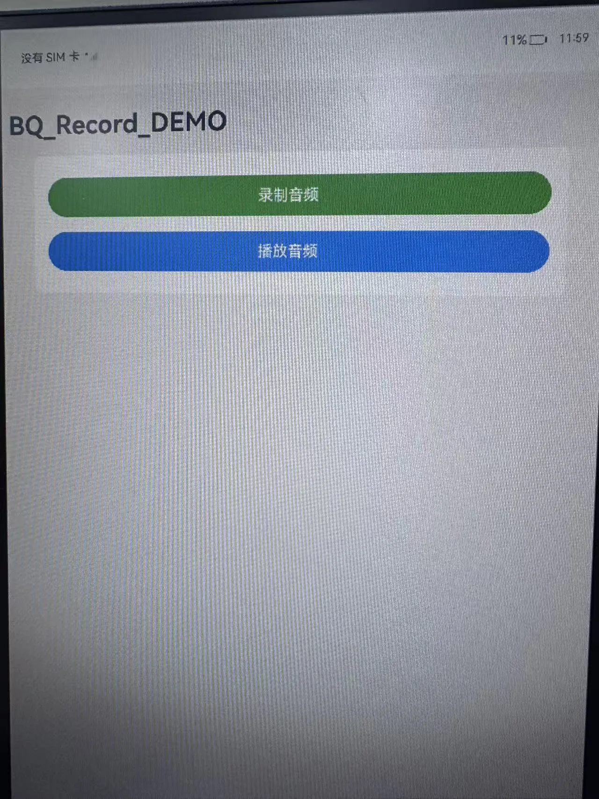
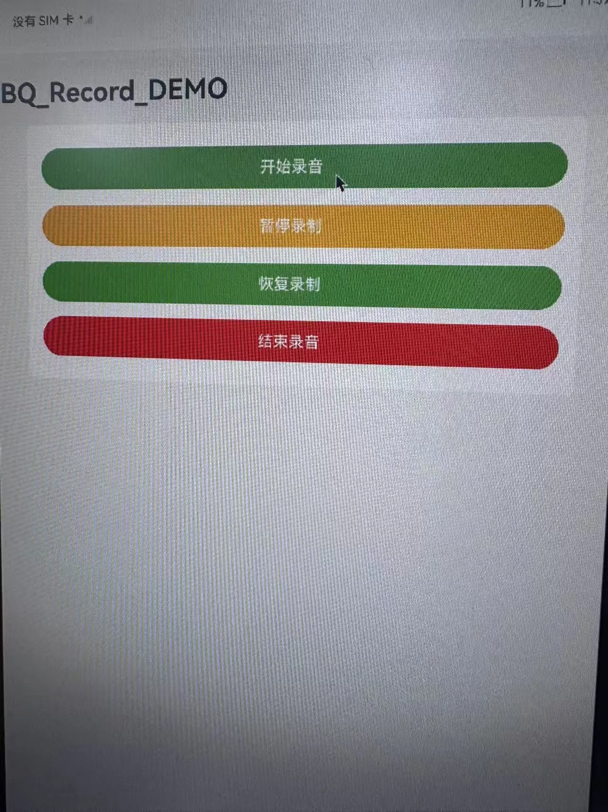

