# 第三章 RK3576 平台界面功能使用及测试

### 3.1 桌面功能测试
测试步骤：

1. 上电后，给数据网关插上HDMI线外接屏幕

开发板启动后，进入系统桌面。可通过桌面图标和系统应用检查基础显示、触控或鼠标操作是否正常。

测试重点：

- 桌面是否正常显示；
- 应用图标是否正常加载；
- HDMI屏幕触摸操作是否正常；
- 应用是否能够正常打开;

开发板启动桌面显示如下：

***

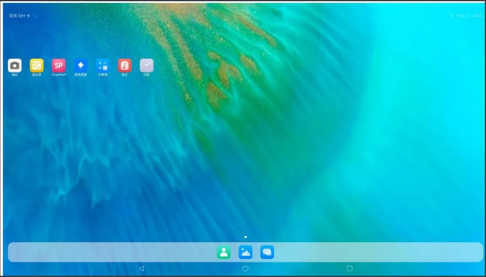

***

### 3.2 WIFI 测试
> 说明：由于网络环境不同，进行 Wi-Fi 测试时需要根据实际网络情况进行设置。用户也可以使用手机热点进行测试。

测试步骤：

1. 打开系统 **设置**；

2. 进入 **WLAN**；

3. 打开 WLAN 开关；

4. 查看是否能够扫描到 Wi-Fi 设备；

5. 选择目标 Wi-Fi；

6. 输入密码并点击连接；

   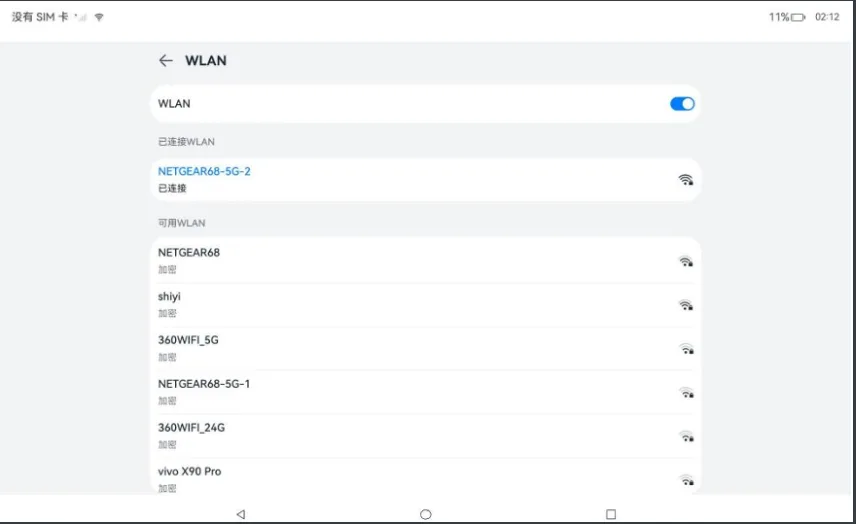

7. 连接成功后，打开命令行窗口hdc shell 进入Openharmony系统后，进入系统后可使用如下命令查看网络信息：

   ```bash
   # ifconfig
   wlan0 	Linkencap:Ethernet HWaddrc0:f5:35:32:68:da Driverbcmsdh_sdmmc
           inetaddr:192.168.0.132 Bcast:192.168.0.255 Mask:255.255.255.0
           inet6addr: fe80::c2f5:35ff:fe32:68da/64Scope:Link
           UPBROADCASTRUNNINGMULTICAST MTU:1500 Metric:1
           RXpackets:411errors:0dropped:0overruns:0frame:0
           TXpackets:172errors:0dropped:0overruns:0carrier:0
           collisions:0txqueuelen:1000
   ```

***

### 3.3 网口测试
1. 开发板网口插上以太网；

2. 打开cmd 命令窗口 ，输入 hdc shell 进入系统

3. 使用命令查看网络信息：

   ```bash
   #ifconfig
   eth0 	Linkencap:Ethernet HWaddraa:78:e9:09:aa:c4 Driverrk_gmac-dwmac
           inetaddr:192.168.0.133 Bcast:192.168.0.255 Mask:255.255.255.0
           inet6addr: fe80::a878:e9ff:fe09:aac4/64Scope:Link
           UPBROADCASTRUNNINGMULTICAST MTU:1500 Metric:1
           RXpackets:59errors:0dropped:0overruns:0frame:0
           TXpackets:47errors:0dropped:0overruns:0carrier:0
           collisions:0txqueuelen:1000
   ```

网络连通性测试：

```bash
ping qq.com -c 3
```

测试结果：

```text
PING qq.com(123.150.76.218)56(84) bytes of data.64 bytes from 123.150.76.218(123.150.76.218): icmp_seq=1ttl=53 time=43.8ms64 bytes from 123.150.76.218(123.150.76.218): icmp_seq=2ttl=53 time=42.4ms64 bytes from 123.150.76.218(123.150.76.218): icmp_seq=3ttl=53 time=48.7ms---qq.compingstatistics--3 packets transmitted,3received,0%packet loss, time 3005ms
```

如果出现 `0% packet loss`，说明网络通信正常。LAN1测试步骤一致，不再重复。

***

### 3.4 系统信息查询
查看内核和 CPU 信息，输入如下命令：

```shell
# uname -a
```

示例输出：

```text
Linux localhost 6.6.22 #1 SMP Tue Nov 11 15:14:30 CST 2025 aarch64
```

查看环境变量信息：

```shell
# env
```

示例输出：

```text
_=/bin/envHOME=/
PULSE_STATE_PATH=/data/data/.pulse_dir/state
rcu_nocbs=all
UV_THREADPOOL_SIZE=16
TMP=/data/local/mtp_tmp/
PULSE_RUNTIME_PATH=/data/data/.pulse_dir/runtime
TERM=linux
default_boot_device=2a330000.mmc
normal_no_read_back=0
TMPDIR=/data/local/tmp
PATH=/usr/local/bin:/bin:/usr/bin
hardware=rk3568
UBSAN_OPTIONS=print_stacktrace=1:print_module_map=2:log_exe_name=1
DOWNLOAD_CACHE=/data/cache
OHOS_SOCKET_hdcd=11
```

***

### 3.5 RTC测试
```shell
# hwclock
```

```text
Fri Nov 7 06:25:59 2025 0.000000 seconds
```

***

### 3.6 UART 485测试
#### 3.6.1 准备工具和环境
测试前需要准备：

- 485 、232串口连接工具；
- PC端串口助手；

> 说明：也可以使用资料中的 `demo -> bq_uart` 应用进行测试。应用使用说明位于网盘资料的 `demo` 文件夹下。

串口硬件接口介绍：

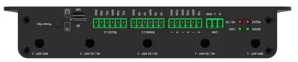

测试工具介绍：

1. 485串口测试工具

   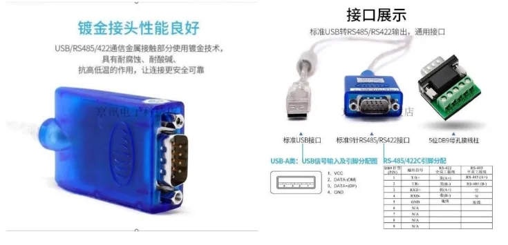

2. 232串口测试工具

   

3. PC端串口助手

   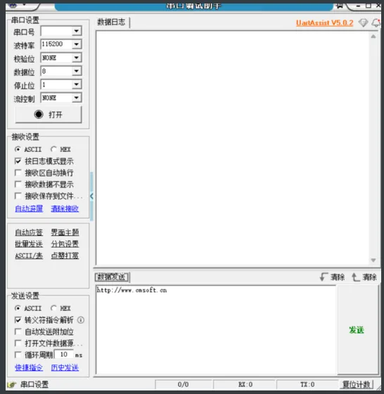

   

***

#### 3.6.2 RS485_UART3发送测试
UART_RS485接口图：

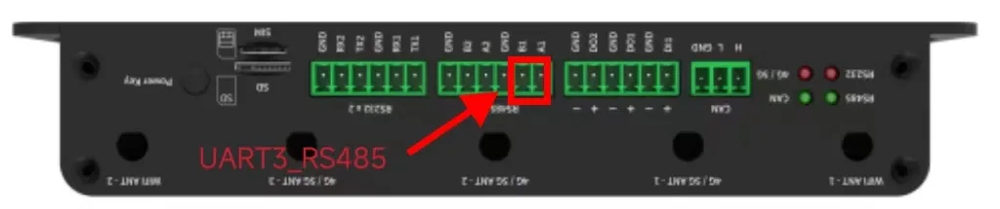

```shell
# microcom -s 115200 /dev/ttyS3
```

输入命令后，在命令行下方输入数据即可。串口助手这边接收到数据。

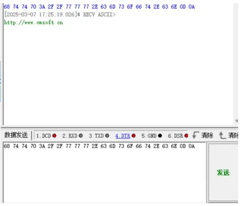

#### 3.6.3 RS485_UART3接收测试
```shell
# microcom -s 115200 /dev/ttyS3
```

串口助手发送数据后，终端这边接收到数据。


***

#### 3.6.4 RS485_UART4发送测试
UART4_RS485接口图：

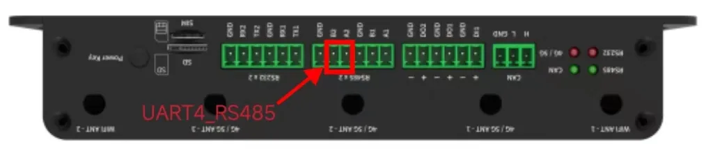

```shell
# microcom -s 115200 /dev/ttyS4
```

输入命令后，在命令行下方输入数据即可。串口助手这边接收到数据。


#### 3.6.5 RS485_UART4接收测试
```shell
# microcom -s 115200 /dev/ttyS4
```

串口助手发送数据后，终端这边接收到数据。

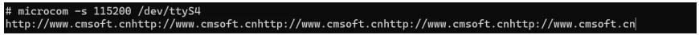

***


### 3.7 UART 232 测试
#### 3.7.1 准备工具和环境
1. 232串口测试工具

   

   针脚定义

   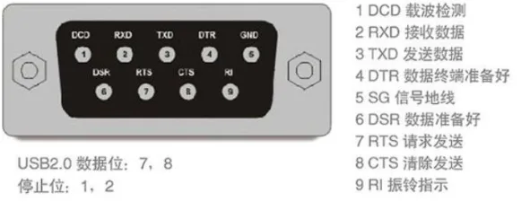

2. PC端串口助手

   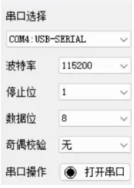

***

#### 3.7.2 RS232_UART7发送测试
UART7_RS232接口图：

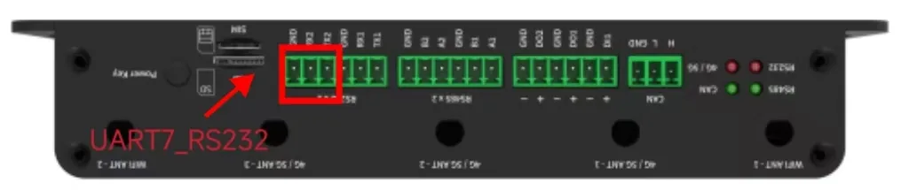

```shell
# microcom -s 115200 /dev/ttyS7
```

输入命令后，在命令行下方输入 `beiqi`，串口助手这边接收到数据。

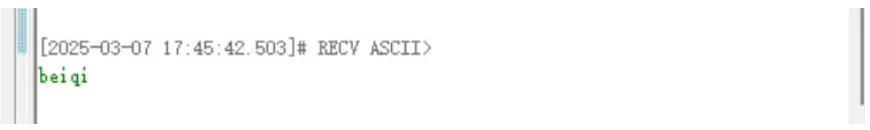

***

#### 3.7.3 RS232_UART7接收测试
```shell
# microcom -s 115200 /dev/ttyS7
```

串口助手发送数据后，终端这边接收到数据。


***

#### 3.7.4 RS232_UART9发送测试
UART9_RS232接口图：

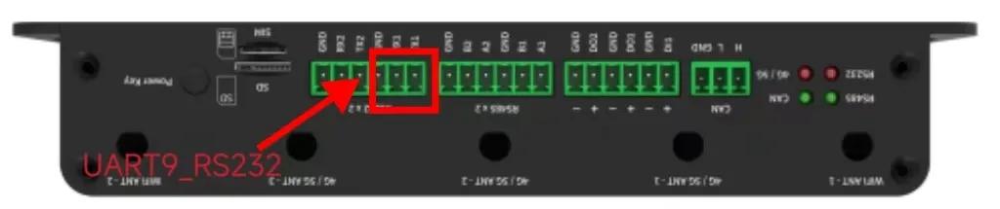

```shell
# microcom -s 115200 /dev/ttyS9
```

输入命令后，在命令行下方输入 `beiqi`，串口助手这边接收到数据。


***

#### 3.7.5 RS232_UART9接收测试
```shell
# microcom -s 115200 /dev/ttyS9
```

串口助手发送数据后，终端这边接收到数据。

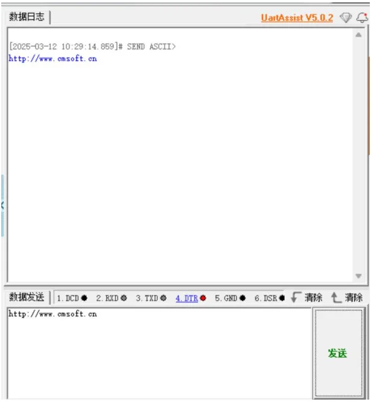

***


***

### 3.8 USB鼠标测试
将 USB 鼠标接入开发板 USB 接口，使用鼠标进行点击测试。

测试判断：

- 鼠标能够正常移动；
- 点击无误触；
- 坐标位置正确；
- 桌面或应用能够正常响应。

满足以上条件，说明 USB 鼠标功能正常。

如图所示：

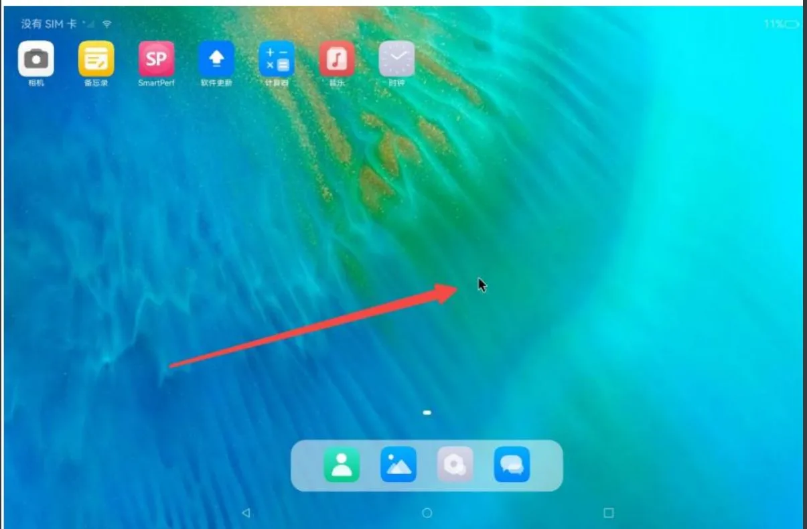

***

### 3.9 USB测试
USB 端口可连接以下设备进行测试：

- USB 鼠标；
- USB 键盘；
- U 盘；
- 其他 USB 外设。

测试重点：

- 插入设备后是否能识别；
- 鼠标、键盘是否能正常操作；
- U 盘是否能正常识别；
- 是否支持热插拔。

插入设备后测试正常即可。

***

### 3.10 蓝牙测试
测试步骤：

1. 确认蓝牙天线已正确连接；

2. 打开系统 **设置**；

3. 进入 **蓝牙**；

4. 打开蓝牙开关；

5. 点击扫描；

6. 选择目标蓝牙设备；

7. 点击连接；

8. 确认连接成功。

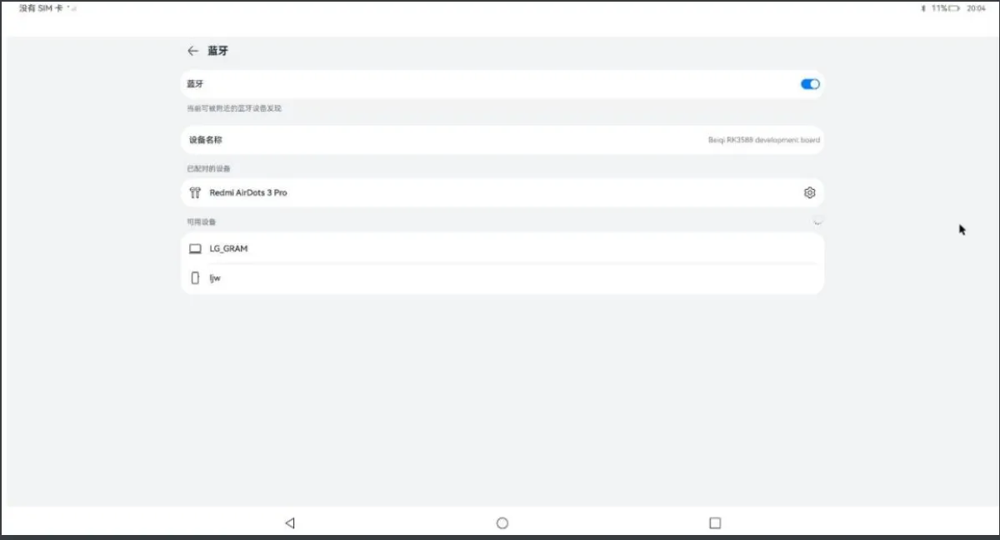

测试判断：

- 能扫描到蓝牙设备；
- 能够正常连接；
- 连接状态显示正常。
- 打开音乐应用播放音频，通过已连接的蓝牙耳机确认声音输出是否正常。

***

### 3.11 耳机测试
测试步骤：

1. 找到开发板上丝印标识为 `PHONE` 的接口；

   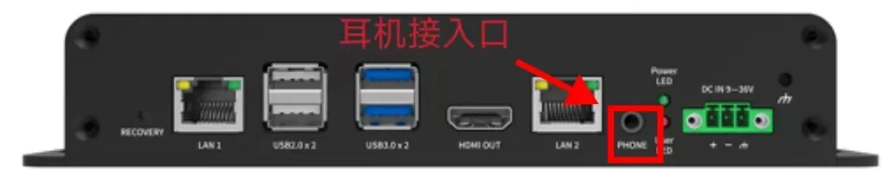

2. 插入耳机；

3. 打开桌面音乐播放器；

   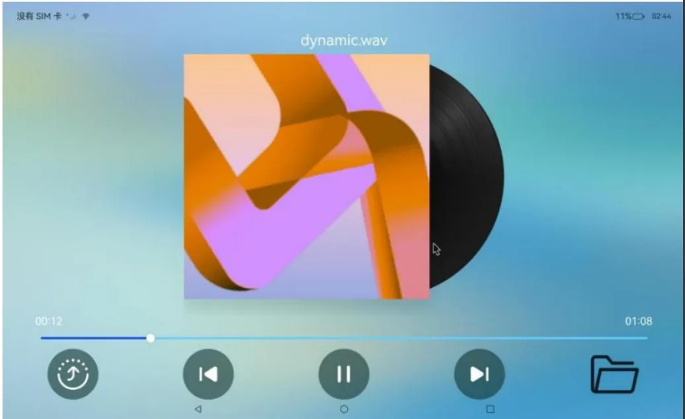

4. 点击播放音乐；

5. 确认耳机是否有声音输出。

测试判断：

- 耳机有声音输出，说明耳机接口功能正常；
- 如果无声音，需要检查耳机、音量、播放器以及接口接触情况。

***
