# 二、 烧录系统

RK3588 目前支持 **OTG 烧写方式**。用户资料中提供了相应的烧写工具。

### 2.1 准备工作：安装相关驱动

驱动工具路径：

```text
5-工具\DriverAssitant_v5.13.zip
```

操作步骤：

1. 将 `DriverAssitant_v5.13.zip` 解压到任意目录；
2. 以管理员权限运行 `DriverInstall.exe`；
3. 为避免驱动安装异常，建议先点击 **驱动卸载**；
4. 再点击 **驱动安装**；
5. 出现安装成功提示后，表示驱动安装完成。

> 注意：驱动安装需要管理员权限。

---

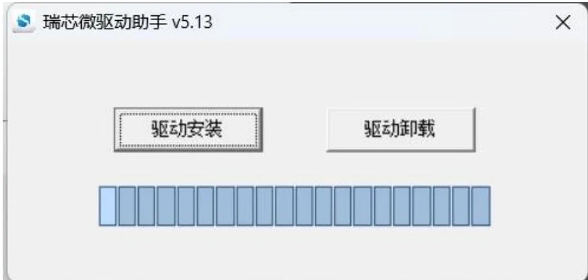

### 2.2 烧录操作：烧写固件到设备

固件和烧写工具：

```text
固件：由贝启提供
烧写工具：RKDevTool_Release.zip
```

RKDevTool 是瑞芯微提供的开发工具。使用前建议将工具解压到**全英文路径**下。

烧写前准备：

1. 使用 Type-C 线连接开发板 `	TYPE-C` 口和电脑主机；

   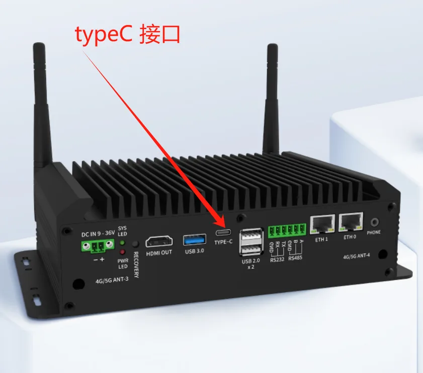

2. 按住开发板上的 `recovery` 键不要松开；

   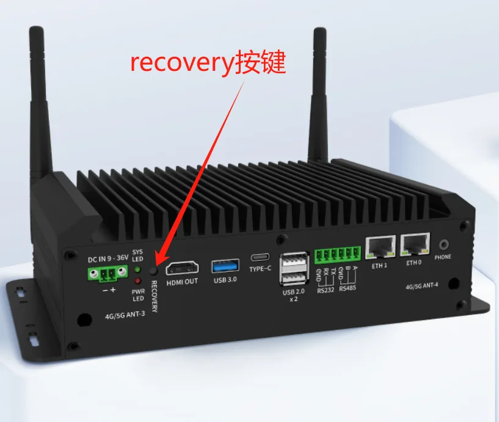

3. 接上电源适配器，开发板上电；

   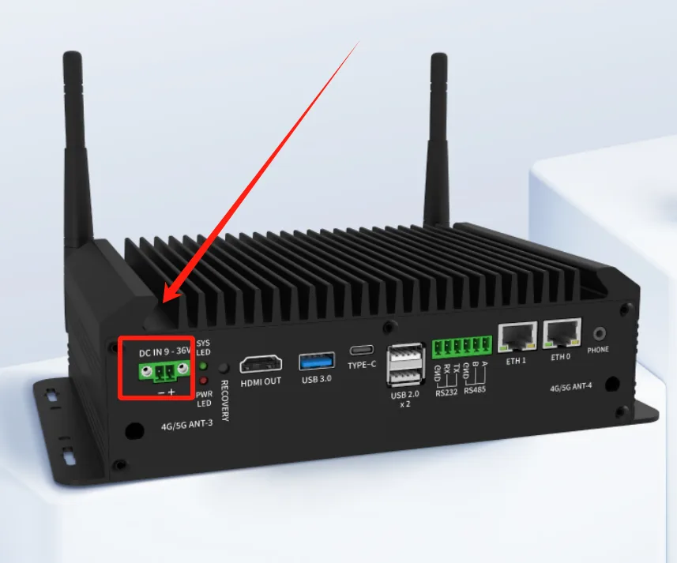

4. RKDevTool 工具上会提示发现 `LOADER` 设备或 `MASKROM` 设备，再松开 `	recovery`按键。

> 注意：识别设备时，开发板上电过程中需要保持 `recovery` 按键按下状态。

> 注意：理论上 RKDevTool 解压目录可以随意，但如果工具打开后界面异常，建议将其解压到全英文目录下。

烧写步骤：

1. 打开 RKDevTool；

2. 确认工具显示：`发现一个 LOADER 设备` 或 `发现一个 MASKROM 设备`；

3. 清空工具所有项

   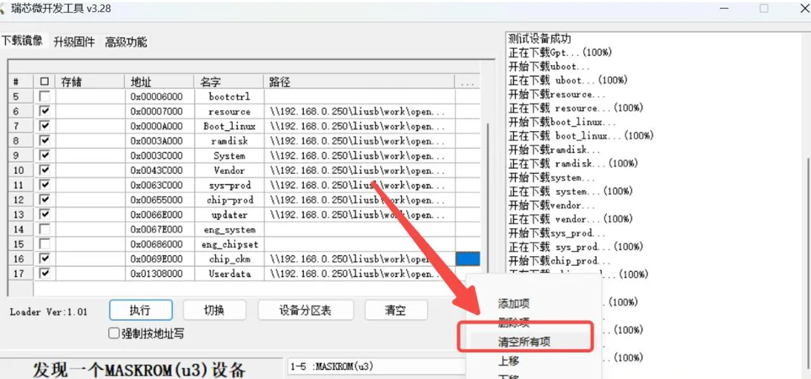

4. 清空完成后，点击 **导入配置**；

   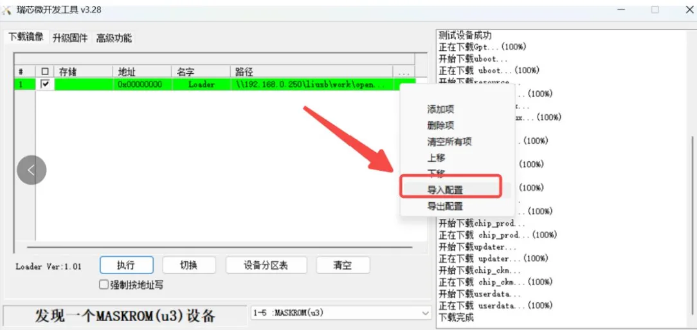

5. 选择镜像目录下的 `config.cfg` 文件；

   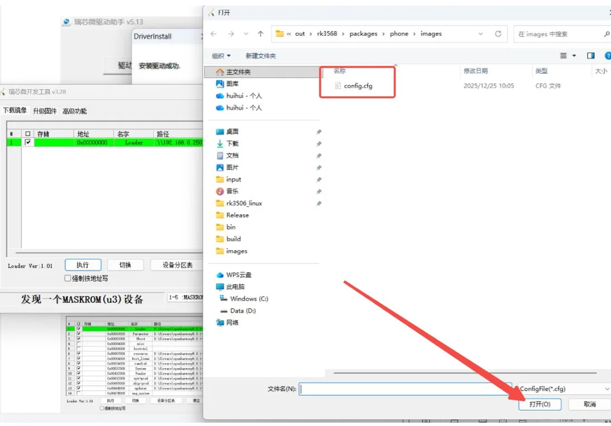

   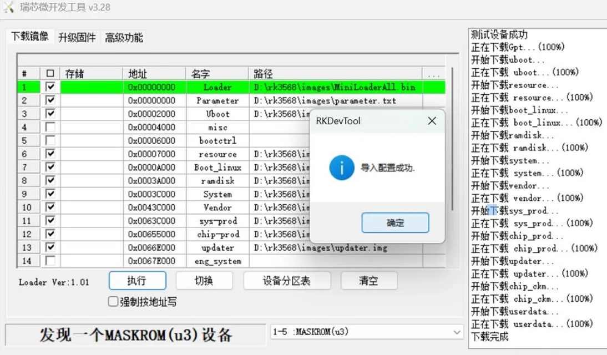

6. 依次选择工具所勾选的镜像文件；

   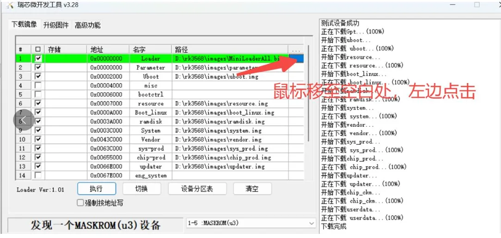

   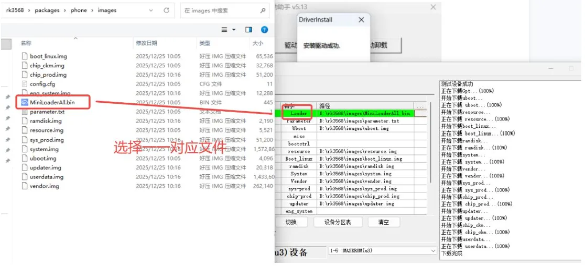

7. 点击 **执行** 按钮开始升级。

   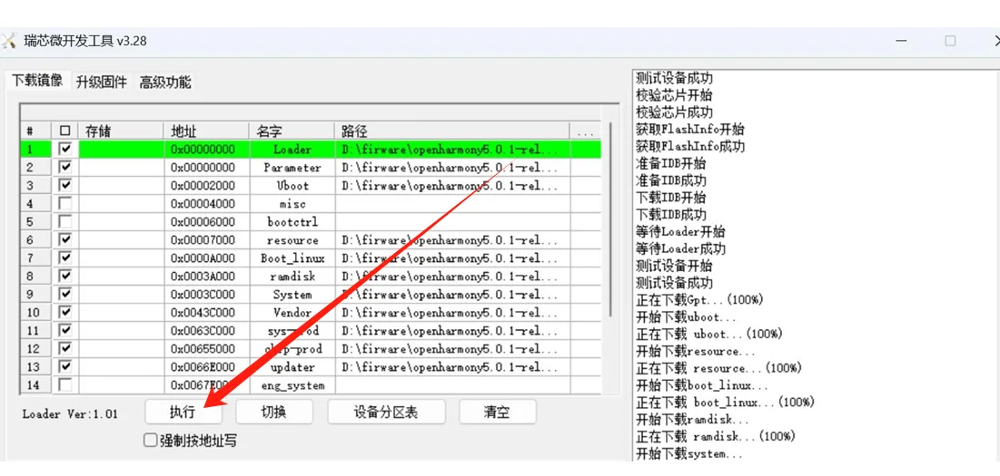

等待工具左侧显示烧录完成即可。

---
