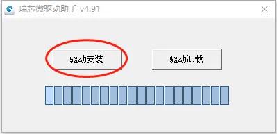
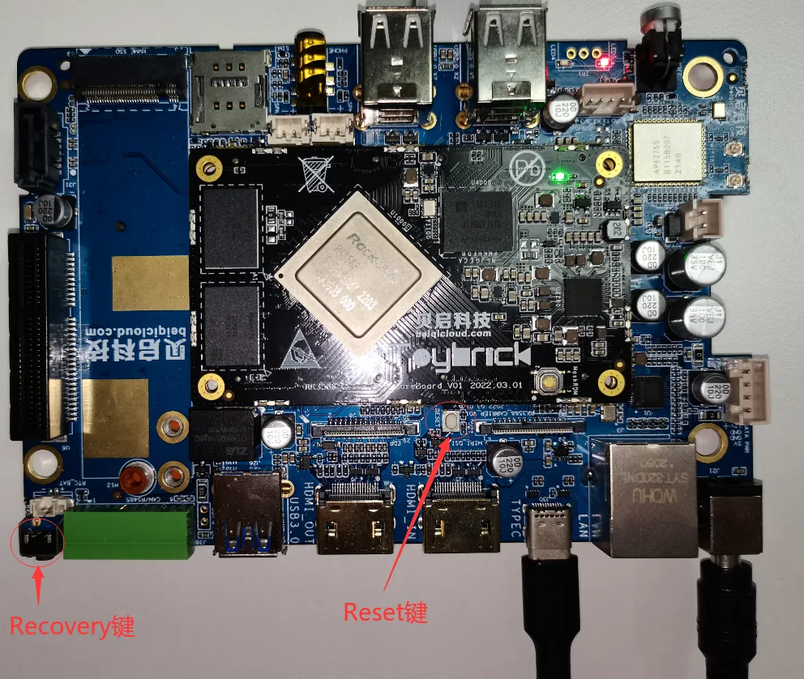
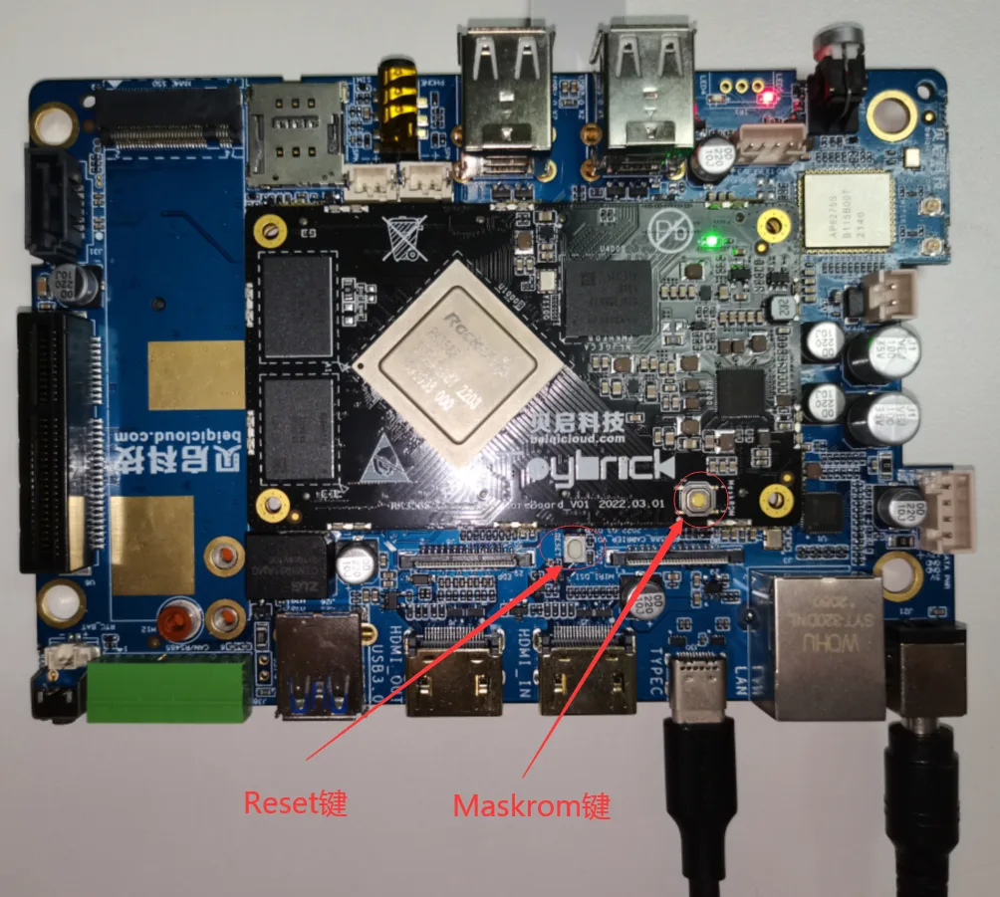
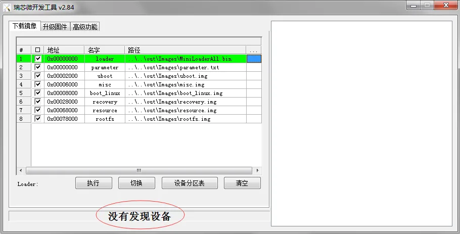
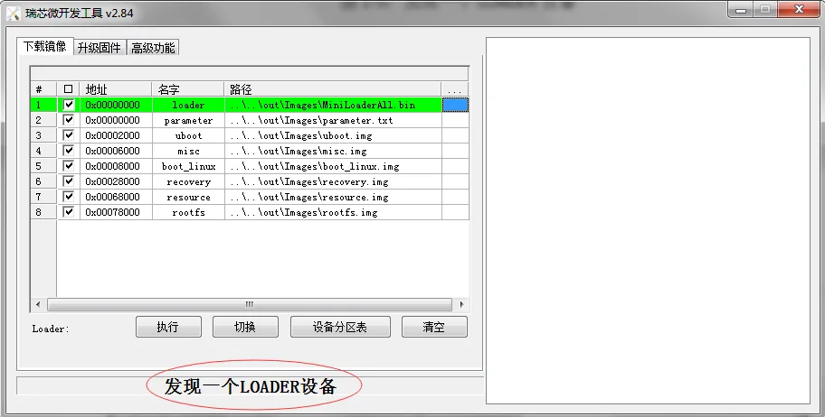
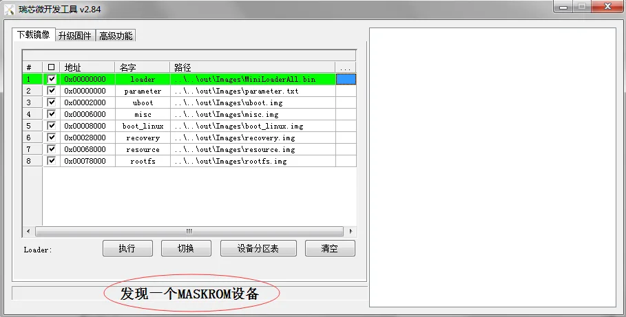
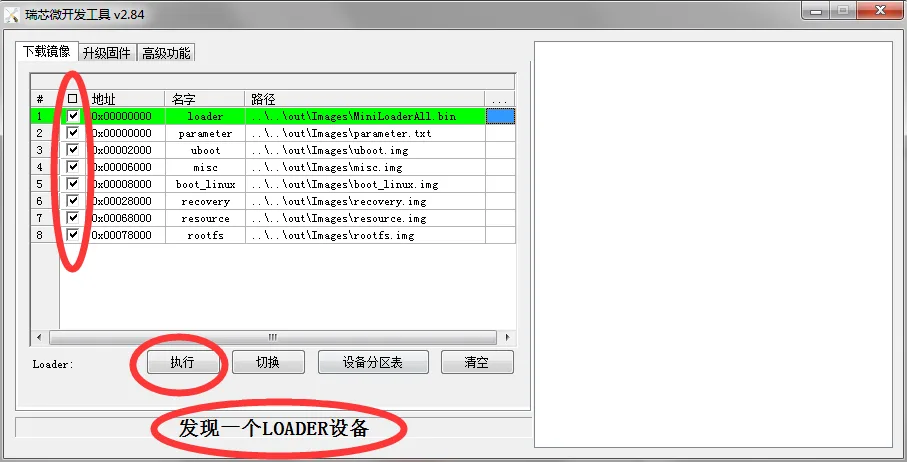

# 入门指南

### 烧写固件


一般采用Loader模式烧写固件，如果无法进入loader烧写模式，仍可以进入 MaskRom 模式来烧写固件。

#### 进入烧写模式

#### 准备程序

- RK3588开发板
- 电脑主机
- Type-C 数据线
- 12v电源适配器

##### 安装Windows RK USB驱动程序

先从网盘下载 [driverAssitant_v5.1.1.zip](https://pan.baidu.com/s/1ZPgDx9DucAG_rSReRePOCQ?pwd=1e5z#list/path=%2Fsharelink643277584-132554420893019%2F2.%E8%BE%B9%E7%BC%98%E8%AE%A1%E7%AE%97Debian11_Ubuntu20.04%2F%E7%83%A7%E5%86%99%E5%B7%A5%E5%85%B7%E5%8F%8A%E9%A9%B1%E5%8A%A8&parentPath=%2Fsharelink643277584-132554420893019) 至电脑上，解压目录运行里面的 `DriverInstall.exe` 。先选择驱动卸载，然后再选择驱动安装。



##### 进入loader烧写模式

1.接入12V电源适配器给予开发板供电，Type-C数据一端接在开发板上一端接到电脑PC端的USB接口上。

2.按住主板的Recovery按键不放。

3.电源适配器上电后，按下复位(Reset)按键。

4.当开发板进入loader模式后，松开按键。



##### 进入maskrom烧写模式

1.接入12V电源适配器给予开发板供电，Type-C数据一端接在开发板上一端接到电脑PC端的USB接口上。

2.按住主板的Maskrom按键不放。

3.电源适配器上电后，按下复位(Reset)按键。

4.当开发板进入loader模式后，松开按键。



#### 查询烧写状态

##### Linux主机查询

先从网盘下载得到
[edge工具](https://pan.baidu.com/s/1ZPgDx9DucAG_rSReRePOCQ?pwd=1e5z#list/path=%2Fsharelink643277584-132554420893019%2F2.%E8%BE%B9%E7%BC%98%E8%AE%A1%E7%AE%97Debian11_Ubuntu20.04%2F%E7%83%A7%E5%86%99%E5%B7%A5%E5%85%B7%E5%8F%8A%E9%A9%B1%E5%8A%A8%2Fedge%E5%B7%A5%E5%85%B7&parentPath=%2Fsharelink643277584-132554420893019) 至电脑上，执行如下命令查询烧写状态:

```
./edge flash -q
```

1.none：表示开发板未进入烧写模式。

2.loader：表示开发板进入loader烧写模式。

3.maskrom：表示开发板进入maskrom烧写模式。

##### Windows主机查询

下载网盘 [RKDevTool_Release_v2.84](https://pan.baidu.com/s/1ZPgDx9DucAG_rSReRePOCQ?pwd=1e5z#list/path=%2Fsharelink643277584-132554420893019%2F2.%E8%BE%B9%E7%BC%98%E8%AE%A1%E7%AE%97Debian11_Ubuntu20.04%2F%E7%83%A7%E5%86%99%E5%B7%A5%E5%85%B7%E5%8F%8A%E9%A9%B1%E5%8A%A8%2FFlashTool&parentPath=%2Fsharelink643277584-132554420893019) 工具至电脑上。双击打开RKDevTool_Release_v2.84目录下的 `RKDevTool.exe`

- 没有发现设备（如果图1-4所示）：表示开发板未进入烧写模式。
- 发现一个LOADER设备（如图1-5所示）：表示开发板进入loader烧写模式。
- 发现一个MASKROM设备（如图1-6所示）：表示开发板进入maskrom烧写模式。


图1-4：没有发现设备


图1-5：发现一个LOADER设备


图1-6：发现一个MASKROM设备

#### Linux主机烧写镜像

##### 烧写所有镜像

烧写所有镜像包括： `MiniLoaderAll.bin` ， `parameter.txt` ， `uboot.img` ， `misc.img` ， `boot_linux.img` ， `recovery.img` ， `resource.img` 和 `rootfs.img`

```
./edge flash -a
```

##### 烧写uboot镜像

烧写镜像：MiniLoaderAll.bin，uboot.img

```
./edge flash -u
```

##### 烧写kernel镜像

烧写镜像：resource.img，boot_linux.img和recovery.img

```
./edge flash -k
```

##### 烧写misc镜像

烧写镜像：misc.img

```
./edge flash -m
```

##### 烧写文件系统镜像

烧写镜像：rootfs.img

```
./edge flash -r
```

##### 查看烧写帮助

查看支持的烧写参数：

```
./edge flash -h
```

#### Windows主机烧写镜像

- 双击打开RKDevTool_Release_v2.84目录下的RKDevTool.exe。
- 确认开发板已经进入loader或者maskrom烧写模式。
- 打勾选择需要烧写的镜像。

###### 注解

Loader和Parmeter选项建议打勾选择，其他选项根据需要打勾选择。

- 点击“执行”按钮，开始烧写固件（如图1-7所示）。   图1-7：烧写固件
