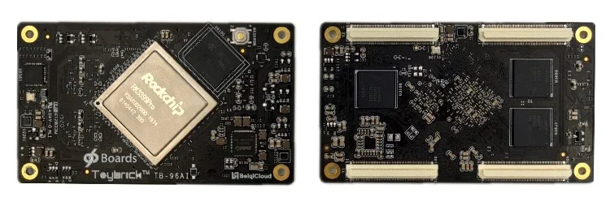
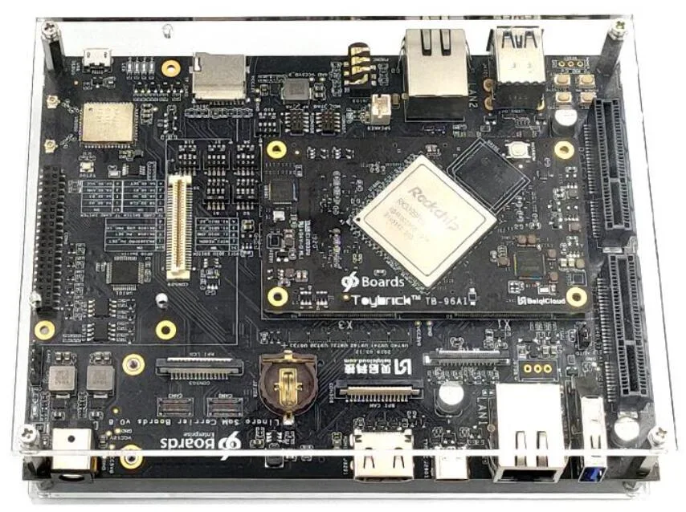
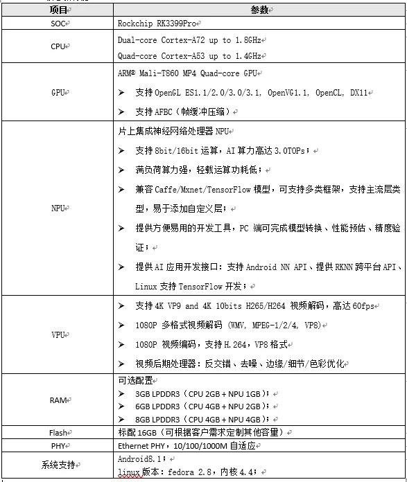
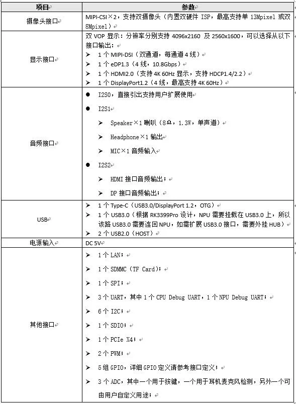
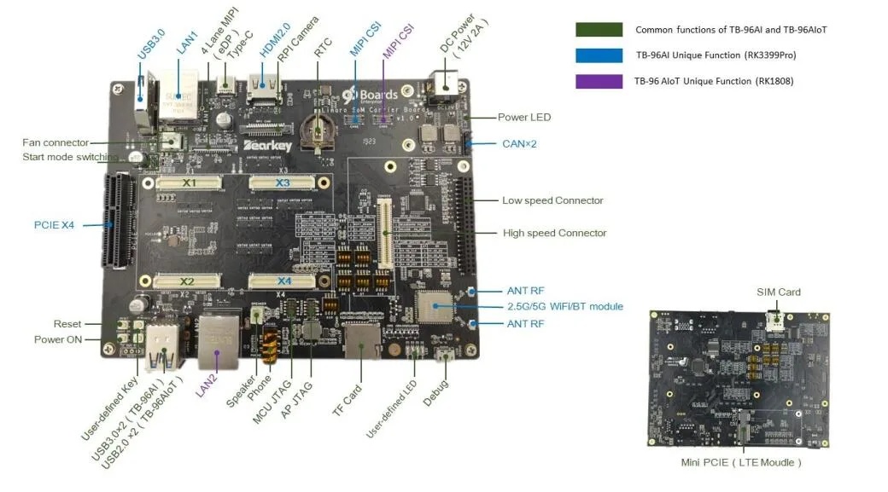

# 产品规格

### 产品介绍

TB-96AI是由Linaro、Rockchip、Bearkey三方联合研发的全球第一款符合96Boards Compute SOM规范的面向人工智能领域的高性能嵌入式AI核心板，并由Linaro 96Boards于2019年4月1日正式对外发布，[详情请查看官方论坛96Boards.org](http://xn--96Boards-um7n725aoko1ooq0ghr3dm3zd7ta8i.org)。

TB-96AI采用Rockchip RK3399Pro为主控芯片，搭配3GB LPDDR3+16GB eMMC（可选6GB LPDDR3+16GB eMMC或8GB LPDDR3+16GB eMMC），内置千兆以太网PHY芯片。TB-96AI设计为通过4个100Pin的松下高速板对板连接器与应用底板连接，更加稳定可靠，并且拥有MIPI CSI、MIPI DSI、eDP、HDMI、DisplayPort、Type-C、USB3.0、USB2.0、I2S、Speaker、Mic、HeadPhone、SPI、I2C、UART、PCIE X4、SDIO、LAN、TF Card、RTC、PWM、ADC、GPIO等丰富的扩展接口，支持用户根据自身需求进行功能扩展。TB-96AI采用10层板设计，机械尺寸只有85mm×50mm，比信用卡还小，可以方便快捷地部署到各种类别的产品中。

TB-96AI搭配由Bearkey研发的96Boards CarrierBoard可以组成一套完整的RK3399Pro开发套件，也可作为RK3399Pro核心板（TB-96AI）的评估板；搭配客户根据实际需求定制开发的底板即可直接组成行业应用主板，广泛适用于工业自动化、无人机、图像检测、人脸识别、边缘计算网关、集群服务器、智慧商显、自动驾驶、医疗健康设备、机器人和智能零售等人工智能领域。

### 实物图片

### 功能列表

### 接口列表

