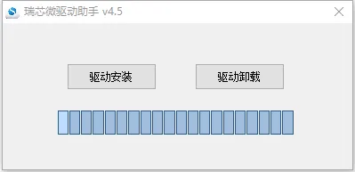
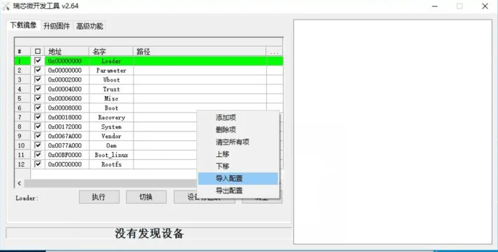
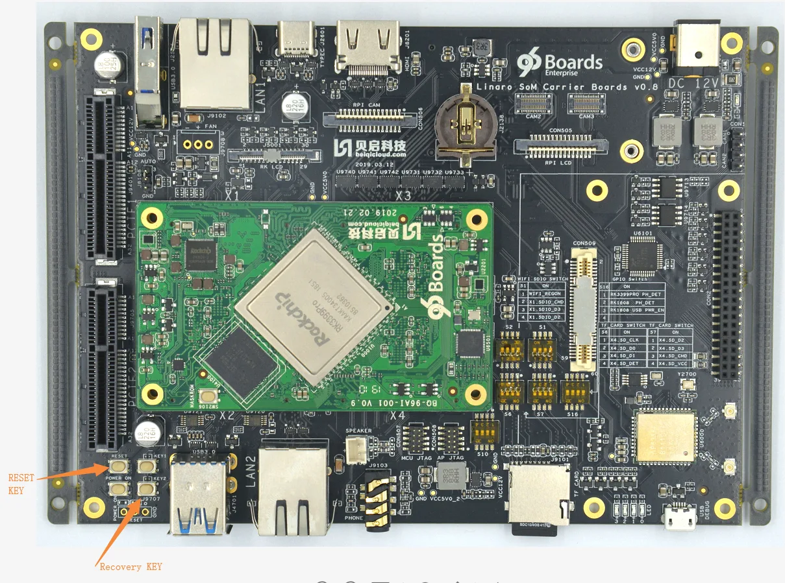
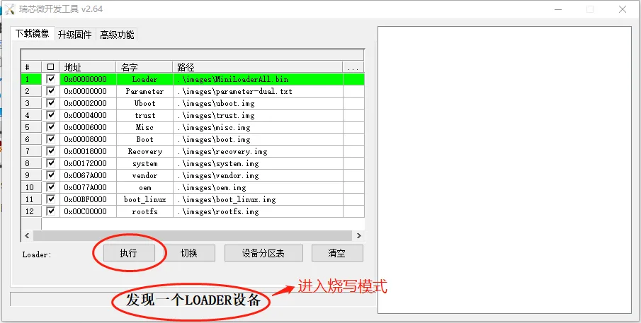
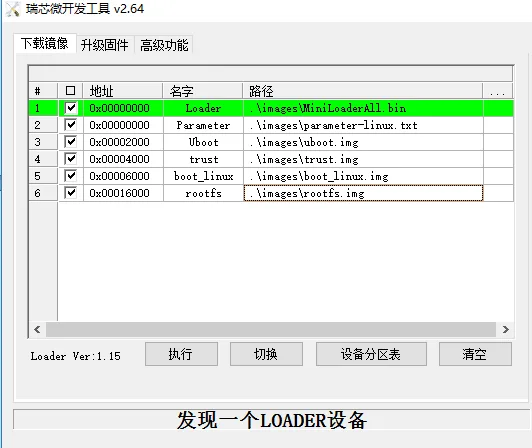
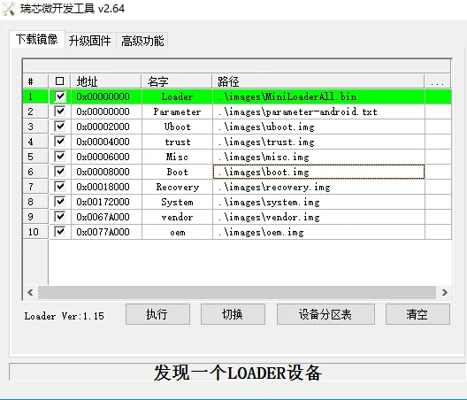
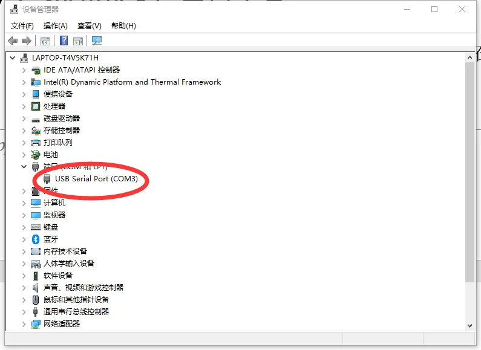
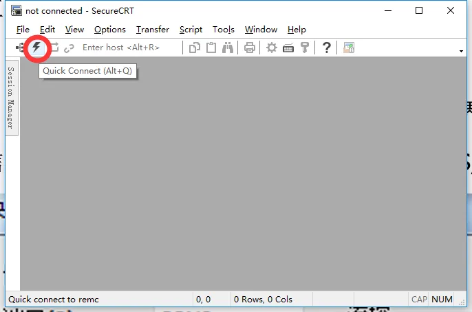
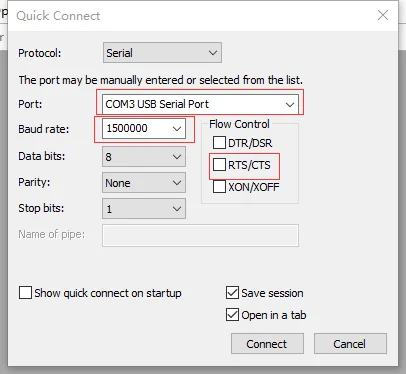

# 入门指南

### 固件下载

[下载地址1：百度云链接 提取码：x7nz](https://pan.baidu.com/s/1PlPESAXDmTC4LrpBP_R5fQ)

[下载地址2：Onedrive](https://1drv.ms/f/s!AhoFWWcHV7rXfiQI_EPY5W-kVGw)

### 开发工具下载

[下载地址1：百度云链接 提取码：x7nz](https://pan.baidu.com/s/1PlPESAXDmTC4LrpBP_R5fQ)

[下载地址2：Onedrive](https://1drv.ms/f/s!AhoFWWcHV7rXfxvmL4NNgUSyuLc)

### 烧写驱动下载

[下载地址1：百度云链接 提取码：x7nz](https://pan.baidu.com/s/1PlPESAXDmTC4LrpBP_R5fQ)

[下载地址2：Onedrive](https://1drv.ms/f/s!AhoFWWcHV7rXgQEN4kCS027uBRSa)

### 烧写固件

#### Window主机烧写固件

1、安装Windows PC端USB驱动(首次烧写执行)。

2、双击DriverAssitant_v4.5\ DriverInstall.exe打开安装程序，点击“驱动安装”按提示安装驱动即可，安装界面如下所示:



3、Type-C线连接主机端的USB接口和RK3399Pro TB-96AI开发板的Type-C接口，进入烧写模式。

4、将固件解压到AndroidTool_Release_v2.64\images目录下

5、双击AndroidTool_Release_v2.64\AndroidTool.exe启动烧写工具，单击右键，导入config_dual 配置，此配置为双系统配置。（在AndroidTool_Release_v2.64根目录下）。



6、长按RK3399Pro TB-96AI开发板上recovery按键（KEY2键）的过程中重启机器，注意要一直长按KEY2键一直持续按，直到系统进入Loader模式，如下所示：





7、如果需要单烧linux系统，请在步骤5导入config_linux 配置。



8、如果需要单烧android系统，请在步骤5导入config_android 配置。



#### Linux主机烧写固件

1、Type-C线连接主机端的USB接口和RK3399Pro TB-96AI开发板的Type-C接口。

说明：RK3399Pro TB-96AI的Linux系统也可以作为开发主机给其他开发板烧写固件。

2、长按RK3399Pro TB-96AI开发板上recovery按键后重启机器，进入Loader模式。

3、将固件解压到linuxTool-v1.0/images目录下。

4、执行如下命令烧写固件：

1)烧写双系统固件(默认)：

a) 烧写所有固件：

```
sudo python ./flash.py -d all
```

b) 烧写uboot.img和trust.img:

```
sudo python ./flash.py -d uboot
```

c) 烧写system.img:

```
sudo python ./flash.py -d system
```

d) 烧写boot.img和boot_linux.img:

```
sudo python ./flash.py -d boot
```

e) 烧写rootfs.img：

```
sudo python ./flash.py -d rootfs
```

2)烧写linux系统固件(单系统)：

a) 烧写所有固件：

```
sudo python ./flash.py -l all
```

b) 烧写uboot.img和trust.img:

```
sudo python ./flash.py -l uboot
```

c) 烧写boot_linux.img:

```
sudo python ./flash.py -l boot
```

d) 烧写rootfs.img：

```
sudo python ./flash.py -l rootfs
```

3)烧写android系统固件(单系统)：

a) 烧写所有固件：

```
sudo python ./flash.py -a all
```

b) 烧写uboot.img和trust.img:

```
sudo python ./flash.py -a uboot
```

c) 烧写boot.img:

```
sudo python ./flash.py -a boot
```

d) 烧写system.img：

```
sudo python ./flash.py -a system
```

4)查看帮助：

```
sudo python ./flash.py --help
```

### 串口调试

#### SecureCRT串口工具

将RK3399Pro TB-96AI开发板的Debug口（microUSB口）连接到主机端的USB口，打开设备管理器获取USB Serial Port的端口号，如下图所示：



注意：如果设备管理器里面显示驱动异常信息，请选择更新驱动信息即可。

打开串口工具“SecureCRT”，点击“快速连接”按钮。



配置串口信息，端口选择连接开发板的端口号，设置波特率为1500000，不勾选流控RTS/CTS，如下图所示：



点击连接，就可以正常查看系统调试信息和输入用户命令。

#### Minicom串口工具

1、将RK3399Pro TB-96AI开发板的Debug口连接到主机端的USB口。

2、以root权限打开minicom： sudo minicom -s。

3、打开Minicom菜单：输入CTRL-A + z。

4、进入Minicom配置界面：输入“O”选择“Configure Minicom”。

5、进入串口设置：选择“Serial port setup”。

6、设置串口设备：输入“A”，写入“/dev/ttyUSB0”，按回车确定。

7、禁止流控：输入“F”，按回车确定。

8、设置波特率：输入“E”，再输入“A”直到显示“Current 1500000 8N1”，然后回车确定。

9、保存设置：选择“Save setup as dfl”。

10、退出设置：选择“Exit”。

### 开机启动

RK3399Pro TB-96AI开发板预安装双系统：fedora28和Android 8.1系统。

fedora系统登录用户名：toybrick，密码：toybrick

开机启动

1、开机上电默认进入Linux系统。

2、长按recovery按键，开机上电后：

（1）当type-c有接入时，进入loader模式；

（2）当无type-c接入时，加载Android系统。
