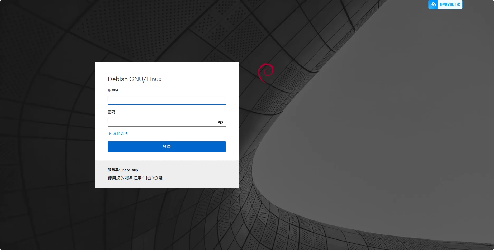
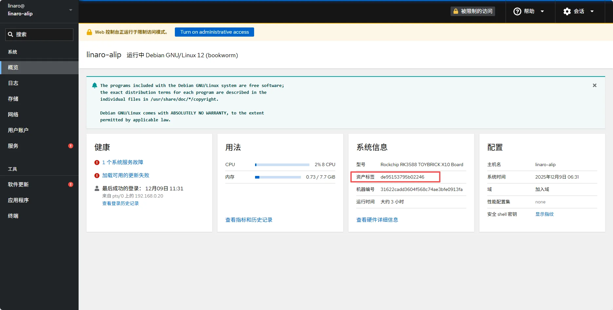
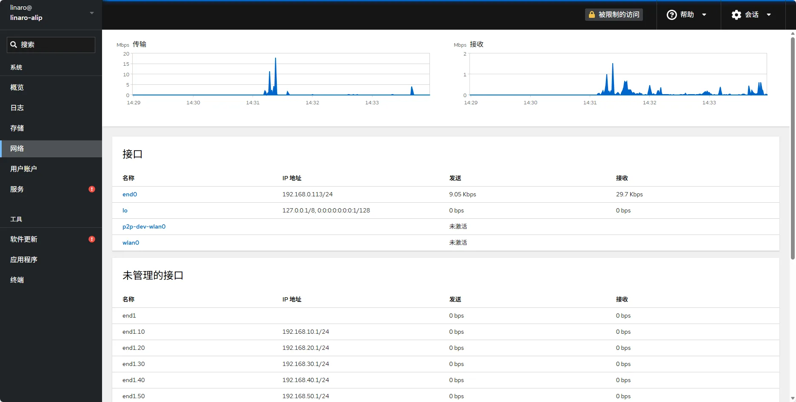
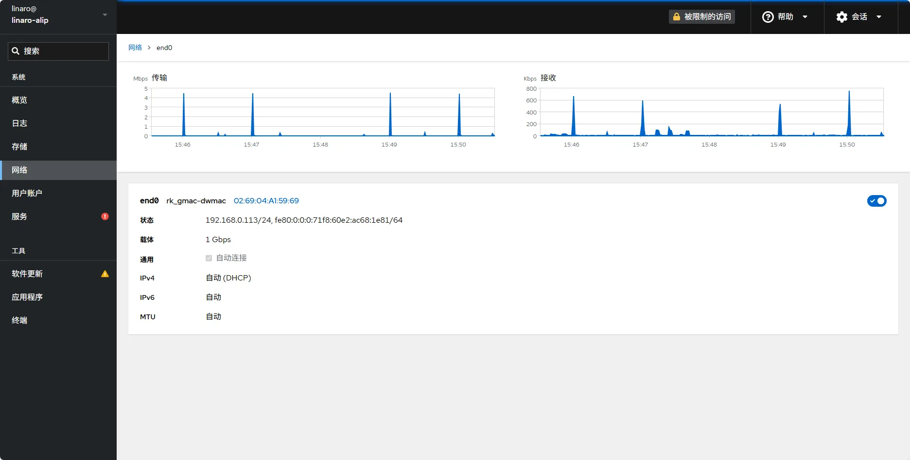
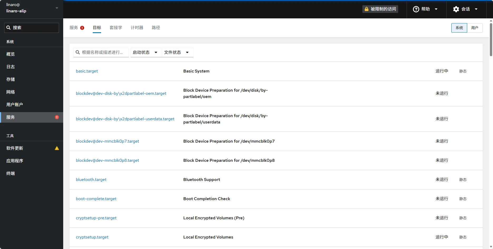
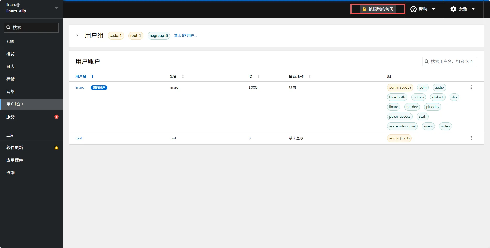

# 四、设备管理

设备上总共有六个网口，其中一个为 wan 口（线缆上有相关标识），接交换机或者路由器，设备使用 wan 口进行上网；剩余五个网口为 lan 口，可以对外分配 IP，网段分别为 192.168.10.0/24，192.168.20.0/24，192.168.30.0/24，192.168.40.0/24，192.168.50.0/24，对应 lan1-lan5 五个网口，即 lan1 可以对外分配 192.168.10.0/24 地址段的 IP，lan2 可以对外分配 192.168.20.0/24 地址段的 IP...

设备 wan 口接到路由器或者交换机，成功获取到 IP 后(可通过 adb shell ifconfig 查看，需要使用 typec 线连接设备上的 typec 口与 pc)，可通过 ***IP:9090*** (IP 为 adb shell ifconfig 中 end0 网卡的 IP 地址)进行登录，登录页面如下

账号密码均为 linaro，登陆后，在概览界面中可以看到 sn 号，下图红框处的资产标签即为 sn

在网络界面中可以看到设备上的网卡，目前仅支持对 end0(即 wan 口)，与 wlan0 的配置

具体配置页面如下，页面上方为当前的流量图，下面可以配置固定 IP，网关等，其他网卡的配置，目前需要在左侧终端页中使用命令行进行配置

左侧服务页面中，可以对开机自启服务等进行配置，选择禁用或者启动服务，如下

用户账户页面可以对用户进行配置，例如新增用户，删除某个用户，修改某个用户的密码等操作，操作前需要先点击下图红框处接触限制，才可进行操作
