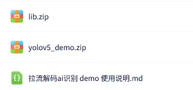
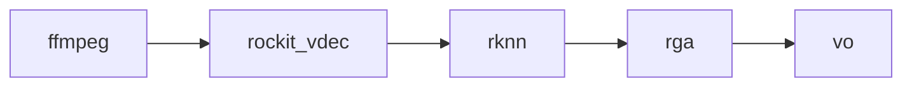

# 五、设备相关例程

设备相关例程见[贝启AI工作站相关例程](https://pan.baidu.com/s/1QSvTuqrIjKQowduZ79q4oA?pwd=2rif)。

链接包含如下 demo

-    rtsp 拉流解码 demo
-    rtsp 推流 demo

用户可以根据链接内的说明来进行部署

此处对 demo 进行简单说明
rtsp 拉流解码 demo 包含如下内容，其中 lib.zip 包含运行需要的库；yolov5_demo.zip 包含可执行程序以及相关文件；拉流解码 ai 识别 demo 使用说明.md 则为 demo 详细使用说明

##### rtsp 拉流解码 demo 说明

流程如下

demo 使用 ffmpeg 拉取 rtsp 视频流，通过 rockit_vdec 模块进行解码， 使用 rknn 运行 yolov5 算法，使用 rga 模块进行结果绘制，最后送到 vo 进行显示

##### rtsp 推流 demo 说明

rtsp 拉流解码 demo 则是对应的推流 demo，能够快速实现推出相关 rtsp 流供  rtsp 拉流解码 demo 使用，流程如下

~~~mermaid
graph LR
file --> ffmpeg --> rtsp
~~~

demo 读取视频文件内容，根据视频信息创建 ffmpeg 相关上下文，最后推一个 rtsp 出来

客户可以通过这两个 demo 快速熟悉贝启AI工作站对于视频处理以及 npu 等相关能力
