# 三、Debian12

### 烧录信息
#### 烧入准备
(1)BQ8180 AI Mini PC 拆机后，SSD固态存放位置(拔插SSD时请先断电)

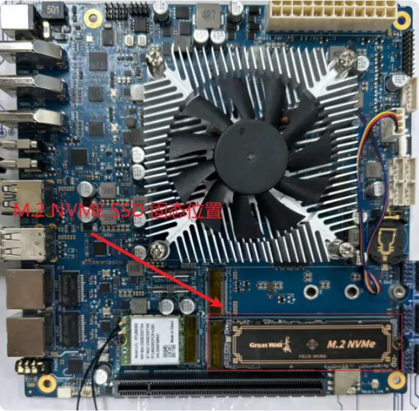
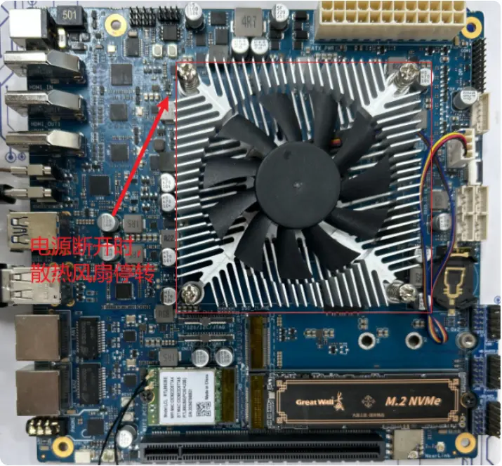

### 烧入方法
#### windows系统
(1)准备烧录工具nvme转usb外接盒

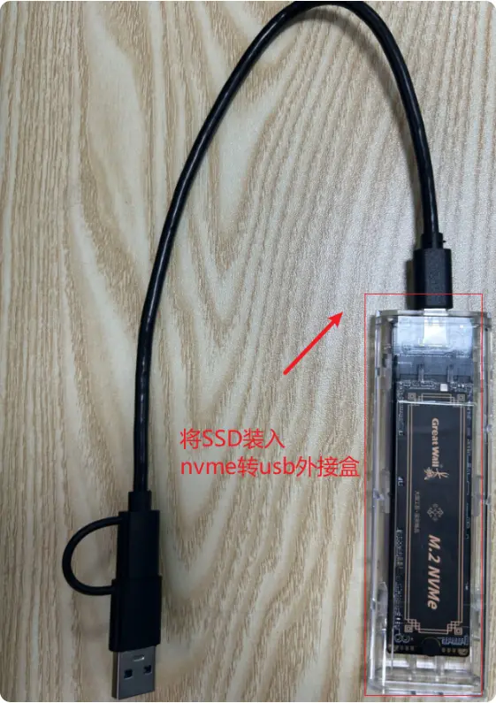

(2)在官网下载rufus烧录软件（版本在3.30以上）

(3)在软件页面中按alt+f，开启磁盘启动


(4)选择对应的磁盘和linux固件，点击开始

(5)耐心等待至烧录完成，即可插回原位使用

#### linux系统

(1)先将设备断电，拆机显示内部主板。

(2)执行烧录命令：假设 固态SSD在烧录设备中节点为/dev/nvme0n1，固件为linux-fs.sdcard.zst

```cpp
#安装zstd命令
sudo apt update
sudo apt install zstd -y
#烧录固件 zstdcat “固件” | sudo dd of=“SSD的设备节点” bs=64M status=progress
zstdcat linux-fs.sdcard.zst | sudo dd of=/dev/nvme0n1 bs=64M status=progress
```
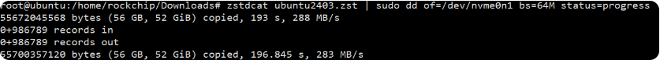

(3)将烧录完成“M.2 NVME SSD”放入BQ-8180开发板的SSD位置

(4)重新上电等待启动

### 默认用户

用户名:    cix密码:        cix
root密码: cix
系统权限认证密码: root
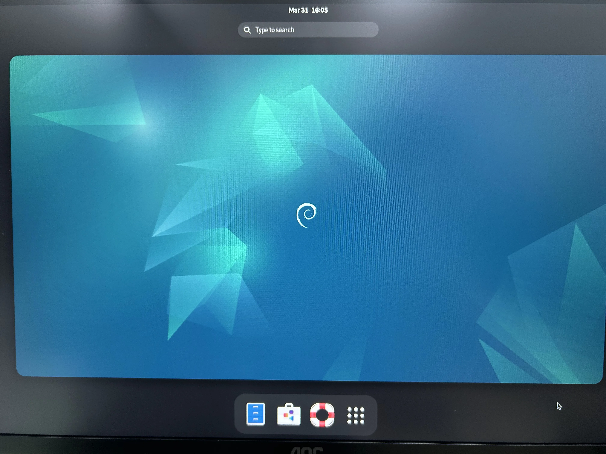

### 开源代码
#### 搭建开发环境

**安装依赖工具**

安装命令如下：

```
apt update
apt install -y git curl sudo wget python3-pip python-is-python3 \
             lsb-release p7zip-full p7zip-rar bison build-essential
```

**获取标准系统源码**

**前提条件**

1）注册github账号

2）配置 Git 用户信息

```
git config --global user.name "your_account_name"

git config --global user.email "your_email@example.com"
```

3）安装repo工具，可以执行如下命令。

```
curl https://storage.googleapis.com/git-repo-downloads/repo -o repo
chmod +x repo
mv ./repo /usr/bin/
//注意：repo 工具依赖 python3，上述步骤已安装 python-is-python3 确保 python 命令可用。
```

**代码下载与工作空间设置**


1） 创建并初始化工作空间

```
mkdir workspace
cd workspace
repo init -u git@github.com:bearkey-cix-linux/manifest.git -b 25q4_bq8180_release
```

2） 同步代码

```
repo sync -c
```

**编译环境准备**

加载环境变量

```
source ./build-scripts/envtool.sh
```
**初始化环境**

```
export USER=root
newer_env
```
**下载编译资源**

```
source ./build-scripts/envtool.sh
updateres
//资源包体积较大，下载时间较长属正常现象
//如果执行过程中报错提示"资源不完整"或解压失败，请重复执行该命令，直到成功为止
```
#### 编译调试
**1、编译**

1） 进入源码根目录，执行如下命令进行版本编译。

```
source ./build-scripts/envtool.sh

# 注意：该命令在 Docker 容器编译环境中使用；
export USER=root 

build all 
```
开始编译

2） 编译产物

编译成功后，生成的镜像文件位于
```
./output/cix_evb/images/
```

3） 编译源码完成，请进行镜像烧录。

**2、固件包制作**
进入到镜像生成路径使用zstd压缩文件

```
cd output/cix_evb/images/

zstd linux-fs.sdcard -o linux-fs.sdcard.zst
```

### 功能概况

### 1、GPU占用率查询

root用户下执行

```
gpu_utilization_clock_tracing
```

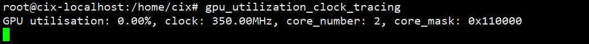

### 2、 WIFI

(1)可以在屏幕设置界面直接连接

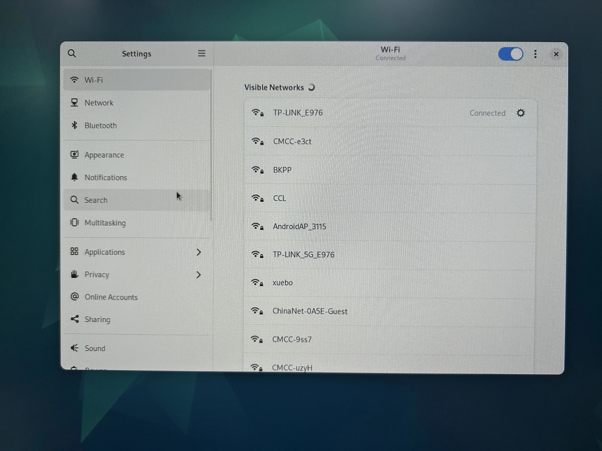

(2)命令查询 ip a

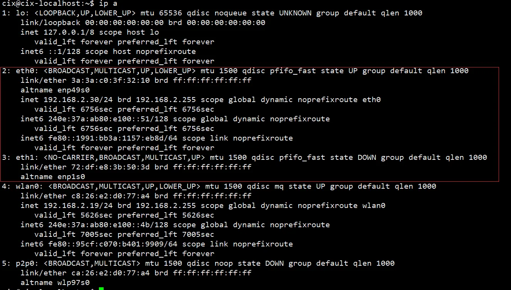


### 3、Bluetooth

(1)可以在屏幕设置界面直接连接

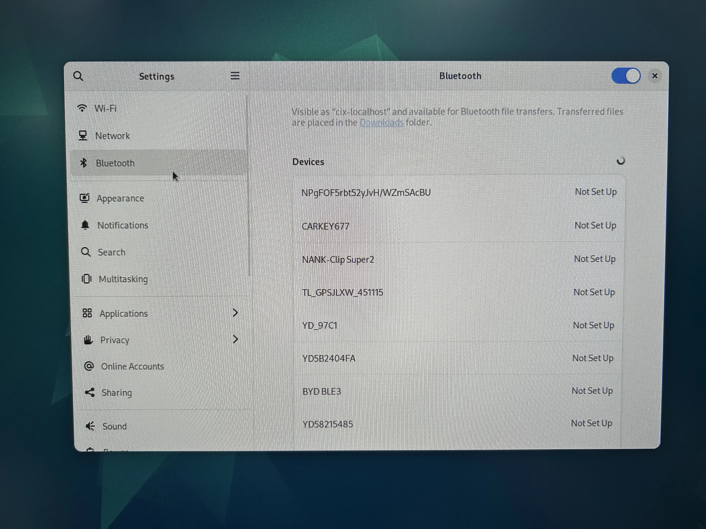

(2)命令查询 hciconfig

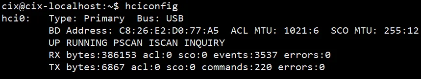

### 4、USB接口

(1)支持鼠标、键盘

(2)支持u盘挂载

假设u盘识别为/dev/sda ,命令将u盘挂载在SD文件夹下

```
sudo mount /dev/sda SD
```

### 5、以太网

支持2路以太网

(1)线缆插入后，屏幕设置界面自动显示

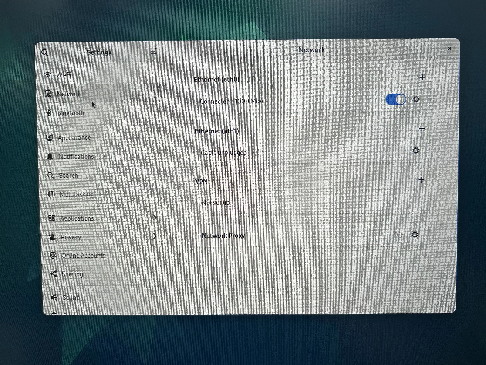

(2)命令查询 ip a

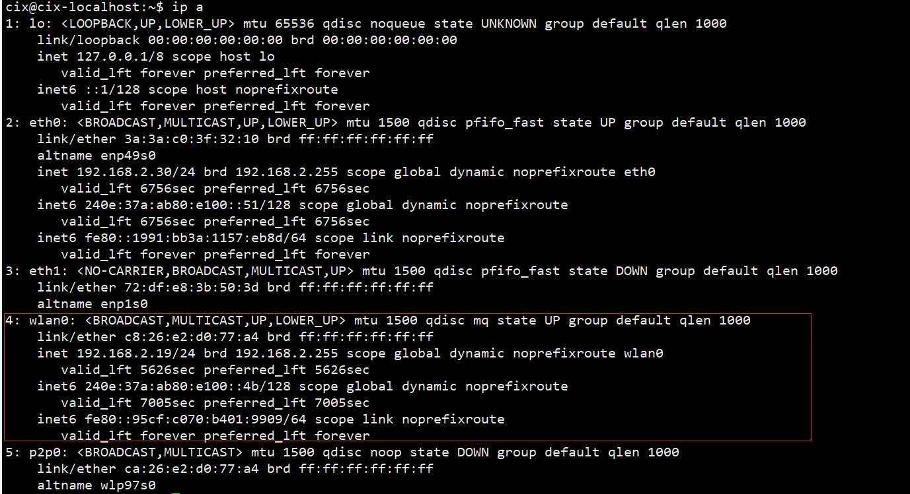

### 6、音频

(1)支持耳机播放和录音
(2)支持SPK播放

### 7、typec0/1接口

(1)使用usb转typec连接设备typec0口和pc侧，adb功能能够正常使用
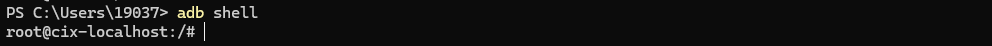
(2)使用typec拓展坞接入typec0/1,并且在拓展坞上接入usb设备，能够正常使用
(3)使用typec拓展坞接入typec0/1,并且在拓展坞上使用hdmi线接外接屏能够正常显示
(4)使用typec拓展坞接入typec0/1,并且在拓展坞上插入网口，能够正常上网

### 8、hdmi-in功能使用说明

(1)加载ko，命令如下

```plain
insmod /usr/lib/modules/6.6.89-cix-build-generic/kernel/drivers/media/i2c/cix/lt7911uxc/lt7911uxc.ko
insmod /usr/lib/modules/6.6.89-cix-build-generic/kernel/drivers/media/platform/cix/csi_dma/csi_rcsu_hw.ko
insmod /usr/lib/modules/6.6.89-cix-build-generic/kernel/drivers/media/platform/cix/csi_dma/csi_mipi_dphy_hw.ko
insmod /usr/lib/modules/6.6.89-cix-build-generic/kernel/drivers/media/platform/cix/csi_dma/csi_mipi_dphy_rx.ko
insmod /usr/lib/modules/6.6.89-cix-build-generic/kernel/drivers/media/platform/cix/csi_dma/csi_mipi_csi2.ko
insmod /usr/lib/modules/6.6.89-cix-build-generic/kernel/drivers/media/platform/cix/csi_dma/csi_dma.ko
```

(2)调整分辨率，目前仅支持1080p和4k，默认为4k，为方便调试调整为 1080p，命令如下

```plain
echo 0 > /sys/kernel/debug/csi_dma/sync_mode
echo 400 > /sys/kernel/debug/mipi-csi-dphy/lane_rate
```

(3)视频预览，按照前两步完成后，接下来可以使用 gst-launch-1.0 进行预览，命令如下

```plain
gst-launch-1.0 v4l2src device=/dev/video2 ! queue max-size-buffers=15 ! video/x-raw,format=YUY2,width=1920,height=1080,framerate=60/1 ! videoconvert ! glimagesink
```

该命令需要在桌面环境中输入，如果在 ssh 或者 adb 中输入会出现无法显示的情况，效果如下
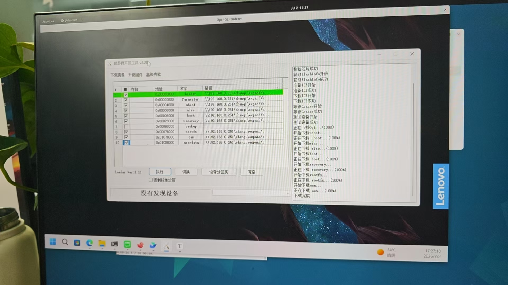

### 9、HDMI-OUT1/2显示

(1)使用hdmi外接显示屏能够正常显示
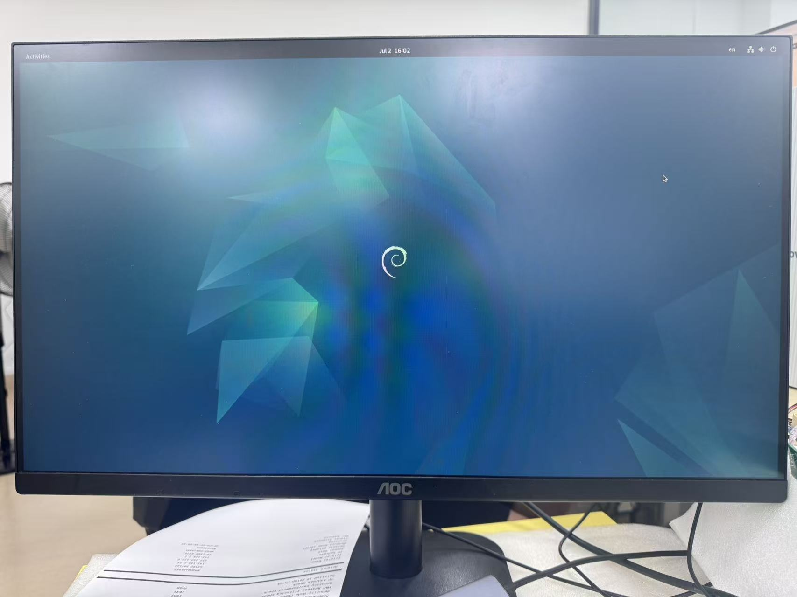
