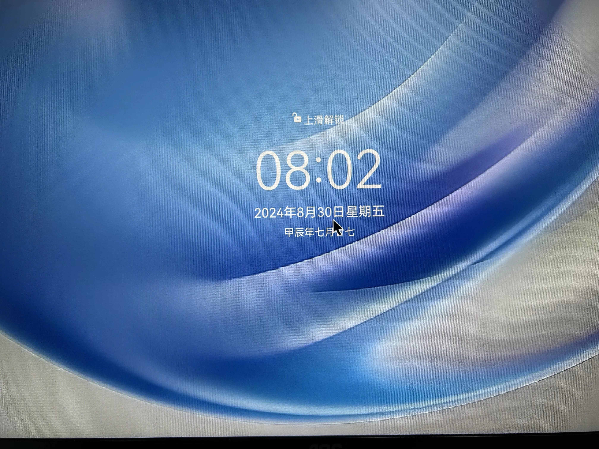
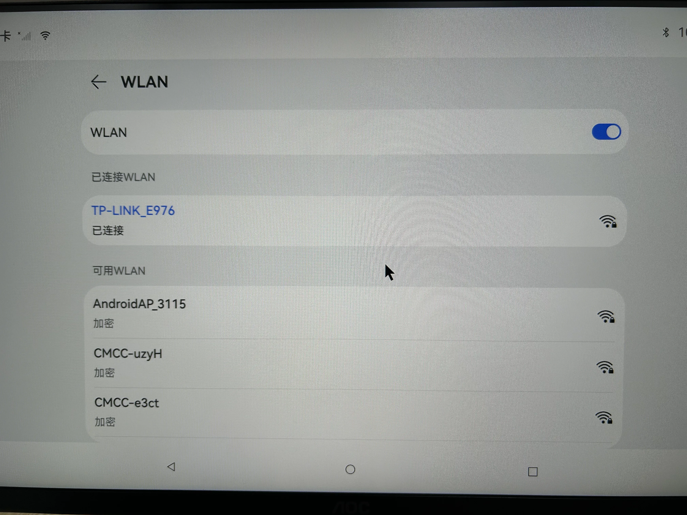
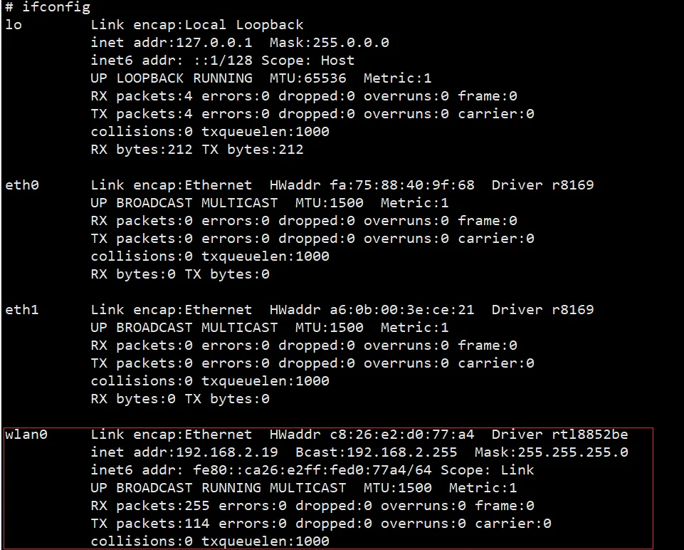
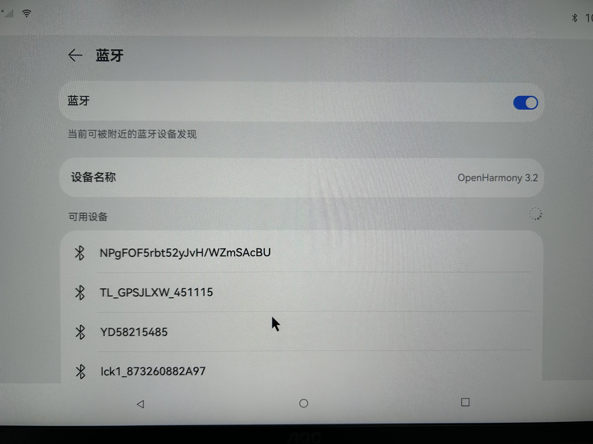
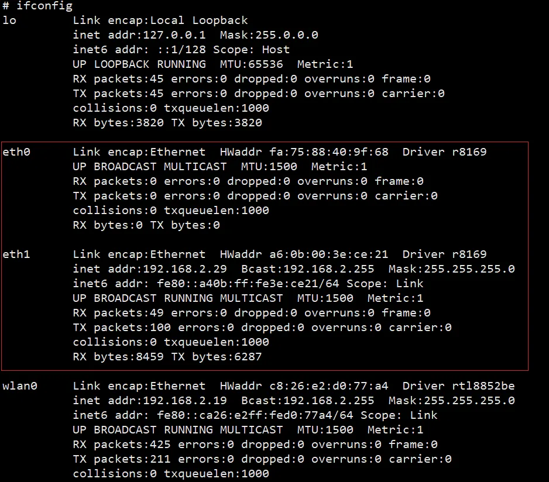

# 四、Openharmony

### 默认用户

用户名:    无密码:        无
root密码: 无

&gt; HDMI显示，目前仅支持HDMI OUT1



### 功能概况

### 1、 WIFI

(1)可以在屏幕设置界面直接连接



(2)命令查询 ifconfig



### 2、Bluetooth

(1)可以在屏幕设置界面直接连接



### 3、USB接口

(1)支持鼠标、键盘

(2)支持u盘挂载

假设u盘识别为/dev/sda ,命令将u盘挂载在SD文件夹下

```
sudo mount /dev/sda SD
```

### 4、以太网

支持2路以太网

(1)命令查询 ip a



### 5、音频

(1)支持耳机播放和录音
(2)支持SPK播放
