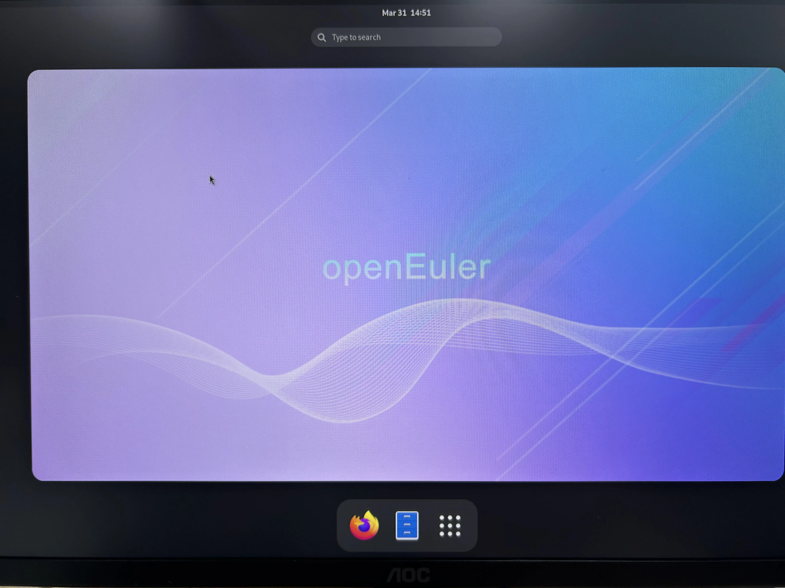
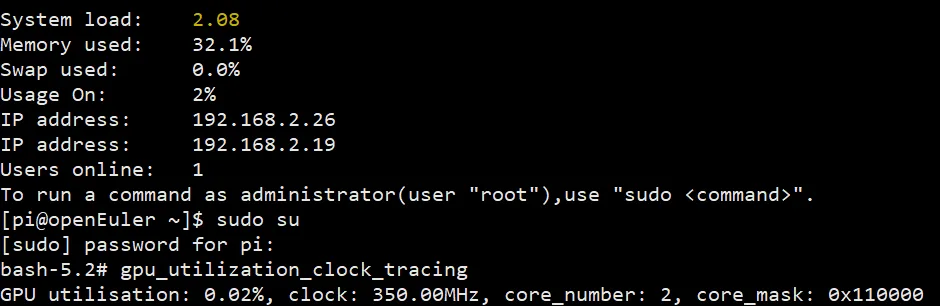
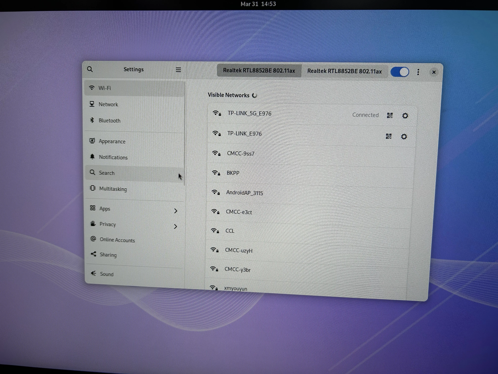
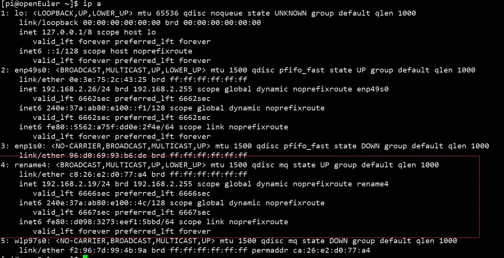
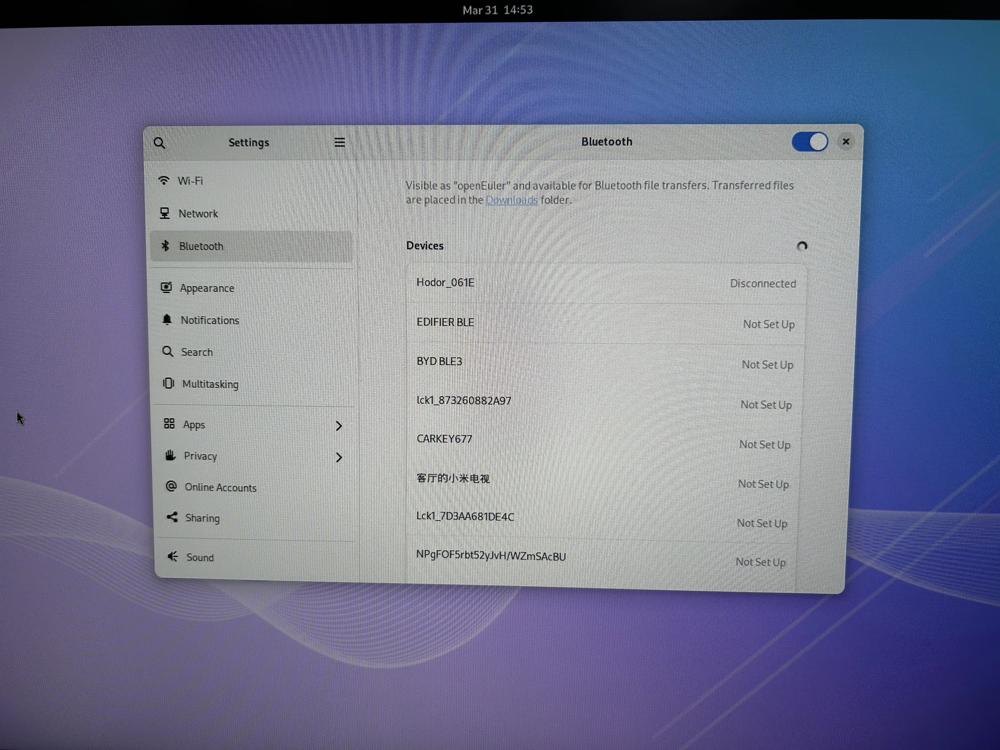
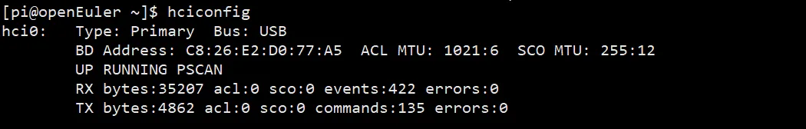
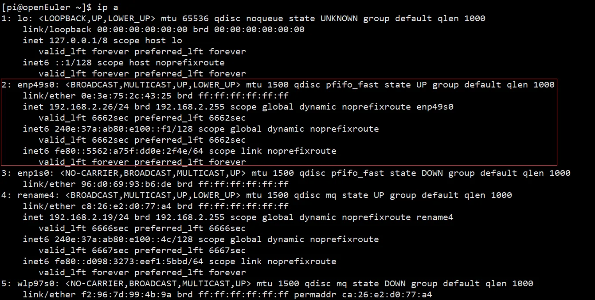

# 五、Openeuler

### 默认用户

用户名:    pi密码:        pi
root密码: pi



### 功能概况

### 1、GPU占用率查询

root用户下执行

```
gpu_utilization_clock_tracing
```



### 2、 WIFI

(1)可以在屏幕设置界面直接连接



(2)命令查询 ip a



### 3、Bluetooth

(1)可以在屏幕设置界面直接连接



(2)命令查询 hciconfig



### 4、USB接口

(1)支持鼠标、键盘

(2)支持u盘挂载

假设u盘识别为/dev/sda ,命令将u盘挂载在SD文件夹下

```
sudo mount /dev/sda SD
```

### 5、以太网

支持2路以太网

(1)线缆插入后，屏幕设置界面自动显示


(2)命令查询 ip a



### 6、音频

(1)支持耳机播放和录音
(2)支持SPK播放
