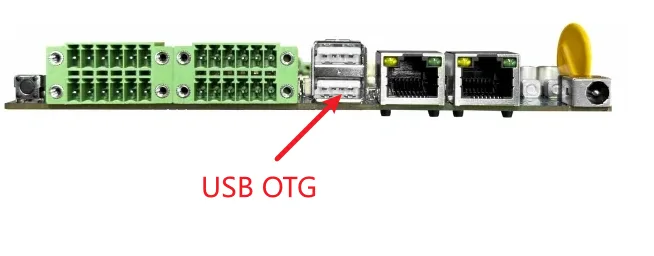
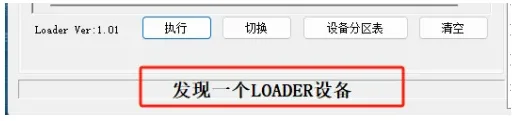
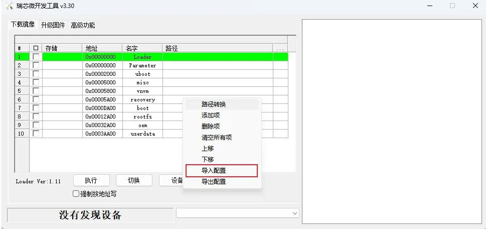
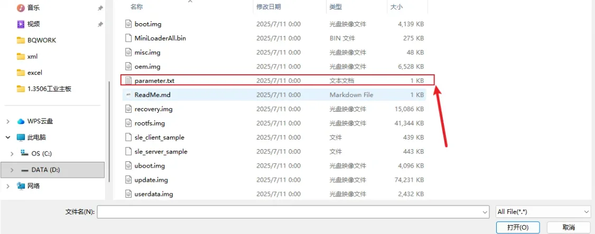
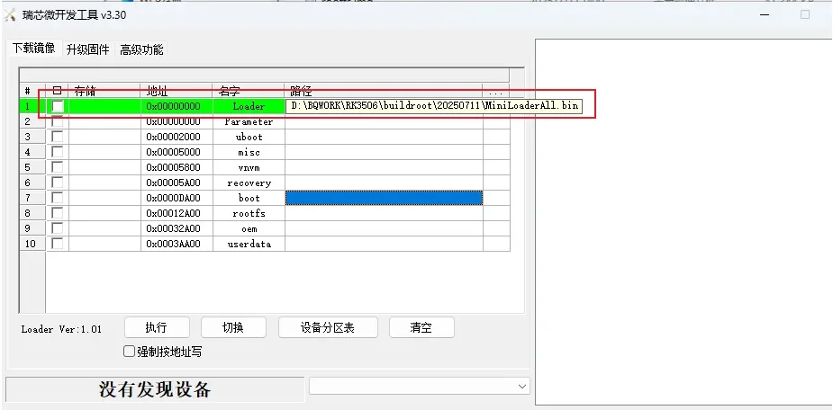
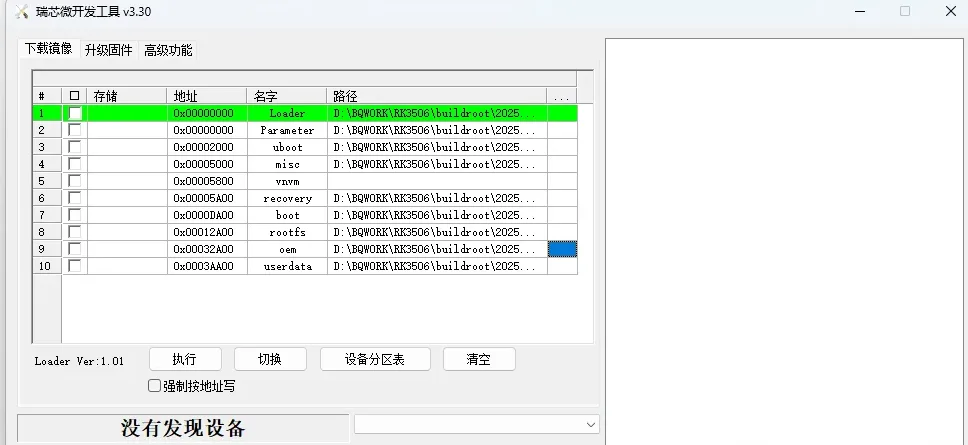

# 3. 固件烧录

用双头USB连接OTG口和PC的USB口

如何进入烧写模式(Loader)

1. 按住设备的 recovery 键不要松开，然后按一下 reset 键系统复位，大约两秒后松开 recovery 键。
2. 连接完成OTG口后，上电设备，在PC的powershell输入 adb shell 进入到设备终端，执行`reboot loader`命令

这时候进入到烧录工具可以看到下面这个现象

导入配置

导入完成后需要根据列出的项名字选择对应的img文件

例如

选择完成后勾选点击执行岂可。

