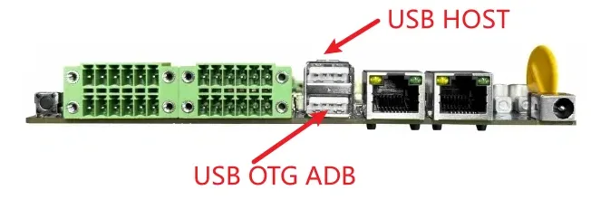
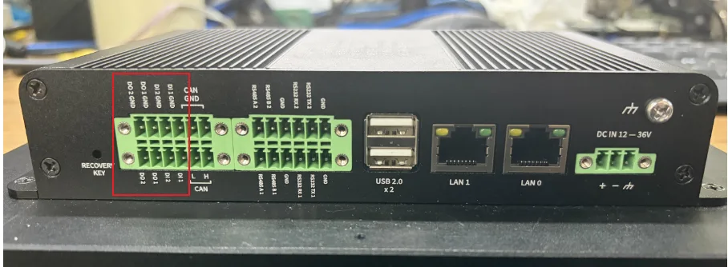
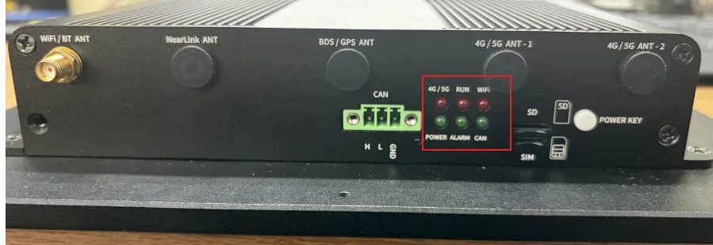
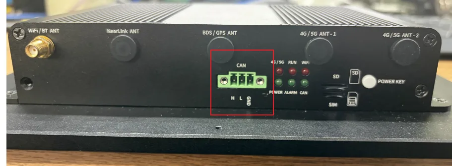
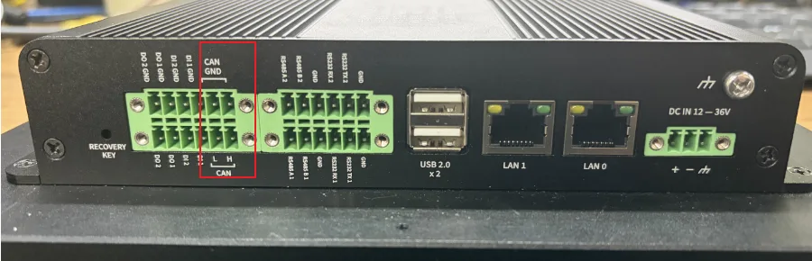
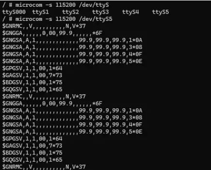
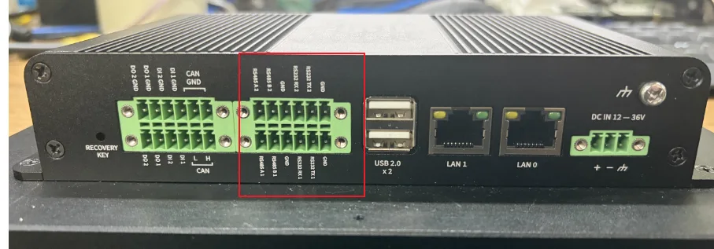

# 4. 基础功能验证

### 4.1 USB功能测试



插入U盘到USB-HOST，使用adb shell进入设备终端可以查看当前U盘是否被挂载

### 4.2 DODI功能测试



```
IN1节点 /sys/devices/platform/gpios_dido/DIN1
IN2节点 /sys/devices/platform/gpios_dido/DIN2
OUT1节点 /sys/devices/platform/gpios_dido/DOUT1
OUT2节点 /sys/devices/platform/gpios_dido/DOUT2

OUT1与OUT2 echo 1为输出高电平，echo 0 为输出低电平
参考命令 echo 1 > /sys/devices/platform/gpios_dido/DOUT1

IN1与IN2使用cat查看输入，返回值为0为输入低电平，返回值为1为输入高电平
参考命令 cat /sys/devices/platform/gpios_dido/DIN1
```

### 4.3 LED功能测试



```
LED1控制节点 /sys/class/leds/led-1/brightness
LED2控制节点 /sys/class/leds/led-2/brightness
LED3控制节点 /sys/class/leds/led-3/brightness
LED4控制节点 /sys/class/leds/led-4/brightness
节点echo 1 打开LED灯，echo 0 关闭LED灯
参考命令 echo 1 > /sys/class/leds/led-1/brightness
```

### 4.4 CAN功能测试





```
CAN测试方法
adb push ip /bin/
adb push cansend /bin/
adb push candump /bin/


adb shell
进入ADB命令行


执行ip 需要进入bin目录
./ip link set can1 down
./ip link set can0 down
./ip link set can0 type can bitrate 250000 sample-point 0.8 dbitrate 250000 sample-point 0.8 fd on
./ip link set can1 type can bitrate 250000 sample-point 0.8 dbitrate 250000 sample-point 0.8 fd on
./ip link set can1 up
./ip link set can0 up

can1发送
cansend can1 123#1122334455667788
can1接收
candump can1
```

### 4.5 GPS功能测试



```
执行microcom -s 115200 /dev/ttyS5 可以看见GPS报文
```

### 4.6 RS232 RS485



```
485_1 UART1 /dev/ttyS1   485_2 UART2 /dev/ttyS2
232_1 UART3 /dev/ttyS3   232_2 UART4 /dev.ttyS4
测试使用echo “xxxx” 发送 cat节点接收
```
