# 三、硬件接口使用

### 1. RS485

RS485 接口位置如下图所示。

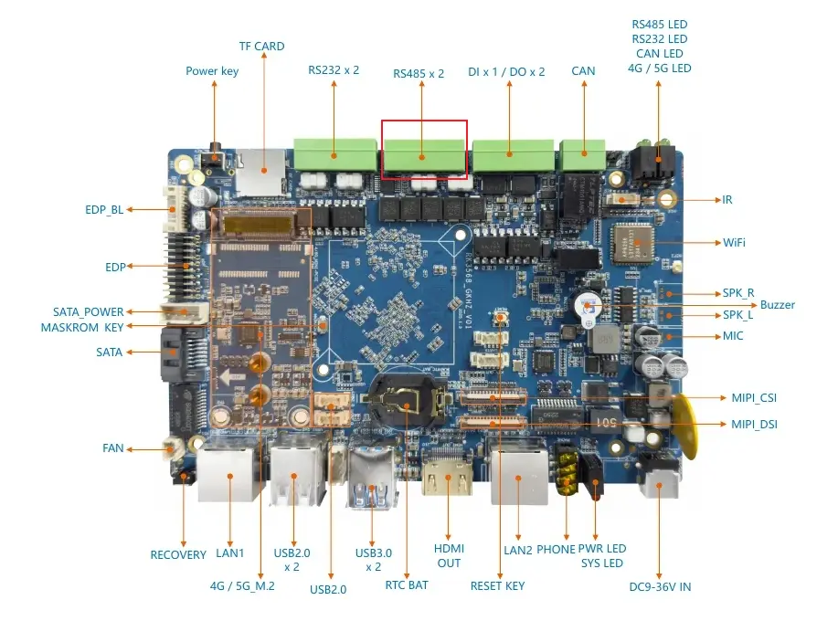

#### 1.1 硬件连接

根据 USB 转 485 线的针脚定义，将 `A`、`B`、`GND` 分别连接到开发板 RS485 接口的 `A`、`B`、`GND`。


具体引脚可查看板卡背面丝印。

#### 1.2 串口连接

使用 USB 转串口线连接开发板 Debug 串口，并按本文前面的串口参数打开终端。

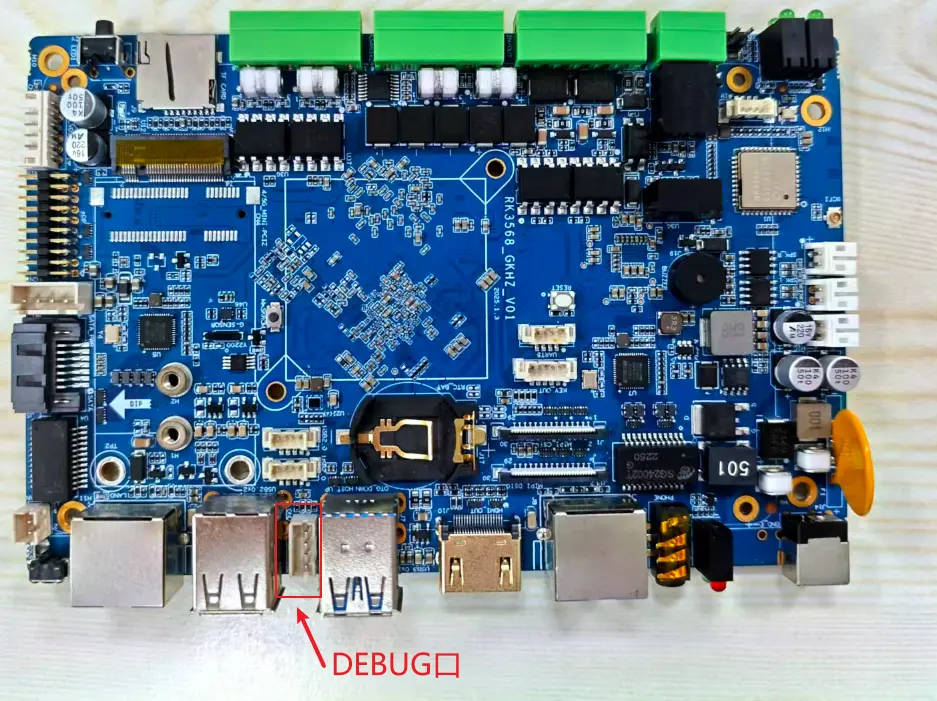


#### 1.3 收发测试

RS485_1 使用 `uart3`，系统节点为 `/dev/ttyS3`，RS485_2 使用 `uart4`，系统节点为 `/dev/ttyS4`


发送测试：

```shell
stty -F /dev/ttyS3 115200
echo "beiqi" > /dev/ttyS3
```

接收测试：

```shell
cat /dev/ttyS3
```

### 2. RS232

#### 2.1 硬件连接

RS232 接口连接方式如下图所示。

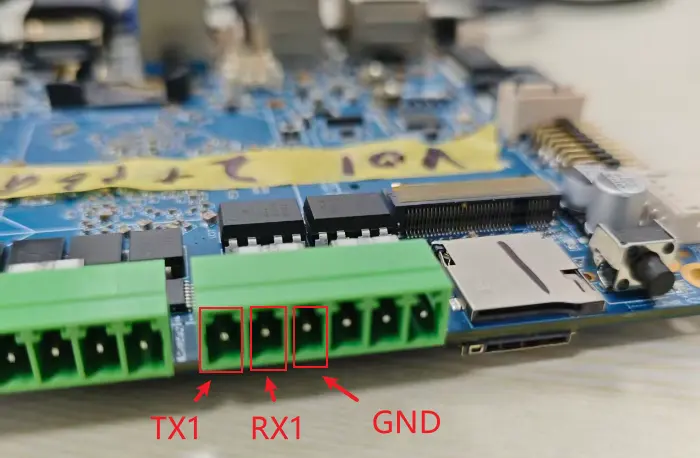

#### 2.2 收发测试

RS232_1 使用 `uart7`，系统节点为 `/dev/ttyS7`，RS232_2 使用 `uart9`，系统节点为 `/dev/ttyS9`


发送测试：

```shell
stty -F /dev/ttyS7 115200
echo "beiqi" > /dev/ttyS7
```

接收测试：

```shell
cat /dev/ttyS7
```

### 3. DI/DO

DI/DO 接口位置如下图所示。


#### 3.1 DO 测试

DO 接口如下图所示。

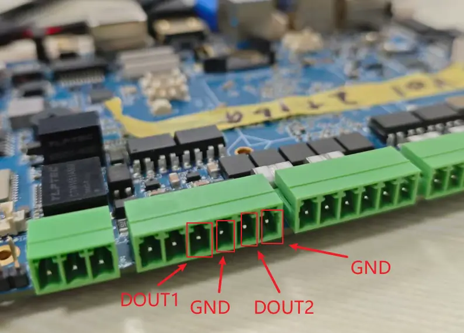

查看和设置 DO1：

```shell
# 查看 DO1 当前电平
cat /sys/devices/platform/gpios/DOUT1

# 设置 DO1 输出高电平
echo 1 > /sys/devices/platform/gpios/DOUT1

# 设置 DO1 输出低电平
echo 0 > /sys/devices/platform/gpios/DOUT1
```

#### 3.2 DI 测试

DI 接口如下图所示。


读取 DI 输入：

```shell
cat /sys/devices/platform/gpios/DIN1
```

#### 3.3 DI/DO 回环测试

如无万用表或其他测试工具，可将 `DIN1` 与 `DOUT1` 连接起来做回环测试。


输出高电平并读取输入：

```shell
echo 1 > /sys/devices/platform/gpios/DOUT1
cat /sys/devices/platform/gpios/DIN1
```

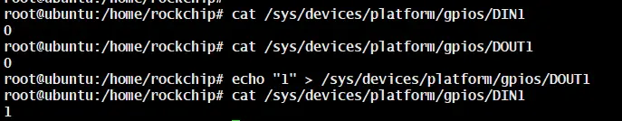

输出低电平并读取输入：

```shell
echo 0 > /sys/devices/platform/gpios/DOUT1
cat /sys/devices/platform/gpios/DIN1
```


### 4. USB

USB 接口位置如下图所示。


测试方法：

1. 插入鼠标或键盘，确认系统可正常识别并使用。
2. 接入 HDMI 显示器后，移动鼠标，确认屏幕中的鼠标指针可正常跟随移动。

### 5. RTC

RTC 电池接口位置如下图所示。

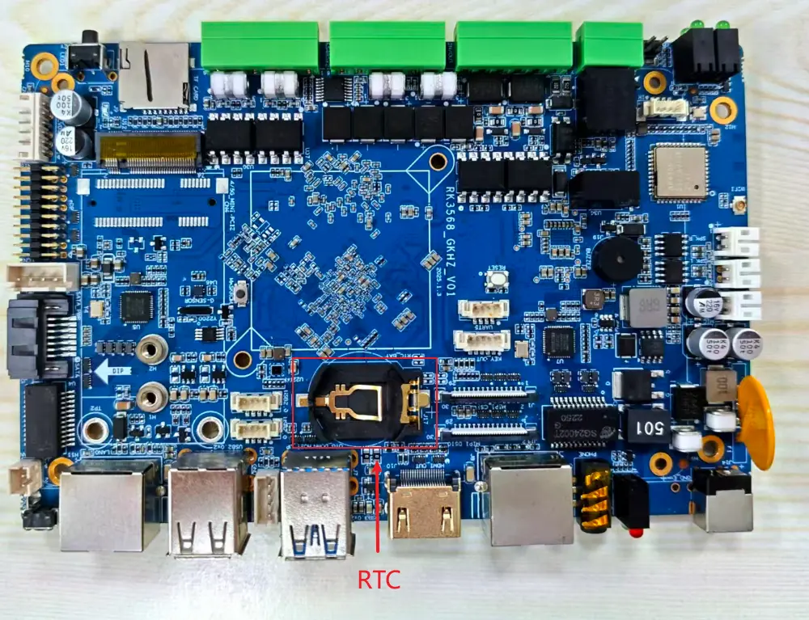

测试方法一：

1. 确认已连接 RTC 电池。
2. 连接网络进行时间同步。
3. 断开 Wi-Fi 与网线。
4. 关机等待几分钟。
5. 再次开机，确认系统时间是否保持准确。

测试方法二：

```shell
hwclock
```

多次执行后，观察时间是否正常递增。

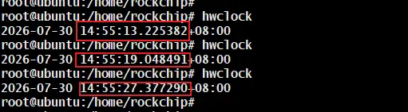

### 6. 网络连接

#### 6.1 Wi-Fi

外接 HDMI 显示器进入 Ubuntu桌面后，可在系统设置中连接 Wi-Fi。

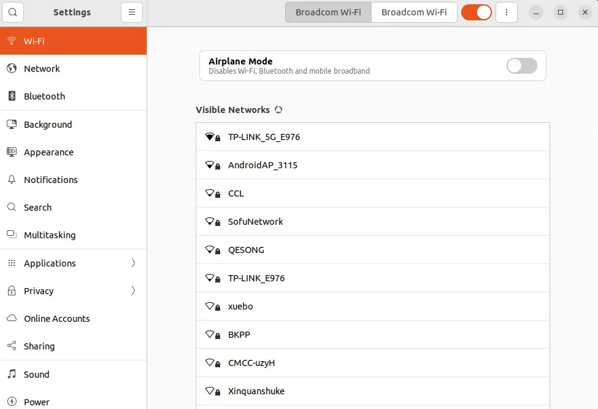

也可以使用命令行：

```shell
# 查看 Wi-Fi 列表
nmcli device wifi list

# 重新扫描 Wi-Fi
nmcli device wifi rescan
```


连接 Wi-Fi 并查看状态：

```shell
nmcli device wifi connect "<SSID>" password "<密码>"
nmcli device status
```

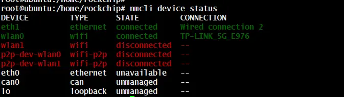

获取 IP：

```shell
ifconfig
```


#### 6.2 以太网

接入网线后，可在 Ubuntu桌面设置中查看 Network 状态和 IP 地址。


也可以使用命令查看：

```shell
ifconfig
```


### 7. SATA

#### 7.1 硬件连接

SATA 接口连接方式如下图所示。

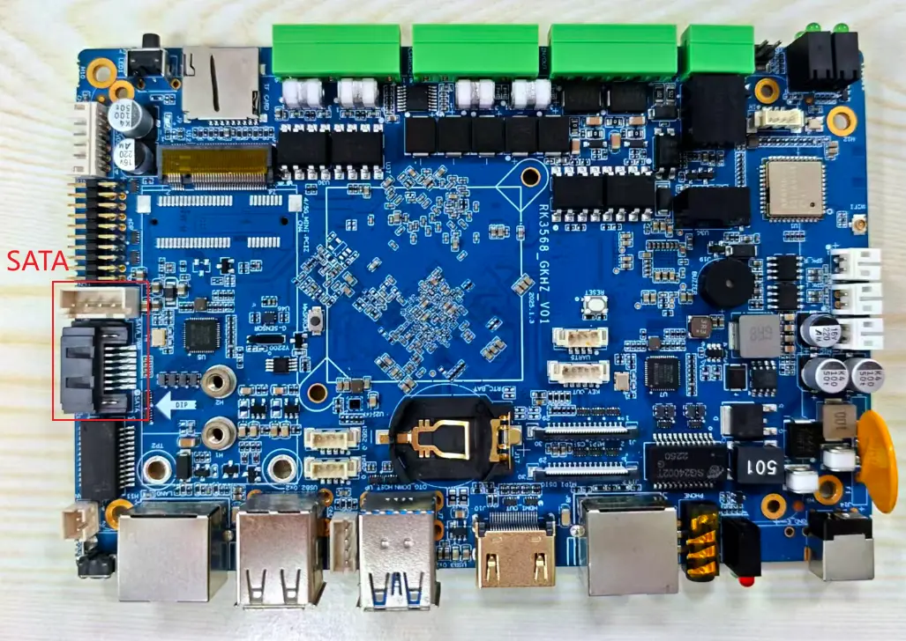

#### 7.2 测试方法

进入 OpenEuler 桌面文件管理器，查看是否识别到额外硬盘。


也可以使用命令查看：

```shell
lsblk
```

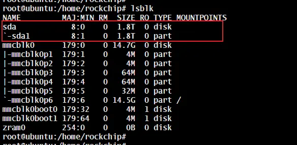

### 8. CAN

#### 8.1 硬件连接

CAN 接口连接方式如下图所示。


#### 8.2 收发测试

主机端或 CAN 分析仪端配置波特率为 `250000`。

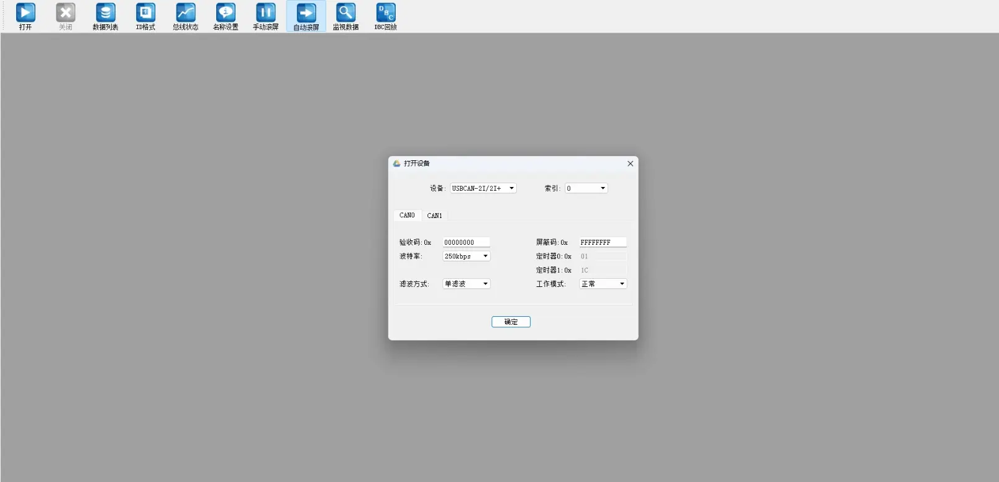

RK3568 端配置 CAN：

```shell
ip link set can0 down
ip link set can0 type can bitrate 250000
ip link set can0 up
```

3568 侧使用命令进行发送和接收：

```shell
# 发送数据
./cansend can0 123#1122334455667788

# 接收数据
./candump can0
```

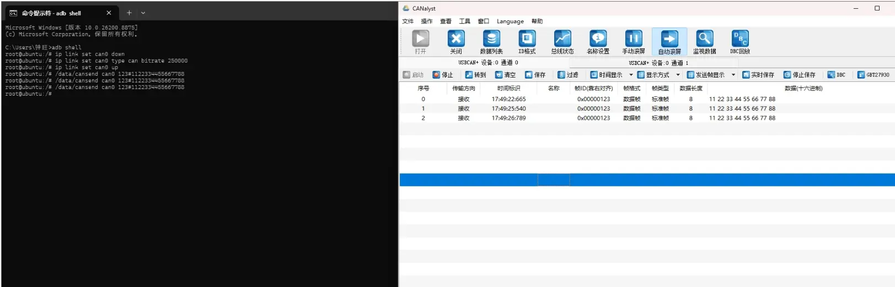

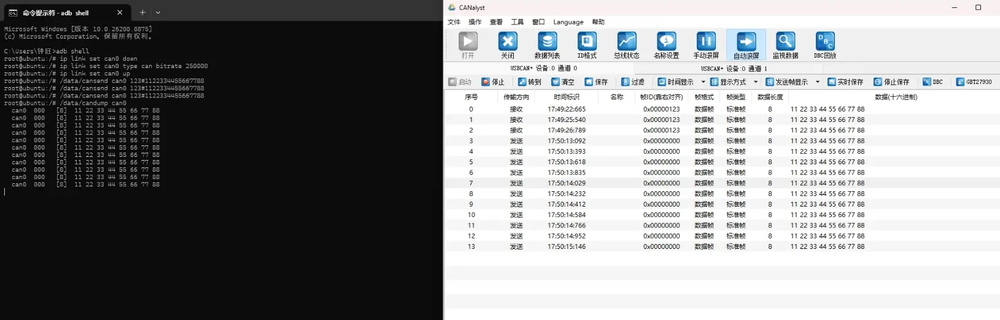

### 9. 蜂鸣器

使用方法：

```shell
#开启蜂鸣器
echo "1" > /sys/devices/platform/gpios/Buzzer 
#关闭蜂鸣器
echo "0" > /sys/devices/platform/gpios/Buzzer 
```

### 10. 4G

#### 11.1 硬件连接

4G 模块安装位置如下图所示。安装模块和 SIM 卡前，请先断电。

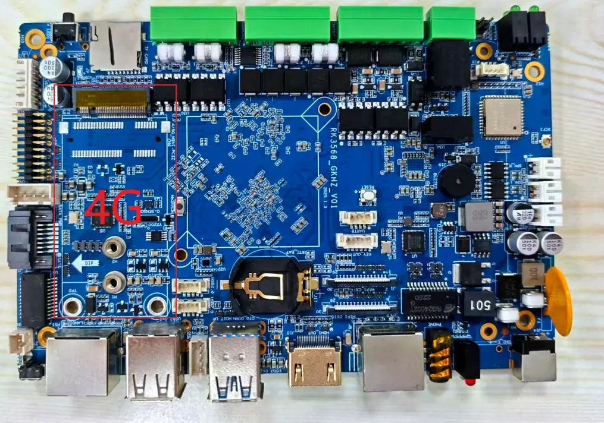

#### 11.2 测试方法

装上 4G 模块并插入 SIM 卡后，等待系统识别并自动获取 IP。

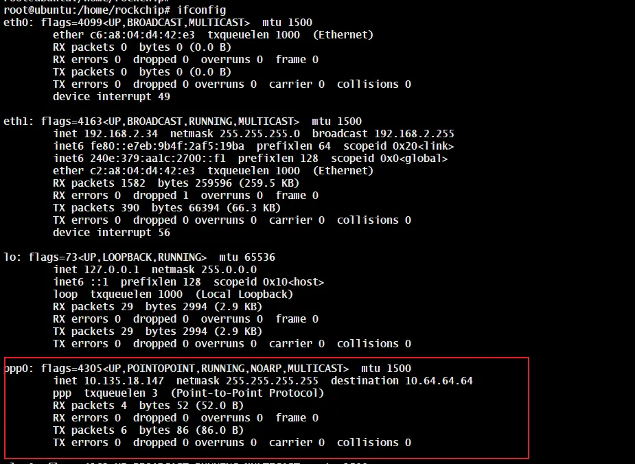

使用 `ping` 命令验证网络连通性。

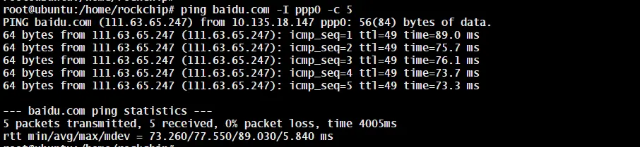
