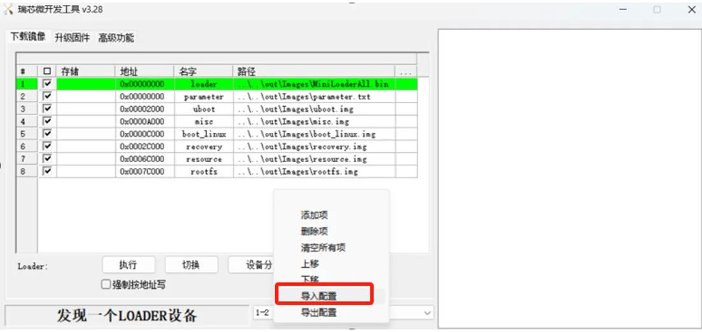

# 二、固件烧写

需要在 pc 上安装 rk 的驱动，驱动版本 5.12，步骤如下

1.   解压
2.   双击 DriverInstall.exe 打开
3.   为保证驱动正确安装，建议先点击驱动卸载，再进行驱动安装，界面如下

使用工具为 RKDevTool_Release_v3.28， 版本为 3.28，***需要在 windows10/11 上进行使用，该工具目前暂不支持其他系统***

若版本较低可能出现固件无法加载的情况

##### 固件烧写

1.   按住板子上的 recovery 键并重启，进入 loader 模式，或者在板子上电开机后，使用串口、ssh 或 adb 终端，输入 reboot loader 进行 loader 模式

2.   按上述步骤操作后，会显示 “发现一个 LOADER 设备”。右键单击工具空白处，点击导入配置，选择我们提供 parameter.txt，如下

      

     根据自己镜像的位置调整镜像路径，然后勾选要更新的 镜像，然后点击“执行”按钮进行升级。
